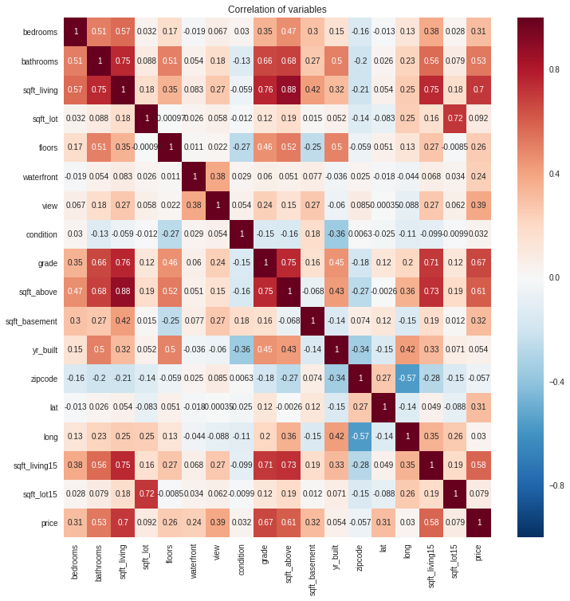

##### Copyright 2018 BUPT 824zzy.

Licensed under the Apache License, Version 2.0 (the "License").

# House Price Prediction with Colabotary


This notebook first uses two modes to upload data: 
1. Download data directly from the Internet;
2. Upload data to colab. 

Then the training data is visualized and analyzed. Then the training sets are divided and compared with the traditional machine learning methods. Two predictions came out.

**Plean run in environment of Py3.6 and set configuration like this**:


## Download and Prepare the dataset
The dataset of the problem is uploaded to my github. This problem is a great sample for learning regression models.

There are some packages below we will use soon.


```python
# if there are some packages your don't have, please install packages in the way below
!pip install seaborn
```

    Requirement already satisfied: seaborn in /usr/local/lib/python3.6/dist-packages (0.7.1)


```python
import pandas as pd
import numpy as np
import matplotlib.pyplot as plt
import tensorflow as tf
import os
import seaborn as sns

%matplotlib inline 
```


```python
# If you are not run this code in Colab. You can Download dataset from Internet
path_to_train_csv = tf.keras.utils.get_file(
    'housedata.zip', 
    origin='https://github.com/824zzy/blogResources/blob/master/zipResources/housedata.zip',
    extract=True)
path_to_test_csv = tf.keras.utils.get_file(
    'housetest.zip', 
    origin='https://github.com/824zzy/blogResources/blob/master/zipResources/housetest.zip',
    extract=True)

path_to_train = os.path.dirname(path_to_train_csv)+"/housedata.csv"
path_to_test = os.path.dirname(path_to_test_csv)+"/housetest.csv"
print("Your train dateset is downloaded to:" + path_to_train)
print("Your test dateset is downloaded to:" + path_to_test)
```

    Your train dateset is downloaded to:/root/.keras/datasets/housedata.csv
    Your test dateset is downloaded to:/root/.keras/datasets/housetest.csv


## Data Visualization

### Overview of Housedata


```python
# If your are using colab, please read data directly!
# read csv via pandas and see shape and distinct observations of dataset
df_train = pd.read_csv("housedata.csv")
df_test = pd.read_csv("housetest.csv")

print("The shape of train dataset is:" + str(df_train.shape))

print("The shape of test dataset is: " + str(df_test.shape))

print("The distinct observations in train dateset is: ")
df_train.nunique()

```

    The shape of train dataset is:(14480, 21)
    The shape of test dataset is: (7133, 20)
    The distinct observations in train dateset is: 


    id               14406
    date               364
    bedrooms            12
    bathrooms           29
    sqft_living        843
    sqft_lot          7440
    floors               6
    waterfront           2
    view                 5
    condition            5
    grade               12
    sqft_above         773
    sqft_basement      271
    yr_built           116
    yr_renovated        68
    zipcode             70
    lat               4658
    long               696
    sqft_living15      669
    sqft_lot15        6764
    price             3198
    dtype: int64


```python
# let us see some examples of our trainset
df_train.head(5)
```


<div>
<style scoped>
    .dataframe tbody tr th:only-of-type {
        vertical-align: middle;
    }

    .dataframe tbody tr th {
        vertical-align: top;
    }

    .dataframe thead th {
        text-align: right;
    }
</style>
<table border="1" class="dataframe">
  <thead>
    <tr style="text-align: right;">
      <th></th>
      <th>id</th>
      <th>date</th>
      <th>bedrooms</th>
      <th>bathrooms</th>
      <th>sqft_living</th>
      <th>sqft_lot</th>
      <th>floors</th>
      <th>waterfront</th>
      <th>view</th>
      <th>condition</th>
      <th>...</th>
      <th>sqft_above</th>
      <th>sqft_basement</th>
      <th>yr_built</th>
      <th>yr_renovated</th>
      <th>zipcode</th>
      <th>lat</th>
      <th>long</th>
      <th>sqft_living15</th>
      <th>sqft_lot15</th>
      <th>price</th>
    </tr>
  </thead>
  <tbody>
    <tr>
      <th>0</th>
      <td>2653000005</td>
      <td>20140512T000000</td>
      <td>4</td>
      <td>2.75</td>
      <td>2600</td>
      <td>2750</td>
      <td>1.5</td>
      <td>0</td>
      <td>0</td>
      <td>3</td>
      <td>...</td>
      <td>1620</td>
      <td>980</td>
      <td>1936</td>
      <td>0</td>
      <td>98119</td>
      <td>47.6413</td>
      <td>-122.357</td>
      <td>1960</td>
      <td>3705</td>
      <td>840000.0</td>
    </tr>
    <tr>
      <th>1</th>
      <td>1657310170</td>
      <td>20140723T000000</td>
      <td>3</td>
      <td>2.50</td>
      <td>2140</td>
      <td>9492</td>
      <td>2.0</td>
      <td>0</td>
      <td>0</td>
      <td>3</td>
      <td>...</td>
      <td>2140</td>
      <td>0</td>
      <td>1994</td>
      <td>0</td>
      <td>98092</td>
      <td>47.3289</td>
      <td>-122.204</td>
      <td>2180</td>
      <td>9184</td>
      <td>302000.0</td>
    </tr>
    <tr>
      <th>2</th>
      <td>2425700022</td>
      <td>20140929T000000</td>
      <td>4</td>
      <td>1.75</td>
      <td>1730</td>
      <td>11890</td>
      <td>1.0</td>
      <td>0</td>
      <td>0</td>
      <td>2</td>
      <td>...</td>
      <td>980</td>
      <td>750</td>
      <td>1955</td>
      <td>0</td>
      <td>98004</td>
      <td>47.5979</td>
      <td>-122.194</td>
      <td>2100</td>
      <td>12325</td>
      <td>425000.0</td>
    </tr>
    <tr>
      <th>3</th>
      <td>6181400470</td>
      <td>20150127T000000</td>
      <td>4</td>
      <td>2.50</td>
      <td>2130</td>
      <td>4496</td>
      <td>2.0</td>
      <td>0</td>
      <td>0</td>
      <td>3</td>
      <td>...</td>
      <td>2130</td>
      <td>0</td>
      <td>2004</td>
      <td>0</td>
      <td>98001</td>
      <td>47.3041</td>
      <td>-122.280</td>
      <td>3220</td>
      <td>5400</td>
      <td>215000.0</td>
    </tr>
    <tr>
      <th>4</th>
      <td>2206500300</td>
      <td>20140820T000000</td>
      <td>5</td>
      <td>1.75</td>
      <td>1910</td>
      <td>9720</td>
      <td>1.0</td>
      <td>0</td>
      <td>0</td>
      <td>4</td>
      <td>...</td>
      <td>1390</td>
      <td>520</td>
      <td>1955</td>
      <td>0</td>
      <td>98006</td>
      <td>47.5772</td>
      <td>-122.159</td>
      <td>1750</td>
      <td>9720</td>
      <td>565000.0</td>
    </tr>
  </tbody>
</table>
<p>5 rows × 21 columns</p>
</div>


### data cleaning
There are some columns we don't want to use in any of our model so drop the "id" and  "date" columns.


```python
df_train.drop(['id', 'date'], axis = 1, inplace = True)

print("The basic variable's statistical indexs in Housedata is: ")
df_train.describe()
```

    The basic variable's statistical indexs in Housedata is: 


<div>
<style scoped>
    .dataframe tbody tr th:only-of-type {
        vertical-align: middle;
    }

    .dataframe tbody tr th {
        vertical-align: top;
    }

    .dataframe thead th {
        text-align: right;
    }
</style>
<table border="1" class="dataframe">
  <thead>
    <tr style="text-align: right;">
      <th></th>
      <th>bedrooms</th>
      <th>bathrooms</th>
      <th>sqft_living</th>
      <th>sqft_lot</th>
      <th>floors</th>
      <th>waterfront</th>
      <th>view</th>
      <th>condition</th>
      <th>grade</th>
      <th>sqft_above</th>
      <th>sqft_basement</th>
      <th>yr_built</th>
      <th>yr_renovated</th>
      <th>zipcode</th>
      <th>lat</th>
      <th>long</th>
      <th>sqft_living15</th>
      <th>sqft_lot15</th>
      <th>price</th>
    </tr>
  </thead>
  <tbody>
    <tr>
      <th>count</th>
      <td>14480.000000</td>
      <td>14480.000000</td>
      <td>14480.000000</td>
      <td>1.448000e+04</td>
      <td>14480.000000</td>
      <td>14480.000000</td>
      <td>14480.000000</td>
      <td>14480.000000</td>
      <td>14480.000000</td>
      <td>14480.000000</td>
      <td>14480.000000</td>
      <td>14480.000000</td>
      <td>14480.000000</td>
      <td>14480.000000</td>
      <td>14480.000000</td>
      <td>14480.000000</td>
      <td>14480.000000</td>
      <td>14480.000000</td>
      <td>1.448000e+04</td>
    </tr>
    <tr>
      <th>mean</th>
      <td>3.367680</td>
      <td>2.113225</td>
      <td>2075.768439</td>
      <td>1.505100e+04</td>
      <td>1.499033</td>
      <td>0.006906</td>
      <td>0.231423</td>
      <td>3.410152</td>
      <td>7.653177</td>
      <td>1786.859185</td>
      <td>288.909254</td>
      <td>1971.083702</td>
      <td>82.410566</td>
      <td>98078.223343</td>
      <td>47.560850</td>
      <td>-122.214365</td>
      <td>1983.502348</td>
      <td>12809.173412</td>
      <td>5.377890e+05</td>
    </tr>
    <tr>
      <th>std</th>
      <td>0.935538</td>
      <td>0.766134</td>
      <td>909.091142</td>
      <td>3.980053e+04</td>
      <td>0.542292</td>
      <td>0.082818</td>
      <td>0.758018</td>
      <td>0.651366</td>
      <td>1.172298</td>
      <td>826.407904</td>
      <td>439.209514</td>
      <td>29.387281</td>
      <td>397.088523</td>
      <td>53.362946</td>
      <td>0.138598</td>
      <td>0.140063</td>
      <td>682.589466</td>
      <td>27273.288544</td>
      <td>3.569339e+05</td>
    </tr>
    <tr>
      <th>min</th>
      <td>0.000000</td>
      <td>0.000000</td>
      <td>290.000000</td>
      <td>5.200000e+02</td>
      <td>1.000000</td>
      <td>0.000000</td>
      <td>0.000000</td>
      <td>1.000000</td>
      <td>1.000000</td>
      <td>290.000000</td>
      <td>0.000000</td>
      <td>1900.000000</td>
      <td>0.000000</td>
      <td>98001.000000</td>
      <td>47.159300</td>
      <td>-122.519000</td>
      <td>399.000000</td>
      <td>651.000000</td>
      <td>7.500000e+04</td>
    </tr>
    <tr>
      <th>25%</th>
      <td>3.000000</td>
      <td>1.500000</td>
      <td>1420.000000</td>
      <td>5.008750e+03</td>
      <td>1.000000</td>
      <td>0.000000</td>
      <td>0.000000</td>
      <td>3.000000</td>
      <td>7.000000</td>
      <td>1200.000000</td>
      <td>0.000000</td>
      <td>1951.000000</td>
      <td>0.000000</td>
      <td>98033.000000</td>
      <td>47.472200</td>
      <td>-122.329000</td>
      <td>1483.250000</td>
      <td>5100.000000</td>
      <td>3.220000e+05</td>
    </tr>
    <tr>
      <th>50%</th>
      <td>3.000000</td>
      <td>2.250000</td>
      <td>1910.000000</td>
      <td>7.574000e+03</td>
      <td>1.500000</td>
      <td>0.000000</td>
      <td>0.000000</td>
      <td>3.000000</td>
      <td>7.000000</td>
      <td>1560.000000</td>
      <td>0.000000</td>
      <td>1975.000000</td>
      <td>0.000000</td>
      <td>98065.000000</td>
      <td>47.573100</td>
      <td>-122.232000</td>
      <td>1840.000000</td>
      <td>7606.500000</td>
      <td>4.500000e+05</td>
    </tr>
    <tr>
      <th>75%</th>
      <td>4.000000</td>
      <td>2.500000</td>
      <td>2550.000000</td>
      <td>1.064050e+04</td>
      <td>2.000000</td>
      <td>0.000000</td>
      <td>0.000000</td>
      <td>4.000000</td>
      <td>8.000000</td>
      <td>2200.000000</td>
      <td>560.000000</td>
      <td>1997.000000</td>
      <td>0.000000</td>
      <td>98117.000000</td>
      <td>47.678425</td>
      <td>-122.125000</td>
      <td>2360.000000</td>
      <td>10070.000000</td>
      <td>6.400000e+05</td>
    </tr>
    <tr>
      <th>max</th>
      <td>33.000000</td>
      <td>8.000000</td>
      <td>12050.000000</td>
      <td>1.164794e+06</td>
      <td>3.500000</td>
      <td>1.000000</td>
      <td>4.000000</td>
      <td>5.000000</td>
      <td>13.000000</td>
      <td>8860.000000</td>
      <td>4820.000000</td>
      <td>2015.000000</td>
      <td>2015.000000</td>
      <td>98199.000000</td>
      <td>47.777600</td>
      <td>-121.315000</td>
      <td>6210.000000</td>
      <td>871200.000000</td>
      <td>7.700000e+06</td>
    </tr>
  </tbody>
</table>
</div>


```python
# visualization of train_set without `id` and `date`
fig = plt.figure(figsize = (20,20))
ax = fig.gca()
df_train.hist(ax = ax)
```

    /usr/local/lib/python3.6/dist-packages/IPython/core/interactiveshell.py:2882: UserWarning: To output multiple subplots, the figure containing the passed axes is being cleared
      exec(code_obj, self.user_global_ns, self.user_ns)


    array([[<matplotlib.axes._subplots.AxesSubplot object at 0x7f7c850f0908>,
            <matplotlib.axes._subplots.AxesSubplot object at 0x7f7c84fc7438>,
            <matplotlib.axes._subplots.AxesSubplot object at 0x7f7c84f7bf98>,
            <matplotlib.axes._subplots.AxesSubplot object at 0x7f7c84f26438>],
           [<matplotlib.axes._subplots.AxesSubplot object at 0x7f7c84f642e8>,
            <matplotlib.axes._subplots.AxesSubplot object at 0x7f7c84f64320>,
            <matplotlib.axes._subplots.AxesSubplot object at 0x7f7c84ed54a8>,
            <matplotlib.axes._subplots.AxesSubplot object at 0x7f7c84e8cfd0>],
           [<matplotlib.axes._subplots.AxesSubplot object at 0x7f7c84e3e710>,
            <matplotlib.axes._subplots.AxesSubplot object at 0x7f7c84df1d68>,
            <matplotlib.axes._subplots.AxesSubplot object at 0x7f7c84db12e8>,
            <matplotlib.axes._subplots.AxesSubplot object at 0x7f7c84d67908>],
           [<matplotlib.axes._subplots.AxesSubplot object at 0x7f7c84e023c8>,
            <matplotlib.axes._subplots.AxesSubplot object at 0x7f7c84d57048>,
            <matplotlib.axes._subplots.AxesSubplot object at 0x7f7c84d0cb38>,
            <matplotlib.axes._subplots.AxesSubplot object at 0x7f7c84ccb6d8>],
           [<matplotlib.axes._subplots.AxesSubplot object at 0x7f7c84c6f9e8>,
            <matplotlib.axes._subplots.AxesSubplot object at 0x7f7c84c353c8>,
            <matplotlib.axes._subplots.AxesSubplot object at 0x7f7c84c65eb8>,
            <matplotlib.axes._subplots.AxesSubplot object at 0x7f7c84ba8518>]],
          dtype=object)


### Data analysis of house prices
this section we will discover the secret of price via `seaborn`.


```python
plt.figure(figsize = (16, 6))

plt.subplot(121)
plt.title('Price Distribution in Housedata')
plt.ylabel("Distribution")
sns.distplot(df_train['price'])

plt.show()
```


```python
plt.figure(figsize = (10,5))
sns.jointplot(df_train.sqft_living, df_train.price, alpha=0.5)
plt.xlabel("Sqft Living")
plt.ylabel("Sale Price")
plt.show()
```


    <matplotlib.figure.Figure at 0x7f7c8490de80>


### Correlation Matrix of all variables


```python
corr = df_train[['bedrooms', 'bathrooms', 'sqft_living', 'sqft_lot', 'floors',
                 'waterfront', 'view',
                 'condition', 'grade', 'sqft_above',
                 'sqft_basement', 'yr_built', 'zipcode', 'lat', 'long', 
                 'sqft_living15', 'sqft_lot15', 'price']]

# 'bedrooms','bathrooms','sqft_living','sqft_lot','floors',
# 'condition','grade','sqft_above','sqft_basement','yr_built',
# 'zipcode','lat','long','sqft_living15','sqft_lot15','price'])

plt.figure(figsize=(12,12))
plt.title('Correlation of variables')
sns.heatmap(corr.astype(float).corr(),vmax=1.0,  annot=True)
plt.show()
```





## House Price Prediction using Deep Learning Model
Using Keras with Tensorflow backend.And you can use google's free GPU for accelerating! With feature engineering above, this approach will give us a great prediction.


### Preparation
First, load keras libraries


```python
import keras
from keras import metrics
from keras import regularizers
from keras.models import Sequential
from keras.layers import Dense, Dropout, Flatten, Activation
from keras.layers import Conv2D, MaxPooling2D
from keras.optimizers import Adam, RMSprop
from keras.callbacks import TensorBoard, EarlyStopping, ModelCheckpoint
from keras.utils import plot_model
from keras.models import load_model
```


```python
# Load data and choose 16 columns for Training data and Test data
df_train = pd.DataFrame(df_train, columns=[
        'bedrooms','bathrooms','sqft_living','sqft_lot','floors', 
        'waterfront', 'view',
        'condition','grade','sqft_above','sqft_basement','yr_built',
        'zipcode','lat','long','sqft_living15','sqft_lot15','price'])

df_test = pd.DataFrame(df_test, columns=[
        'bedrooms','bathrooms','sqft_living','sqft_lot','floors',
        'waterfront', 'view',
        'condition','grade','sqft_above','sqft_basement','yr_built',
        'zipcode','lat','long','sqft_living15','sqft_lot15'])
# select column price as label
label_col = 'price'
```

### Split Housedata for training and validation[80% and 20%]


```python
# a little function for splitting data
def train_validate_split(df, train_part=.8, validate_part=.2, seed=None):
    total_size = train_part + validate_part
    train_percent = train_part / total_size
    validate_percent = validate_part / total_size
    perm = np.random.permutation(df.index)
    m = len(df)
    train_end = int(train_percent * m)
    validate_end = int(validate_percent * m) + train_end
    train = perm[:train_end]
    validate = perm[train_end:validate_end]
    return train, validate
```


```python
train_size, valid_size= (80, 20)
train_set, valid_set = train_validate_split(df_train, 
                              train_part=train_size, 
                              validate_part=valid_size,
                              seed=824)
```


```python
y_train = df_train.loc[train_set, [label_col]]
x_train = df_train.loc[train_set, :].drop(label_col, axis=1)
y_valid = df_train.loc[valid_set, [label_col]]
x_valid = df_train.loc[valid_set, :].drop(label_col, axis=1)

print('Size of training set: ', len(x_train))
print('Size of validation set: ', len(x_valid))
```

    Size of training set:  11584
    Size of validation set:  2896


### Prepare data for Keras Model


```python
# Function to get statistic
def norm_stats(df1, df2):
    dfs = df1.append(df2)
    minimum = np.min(dfs)
    maximum = np.max(dfs)
    mu = np.mean(dfs)
    sigma = np.std(dfs)
    return (minimum, maximum, mu, sigma)
  
# Function to Z-normalise
def z_score(col, stats):
    m, M, mu, s = stats
    df = pd.DataFrame()
    for c in col.columns:
        df[c] = (col[c]-mu[c])/s[c]
    return df
```


```python
stats = norm_stats(x_train, x_valid)
arr_x_train = np.array(z_score(x_train, stats))
arr_y_train = np.array(y_train)
arr_x_valid = np.array(z_score(x_valid, stats))
arr_y_valid = np.array(y_valid)

stats_test = norm_stats(df_test, None)
arr_test = np.array(z_score(df_test, stats_test))

print('Training shape:', arr_x_train.shape)
print('Validation shape', arr_x_valid.shape)
print('Test shape', arr_test.shape)

print('Training samples: ', arr_x_train.shape[0])
print('Validation samples: ', arr_x_valid.shape[0])
print('Test samples', arr_test.shape[0])
```

    Training shape: (11584, 17)
    Validation shape (2896, 17)
    Test shape (7133, 17)
    Training samples:  11584
    Validation samples:  2896
    Test samples 7133


### Create Keras Model


```python
def keras_model(x_size, y_size):
    t_model = Sequential()
    t_model.add(Dense(80, activation="tanh", kernel_initializer='normal', input_shape=(x_size,)))
    t_model.add(Dropout(0.2))
    t_model.add(Dense(120, activation="relu", kernel_initializer='normal', 
        kernel_regularizer=regularizers.l1(0.01), bias_regularizer=regularizers.l1(0.01)))
    t_model.add(Dropout(0.1))
    t_model.add(Dense(20, activation="relu", kernel_initializer='normal', 
        kernel_regularizer=regularizers.l1_l2(0.01), bias_regularizer=regularizers.l1_l2(0.01)))
    t_model.add(Dropout(0.1))
    t_model.add(Dense(10, activation="relu", kernel_initializer='normal'))
    t_model.add(Dropout(0.0))
    t_model.add(Dense(y_size))
    t_model.compile(
        loss='mean_squared_error',
        optimizer='nadam',
        metrics=[metrics.mae])
    return(t_model)
```


```python
model = keras_model(arr_x_train.shape[1], arr_y_train.shape[1])
model.summary()
```

    _________________________________________________________________
    Layer (type)                 Output Shape              Param #   
    =================================================================
    dense_11 (Dense)             (None, 80)                1440      
    _________________________________________________________________
    dropout_9 (Dropout)          (None, 80)                0         
    _________________________________________________________________
    dense_12 (Dense)             (None, 120)               9720      
    _________________________________________________________________
    dropout_10 (Dropout)         (None, 120)               0         
    _________________________________________________________________
    dense_13 (Dense)             (None, 20)                2420      
    _________________________________________________________________
    dropout_11 (Dropout)         (None, 20)                0         
    _________________________________________________________________
    dense_14 (Dense)             (None, 10)                210       
    _________________________________________________________________
    dropout_12 (Dropout)         (None, 10)                0         
    _________________________________________________________________
    dense_15 (Dense)             (None, 1)                 11        
    =================================================================
    Total params: 13,801
    Trainable params: 13,801
    Non-trainable params: 0
    _________________________________________________________________


```python
#Define how many epochs of training should be done and what is the batch size.
epochs = 200
batch_size = 64

print('Epochs: ', epochs)
print('Batch size: ', batch_size)
```

    Epochs:  200
    Batch size:  64


Specify Keras callbacks which allow additional functionality while the model is being fitted.

- ModelCheckpoint allows to save the models as they are being built or improved.
- TensorBoard interacts with TensorFlow interactive reporting system.
- EarlyStopping watches one of the model measurements and stops fitting when no improvement.


```python
history = model.fit(arr_x_train, arr_y_train,
    batch_size=batch_size,
    epochs=epochs,
    shuffle=True,
    verbose=2,
    validation_data=(arr_x_valid, arr_y_valid),)
```

    Train on 11584 samples, validate on 2896 samples
    Epoch 1/200
     - 2s - loss: 385307830260.6851 - mean_absolute_error: 514643.3942 - val_loss: 339167152524.0221 - val_mean_absolute_error: 432971.0901
    Epoch 2/200
     - 2s - loss: 161960913065.7238 - mean_absolute_error: 268055.1045 - val_loss: 138386924606.2321 - val_mean_absolute_error: 220038.7547
    Epoch 3/200
     - 2s - loss: 105237050068.1547 - mean_absolute_error: 217478.3741 - val_loss: 132938626291.2707 - val_mean_absolute_error: 215080.9812
    Epoch 4/200
     - 2s - loss: 101737817829.1271 - mean_absolute_error: 212497.4104 - val_loss: 130401536101.8343 - val_mean_absolute_error: 210982.9509
    Epoch 5/200
     - 2s - loss: 98835267878.1879 - mean_absolute_error: 209381.5488 - val_loss: 126093999539.6243 - val_mean_absolute_error: 206584.0720
    Epoch 6/200
     - 2s - loss: 93167893837.7901 - mean_absolute_error: 204212.0070 - val_loss: 119910505624.7514 - val_mean_absolute_error: 198911.1639
    Epoch 7/200
     - 2s - loss: 87940202496.0000 - mean_absolute_error: 198351.3848 - val_loss: 113230616666.5193 - val_mean_absolute_error: 194371.3539
    Epoch 8/200
     - 2s - loss: 82091230326.8066 - mean_absolute_error: 191445.4037 - val_loss: 106832883621.4807 - val_mean_absolute_error: 185911.3862
    Epoch 9/200
     - 2s - loss: 76120818478.6740 - mean_absolute_error: 185607.4251 - val_loss: 99157351214.6740 - val_mean_absolute_error: 179108.0770
    Epoch 10/200
     - 2s - loss: 71141122081.9447 - mean_absolute_error: 179883.8063 - val_loss: 92202632435.2707 - val_mean_absolute_error: 172227.6698
    Epoch 11/200
     - 2s - loss: 65268320097.5912 - mean_absolute_error: 174719.5768 - val_loss: 85810202590.0553 - val_mean_absolute_error: 163951.3778
    Epoch 12/200
     - 2s - loss: 60275659306.4309 - mean_absolute_error: 167071.2358 - val_loss: 78334592033.9447 - val_mean_absolute_error: 153672.3020
    Epoch 13/200
     - 2s - loss: 52754812837.4807 - mean_absolute_error: 154553.7463 - val_loss: 68218214671.5580 - val_mean_absolute_error: 135643.7195
    Epoch 14/200
     - 2s - loss: 44490573586.3867 - mean_absolute_error: 139008.9964 - val_loss: 61725868744.8398 - val_mean_absolute_error: 119992.3913
    Epoch 15/200
     - 2s - loss: 41575967828.8619 - mean_absolute_error: 131945.4156 - val_loss: 58382449918.5856 - val_mean_absolute_error: 114199.8918
    Epoch 16/200
     - 2s - loss: 39248231180.7293 - mean_absolute_error: 129263.3861 - val_loss: 56145743000.7514 - val_mean_absolute_error: 110442.5669
    Epoch 17/200
     - 2s - loss: 40219794618.6961 - mean_absolute_error: 128967.5363 - val_loss: 54698668518.5414 - val_mean_absolute_error: 108334.0150
    Epoch 18/200
     - 2s - loss: 38220996070.5414 - mean_absolute_error: 126505.3302 - val_loss: 53422967406.3204 - val_mean_absolute_error: 107721.8670
    Epoch 19/200
     - 2s - loss: 38362719916.5525 - mean_absolute_error: 126653.2592 - val_loss: 52771027453.1713 - val_mean_absolute_error: 105210.3424
    Epoch 20/200
     - 2s - loss: 37136842927.3812 - mean_absolute_error: 125740.7024 - val_loss: 51788707002.6961 - val_mean_absolute_error: 104472.1801
    Epoch 21/200
     - 2s - loss: 36161136328.8398 - mean_absolute_error: 124202.4730 - val_loss: 50500067531.6685 - val_mean_absolute_error: 102679.1793
    Epoch 22/200
     - 2s - loss: 35741540612.2431 - mean_absolute_error: 123537.4974 - val_loss: 49931856845.0829 - val_mean_absolute_error: 102445.3893
    Epoch 23/200
     - 2s - loss: 35251762407.9558 - mean_absolute_error: 122786.6007 - val_loss: 49700665921.0608 - val_mean_absolute_error: 100911.8548
    Epoch 24/200
     - 2s - loss: 34588789098.0773 - mean_absolute_error: 121988.1430 - val_loss: 48509705696.8840 - val_mean_absolute_error: 100307.6511
    Epoch 25/200
     - 2s - loss: 35237566243.3591 - mean_absolute_error: 122338.7113 - val_loss: 48530987064.5746 - val_mean_absolute_error: 99769.8400
    Epoch 26/200
     - 2s - loss: 33651906175.2928 - mean_absolute_error: 120717.4787 - val_loss: 47869999975.2486 - val_mean_absolute_error: 98908.8816
    Epoch 27/200
     - 2s - loss: 33549493264.9724 - mean_absolute_error: 119818.3646 - val_loss: 46850380217.2818 - val_mean_absolute_error: 97086.1760
    Epoch 28/200
     - 2s - loss: 32842913180.9945 - mean_absolute_error: 118636.5889 - val_loss: 46460454957.2597 - val_mean_absolute_error: 96560.5304
    Epoch 29/200
     - 2s - loss: 32555842260.1547 - mean_absolute_error: 118097.4263 - val_loss: 46052293875.2707 - val_mean_absolute_error: 95518.4366
    Epoch 30/200
     - 2s - loss: 32273529991.7790 - mean_absolute_error: 117717.3267 - val_loss: 46001574136.9282 - val_mean_absolute_error: 95180.4553
    Epoch 31/200
     - 2s - loss: 32216885870.3204 - mean_absolute_error: 116205.8081 - val_loss: 44711962307.1823 - val_mean_absolute_error: 94774.3679
    Epoch 32/200
     - 2s - loss: 31376813157.8343 - mean_absolute_error: 115035.1993 - val_loss: 44129888391.7790 - val_mean_absolute_error: 92995.5022
    Epoch 33/200
     - 2s - loss: 30441003256.9282 - mean_absolute_error: 114545.2874 - val_loss: 43745217349.3039 - val_mean_absolute_error: 92718.8650
    Epoch 34/200
     - 2s - loss: 29784209362.7403 - mean_absolute_error: 112380.4175 - val_loss: 41838966184.3094 - val_mean_absolute_error: 90708.5635
    Epoch 35/200
     - 2s - loss: 28682513905.8564 - mean_absolute_error: 110937.9108 - val_loss: 41388052050.0331 - val_mean_absolute_error: 89814.9006
    Epoch 36/200
     - 2s - loss: 29215347960.9282 - mean_absolute_error: 110776.2778 - val_loss: 40622896190.2320 - val_mean_absolute_error: 89203.1885
    Epoch 37/200
     - 2s - loss: 28030798282.2541 - mean_absolute_error: 108549.3124 - val_loss: 39382593309.7017 - val_mean_absolute_error: 88063.2230
    Epoch 38/200
     - 2s - loss: 27579020882.0331 - mean_absolute_error: 108125.6320 - val_loss: 39311946508.7293 - val_mean_absolute_error: 87403.2227
    Epoch 39/200
     - 2s - loss: 28111266674.5635 - mean_absolute_error: 108461.0413 - val_loss: 38366184974.1436 - val_mean_absolute_error: 86879.5132
    Epoch 40/200
     - 2s - loss: 26524340365.4365 - mean_absolute_error: 106209.2106 - val_loss: 37216991277.2597 - val_mean_absolute_error: 85626.0016
    Epoch 41/200
     - 2s - loss: 26584942968.2210 - mean_absolute_error: 106279.2335 - val_loss: 37192078036.1547 - val_mean_absolute_error: 85873.7672
    Epoch 42/200
     - 2s - loss: 26761234364.1105 - mean_absolute_error: 105589.5229 - val_loss: 36334637463.3370 - val_mean_absolute_error: 84814.0869
    Epoch 43/200
     - 2s - loss: 26144924457.0166 - mean_absolute_error: 105488.5843 - val_loss: 36049869773.0829 - val_mean_absolute_error: 84730.6847
    Epoch 44/200
     - 2s - loss: 25893105658.3425 - mean_absolute_error: 104278.0347 - val_loss: 34898214742.2762 - val_mean_absolute_error: 84345.1851
    Epoch 45/200
     - 2s - loss: 25066239869.8785 - mean_absolute_error: 102718.5144 - val_loss: 34814104672.1768 - val_mean_absolute_error: 83586.8859
    Epoch 46/200
     - 2s - loss: 25424769629.3481 - mean_absolute_error: 103460.7390 - val_loss: 35580901919.1160 - val_mean_absolute_error: 84319.8144
    Epoch 47/200
     - 2s - loss: 25103307017.9006 - mean_absolute_error: 103139.4806 - val_loss: 34670090851.0055 - val_mean_absolute_error: 83407.6166
    Epoch 48/200
     - 2s - loss: 24601770826.9613 - mean_absolute_error: 101942.8583 - val_loss: 34176358309.4807 - val_mean_absolute_error: 82883.6499
    Epoch 49/200
     - 2s - loss: 24057699098.8729 - mean_absolute_error: 102059.1236 - val_loss: 33910215165.1713 - val_mean_absolute_error: 82823.1433
    Epoch 50/200
     - 2s - loss: 23299094273.4144 - mean_absolute_error: 101051.2920 - val_loss: 33705564012.9061 - val_mean_absolute_error: 82604.7006
    Epoch 51/200
     - 2s - loss: 23574845236.3315 - mean_absolute_error: 101682.1482 - val_loss: 32897625444.4199 - val_mean_absolute_error: 82133.1579
    Epoch 52/200
     - 2s - loss: 23939704752.7956 - mean_absolute_error: 100818.0611 - val_loss: 32866517919.8232 - val_mean_absolute_error: 82064.3971
    Epoch 53/200
     - 2s - loss: 24531219492.7735 - mean_absolute_error: 101251.5459 - val_loss: 33125237233.8564 - val_mean_absolute_error: 81675.6547
    Epoch 54/200
     - 2s - loss: 23411797286.1878 - mean_absolute_error: 100530.4624 - val_loss: 32085362122.2541 - val_mean_absolute_error: 81090.0363
    Epoch 55/200
     - 2s - loss: 22551138739.6243 - mean_absolute_error: 99083.3672 - val_loss: 31304654746.1657 - val_mean_absolute_error: 81034.5962
    Epoch 56/200
     - 2s - loss: 21965861110.0994 - mean_absolute_error: 98180.7714 - val_loss: 31290478931.4475 - val_mean_absolute_error: 80980.1921
    Epoch 57/200
     - 2s - loss: 21977086302.7624 - mean_absolute_error: 98937.9313 - val_loss: 32105078817.9448 - val_mean_absolute_error: 81074.4410
    Epoch 58/200
     - 2s - loss: 22416148344.2210 - mean_absolute_error: 98992.5770 - val_loss: 31152860244.8619 - val_mean_absolute_error: 80769.6438
    Epoch 59/200
     - 2s - loss: 22419401193.3702 - mean_absolute_error: 98687.0392 - val_loss: 30760372088.2210 - val_mean_absolute_error: 80712.1971
    Epoch 60/200
     - 2s - loss: 22537341697.4144 - mean_absolute_error: 98577.8474 - val_loss: 30347206825.7238 - val_mean_absolute_error: 80821.7077
    Epoch 61/200
     - 2s - loss: 21773160719.5580 - mean_absolute_error: 97714.3576 - val_loss: 30442228922.6961 - val_mean_absolute_error: 80223.2019
    Epoch 62/200
     - 2s - loss: 21796700561.6796 - mean_absolute_error: 97592.8527 - val_loss: 29988820697.8122 - val_mean_absolute_error: 79894.3729
    Epoch 63/200
     - 2s - loss: 21525496274.7403 - mean_absolute_error: 96736.9175 - val_loss: 30009627302.8950 - val_mean_absolute_error: 79615.0309
    Epoch 64/200
     - 2s - loss: 21641034132.5083 - mean_absolute_error: 96920.5011 - val_loss: 29866266872.9282 - val_mean_absolute_error: 79735.5720
    Epoch 65/200
     - 2s - loss: 22302710325.7459 - mean_absolute_error: 98312.8315 - val_loss: 29666268629.5691 - val_mean_absolute_error: 79195.2134
    Epoch 66/200
     - 2s - loss: 21519430873.8122 - mean_absolute_error: 96561.6942 - val_loss: 29528135917.6133 - val_mean_absolute_error: 79009.7037
    Epoch 67/200
     - 2s - loss: 21717656236.5525 - mean_absolute_error: 96148.9359 - val_loss: 30706556011.4917 - val_mean_absolute_error: 79778.1460
    Epoch 68/200
     - 2s - loss: 21842007911.2486 - mean_absolute_error: 96650.2741 - val_loss: 29627162906.8729 - val_mean_absolute_error: 79425.3124
    Epoch 69/200
     - 2s - loss: 22039562415.3812 - mean_absolute_error: 97217.9867 - val_loss: 30106432404.5083 - val_mean_absolute_error: 79575.8561
    Epoch 70/200
     - 2s - loss: 21438631409.8564 - mean_absolute_error: 96288.3036 - val_loss: 29619490069.2155 - val_mean_absolute_error: 79133.0005
    Epoch 71/200
     - 2s - loss: 22142033323.1381 - mean_absolute_error: 97490.0333 - val_loss: 29425106547.9779 - val_mean_absolute_error: 78466.0972
    Epoch 72/200
     - 2s - loss: 20603280508.4641 - mean_absolute_error: 95913.5219 - val_loss: 28624916774.1878 - val_mean_absolute_error: 78428.0891
    Epoch 73/200
     - 2s - loss: 20664209608.8398 - mean_absolute_error: 94798.2117 - val_loss: 29219384133.3039 - val_mean_absolute_error: 78810.2309
    Epoch 74/200
     - 2s - loss: 21093526957.9669 - mean_absolute_error: 96035.3853 - val_loss: 28518162997.7459 - val_mean_absolute_error: 78174.2196
    Epoch 75/200
     - 2s - loss: 20728060435.8011 - mean_absolute_error: 95142.4281 - val_loss: 28224000079.2044 - val_mean_absolute_error: 78149.5455
    Epoch 76/200
     - 2s - loss: 21108866138.5193 - mean_absolute_error: 95958.7678 - val_loss: 28976793237.9227 - val_mean_absolute_error: 78390.8026
    Epoch 77/200
     - 2s - loss: 21715013032.3094 - mean_absolute_error: 96906.3746 - val_loss: 28636159954.7403 - val_mean_absolute_error: 78526.0723
    Epoch 78/200
     - 2s - loss: 19954773054.2320 - mean_absolute_error: 94096.2072 - val_loss: 28570272026.8729 - val_mean_absolute_error: 78384.2227
    Epoch 79/200
     - 2s - loss: 19997372704.5304 - mean_absolute_error: 94606.4250 - val_loss: 28274165941.0387 - val_mean_absolute_error: 77830.5527
    Epoch 80/200
     - 2s - loss: 20462893955.5359 - mean_absolute_error: 94886.5154 - val_loss: 28068564199.9558 - val_mean_absolute_error: 77848.8863
    Epoch 81/200
     - 2s - loss: 20119172344.9282 - mean_absolute_error: 93771.2080 - val_loss: 28290854951.6022 - val_mean_absolute_error: 77765.1728
    Epoch 82/200
     - 2s - loss: 20537294381.2597 - mean_absolute_error: 94702.7702 - val_loss: 27788044129.5912 - val_mean_absolute_error: 77167.2377
    Epoch 83/200
     - 2s - loss: 20565482829.7901 - mean_absolute_error: 94622.4148 - val_loss: 27437207088.0884 - val_mean_absolute_error: 77724.5117
    Epoch 84/200
     - 2s - loss: 20882438008.2210 - mean_absolute_error: 94891.3747 - val_loss: 27432008619.1381 - val_mean_absolute_error: 77231.0912
    Epoch 85/200
     - 2s - loss: 20450243558.5414 - mean_absolute_error: 94438.0928 - val_loss: 27503101261.7901 - val_mean_absolute_error: 77773.8466
    Epoch 86/200
     - 2s - loss: 20259198215.0718 - mean_absolute_error: 93738.6416 - val_loss: 26930726787.5359 - val_mean_absolute_error: 77046.5551
    Epoch 87/200
     - 2s - loss: 19826579020.3757 - mean_absolute_error: 93991.5313 - val_loss: 27367688135.4254 - val_mean_absolute_error: 77172.1259
    Epoch 88/200
     - 2s - loss: 20165784222.4088 - mean_absolute_error: 94439.0246 - val_loss: 27347535707.9337 - val_mean_absolute_error: 77108.9558
    Epoch 89/200
     - 2s - loss: 19693719789.6133 - mean_absolute_error: 93230.0443 - val_loss: 27541045836.3757 - val_mean_absolute_error: 77648.9671
    Epoch 90/200
     - 2s - loss: 19285731019.6685 - mean_absolute_error: 93833.4883 - val_loss: 27536955782.3646 - val_mean_absolute_error: 77562.8051
    Epoch 91/200
     - 2s - loss: 19874032079.9116 - mean_absolute_error: 93158.4642 - val_loss: 26985993046.2762 - val_mean_absolute_error: 76787.9963
    Epoch 92/200
     - 2s - loss: 19931178538.4309 - mean_absolute_error: 93736.3611 - val_loss: 27140188114.7403 - val_mean_absolute_error: 76801.6222
    Epoch 93/200
     - 2s - loss: 19807458934.8066 - mean_absolute_error: 93911.1135 - val_loss: 26631908555.6685 - val_mean_absolute_error: 76482.0763
    Epoch 94/200
     - 2s - loss: 19800017928.4862 - mean_absolute_error: 94148.9351 - val_loss: 27559710878.4088 - val_mean_absolute_error: 76773.7680
    Epoch 95/200
     - 2s - loss: 19968030762.4309 - mean_absolute_error: 92850.9308 - val_loss: 26719964301.4365 - val_mean_absolute_error: 76516.8974
    Epoch 96/200
     - 2s - loss: 19332919327.1160 - mean_absolute_error: 92932.0448 - val_loss: 26954973795.0055 - val_mean_absolute_error: 76283.3667
    Epoch 97/200
     - 2s - loss: 19494255955.4475 - mean_absolute_error: 92480.3481 - val_loss: 26915946761.9006 - val_mean_absolute_error: 76386.1825
    Epoch 98/200
     - 2s - loss: 19687557985.5912 - mean_absolute_error: 93064.8957 - val_loss: 27141070599.0718 - val_mean_absolute_error: 76694.5947
    Epoch 99/200
     - 2s - loss: 19581991206.1878 - mean_absolute_error: 92571.5403 - val_loss: 27124099354.8729 - val_mean_absolute_error: 76399.8151
    Epoch 100/200
     - 2s - loss: 19738571221.5691 - mean_absolute_error: 92566.2532 - val_loss: 27236806090.2541 - val_mean_absolute_error: 76549.9854
    Epoch 101/200
     - 2s - loss: 19661360905.9006 - mean_absolute_error: 92188.4461 - val_loss: 26675508801.0608 - val_mean_absolute_error: 76360.3388
    Epoch 102/200
     - 2s - loss: 19302649185.5912 - mean_absolute_error: 91678.9087 - val_loss: 26432618405.4807 - val_mean_absolute_error: 77193.6962
    Epoch 103/200
     - 2s - loss: 19243306068.8619 - mean_absolute_error: 92300.7169 - val_loss: 26326613421.9669 - val_mean_absolute_error: 76106.1102
    Epoch 104/200
     - 2s - loss: 18808965111.5138 - mean_absolute_error: 91436.4212 - val_loss: 26551239923.2707 - val_mean_absolute_error: 76909.6259
    Epoch 105/200
     - 2s - loss: 18765995969.7680 - mean_absolute_error: 91302.5691 - val_loss: 26174044991.6464 - val_mean_absolute_error: 75922.7945
    Epoch 106/200
     - 2s - loss: 19364561190.1878 - mean_absolute_error: 92490.6560 - val_loss: 26254364683.3149 - val_mean_absolute_error: 75778.1509
    Epoch 107/200
     - 2s - loss: 19267989351.2486 - mean_absolute_error: 91566.5071 - val_loss: 25987847484.8177 - val_mean_absolute_error: 75893.2124
    Epoch 108/200
     - 2s - loss: 19684059028.5083 - mean_absolute_error: 92405.0970 - val_loss: 26131282004.8619 - val_mean_absolute_error: 76275.3734
    Epoch 109/200
     - 2s - loss: 19375842977.2376 - mean_absolute_error: 91620.6217 - val_loss: 26851309794.2983 - val_mean_absolute_error: 76535.3318
    Epoch 110/200
     - 2s - loss: 19160815367.0718 - mean_absolute_error: 91712.5612 - val_loss: 25886921541.3039 - val_mean_absolute_error: 75608.1019
    Epoch 111/200
     - 2s - loss: 18331891627.1381 - mean_absolute_error: 90654.9915 - val_loss: 26071483137.4144 - val_mean_absolute_error: 75527.2861
    Epoch 112/200
     - 2s - loss: 18139922482.9171 - mean_absolute_error: 89707.4386 - val_loss: 26028577424.2652 - val_mean_absolute_error: 75363.8741
    Epoch 113/200
     - 2s - loss: 19230287662.6740 - mean_absolute_error: 91648.5541 - val_loss: 26142868813.7901 - val_mean_absolute_error: 76434.6248
    Epoch 114/200
     - 2s - loss: 18557624752.7956 - mean_absolute_error: 90690.3822 - val_loss: 25477337687.6906 - val_mean_absolute_error: 75480.7766
    Epoch 115/200
     - 2s - loss: 19185092310.9834 - mean_absolute_error: 91718.7865 - val_loss: 26201390668.3757 - val_mean_absolute_error: 76502.5550
    Epoch 116/200
     - 2s - loss: 18918896306.2099 - mean_absolute_error: 91068.6512 - val_loss: 25633560892.8177 - val_mean_absolute_error: 75766.0398
    Epoch 117/200
     - 2s - loss: 18141167123.8011 - mean_absolute_error: 89822.3193 - val_loss: 25675215125.2155 - val_mean_absolute_error: 75514.5657
    Epoch 118/200
     - 2s - loss: 18251801908.3315 - mean_absolute_error: 89907.5758 - val_loss: 25466702955.4917 - val_mean_absolute_error: 75520.0673
    Epoch 119/200
     - 2s - loss: 19099825449.0166 - mean_absolute_error: 91057.0920 - val_loss: 25993222483.4475 - val_mean_absolute_error: 75562.3703
    Epoch 120/200
     - 2s - loss: 19152507273.1934 - mean_absolute_error: 91536.6705 - val_loss: 26208753777.1492 - val_mean_absolute_error: 75562.7834
    Epoch 121/200
     - 2s - loss: 18923138659.0055 - mean_absolute_error: 90563.6793 - val_loss: 25998243823.0276 - val_mean_absolute_error: 75826.6985
    Epoch 122/200
     - 2s - loss: 18653609785.9889 - mean_absolute_error: 90584.7013 - val_loss: 26374750004.3315 - val_mean_absolute_error: 75582.3923
    Epoch 123/200
     - 2s - loss: 19024776401.3260 - mean_absolute_error: 90302.8964 - val_loss: 25976245429.0387 - val_mean_absolute_error: 75651.0848
    Epoch 124/200
     - 2s - loss: 19228797230.6740 - mean_absolute_error: 91178.2245 - val_loss: 24913214186.7845 - val_mean_absolute_error: 74861.0685
    Epoch 125/200
     - 2s - loss: 18478845612.5525 - mean_absolute_error: 90405.7663 - val_loss: 25401164777.3702 - val_mean_absolute_error: 75062.0366
    Epoch 126/200
     - 2s - loss: 18682170054.0111 - mean_absolute_error: 90264.4288 - val_loss: 25644243373.9669 - val_mean_absolute_error: 75332.1810
    Epoch 127/200
     - 2s - loss: 18551528541.3481 - mean_absolute_error: 90441.7659 - val_loss: 25179691268.2431 - val_mean_absolute_error: 75376.0534
    Epoch 128/200
     - 2s - loss: 18492662984.8398 - mean_absolute_error: 90181.4757 - val_loss: 25660237699.5359 - val_mean_absolute_error: 75136.0877
    Epoch 129/200
     - 2s - loss: 18319714708.5083 - mean_absolute_error: 90462.2679 - val_loss: 24820805094.5414 - val_mean_absolute_error: 74719.8390
    Epoch 130/200
     - 2s - loss: 18329798882.2983 - mean_absolute_error: 90679.5104 - val_loss: 25479560548.4199 - val_mean_absolute_error: 75508.6680
    Epoch 131/200
     - 2s - loss: 17958523428.7735 - mean_absolute_error: 89547.7233 - val_loss: 25532498282.0773 - val_mean_absolute_error: 74879.9659
    Epoch 132/200
     - 2s - loss: 18602680931.0055 - mean_absolute_error: 90209.2012 - val_loss: 24749554241.0608 - val_mean_absolute_error: 74571.7178
    Epoch 133/200
     - 2s - loss: 18540819272.1326 - mean_absolute_error: 90516.3035 - val_loss: 25305947843.1823 - val_mean_absolute_error: 75112.1673
    Epoch 134/200
     - 2s - loss: 17895314024.6630 - mean_absolute_error: 89933.1531 - val_loss: 25355784192.0000 - val_mean_absolute_error: 75272.8784
    Epoch 135/200
     - 2s - loss: 18283112487.6022 - mean_absolute_error: 90102.3229 - val_loss: 24720345721.6354 - val_mean_absolute_error: 74476.6671
    Epoch 136/200
     - 2s - loss: 18288459843.8895 - mean_absolute_error: 89629.3904 - val_loss: 25184160734.0552 - val_mean_absolute_error: 74567.1013
    Epoch 137/200
     - 2s - loss: 18912794652.2873 - mean_absolute_error: 90300.5579 - val_loss: 24846938411.8453 - val_mean_absolute_error: 74920.5827
    Epoch 138/200
     - 2s - loss: 18187199900.9945 - mean_absolute_error: 90098.8518 - val_loss: 25067768447.2928 - val_mean_absolute_error: 75078.4732
    Epoch 139/200
     - 2s - loss: 18453639880.8398 - mean_absolute_error: 89714.7745 - val_loss: 25300036845.6133 - val_mean_absolute_error: 74654.9284
    Epoch 140/200
     - 2s - loss: 18103587011.1823 - mean_absolute_error: 89486.9691 - val_loss: 25416273620.1547 - val_mean_absolute_error: 75139.4754
    Epoch 141/200
     - 2s - loss: 18053763131.4033 - mean_absolute_error: 89112.9905 - val_loss: 24923340494.4972 - val_mean_absolute_error: 74748.6986
    Epoch 142/200
     - 2s - loss: 18375397240.2210 - mean_absolute_error: 89209.2175 - val_loss: 26035261287.2486 - val_mean_absolute_error: 75060.8758
    Epoch 143/200
     - 2s - loss: 18015653964.3757 - mean_absolute_error: 88950.8110 - val_loss: 25240330438.0111 - val_mean_absolute_error: 74723.5054
    Epoch 144/200
     - 2s - loss: 18026713662.2320 - mean_absolute_error: 89411.1139 - val_loss: 25662487263.4696 - val_mean_absolute_error: 75187.3550
    Epoch 145/200
     - 2s - loss: 17772356568.3978 - mean_absolute_error: 89137.2641 - val_loss: 25472793905.5028 - val_mean_absolute_error: 75027.6594
    Epoch 146/200
     - 2s - loss: 17789450299.4033 - mean_absolute_error: 88848.5074 - val_loss: 25265600551.6022 - val_mean_absolute_error: 74906.4558
    Epoch 147/200
     - 2s - loss: 18597425149.1713 - mean_absolute_error: 88955.7006 - val_loss: 24922558124.5525 - val_mean_absolute_error: 74747.4183
    Epoch 148/200
     - 2s - loss: 17806923719.4254 - mean_absolute_error: 89202.1689 - val_loss: 24688503361.0608 - val_mean_absolute_error: 74561.0466
    Epoch 149/200
     - 2s - loss: 17541130030.6740 - mean_absolute_error: 88099.6219 - val_loss: 25291528175.0276 - val_mean_absolute_error: 74772.6219
    Epoch 150/200
     - 2s - loss: 16954505578.0773 - mean_absolute_error: 87377.9107 - val_loss: 24381588491.3149 - val_mean_absolute_error: 74259.2911
    Epoch 151/200
     - 2s - loss: 17615763057.1492 - mean_absolute_error: 88543.7522 - val_loss: 25391904926.4088 - val_mean_absolute_error: 75044.2862
    Epoch 152/200
     - 2s - loss: 17500412746.9613 - mean_absolute_error: 88141.0235 - val_loss: 25820720784.2652 - val_mean_absolute_error: 75242.5263
    Epoch 153/200
     - 2s - loss: 17600879785.7238 - mean_absolute_error: 87819.6884 - val_loss: 25174099379.6243 - val_mean_absolute_error: 74701.9234
    Epoch 154/200
     - 2s - loss: 17759527370.2541 - mean_absolute_error: 88128.7993 - val_loss: 24719677287.2486 - val_mean_absolute_error: 74140.2996
    Epoch 155/200
     - 2s - loss: 17909163732.1547 - mean_absolute_error: 88702.5867 - val_loss: 25256531006.2320 - val_mean_absolute_error: 74684.1409
    Epoch 156/200
     - 2s - loss: 18030930598.8950 - mean_absolute_error: 89155.6082 - val_loss: 25679775189.5691 - val_mean_absolute_error: 74952.5702
    Epoch 157/200
     - 2s - loss: 17647813722.5193 - mean_absolute_error: 89148.8369 - val_loss: 25192747307.8453 - val_mean_absolute_error: 74858.9551
    Epoch 158/200
     - 2s - loss: 17405538154.0773 - mean_absolute_error: 88165.6788 - val_loss: 24634625482.2541 - val_mean_absolute_error: 74678.2126
    Epoch 159/200
     - 2s - loss: 17772723536.6188 - mean_absolute_error: 88615.5915 - val_loss: 24801928333.4365 - val_mean_absolute_error: 74346.1924
    Epoch 160/200
     - 2s - loss: 17463041674.6077 - mean_absolute_error: 87150.8472 - val_loss: 25404949730.2983 - val_mean_absolute_error: 74836.7434
    Epoch 161/200
     - 2s - loss: 17483090652.6409 - mean_absolute_error: 87109.6196 - val_loss: 24807528300.9061 - val_mean_absolute_error: 74672.9850
    Epoch 162/200
     - 2s - loss: 17831432438.0994 - mean_absolute_error: 88552.6588 - val_loss: 24663070210.8287 - val_mean_absolute_error: 74019.6853
    Epoch 163/200
     - 2s - loss: 17495109858.2983 - mean_absolute_error: 87690.5887 - val_loss: 25177777468.8177 - val_mean_absolute_error: 74145.5907
    Epoch 164/200
     - 2s - loss: 17962351392.5304 - mean_absolute_error: 87966.1023 - val_loss: 24742698611.9779 - val_mean_absolute_error: 74697.7737
    Epoch 165/200
     - 2s - loss: 17315719739.4033 - mean_absolute_error: 87265.5993 - val_loss: 24695706980.4199 - val_mean_absolute_error: 74483.1772
    Epoch 166/200
     - 2s - loss: 18049527745.7680 - mean_absolute_error: 87757.2337 - val_loss: 24877540793.2818 - val_mean_absolute_error: 74622.7097
    Epoch 167/200
     - 2s - loss: 18041577904.7956 - mean_absolute_error: 88978.0403 - val_loss: 25353021700.2431 - val_mean_absolute_error: 74671.9031
    Epoch 168/200
     - 2s - loss: 18572382770.9171 - mean_absolute_error: 89342.4400 - val_loss: 24466882237.5249 - val_mean_absolute_error: 74216.8816
    Epoch 169/200
     - 2s - loss: 17304638441.3702 - mean_absolute_error: 86498.5969 - val_loss: 25501593775.3812 - val_mean_absolute_error: 74889.5815
    Epoch 170/200
     - 2s - loss: 16808670258.9171 - mean_absolute_error: 86026.5012 - val_loss: 25116079879.0718 - val_mean_absolute_error: 74200.7462
    Epoch 171/200
     - 2s - loss: 17685819160.0442 - mean_absolute_error: 87499.7481 - val_loss: 23585416107.1381 - val_mean_absolute_error: 73916.5502
    Epoch 172/200
     - 2s - loss: 17227943910.5414 - mean_absolute_error: 87312.1174 - val_loss: 24100196578.2983 - val_mean_absolute_error: 73767.2857
    Epoch 173/200
     - 2s - loss: 16773814249.3702 - mean_absolute_error: 87390.8589 - val_loss: 25667412618.6077 - val_mean_absolute_error: 74309.3315
    Epoch 174/200
     - 2s - loss: 17397539871.1160 - mean_absolute_error: 87576.3350 - val_loss: 25131477919.8232 - val_mean_absolute_error: 73776.5652
    Epoch 175/200
     - 2s - loss: 17149318551.3370 - mean_absolute_error: 87482.1514 - val_loss: 24082042727.2486 - val_mean_absolute_error: 74067.5218
    Epoch 176/200
     - 2s - loss: 16910917756.4641 - mean_absolute_error: 86295.8542 - val_loss: 24858377855.2928 - val_mean_absolute_error: 74235.4290
    Epoch 177/200
     - 2s - loss: 16938152184.9282 - mean_absolute_error: 86876.4721 - val_loss: 24992911993.6354 - val_mean_absolute_error: 74627.5845
    Epoch 178/200
     - 2s - loss: 17309674979.7127 - mean_absolute_error: 86961.0892 - val_loss: 25472351435.6685 - val_mean_absolute_error: 75738.9488
    Epoch 179/200
     - 2s - loss: 17388279745.7680 - mean_absolute_error: 87254.4294 - val_loss: 24378978960.2652 - val_mean_absolute_error: 73893.7188
    Epoch 180/200
     - 2s - loss: 17157800646.0111 - mean_absolute_error: 87486.0894 - val_loss: 24000826271.8232 - val_mean_absolute_error: 74023.1034
    Epoch 181/200
     - 2s - loss: 16699600969.5470 - mean_absolute_error: 86230.3931 - val_loss: 24955078101.5691 - val_mean_absolute_error: 74241.3575
    Epoch 182/200
     - 2s - loss: 17777330320.2652 - mean_absolute_error: 87109.9111 - val_loss: 25430233846.0994 - val_mean_absolute_error: 74117.5046
    Epoch 183/200
     - 2s - loss: 16816420759.3370 - mean_absolute_error: 86255.0700 - val_loss: 24103258015.8232 - val_mean_absolute_error: 73524.4394
    Epoch 184/200
     - 2s - loss: 17539844449.5912 - mean_absolute_error: 87011.9976 - val_loss: 24231952649.9006 - val_mean_absolute_error: 73693.5821
    Epoch 185/200
     - 2s - loss: 17048348697.4586 - mean_absolute_error: 86415.5272 - val_loss: 24556381076.5083 - val_mean_absolute_error: 74127.9583
    Epoch 186/200
     - 2s - loss: 17518142198.0994 - mean_absolute_error: 86981.2792 - val_loss: 24431468136.6630 - val_mean_absolute_error: 73813.8178
    Epoch 187/200
     - 2s - loss: 17084705741.0829 - mean_absolute_error: 85971.6042 - val_loss: 24609624007.4254 - val_mean_absolute_error: 73615.2576
    Epoch 188/200
     - 2s - loss: 16734906648.0442 - mean_absolute_error: 86008.4828 - val_loss: 24587920287.8232 - val_mean_absolute_error: 73490.7455
    Epoch 189/200
     - 2s - loss: 16191356639.4696 - mean_absolute_error: 85837.4537 - val_loss: 25739594095.7348 - val_mean_absolute_error: 74256.4087
    Epoch 190/200
     - 2s - loss: 17031698256.6188 - mean_absolute_error: 86717.4673 - val_loss: 24682570927.3812 - val_mean_absolute_error: 74606.8758
    Epoch 191/200
     - 2s - loss: 16819192155.9337 - mean_absolute_error: 86148.9380 - val_loss: 25323886416.6188 - val_mean_absolute_error: 74539.9636
    Epoch 192/200
     - 2s - loss: 17077926716.8177 - mean_absolute_error: 86572.6690 - val_loss: 25269703397.1271 - val_mean_absolute_error: 74320.4486
    Epoch 193/200
     - 2s - loss: 17860889305.8122 - mean_absolute_error: 87044.5710 - val_loss: 24051252297.5470 - val_mean_absolute_error: 73539.9730
    Epoch 194/200
     - 2s - loss: 16109005504.3536 - mean_absolute_error: 85349.1450 - val_loss: 25538526598.3646 - val_mean_absolute_error: 74656.7660
    Epoch 195/200
     - 2s - loss: 17218407175.0718 - mean_absolute_error: 85158.0221 - val_loss: 25056949660.9945 - val_mean_absolute_error: 73654.3405
    Epoch 196/200
     - 2s - loss: 16877752486.8950 - mean_absolute_error: 86084.9349 - val_loss: 25101098012.2873 - val_mean_absolute_error: 74103.4861
    Epoch 197/200
     - 2s - loss: 16178615298.8287 - mean_absolute_error: 84971.6054 - val_loss: 24234531868.2873 - val_mean_absolute_error: 73893.7632
    Epoch 198/200
     - 2s - loss: 17343833602.8287 - mean_absolute_error: 85585.8468 - val_loss: 24142953766.1878 - val_mean_absolute_error: 73629.5489
    Epoch 199/200
     - 2s - loss: 16394217336.2210 - mean_absolute_error: 84901.6002 - val_loss: 25339900271.7348 - val_mean_absolute_error: 73558.2714
    Epoch 200/200
     - 2s - loss: 16767498814.2320 - mean_absolute_error: 86102.0016 - val_loss: 24099634396.6409 - val_mean_absolute_error: 73631.0405


```python
# Evaluate and report performance of the trained model
train_score = model.evaluate(arr_x_train, arr_y_train, verbose=0)
valid_score = model.evaluate(arr_x_valid, arr_y_valid, verbose=0)

print('Train MAE: ', round(train_score[1], 4), ', Train Loss: ', round(train_score[0], 4)) 
print('Val MAE: ', round(valid_score[1], 4), ', Val Loss: ', round(valid_score[0], 4))
```

    Train MAE:  63375.7061 , Train Loss:  9564011682.6519
    Val MAE:  73631.0404 , Val Loss:  24099634249.547


```python
def plot_hist(h, xsize=6, ysize=10):
    # Prepare plotting
    fig_size = plt.rcParams["figure.figsize"]
    plt.rcParams["figure.figsize"] = [xsize, ysize]
    fig, axes = plt.subplots(nrows=4, ncols=4, sharex=True)
    
    # summarize history for MAE
    plt.subplot(211)
    plt.plot(h['mean_absolute_error'])
    plt.plot(h['val_mean_absolute_error'])
    plt.title('Training vs Validation MAE')
    plt.ylabel('MAE')
    plt.xlabel('Epoch')
    plt.legend(['Train', 'Validation'], loc='upper left')
    
    # summarize history for loss
    plt.subplot(212)
    plt.plot(h['loss'])
    plt.plot(h['val_loss'])
    plt.title('Training vs Validation Loss')
    plt.ylabel('Loss')
    plt.xlabel('Epoch')
    plt.legend(['Train', 'Validation'], loc='upper left')
    
    # Plot it all in IPython (non-interactive)
    plt.draw()
    plt.show()

    return
```


```python
plot_hist(history.history, xsize=8, ysize=12)
```


```python
# prediction of Housetest using Deep Learning
output_y = model.predict(arr_test)
print("Check out the length of prediction: " + str(len(output_y)))
for i in range(int(len(arr_test)/100)):
  print("X=%s, Prediction=%s" % (arr_test[i], output_y[i]))
```

    Check out the length of prediction: 7133
    X=[ 0.67776569  0.16977744 -0.01951417 -0.14210417  0.96286131 -0.09439752
     -0.30676091  0.9115622   0.28399028  0.33494202 -0.66057861  0.51642752
     -0.36001223 -0.86391076  0.35784861  0.57489781 -0.18218559], Prediction=[377826.2]
    X=[ 1.76612738  1.13345582  0.86621902 -0.1906806  -0.90575241 -0.09439752
     -0.30676091  2.45126696  0.28399028  0.04630294  1.72099473  0.20972702
      0.69971     0.86630949 -0.50613141  0.54595434 -0.23396406], Prediction=[797397.06]
    X=[ 0.67776569  0.49100357  1.79463814 -0.09718837  0.96286131 -0.09439752
      2.2479683  -0.62814256  2.82246477  2.37946885 -0.66057861  0.89128369
     -1.32677637  0.04452708  0.58964813  2.48516639 -0.1096519 ], Prediction=[1160255.4]
    X=[-0.41059601  1.77590808  2.63768538 -0.01375728  0.96286131 -0.09439752
      2.2479683  -0.62814256  3.66862293  3.3295725  -0.66057861  0.65273885
     -0.80621106  1.01867864 -0.10575042  2.97720527  0.05628036], Prediction=[2483467.5]
    X=[-0.41059601  0.49100357  0.49271707 -0.2210886   0.96286131 -0.09439752
     -0.30676091 -0.62814256  1.13014844  0.91222019 -0.66057861  1.12982852
     -0.47156194  0.76737786  0.91276261  0.37229356 -0.3155599 ], Prediction=[668969.5]
    X=[ 0.67776569 -0.15144868 -0.4036876  -0.1556912   0.02855445 -0.09439752
     -0.30676091 -0.62814256 -0.56216789 -0.0980166  -0.66057861 -0.02881782
     -0.86198592 -1.1823695   0.27355788 -0.40917995 -0.20045605], Prediction=[259543.1]
    X=[ 0.67776569  0.49100357  0.64211785 -0.16135059  0.96286131 -0.09439752
     -0.30676091  0.9115622   1.13014844  1.08059298 -0.66057861  0.55050535
     -1.30818475  0.7305493   0.48428471  0.618313   -0.16804426], Prediction=[806143.25]
    X=[-0.41059601  0.49100357 -0.30764424 -0.24300751 -0.90575241 -0.09439752
     -0.30676091  2.45126696 -0.56216789 -0.53097522  0.34101765 -0.02881782
      2.26140592  0.73271569 -1.28582069 -0.10527358 -0.30277058], Prediction=[608179.]
    X=[-0.41059601  0.49100357 -0.52107392 -0.28320715  0.96286131 -0.09439752
     -0.30676091 -0.62814256  0.28399028 -0.23030951 -0.66057861  1.16390635
     -0.93635239 -0.17355577  1.01812602 -0.79268083 -0.41648588], Prediction=[408734.]
    X=[-1.4989577  -1.43635319 -1.25740633 -0.26097383 -0.90575241 -0.09439752
     -0.30676091  0.9115622  -0.56216789 -1.06014687 -0.66057861 -2.10756566
      0.77407647  0.5464065  -1.03997272 -0.39470821 -0.3320033 ], Prediction=[544611.9]
    X=[-0.41059601 -1.43635319 -0.27562979 -0.24300751  0.02855445 -0.09439752
     -0.30676091  0.9115622   0.28399028 -0.08598997 -0.41574397 -1.39193116
      0.82985132  0.33771132 -0.61149483 -0.49601034 -0.30277058], Prediction=[710142.3]
    X=[-0.41059601 -0.47267481 -0.16891495 -0.01867556 -0.90575241 -0.09439752
     -0.30676091 -0.62814256 -0.56216789 -0.79556105  1.12003697 -0.26736265
      1.44337472  1.55160958 -0.7309067  -0.38023648  0.06183457], Prediction=[381314.8]
    X=[-1.4989577  -1.43635319 -0.72383212 -0.18461697 -0.90575241 -0.09439752
     -0.30676091 -0.62814256 -0.56216789 -0.45881545 -0.66057861 -0.09697348
     -0.41578709 -0.48840386 -0.07062929 -0.65519938 -0.24430513], Prediction=[261662.38]
    X=[-0.41059601  0.16977744 -0.1369005  -0.29724333  0.96286131 -0.09439752
     -0.30676091 -0.62814256 -0.56216789 -0.04991009 -0.19316702  1.09575069
      0.75548485 -0.11939612 -0.53422832 -0.33682129 -0.39101687], Prediction=[349694.25]
    X=[-0.41059601 -1.43635319 -1.0119622  -0.26905867  0.02855445 -0.09439752
     -0.30676091  0.9115622  -1.40832605 -0.78353442 -0.66057861 -2.07348783
     -1.17804343  1.08944724  5.9631824  -1.23406865 -0.29180831], Prediction=[329167.2]
    X=[ 0.67776569  2.09713421  2.17881157 -0.06514095  0.96286131 -0.09439752
     -0.30676091 -0.62814256  2.82246477  2.81242748 -0.66057861  1.02759502
     -0.34142061 -0.28187507  0.43511512  2.45622293 -0.05330582], Prediction=[1034892.9]
    X=[ 2.85448908 -1.43635319 -0.70248916  0.12125961  0.96286131 -0.09439752
     -0.30676091 -0.62814256 -0.56216789 -0.4347622  -0.66057861 -0.57406315
     -1.36395961  0.48430343  0.0277099   0.6617282  -0.09521824], Prediction=[549035.5]
    X=[ 0.67776569  1.45468195  2.4242557   1.70539486 -0.90575241 -0.09439752
     -0.30676091 -0.62814256  1.97630661  1.88637709  1.56519087  0.75497235
     -0.45297032  0.58756783  1.60113693  2.23914695  2.85947937], Prediction=[1003797.7]
    X=[ 0.67776569 -1.43635319 -0.69181767 -0.17978852  0.02855445 -0.09439752
     -0.30676091 -0.62814256 -0.56216789 -0.42273557 -0.66057861 -0.06289565
     -0.80621106  1.11833239  0.00663722 -1.21959692 -0.19990793], Prediction=[376710.5]
    X=[ 0.67776569  0.16977744 -0.1369005  -0.00868179 -0.90575241 -0.09439752
     -0.30676091  0.9115622   0.28399028 -0.55502848  0.74165616  0.17564918
     -0.09972958  1.33569311  0.82847187 -0.65519938  0.08456302], Prediction=[437300.38]
    X=[ 1.76612738 -0.15144868 -0.19025792 -0.21812416 -0.90575241 -0.09439752
     -0.30676091 -0.62814256 -0.56216789 -0.92785396  1.32035623 -0.09697348
      1.03435912  1.0757268  -0.95568199 -1.3932577  -0.19168623], Prediction=[429626.4]
    X=[ 0.67776569  2.73958646  3.86490606  0.21205689  0.96286131 -0.09439752
     -0.30676091 -0.62814256  2.82246477  4.71263477 -0.66057861  1.23206202
      0.27210278 -1.81928697  0.38594552  2.991677    0.40784041], Prediction=[771287.1]
    X=[-0.41059601  0.8122297   0.53540301  4.6668955   0.96286131 -0.09439752
     -0.30676091 -0.62814256  1.13014844  0.9603267  -0.66057861  0.41419402
     -0.06254634  0.40486928  1.48874929  2.05101444  7.28812747], Prediction=[715678.6]
    X=[-0.41059601 -0.79390094  0.74883269 -0.18686276 -0.90575241 -0.09439752
      2.2479683  -0.62814256  0.28399028 -0.11004323  1.76551012 -0.53998532
      0.88562618  1.25914748 -0.52720409  0.60384127 -0.16756923], Prediction=[664843.56]
    X=[-0.41059601  1.45468195 -0.59577431 -0.30667565  0.96286131 -0.09439752
     -0.30676091 -0.62814256  0.28399028 -0.61516162 -0.10413624  1.16390635
      0.82985132  0.42942165 -0.69578556 -0.66967112 -0.41308757], Prediction=[536677.1]
    X=[-0.41059601  0.16977744 -0.17958643 -0.09566123  0.96286131 -0.09439752
     -0.30676091 -0.62814256  0.28399028  0.1545426  -0.66057861  0.34603835
     -0.06254634  0.6121202   1.09539253  0.01050027 -0.07234363], Prediction=[528301.75]
    X=[-0.41059601 -1.43635319 -1.15069149 -0.09927696 -0.90575241 -0.09439752
     -0.30676091  0.9115622  -0.56216789 -0.93988059 -0.66057861  0.03933785
     -0.60170327 -0.79530854  3.09027323 -0.90121882 -0.11641196], Prediction=[250176.53]
    X=[-2.5873194  -1.43635319 -1.67359421 -0.23402435 -0.90575241 -0.09439752
     -0.30676091 -0.62814256 -2.25448422 -1.52918538 -0.66057861 -1.39193116
      0.53238544 -0.03707346 -1.05402118 -1.72610753 -0.28230767], Prediction=[258471.27]
    X=[ 0.67776569  0.8122297   0.35398778 -0.15232251  0.96286131 -0.09439752
     -0.30676091 -0.62814256  0.28399028  0.75587402 -0.66057861  0.89128369
     -1.02931048 -2.52408454  1.41850701  0.40123703 -0.14308682], Prediction=[335502.12]
    X=[-1.4989577  -0.79390094 -1.04397665 -0.26097383 -0.90575241 -0.09439752
     -0.30676091  2.45126696 -0.56216789 -0.81961431 -0.66057861 -2.27795483
      0.77407647  0.57601377 -1.02592427 -0.46706687 -0.26622967], Prediction=[588010.2]
    X=[-0.41059601  0.8122297  -0.77718954 11.83759024 -0.90575241 -0.09439752
      2.2479683   0.9115622  -0.56216789 -0.78353442 -0.17090933 -0.53998532
     -1.02931048 -2.53852711  1.32719205 -0.42365168  1.74892817], Prediction=[445395.44]
    X=[-0.41059601 -0.79390094  0.11921512 -0.17069307 -0.90575241 -0.09439752
     -0.30676091  0.9115622  -0.56216789 -0.79556105  1.72099473 -0.98299716
      1.85239032  1.21220911 -1.05402118  0.25651971 -0.18320874], Prediction=[487853.03]
    X=[-0.41059601 -0.47267481 -0.25428682 -0.14367622 -0.90575241 -0.09439752
     -0.30676091  0.9115622   0.28399028 -0.50692197  0.40779074  0.07341568
     -1.28959313  0.57384739  0.70906    -0.16316051 -0.1865705 ], Prediction=[562364.]
    X=[-0.41059601  0.16977744 -0.47838799 -0.24255835  0.96286131 -0.09439752
     -0.30676091  0.9115622  -0.56216789 -0.182203   -0.66057861 -1.80086516
     -1.40114284 -1.78679118  0.02068568 -1.10382307 -0.22121128], Prediction=[252833.38]
    X=[-0.41059601 -0.47267481 -0.79853251 -0.11104489 -0.90575241 -0.09439752
     -0.30676091  0.9115622  -0.56216789 -0.54300185 -0.66057861 -0.33551832
     -0.80621106  1.17176991 -0.06360506  1.38531478 -0.17169835], Prediction=[466437.22]
    X=[ 0.67776569  0.16977744  0.32197332 -0.06576977 -0.90575241 -0.09439752
     -0.30676091  2.45126696  1.13014844  0.71979413 -0.66057861 -0.30144049
     -0.69466136 -0.0406841  -0.05658083  1.26954093 -0.01274541], Prediction=[934523.3]
    X=[ 1.76612738  2.73958646  1.9547104  -0.21104992  0.96286131 -0.09439752
     -0.30676091 -0.62814256  1.13014844  1.45341847  1.38712931  0.99351719
     -0.89916915 -0.06668073  1.43957969  1.45767344 -0.26999339], Prediction=[829875.1]
    X=[-0.41059601  0.49100357  0.48204559  0.82230537 -0.90575241 -0.09439752
     -0.30676091  0.9115622   0.28399028  0.03427631  0.94197541  0.17564918
     -0.65747812 -1.22353083  0.87764147 -0.49601034  1.4305838 ], Prediction=[401524.8]
    X=[-0.41059601 -0.15144868 -0.99061923 -0.17974361 -0.90575241 -0.09439752
     -0.30676091 -0.62814256 -0.56216789 -0.75948116 -0.66057861 -0.06289565
     -0.80621106  1.22376317 -0.0987262  -0.17763224 -0.13088216], Prediction=[381565.38]
    X=[ 0.67776569  2.73958646  2.34421957 -0.1319532   0.96286131 -0.09439752
     -0.30676091 -0.62814256  1.97630661  2.99884022 -0.66057861  1.43652902
     -1.36395961  0.53990734  0.09795218 -0.61178419 -0.13490166], Prediction=[1743104.2]
    X=[-0.41059601  0.16977744  0.18324403  0.87121868 -0.90575241 -0.09439752
     -0.30676091 -0.62814256 -0.56216789 -0.41070894  1.14229467 -0.30144049
     -0.09972958  1.4967278   0.57559967  0.21310452  1.1599984 ], Prediction=[450035.8]
    X=[-1.4989577  -1.43635319 -1.3427782  -0.20669309 -0.90575241 -0.09439752
     -0.30676091  0.9115622  -1.40832605 -1.1563599  -0.66057861 -0.57406315
      1.03435912  1.35880123 -0.85031857 -0.94463402 -0.2428435 ], Prediction=[293164.94]
    X=[ 1.76612738  0.8122297   0.41908383 -0.25098006  0.96286131 -0.09439752
     -0.30676091 -0.62814256  0.28399028  0.82923645 -0.66057861  1.47060686
     -1.41973446 -2.15363254 -0.49910718  0.53582413 -0.31099228], Prediction=[309324.06]
    X=[-0.41059601 -0.15144868 -0.4677165  -0.2289264   0.02855445 -0.09439752
     -0.30676091 -0.62814256 -0.56216789 -0.17017637 -0.66057861  1.30021769
     -0.2298709  -0.31364873  2.38082622  0.63278473 -0.24430513], Prediction=[380914.1]
    X=[-4.10596008e-01 -1.43635319e+00 -1.15069149e+00 -1.18478459e-01
     -9.05752413e-01 -9.43975163e-02 -3.06760910e-01  9.11562204e-01
     -1.40832605e+00 -9.39880589e-01 -6.60578614e-01  7.34156831e-02
     -2.29870905e-01 -1.87998344e-01  3.16051550e+00 -8.72275359e-01
      8.84343186e-04], Prediction=[292171.88]
    X=[-0.41059601 -1.43635319 -0.77718954 -0.21066813 -0.90575241 -0.09439752
     -0.30676091  0.9115622  -2.25448422 -0.51894859 -0.66057861 -0.60814099
     -0.39719547 -0.4616851   0.3297517  -1.0748796  -0.21843417], Prediction=[249452.12]
    X=[ 6.77765688e-01 -1.51448684e-01 -4.67716504e-01 -1.32851514e-01
     -9.05752413e-01 -9.43975163e-02 -3.06760910e-01  9.11562204e-01
     -1.40832605e+00 -1.70176371e-01 -6.60578614e-01 -3.69596152e-01
     -8.06211065e-01  1.15443882e+00 -3.87007082e-04 -1.92103970e-01
     -1.90005346e-01], Prediction=[411040.84]
    X=[-0.41059601 -0.15144868 -0.58510283 -0.26097383 -0.90575241 -0.09439752
     -0.30676091 -0.62814256 -0.56216789 -1.08420013  0.78617155  0.78905019
      0.82985132  0.37453988 -0.58339791 -0.65519938 -0.3320033 ], Prediction=[481789.62]
    X=[-0.41059601 -0.47267481 -0.61711728 -0.16889644 -0.90575241 -0.09439752
     -0.30676091 -0.62814256 -0.56216789 -0.33854917 -0.66057861 -0.09697348
     -0.80621106  1.22665169  0.13307332 -0.7999167  -0.19256321], Prediction=[387025.88]
    X=[ 0.67776569 -0.15144868  0.21525848 -0.20707487  0.02855445 -0.09439752
      3.52533291  2.45126696 -0.56216789  0.59952785 -0.66057861 -2.41426616
      0.69971     0.88291845 -0.73793093  0.01050027 -0.34844671], Prediction=[771203.6]
    X=[ 0.67776569  0.49100357 -0.48905947 -0.22142547  0.96286131 -0.09439752
     -0.30676091 -0.62814256 -0.56216789 -0.19422963 -0.66057861  0.95943935
      1.23886692  0.08641054 -0.56934946 -0.10527358 -0.27916516], Prediction=[401043.3]
    X=[ 0.67776569 -0.47267481 -0.6064458  -0.22391829 -0.90575241 -0.09439752
     -0.30676091 -0.62814256 -1.40832605 -0.32652254 -0.66057861 -0.74445232
      2.26140592  0.71971737 -1.24367533 -0.66967112 -0.27171081], Prediction=[474235.8]
    X=[-0.41059601  1.77590808  0.01250028 -0.06370364  0.96286131 -0.09439752
     -0.30676091 -0.62814256  1.13014844  0.37102191 -0.66057861  0.31196052
      2.05689812 -0.6479943  -0.3515984   0.58936954 -0.17940848], Prediction=[427432.56]
    X=[-0.41059601 -0.47267481 -0.56375986 -0.20707487 -0.90575241 -0.09439752
     -0.30676091 -0.62814256 -1.40832605 -1.21649304  1.07552158 -0.91484149
      2.26140592  0.66194708 -1.20152996 -0.62625592 -0.40018863], Prediction=[449904.75]
    X=[-0.41059601  0.49100357 -0.84121845 -0.3061142   0.96286131 -0.09439752
     -0.30676091 -0.62814256  0.28399028 -0.83164093 -0.21542472  1.47060686
      0.58816029  0.57745803 -0.91353662 -1.33537077 -0.41886104], Prediction=[519058.28]
    X=[ 1.76612738  2.73958646  2.80842913  0.07906122  0.96286131 -0.09439752
     -0.30676091 -0.62814256  2.82246477  1.70597766  2.70033331  1.16390635
     -0.45297032  0.55073927  1.40445855  2.73118583  0.90044835], Prediction=[1093002.2]
    X=[-0.41059601  0.49100357 -0.10488604  0.11780109  0.02855445 -0.09439752
     -0.30676091  0.9115622   0.28399028 -0.45881545  0.63036769  0.55050535
     -1.2524099  -1.67919401  2.22629321 -0.4815386   2.94911421], Prediction=[323424.66]
    X=[ 0.67776569  1.13345582  1.13300612 -0.13678165  0.96286131 -0.09439752
     -0.30676091 -0.62814256  1.13014844  1.63381789 -0.66057861  1.02759502
     -0.04395472  0.28138528  1.37636164  1.41425824 -0.23597381], Prediction=[727889.25]
    X=[-1.4989577  -1.43635319 -0.49973096 -0.1350973  -0.90575241 -0.09439752
     -0.30676091  2.45126696 -1.40832605 -1.13230664  1.05326389 -1.69863166
     -0.80621106  1.10822259 -0.11979888  0.67619993 -0.26370835], Prediction=[451486.8]
    X=[ 0.67776569  0.49100357  0.74883269 -0.1949476   0.96286131 -0.09439752
     -0.30676091 -0.62814256  1.13014844  1.20085927 -0.66057861  0.95943935
     -0.06254634  0.36298582  1.38338587  1.15376707 -0.23443909], Prediction=[654866.9]
    X=[ 0.67776569  1.13345582  0.24727293 -0.04834244  0.96286131 -0.09439752
      2.2479683  -0.62814256  0.28399028  0.63560773 -0.66057861  0.92536152
      2.2428143  -1.50732739 -0.7309067   0.32887837  0.45965541], Prediction=[408271.2]
    X=[-1.4989577  -1.43635319 -1.02370083 -0.25558393 -0.90575241 -0.09439752
     -0.30676091 -0.62814256 -0.56216789 -0.79676371 -0.66057861 -0.60814099
      0.53238544 -0.19594176 -0.96973044 -1.00252094 -0.32177185], Prediction=[310442.56]
    X=[-0.41059601 -0.79390094 -0.85188993 -0.18237118 -0.90575241 -0.09439752
     -0.30676091 -0.62814256 -1.40832605 -0.60313499 -0.66057861 -0.57406315
      2.2428143  -0.98017348 -0.83627012 -1.00252094 -0.20107724], Prediction=[225053.62]
    X=[ 0.67776569  0.49100357  0.21525848  0.25825279  0.96286131 -0.09439752
     -0.30676091 -0.62814256  0.28399028  0.59952785 -0.66057861  0.20972702
      1.85239032  1.38479786 -1.13128768  0.43018049  0.51282243], Prediction=[537668.9]
    X=[-1.4989577  -1.43635319 -0.6704747  -0.20707487 -0.90575241 -0.09439752
     -0.30676091 -2.16784732 -0.56216789 -0.63921488 -0.21542472 -1.56232032
      0.69971     1.02878844 -0.7309067  -0.59731246 -0.23041959], Prediction=[426185.06]
    X=[-1.4989577  -1.43635319 -1.24673485 -0.2095677  -0.90575241 -0.09439752
     -0.30676091  0.9115622  -1.40832605 -1.04812024 -0.66057861 -0.71037449
     -1.40114284 -1.85755979 -0.03550815 -1.13276653 -0.23772777], Prediction=[198009.64]
    X=[ 2.85448908  0.49100357  1.05830573 -0.15849843 -0.90575241 -0.09439752
     -0.30676091 -0.62814256 -0.56216789 -0.25436277  2.67807561  0.48234968
     -0.88057754 -1.24591682 -0.05658083 -0.2065757  -0.14717941], Prediction=[310051.1]
    X=[ 0.67776569  0.49100357  1.10099167  0.76885557  0.96286131 10.59349905
      4.80269751  0.9115622   1.13014844  0.9603267   0.51907921  0.10749352
      2.2428143  -1.4798865  -0.77305207  0.05391547  0.71237231], Prediction=[872132.1]
    X=[-1.4989577  -1.43635319 -1.03330516 -0.25199067 -0.90575241 -0.09439752
     -0.30676091 -0.62814256 -0.56216789 -0.80758768 -0.66057861 -1.52824249
      0.51379382  0.70960757 -0.80114898 -0.53942553 -0.31738694], Prediction=[548418.3]
    X=[ 0.67776569  0.49100357  1.61322291 -0.20583968  0.96286131 -0.09439752
     -0.30676091 -0.62814256  1.13014844  2.17501617 -0.66057861  1.47060686
     -0.47156194  1.0605621   0.61072081  2.31150561 -0.24247809], Prediction=[837216.4]
    X=[ 0.67776569  0.16977744 -0.09421456 -0.10884402  0.96286131 -0.09439752
      0.9706037   0.9115622  -0.56216789  0.25075562 -0.66057861 -0.13105132
     -1.01071886 -1.61925733 -0.89246394  0.25651971 -0.08447521], Prediction=[301388.9]


```python
df_test_2 = pd.read_csv("housetest.csv")
result_list = []
for each in output_y:
  result_list.append(each[0])

predict_result = pd.DataFrame({'id':df_test_2['id'],'price':result_list})
predict_result.to_csv("submission.csv", index=False, sep=',')
submission = pd.read_csv("submission.csv")
submission
```


<div>
<style scoped>
    .dataframe tbody tr th:only-of-type {
        vertical-align: middle;
    }

    .dataframe tbody tr th {
        vertical-align: top;
    }

    .dataframe thead th {
        text-align: right;
    }
</style>
<table border="1" class="dataframe">
  <thead>
    <tr style="text-align: right;">
      <th></th>
      <th>id</th>
      <th>price</th>
    </tr>
  </thead>
  <tbody>
    <tr>
      <th>0</th>
      <td>2591820310</td>
      <td>3.778262e+05</td>
    </tr>
    <tr>
      <th>1</th>
      <td>7974200820</td>
      <td>7.973971e+05</td>
    </tr>
    <tr>
      <th>2</th>
      <td>7701450110</td>
      <td>1.160255e+06</td>
    </tr>
    <tr>
      <th>3</th>
      <td>9522300010</td>
      <td>2.483468e+06</td>
    </tr>
    <tr>
      <th>4</th>
      <td>9510861140</td>
      <td>6.689695e+05</td>
    </tr>
    <tr>
      <th>5</th>
      <td>1761300310</td>
      <td>2.595431e+05</td>
    </tr>
    <tr>
      <th>6</th>
      <td>7732410120</td>
      <td>8.061432e+05</td>
    </tr>
    <tr>
      <th>7</th>
      <td>7010701383</td>
      <td>6.081790e+05</td>
    </tr>
    <tr>
      <th>8</th>
      <td>291310170</td>
      <td>4.087340e+05</td>
    </tr>
    <tr>
      <th>9</th>
      <td>4232901990</td>
      <td>5.446119e+05</td>
    </tr>
    <tr>
      <th>10</th>
      <td>6840701125</td>
      <td>7.101423e+05</td>
    </tr>
    <tr>
      <th>11</th>
      <td>3971700580</td>
      <td>3.813148e+05</td>
    </tr>
    <tr>
      <th>12</th>
      <td>4202400078</td>
      <td>2.616624e+05</td>
    </tr>
    <tr>
      <th>13</th>
      <td>6064800090</td>
      <td>3.496942e+05</td>
    </tr>
    <tr>
      <th>14</th>
      <td>2626119028</td>
      <td>3.291672e+05</td>
    </tr>
    <tr>
      <th>15</th>
      <td>3303980660</td>
      <td>1.034893e+06</td>
    </tr>
    <tr>
      <th>16</th>
      <td>862000020</td>
      <td>5.490355e+05</td>
    </tr>
    <tr>
      <th>17</th>
      <td>2386000070</td>
      <td>1.003798e+06</td>
    </tr>
    <tr>
      <th>18</th>
      <td>1138000450</td>
      <td>3.767105e+05</td>
    </tr>
    <tr>
      <th>19</th>
      <td>1775800420</td>
      <td>4.373004e+05</td>
    </tr>
    <tr>
      <th>20</th>
      <td>2291401425</td>
      <td>4.296264e+05</td>
    </tr>
    <tr>
      <th>21</th>
      <td>2025770560</td>
      <td>7.712871e+05</td>
    </tr>
    <tr>
      <th>22</th>
      <td>3525069037</td>
      <td>7.156786e+05</td>
    </tr>
    <tr>
      <th>23</th>
      <td>9324800450</td>
      <td>6.648436e+05</td>
    </tr>
    <tr>
      <th>24</th>
      <td>8080400136</td>
      <td>5.366771e+05</td>
    </tr>
    <tr>
      <th>25</th>
      <td>8651540040</td>
      <td>5.283018e+05</td>
    </tr>
    <tr>
      <th>26</th>
      <td>9407001790</td>
      <td>2.501765e+05</td>
    </tr>
    <tr>
      <th>27</th>
      <td>1773101530</td>
      <td>2.584713e+05</td>
    </tr>
    <tr>
      <th>28</th>
      <td>9432900250</td>
      <td>3.355021e+05</td>
    </tr>
    <tr>
      <th>29</th>
      <td>1794500695</td>
      <td>5.880102e+05</td>
    </tr>
    <tr>
      <th>...</th>
      <td>...</td>
      <td>...</td>
    </tr>
    <tr>
      <th>7103</th>
      <td>723059073</td>
      <td>2.922000e+05</td>
    </tr>
    <tr>
      <th>7104</th>
      <td>1842300050</td>
      <td>5.359609e+05</td>
    </tr>
    <tr>
      <th>7105</th>
      <td>7202260780</td>
      <td>5.709856e+05</td>
    </tr>
    <tr>
      <th>7106</th>
      <td>5379805885</td>
      <td>2.340318e+05</td>
    </tr>
    <tr>
      <th>7107</th>
      <td>7852040110</td>
      <td>4.732865e+05</td>
    </tr>
    <tr>
      <th>7108</th>
      <td>7853302370</td>
      <td>4.829719e+05</td>
    </tr>
    <tr>
      <th>7109</th>
      <td>2861100030</td>
      <td>2.831579e+05</td>
    </tr>
    <tr>
      <th>7110</th>
      <td>7856640170</td>
      <td>1.013813e+06</td>
    </tr>
    <tr>
      <th>7111</th>
      <td>5595900090</td>
      <td>2.995369e+05</td>
    </tr>
    <tr>
      <th>7112</th>
      <td>1326049170</td>
      <td>3.852698e+05</td>
    </tr>
    <tr>
      <th>7113</th>
      <td>1274500420</td>
      <td>2.252523e+05</td>
    </tr>
    <tr>
      <th>7114</th>
      <td>1370803925</td>
      <td>4.933140e+05</td>
    </tr>
    <tr>
      <th>7115</th>
      <td>4305200070</td>
      <td>5.650249e+05</td>
    </tr>
    <tr>
      <th>7116</th>
      <td>8161020060</td>
      <td>5.200273e+05</td>
    </tr>
    <tr>
      <th>7117</th>
      <td>1094000030</td>
      <td>3.968219e+05</td>
    </tr>
    <tr>
      <th>7118</th>
      <td>2310100230</td>
      <td>3.533972e+05</td>
    </tr>
    <tr>
      <th>7119</th>
      <td>9551201250</td>
      <td>5.936524e+05</td>
    </tr>
    <tr>
      <th>7120</th>
      <td>3343301385</td>
      <td>8.034769e+05</td>
    </tr>
    <tr>
      <th>7121</th>
      <td>824059211</td>
      <td>6.819887e+05</td>
    </tr>
    <tr>
      <th>7122</th>
      <td>3862710180</td>
      <td>4.169878e+05</td>
    </tr>
    <tr>
      <th>7123</th>
      <td>1122059037</td>
      <td>3.379514e+05</td>
    </tr>
    <tr>
      <th>7124</th>
      <td>2997800015</td>
      <td>4.188731e+05</td>
    </tr>
    <tr>
      <th>7125</th>
      <td>1189000492</td>
      <td>4.896808e+05</td>
    </tr>
    <tr>
      <th>7126</th>
      <td>8835900086</td>
      <td>8.470752e+05</td>
    </tr>
    <tr>
      <th>7127</th>
      <td>3126049411</td>
      <td>3.341367e+05</td>
    </tr>
    <tr>
      <th>7128</th>
      <td>100500020</td>
      <td>2.436347e+05</td>
    </tr>
    <tr>
      <th>7129</th>
      <td>1523089266</td>
      <td>4.491984e+05</td>
    </tr>
    <tr>
      <th>7130</th>
      <td>3693901105</td>
      <td>5.348558e+05</td>
    </tr>
    <tr>
      <th>7131</th>
      <td>4083306552</td>
      <td>5.332372e+05</td>
    </tr>
    <tr>
      <th>7132</th>
      <td>2787700180</td>
      <td>3.413806e+05</td>
    </tr>
  </tbody>
</table>
<p>7133 rows × 2 columns</p>
</div>


## House Price Prediction using different sklearn models
this section we will test how well the models in sklearn library compare to Deep Learning Model


```python
from sklearn.linear_model import SGDRegressor
from sklearn.model_selection import KFold, cross_val_score, train_test_split # Model evaluation
from sklearn.preprocessing import LabelEncoder, OneHotEncoder, StandardScaler # Preprocessing
from sklearn.linear_model import Lasso, Ridge, ElasticNet, RANSACRegressor, SGDRegressor, HuberRegressor, BayesianRidge # Linear models
from sklearn.ensemble import RandomForestRegressor, BaggingRegressor, AdaBoostRegressor, GradientBoostingRegressor, ExtraTreesRegressor  # Ensemble methods
from xgboost import XGBRegressor, plot_importance # XGBoost
from sklearn.svm import SVR, SVC, LinearSVC  # Support Vector Regression
from sklearn.tree import DecisionTreeRegressor # Decision Tree Regression
from sklearn.neighbors import KNeighborsRegressor
from sklearn.pipeline import Pipeline # Streaming pipelines
from sklearn.decomposition import KernelPCA, PCA # Dimensionality reduction
from sklearn.feature_selection import SelectFromModel # Dimensionality reduction
from sklearn.model_selection import learning_curve, validation_curve, GridSearchCV # Model evaluation
from sklearn.base import clone # Clone estimator
from sklearn.metrics import mean_absolute_error
```

### Selecting the most important features


```python
thresh = 5 * 10**(-3)
model = XGBRegressor()
model.fit(x_train, y_train)
#select features using threshold
selection = SelectFromModel(model, threshold=thresh, prefit=True)
# train
select_X_train = selection.transform(x_train)
# eval model
select_X_val = selection.transform(x_valid)
# test 
select_X_test = selection.transform(df_test)
```

After selecting features, we could see variables below are remained.
- bedrooms
- bathrooms
- sqft_living
- sqft_lot
- waterfront
- view
- condition
- grade
- sqft_above
- sqft_basement
- yr_built
- zipcode
- lat
- long
- sqft_living15
- sqft_lot15


```python
# samples of selected varibles
print(select_X_train[0])
print(select_X_val[0])
print(select_X_test[0])
```

    [ 2.00000e+00  1.00000e+00  1.30000e+03  1.10800e+04  0.00000e+00
      0.00000e+00  4.00000e+00  7.00000e+00  1.30000e+03  0.00000e+00
      1.95500e+03  9.80340e+04  4.77281e+01 -1.22233e+02  1.60000e+03
      9.25900e+03]
    [ 4.00000e+00  1.75000e+00  2.04000e+03  9.32200e+03  0.00000e+00
      0.00000e+00  3.00000e+00  8.00000e+00  1.44000e+03  6.00000e+02
      1.97700e+03  9.81550e+04  4.77611e+01 -1.22298e+02  1.91000e+03
      1.00260e+04]
    [ 4.00000e+00  2.25000e+00  2.07000e+03  8.89300e+03  0.00000e+00
      0.00000e+00  4.00000e+00  8.00000e+00  2.07000e+03  0.00000e+00
      1.98600e+03  9.80580e+04  4.74388e+01 -1.22162e+02  2.39000e+03
      7.70000e+03]


```python
# pipeline with the models to we do a first evaluate of their power to this problem
pipelines = []
seed = 2

pipelines.append(
                ("Scaled_Ridge", 
                 Pipeline([
                     ("Scaler", StandardScaler()), 
                     ("Ridge", Ridge(random_state=seed, tol=10 ))
                      ]))
                )
pipelines.append(
                ("Scaled_Lasso", 
                 Pipeline([
                     ("Scaler", StandardScaler()), 
                     ("Lasso", Lasso(random_state=seed, tol=1))
                      ]))
                )
pipelines.append(
                ("Scaled_Elastic", 
                 Pipeline([
                     ("Scaler", StandardScaler()), 
                     ("Lasso", ElasticNet(random_state=seed))
                      ]))
                )

pipelines.append(
                ("Scaled_SVR",
                 Pipeline([
                     ("Scaler", StandardScaler()),
                     ("SVR",  SVR(kernel='linear', C=1e2, degree=5))
                 ])
                )
                )

pipelines.append(
                ("Scaled_RF_reg",
                 Pipeline([
                     ("Scaler", StandardScaler()),
                     ("RF", RandomForestRegressor(random_state=seed))
                 ])
                )
                )

pipelines.append(
                ("Scaled_ET_reg",
                 Pipeline([
                     ("Scaler", StandardScaler()),
                     ("ET", ExtraTreesRegressor(random_state=seed))
                 ])
                )
                )
pipelines.append(
                ("Scaled_BR_reg",
                 Pipeline([
                     ("Scaler", StandardScaler()),
                     ("BR", BaggingRegressor(random_state=seed))
                 ]))) 

pipelines.append(
                ("Scaled_Hub-Reg",
                 Pipeline([
                     ("Scaler", StandardScaler()),
                     ("Hub-Reg", HuberRegressor())
                 ]))) 
pipelines.append(
                ("Scaled_BayRidge",
                 Pipeline([
                     ("Scaler", StandardScaler()),
                     ("BR", BayesianRidge())
                 ]))) 

pipelines.append(
                ("Scaled_XGB_reg",
                 Pipeline([
                     ("Scaler", StandardScaler()),
                     ("XGBR", XGBRegressor(seed=seed))
                 ]))) 

pipelines.append(
                ("Scaled_DT_reg",
                 Pipeline([
                     ("Scaler", StandardScaler()),
                     ("DT_reg", DecisionTreeRegressor())
                 ]))) 

pipelines.append(
                ("Scaled_KNN_reg",
                 Pipeline([
                     ("Scaler", StandardScaler()),
                     ("KNN_reg", KNeighborsRegressor())
                 ])))

pipelines.append(
                ("Scaled_Gboost-Reg",
                 Pipeline([
                     ("Scaler", StandardScaler()),
                     ("GBoost-Reg", GradientBoostingRegressor())
                 ])))

pipelines.append(
                ("Scaled_RFR_PCA",
                 Pipeline([
                     ("Scaler", StandardScaler()),
                     ("PCA", PCA(n_components=3)),
                     ("XGB", RandomForestRegressor())
                 ])))

pipelines.append(
                ("Scaled_XGBR_PCA",
                 Pipeline([
                     ("Scaler", StandardScaler()),
                     ("PCA", PCA(n_components=3)),
                     ("XGB", XGBRegressor())
                 ])))

scoring = 'neg_mean_absolute_error'
n_folds = 7

results, names  = [], [] 

for name, model  in pipelines:
    kfold = KFold(n_splits=n_folds, random_state=seed)
    cv_results = abs(cross_val_score(model, x_train, np.ravel(y_train), cv= kfold,
                                 scoring=scoring))
    names.append(name)
    results.append(cv_results)    
    msg = "%s: %f (+/- %f)" % (name, cv_results.mean(),  cv_results.std())
    print(msg)
    
# boxplot algorithm comparison
fig = plt.figure(figsize=(15,6))
fig.suptitle('Algorithm Comparison', fontsize=22)
ax = fig.add_subplot(111)
sns.boxplot(x=names, y=results)
ax.set_xticklabels(names)
ax.set_xlabel("Algorithmn Name", fontsize=20)
ax.set_ylabel("MAE of Models", fontsize=18)
ax.set_xticklabels(ax.get_xticklabels(),rotation=45)
plt.show()

```

    Scaled_Ridge: 124300.093476 (+/- 4439.417505)
    Scaled_Lasso: 137509.869290 (+/- 4826.521927)
    Scaled_Elastic: 123196.769240 (+/- 5667.367008)
    Scaled_SVR: 116798.453713 (+/- 6281.652625)
    Scaled_RF_reg: 75804.055822 (+/- 5129.546476)
    Scaled_ET_reg: 75293.474146 (+/- 4340.781015)
    Scaled_BR_reg: 75847.642326 (+/- 5244.523696)
    Scaled_Hub-Reg: 115377.171672 (+/- 5753.053611)
    Scaled_BayRidge: 124254.339858 (+/- 4441.150781)
    Scaled_XGB_reg: 77471.329973 (+/- 4219.310519)
    Scaled_DT_reg: 101167.186979 (+/- 5360.034605)
    Scaled_KNN_reg: 90053.093089 (+/- 4554.589399)
    Scaled_Gboost-Reg: 77321.440679 (+/- 4289.193501)
    Scaled_RFR_PCA: 140109.451130 (+/- 6132.699209)
    Scaled_XGBR_PCA: 135826.128547 (+/- 5914.992782)


    /usr/local/lib/python3.6/dist-packages/seaborn/categorical.py:454: FutureWarning: remove_na is deprecated and is a private function. Do not use.
      box_data = remove_na(group_data)


### Testing XGB_regression and RD_regression


```python
xgb = XGBRegressor(n_estimators=100, learning_rate=0.08, gamma=0, subsample=0.75,
                           colsample_bytree=1, max_depth=7)

xgb.fit(x_train, y_train)
y_hat = xgb.predict(x_valid)
y_predict = xgb.predict(df_test)
xgb.score(x_valid,y_valid)
```


    0.8895075374254651


```python
from sklearn.model_selection import RandomizedSearchCV
# Number of trees in random forest
n_estimators = [int(x) for x in np.linspace(start = 10, stop = 200, num = 10)]
# Number of features to consider at every split
max_features = ['auto', 'sqrt']
# Maximum number of levels in tree
max_depth = [int(x) for x in np.linspace(10, 110, num = 11)]
max_depth.append(None)
# Minimum number of samples required to split a node
min_samples_split = [2, 5, 10]
# Minimum number of samples required at each leaf node
min_samples_leaf = [1, 2, 4]
# Method of selecting samples for training each tree
bootstrap = [True, False]
# Create the random grid
random_grid = {'n_estimators': n_estimators,
               'max_features': max_features,
               'max_depth': max_depth,
               'min_samples_split': min_samples_split,
               'min_samples_leaf': min_samples_leaf,
               'bootstrap': bootstrap}

# Use the random grid to search for best hyperparameters
# First create the base model to tune
rf = RandomForestRegressor()
# Random search of parameters, using 3 fold cross validation, 
# search across 100 different combinations, and use all available cores
rf_random = RandomizedSearchCV(estimator = rf, param_distributions = random_grid, n_iter = 100, cv = 3, verbose=2, random_state=42, n_jobs = -1)
# Fit the random search model
rf_random.fit(x_train, np.ravel(y_train))

rf_random.best_params_

# Predicting with best params
y_hat_Search = rf_random.predict(x_valid)
# y_hat_Test = rf_random.predict(arr_test)
```

    Fitting 3 folds for each of 100 candidates, totalling 300 fits
    [CV] n_estimators=31, min_samples_split=5, min_samples_leaf=1, max_features=sqrt, max_depth=30, bootstrap=True 
    [CV] n_estimators=31, min_samples_split=5, min_samples_leaf=1, max_features=sqrt, max_depth=30, bootstrap=True 
    [CV]  n_estimators=31, min_samples_split=5, min_samples_leaf=1, max_features=sqrt, max_depth=30, bootstrap=True, total=   0.8s
    [CV] n_estimators=31, min_samples_split=5, min_samples_leaf=1, max_features=sqrt, max_depth=30, bootstrap=True 
    [CV]  n_estimators=31, min_samples_split=5, min_samples_leaf=1, max_features=sqrt, max_depth=30, bootstrap=True, total=   0.8s
    [CV] n_estimators=200, min_samples_split=5, min_samples_leaf=1, max_features=sqrt, max_depth=10, bootstrap=True 
    [CV]  n_estimators=31, min_samples_split=5, min_samples_leaf=1, max_features=sqrt, max_depth=30, bootstrap=True, total=   0.8s
    [CV] n_estimators=200, min_samples_split=5, min_samples_leaf=1, max_features=sqrt, max_depth=10, bootstrap=True 
    [CV]  n_estimators=200, min_samples_split=5, min_samples_leaf=1, max_features=sqrt, max_depth=10, bootstrap=True, total=   3.4s
    [CV] n_estimators=200, min_samples_split=5, min_samples_leaf=1, max_features=sqrt, max_depth=10, bootstrap=True 
    [CV]  n_estimators=200, min_samples_split=5, min_samples_leaf=1, max_features=sqrt, max_depth=10, bootstrap=True, total=   3.3s
    [CV] n_estimators=115, min_samples_split=5, min_samples_leaf=2, max_features=sqrt, max_depth=10, bootstrap=False 
    [CV]  n_estimators=200, min_samples_split=5, min_samples_leaf=1, max_features=sqrt, max_depth=10, bootstrap=True, total=   3.3s
    [CV] n_estimators=115, min_samples_split=5, min_samples_leaf=2, max_features=sqrt, max_depth=10, bootstrap=False 
    [CV]  n_estimators=115, min_samples_split=5, min_samples_leaf=2, max_features=sqrt, max_depth=10, bootstrap=False, total=   2.7s
    [CV] n_estimators=115, min_samples_split=5, min_samples_leaf=2, max_features=sqrt, max_depth=10, bootstrap=False 
    [CV]  n_estimators=115, min_samples_split=5, min_samples_leaf=2, max_features=sqrt, max_depth=10, bootstrap=False, total=   2.7s
    [CV] n_estimators=200, min_samples_split=2, min_samples_leaf=4, max_features=auto, max_depth=30, bootstrap=False 
    [CV]  n_estimators=115, min_samples_split=5, min_samples_leaf=2, max_features=sqrt, max_depth=10, bootstrap=False, total=   2.7s
    [CV] n_estimators=200, min_samples_split=2, min_samples_leaf=4, max_features=auto, max_depth=30, bootstrap=False 
    [CV]  n_estimators=200, min_samples_split=2, min_samples_leaf=4, max_features=auto, max_depth=30, bootstrap=False, total=  23.3s
    [CV] n_estimators=200, min_samples_split=2, min_samples_leaf=4, max_features=auto, max_depth=30, bootstrap=False 
    [CV]  n_estimators=200, min_samples_split=2, min_samples_leaf=4, max_features=auto, max_depth=30, bootstrap=False, total=  23.4s
    [CV] n_estimators=157, min_samples_split=2, min_samples_leaf=4, max_features=sqrt, max_depth=10, bootstrap=True 
    [CV]  n_estimators=157, min_samples_split=2, min_samples_leaf=4, max_features=sqrt, max_depth=10, bootstrap=True, total=   2.5s
    [CV] n_estimators=157, min_samples_split=2, min_samples_leaf=4, max_features=sqrt, max_depth=10, bootstrap=True 
    [CV]  n_estimators=157, min_samples_split=2, min_samples_leaf=4, max_features=sqrt, max_depth=10, bootstrap=True, total=   2.5s
    [CV] n_estimators=157, min_samples_split=2, min_samples_leaf=4, max_features=sqrt, max_depth=10, bootstrap=True 
    [CV]  n_estimators=157, min_samples_split=2, min_samples_leaf=4, max_features=sqrt, max_depth=10, bootstrap=True, total=   2.5s
    [CV] n_estimators=73, min_samples_split=5, min_samples_leaf=4, max_features=sqrt, max_depth=30, bootstrap=False 
    [CV]  n_estimators=73, min_samples_split=5, min_samples_leaf=4, max_features=sqrt, max_depth=30, bootstrap=False, total=   2.3s
    [CV] n_estimators=73, min_samples_split=5, min_samples_leaf=4, max_features=sqrt, max_depth=30, bootstrap=False 
    [CV]  n_estimators=73, min_samples_split=5, min_samples_leaf=4, max_features=sqrt, max_depth=30, bootstrap=False, total=   2.3s
    [CV] n_estimators=73, min_samples_split=5, min_samples_leaf=4, max_features=sqrt, max_depth=30, bootstrap=False 
    [CV]  n_estimators=73, min_samples_split=5, min_samples_leaf=4, max_features=sqrt, max_depth=30, bootstrap=False, total=   2.3s
    [CV] n_estimators=94, min_samples_split=5, min_samples_leaf=2, max_features=sqrt, max_depth=100, bootstrap=False 
    [CV]  n_estimators=94, min_samples_split=5, min_samples_leaf=2, max_features=sqrt, max_depth=100, bootstrap=False, total=   3.4s
    [CV] n_estimators=94, min_samples_split=5, min_samples_leaf=2, max_features=sqrt, max_depth=100, bootstrap=False 
    [CV]  n_estimators=200, min_samples_split=2, min_samples_leaf=4, max_features=auto, max_depth=30, bootstrap=False, total=  22.6s
    [CV] n_estimators=94, min_samples_split=5, min_samples_leaf=2, max_features=sqrt, max_depth=100, bootstrap=False 
    [CV]  n_estimators=94, min_samples_split=5, min_samples_leaf=2, max_features=sqrt, max_depth=100, bootstrap=False, total=   3.4s
    [CV] n_estimators=52, min_samples_split=5, min_samples_leaf=1, max_features=sqrt, max_depth=60, bootstrap=False 
    [CV]  n_estimators=52, min_samples_split=5, min_samples_leaf=1, max_features=sqrt, max_depth=60, bootstrap=False, total=   2.0s
    [CV] n_estimators=52, min_samples_split=5, min_samples_leaf=1, max_features=sqrt, max_depth=60, bootstrap=False 
    [CV]  n_estimators=94, min_samples_split=5, min_samples_leaf=2, max_features=sqrt, max_depth=100, bootstrap=False, total=   3.5s
    [CV] n_estimators=52, min_samples_split=5, min_samples_leaf=1, max_features=sqrt, max_depth=60, bootstrap=False 
    [CV]  n_estimators=52, min_samples_split=5, min_samples_leaf=1, max_features=sqrt, max_depth=60, bootstrap=False, total=   2.1s
    [CV] n_estimators=94, min_samples_split=2, min_samples_leaf=1, max_features=auto, max_depth=50, bootstrap=False 
    [CV]  n_estimators=52, min_samples_split=5, min_samples_leaf=1, max_features=sqrt, max_depth=60, bootstrap=False, total=   2.0s
    [CV] n_estimators=94, min_samples_split=2, min_samples_leaf=1, max_features=auto, max_depth=50, bootstrap=False 
    [CV]  n_estimators=94, min_samples_split=2, min_samples_leaf=1, max_features=auto, max_depth=50, bootstrap=False, total=  14.4s
    [CV] n_estimators=94, min_samples_split=2, min_samples_leaf=1, max_features=auto, max_depth=50, bootstrap=False 
    [CV]  n_estimators=94, min_samples_split=2, min_samples_leaf=1, max_features=auto, max_depth=50, bootstrap=False, total=  14.3s
    [CV] n_estimators=178, min_samples_split=5, min_samples_leaf=4, max_features=auto, max_depth=10, bootstrap=False 
    [CV]  n_estimators=94, min_samples_split=2, min_samples_leaf=1, max_features=auto, max_depth=50, bootstrap=False, total=  14.3s
    [CV] n_estimators=178, min_samples_split=5, min_samples_leaf=4, max_features=auto, max_depth=10, bootstrap=False 
    [CV]  n_estimators=178, min_samples_split=5, min_samples_leaf=4, max_features=auto, max_depth=10, bootstrap=False, total=  14.7s
    [CV] n_estimators=178, min_samples_split=5, min_samples_leaf=4, max_features=auto, max_depth=10, bootstrap=False 
    [CV]  n_estimators=178, min_samples_split=5, min_samples_leaf=4, max_features=auto, max_depth=10, bootstrap=False, total=  14.8s
    [CV] n_estimators=31, min_samples_split=10, min_samples_leaf=4, max_features=auto, max_depth=70, bootstrap=True 
    [CV]  n_estimators=178, min_samples_split=5, min_samples_leaf=4, max_features=auto, max_depth=10, bootstrap=False, total=  14.8s
    [CV] n_estimators=31, min_samples_split=10, min_samples_leaf=4, max_features=auto, max_depth=70, bootstrap=True 
    [CV]  n_estimators=31, min_samples_split=10, min_samples_leaf=4, max_features=auto, max_depth=70, bootstrap=True, total=   2.2s
    [CV] n_estimators=31, min_samples_split=10, min_samples_leaf=4, max_features=auto, max_depth=70, bootstrap=True 
    [CV]  n_estimators=31, min_samples_split=10, min_samples_leaf=4, max_features=auto, max_depth=70, bootstrap=True, total=   2.2s
    [CV] n_estimators=73, min_samples_split=5, min_samples_leaf=1, max_features=sqrt, max_depth=90, bootstrap=False 
    [CV]  n_estimators=31, min_samples_split=10, min_samples_leaf=4, max_features=auto, max_depth=70, bootstrap=True, total=   2.1s
    [CV] n_estimators=73, min_samples_split=5, min_samples_leaf=1, max_features=sqrt, max_depth=90, bootstrap=False 
    [CV]  n_estimators=73, min_samples_split=5, min_samples_leaf=1, max_features=sqrt, max_depth=90, bootstrap=False, total=   2.9s
    [CV] n_estimators=73, min_samples_split=5, min_samples_leaf=1, max_features=sqrt, max_depth=90, bootstrap=False 
    [CV]  n_estimators=73, min_samples_split=5, min_samples_leaf=1, max_features=sqrt, max_depth=90, bootstrap=False, total=   2.9s
    [CV] n_estimators=200, min_samples_split=10, min_samples_leaf=1, max_features=sqrt, max_depth=10, bootstrap=False 
    [CV]  n_estimators=73, min_samples_split=5, min_samples_leaf=1, max_features=sqrt, max_depth=90, bootstrap=False, total=   2.9s
    [CV]  n_estimators=200, min_samples_split=10, min_samples_leaf=1, max_features=sqrt, max_depth=10, bootstrap=False, total=   4.6s
    [CV] n_estimators=157, min_samples_split=5, min_samples_leaf=2, max_features=sqrt, max_depth=10, bootstrap=False 
    [CV]  n_estimators=200, min_samples_split=10, min_samples_leaf=1, max_features=sqrt, max_depth=10, bootstrap=False, total=   4.6s
    [CV] n_estimators=157, min_samples_split=5, min_samples_leaf=2, max_features=sqrt, max_depth=10, bootstrap=False 
    [CV]  n_estimators=157, min_samples_split=5, min_samples_leaf=2, max_features=sqrt, max_depth=10, bootstrap=False, total=   3.7s
    [CV] n_estimators=157, min_samples_split=5, min_samples_leaf=2, max_features=sqrt, max_depth=10, bootstrap=False 
    [CV]  n_estimators=157, min_samples_split=5, min_samples_leaf=2, max_features=sqrt, max_depth=10, bootstrap=False, total=   3.7s
    [CV] n_estimators=73, min_samples_split=10, min_samples_leaf=2, max_features=sqrt, max_depth=30, bootstrap=False 
    [CV]  n_estimators=157, min_samples_split=5, min_samples_leaf=2, max_features=sqrt, max_depth=10, bootstrap=False, total=   3.7s
    [CV] n_estimators=73, min_samples_split=10, min_samples_leaf=2, max_features=sqrt, max_depth=30, bootstrap=False 
    [CV]  n_estimators=73, min_samples_split=10, min_samples_leaf=2, max_features=sqrt, max_depth=30, bootstrap=False, total=   2.5s
    [CV] n_estimators=73, min_samples_split=10, min_samples_leaf=2, max_features=sqrt, max_depth=30, bootstrap=False 
    [CV]  n_estimators=73, min_samples_split=10, min_samples_leaf=2, max_features=sqrt, max_depth=30, bootstrap=False, total=   2.4s
    [CV] n_estimators=178, min_samples_split=2, min_samples_leaf=4, max_features=auto, max_depth=50, bootstrap=False 
    [CV]  n_estimators=73, min_samples_split=10, min_samples_leaf=2, max_features=sqrt, max_depth=30, bootstrap=False, total=   2.4s
    [CV] n_estimators=178, min_samples_split=2, min_samples_leaf=4, max_features=auto, max_depth=50, bootstrap=False 
    [CV]  n_estimators=178, min_samples_split=2, min_samples_leaf=4, max_features=auto, max_depth=50, bootstrap=False, total=  20.0s
    [CV] n_estimators=178, min_samples_split=2, min_samples_leaf=4, max_features=auto, max_depth=50, bootstrap=False 
    [CV]  n_estimators=178, min_samples_split=2, min_samples_leaf=4, max_features=auto, max_depth=50, bootstrap=False, total=  19.9s
    [CV] n_estimators=52, min_samples_split=5, min_samples_leaf=2, max_features=auto, max_depth=70, bootstrap=False 
    [CV]  n_estimators=52, min_samples_split=5, min_samples_leaf=2, max_features=auto, max_depth=70, bootstrap=False, total=   6.7s
    [CV] n_estimators=52, min_samples_split=5, min_samples_leaf=2, max_features=auto, max_depth=70, bootstrap=False 
    [CV]  n_estimators=52, min_samples_split=5, min_samples_leaf=2, max_features=auto, max_depth=70, bootstrap=False, total=   6.7s
    [CV] n_estimators=52, min_samples_split=5, min_samples_leaf=2, max_features=auto, max_depth=70, bootstrap=False 
    [CV]  n_estimators=178, min_samples_split=2, min_samples_leaf=4, max_features=auto, max_depth=50, bootstrap=False, total=  20.0s
    [CV] n_estimators=94, min_samples_split=2, min_samples_leaf=1, max_features=sqrt, max_depth=20, bootstrap=True 
    [CV]  n_estimators=52, min_samples_split=5, min_samples_leaf=2, max_features=auto, max_depth=70, bootstrap=False, total=   6.6s
    [CV] n_estimators=94, min_samples_split=2, min_samples_leaf=1, max_features=sqrt, max_depth=20, bootstrap=True 
    [CV]  n_estimators=94, min_samples_split=2, min_samples_leaf=1, max_features=sqrt, max_depth=20, bootstrap=True, total=   2.7s
    [CV] n_estimators=94, min_samples_split=2, min_samples_leaf=1, max_features=sqrt, max_depth=20, bootstrap=True 
    [CV]  n_estimators=94, min_samples_split=2, min_samples_leaf=1, max_features=sqrt, max_depth=20, bootstrap=True, total=   2.7s
    [CV] n_estimators=178, min_samples_split=10, min_samples_leaf=2, max_features=auto, max_depth=110, bootstrap=False 
    [CV]  n_estimators=94, min_samples_split=2, min_samples_leaf=1, max_features=sqrt, max_depth=20, bootstrap=True, total=   2.7s
    [CV] n_estimators=178, min_samples_split=10, min_samples_leaf=2, max_features=auto, max_depth=110, bootstrap=False 
    [CV]  n_estimators=178, min_samples_split=10, min_samples_leaf=2, max_features=auto, max_depth=110, bootstrap=False, total=  21.0s
    [CV] n_estimators=178, min_samples_split=10, min_samples_leaf=2, max_features=auto, max_depth=110, bootstrap=False 
    [CV]  n_estimators=178, min_samples_split=10, min_samples_leaf=2, max_features=auto, max_depth=110, bootstrap=False, total=  21.2s
    [CV] n_estimators=52, min_samples_split=5, min_samples_leaf=1, max_features=auto, max_depth=80, bootstrap=True 
    [CV]  n_estimators=52, min_samples_split=5, min_samples_leaf=1, max_features=auto, max_depth=80, bootstrap=True, total=   4.4s
    [CV] n_estimators=52, min_samples_split=5, min_samples_leaf=1, max_features=auto, max_depth=80, bootstrap=True 
    [CV]  n_estimators=52, min_samples_split=5, min_samples_leaf=1, max_features=auto, max_depth=80, bootstrap=True, total=   4.4s
    [CV] n_estimators=52, min_samples_split=5, min_samples_leaf=1, max_features=auto, max_depth=80, bootstrap=True 
    [CV]  n_estimators=52, min_samples_split=5, min_samples_leaf=1, max_features=auto, max_depth=80, bootstrap=True, total=   4.3s
    [CV] n_estimators=178, min_samples_split=10, min_samples_leaf=1, max_features=sqrt, max_depth=30, bootstrap=False 
    [CV]  n_estimators=178, min_samples_split=10, min_samples_leaf=2, max_features=auto, max_depth=110, bootstrap=False, total=  21.0s
    [CV] n_estimators=178, min_samples_split=10, min_samples_leaf=1, max_features=sqrt, max_depth=30, bootstrap=False 
    [CV]  n_estimators=178, min_samples_split=10, min_samples_leaf=1, max_features=sqrt, max_depth=30, bootstrap=False, total=   6.2s
    [CV] n_estimators=178, min_samples_split=10, min_samples_leaf=1, max_features=sqrt, max_depth=30, bootstrap=False 
    [CV]  n_estimators=178, min_samples_split=10, min_samples_leaf=1, max_features=sqrt, max_depth=30, bootstrap=False, total=   6.2s
    [CV] n_estimators=157, min_samples_split=5, min_samples_leaf=1, max_features=sqrt, max_depth=70, bootstrap=False 
    [CV]  n_estimators=178, min_samples_split=10, min_samples_leaf=1, max_features=sqrt, max_depth=30, bootstrap=False, total=   6.1s
    [CV] n_estimators=157, min_samples_split=5, min_samples_leaf=1, max_features=sqrt, max_depth=70, bootstrap=False 
    [CV]  n_estimators=157, min_samples_split=5, min_samples_leaf=1, max_features=sqrt, max_depth=70, bootstrap=False, total=   6.1s
    [CV] n_estimators=157, min_samples_split=5, min_samples_leaf=1, max_features=sqrt, max_depth=70, bootstrap=False 
    [CV]  n_estimators=157, min_samples_split=5, min_samples_leaf=1, max_features=sqrt, max_depth=70, bootstrap=False, total=   6.1s
    [CV] n_estimators=136, min_samples_split=5, min_samples_leaf=4, max_features=sqrt, max_depth=80, bootstrap=True 
    [CV]  n_estimators=136, min_samples_split=5, min_samples_leaf=4, max_features=sqrt, max_depth=80, bootstrap=True, total=   2.8s
    [CV] n_estimators=136, min_samples_split=5, min_samples_leaf=4, max_features=sqrt, max_depth=80, bootstrap=True 
    [CV]  n_estimators=157, min_samples_split=5, min_samples_leaf=1, max_features=sqrt, max_depth=70, bootstrap=False, total=   6.1s
    [CV] n_estimators=136, min_samples_split=5, min_samples_leaf=4, max_features=sqrt, max_depth=80, bootstrap=True 
    [CV]  n_estimators=136, min_samples_split=5, min_samples_leaf=4, max_features=sqrt, max_depth=80, bootstrap=True, total=   2.9s
    [CV] n_estimators=178, min_samples_split=2, min_samples_leaf=2, max_features=auto, max_depth=None, bootstrap=True 
    [CV]  n_estimators=136, min_samples_split=5, min_samples_leaf=4, max_features=sqrt, max_depth=80, bootstrap=True, total=   2.9s
    [CV] n_estimators=178, min_samples_split=2, min_samples_leaf=2, max_features=auto, max_depth=None, bootstrap=True 
    [CV]  n_estimators=178, min_samples_split=2, min_samples_leaf=2, max_features=auto, max_depth=None, bootstrap=True, total=  14.4s
    [CV] n_estimators=178, min_samples_split=2, min_samples_leaf=2, max_features=auto, max_depth=None, bootstrap=True 
    [CV]  n_estimators=178, min_samples_split=2, min_samples_leaf=2, max_features=auto, max_depth=None, bootstrap=True, total=  14.4s
    [CV] n_estimators=136, min_samples_split=5, min_samples_leaf=1, max_features=sqrt, max_depth=80, bootstrap=False 
    [CV]  n_estimators=136, min_samples_split=5, min_samples_leaf=1, max_features=sqrt, max_depth=80, bootstrap=False, total=   5.3s
    [CV] n_estimators=136, min_samples_split=5, min_samples_leaf=1, max_features=sqrt, max_depth=80, bootstrap=False 
    [CV]  n_estimators=136, min_samples_split=5, min_samples_leaf=1, max_features=sqrt, max_depth=80, bootstrap=False, total=   5.3s
    [CV] n_estimators=136, min_samples_split=5, min_samples_leaf=1, max_features=sqrt, max_depth=80, bootstrap=False 
    [CV]  n_estimators=178, min_samples_split=2, min_samples_leaf=2, max_features=auto, max_depth=None, bootstrap=True, total=  14.3s
    [CV] n_estimators=31, min_samples_split=2, min_samples_leaf=1, max_features=sqrt, max_depth=None, bootstrap=False 
    [CV]  n_estimators=31, min_samples_split=2, min_samples_leaf=1, max_features=sqrt, max_depth=None, bootstrap=False, total=   1.4s
    [CV] n_estimators=31, min_samples_split=2, min_samples_leaf=1, max_features=sqrt, max_depth=None, bootstrap=False 
    [CV]  n_estimators=31, min_samples_split=2, min_samples_leaf=1, max_features=sqrt, max_depth=None, bootstrap=False, total=   1.4s
    [CV] n_estimators=31, min_samples_split=2, min_samples_leaf=1, max_features=sqrt, max_depth=None, bootstrap=False 
    [CV]  n_estimators=31, min_samples_split=2, min_samples_leaf=1, max_features=sqrt, max_depth=None, bootstrap=False, total=   1.4s
    [CV] n_estimators=136, min_samples_split=2, min_samples_leaf=1, max_features=auto, max_depth=40, bootstrap=False 
    [CV]  n_estimators=136, min_samples_split=5, min_samples_leaf=1, max_features=sqrt, max_depth=80, bootstrap=False, total=   5.3s
    [CV] n_estimators=136, min_samples_split=2, min_samples_leaf=1, max_features=auto, max_depth=40, bootstrap=False 
    [CV]  n_estimators=136, min_samples_split=2, min_samples_leaf=1, max_features=auto, max_depth=40, bootstrap=False, total=  20.6s
    [CV] n_estimators=136, min_samples_split=2, min_samples_leaf=1, max_features=auto, max_depth=40, bootstrap=False 
    [CV]  n_estimators=136, min_samples_split=2, min_samples_leaf=1, max_features=auto, max_depth=40, bootstrap=False, total=  20.6s
    [CV] n_estimators=94, min_samples_split=5, min_samples_leaf=2, max_features=sqrt, max_depth=20, bootstrap=True 
    [CV]  n_estimators=94, min_samples_split=5, min_samples_leaf=2, max_features=sqrt, max_depth=20, bootstrap=True, total=   2.2s
    [CV] n_estimators=94, min_samples_split=5, min_samples_leaf=2, max_features=sqrt, max_depth=20, bootstrap=True 
    [CV]  n_estimators=94, min_samples_split=5, min_samples_leaf=2, max_features=sqrt, max_depth=20, bootstrap=True, total=   2.2s
    [CV] n_estimators=94, min_samples_split=5, min_samples_leaf=2, max_features=sqrt, max_depth=20, bootstrap=True 
    [CV]  n_estimators=94, min_samples_split=5, min_samples_leaf=2, max_features=sqrt, max_depth=20, bootstrap=True, total=   2.2s
    [CV] n_estimators=200, min_samples_split=10, min_samples_leaf=4, max_features=auto, max_depth=100, bootstrap=False 
    [CV]  n_estimators=136, min_samples_split=2, min_samples_leaf=1, max_features=auto, max_depth=40, bootstrap=False, total=  20.9s
    [CV] n_estimators=200, min_samples_split=10, min_samples_leaf=4, max_features=auto, max_depth=100, bootstrap=False 
    [CV]  n_estimators=200, min_samples_split=10, min_samples_leaf=4, max_features=auto, max_depth=100, bootstrap=False, total=  22.0s
    [CV] n_estimators=200, min_samples_split=10, min_samples_leaf=4, max_features=auto, max_depth=100, bootstrap=False 
    [CV]  n_estimators=200, min_samples_split=10, min_samples_leaf=4, max_features=auto, max_depth=100, bootstrap=False, total=  22.1s
    [CV] n_estimators=115, min_samples_split=2, min_samples_leaf=2, max_features=sqrt, max_depth=20, bootstrap=True 
    [CV]  n_estimators=115, min_samples_split=2, min_samples_leaf=2, max_features=sqrt, max_depth=20, bootstrap=True, total=   2.8s
    [CV] n_estimators=115, min_samples_split=2, min_samples_leaf=2, max_features=sqrt, max_depth=20, bootstrap=True 
    [CV]  n_estimators=115, min_samples_split=2, min_samples_leaf=2, max_features=sqrt, max_depth=20, bootstrap=True, total=   2.8s
    [CV] n_estimators=115, min_samples_split=2, min_samples_leaf=2, max_features=sqrt, max_depth=20, bootstrap=True 
    [CV]  n_estimators=200, min_samples_split=10, min_samples_leaf=4, max_features=auto, max_depth=100, bootstrap=False, total=  22.0s
    [CV] n_estimators=115, min_samples_split=10, min_samples_leaf=4, max_features=sqrt, max_depth=20, bootstrap=False 
    [CV]  n_estimators=115, min_samples_split=2, min_samples_leaf=2, max_features=sqrt, max_depth=20, bootstrap=True, total=   2.8s
    [CV] n_estimators=115, min_samples_split=10, min_samples_leaf=4, max_features=sqrt, max_depth=20, bootstrap=False 
    [CV]  n_estimators=115, min_samples_split=10, min_samples_leaf=4, max_features=sqrt, max_depth=20, bootstrap=False, total=   3.6s
    [CV] n_estimators=115, min_samples_split=10, min_samples_leaf=4, max_features=sqrt, max_depth=20, bootstrap=False 
    [CV]  n_estimators=115, min_samples_split=10, min_samples_leaf=4, max_features=sqrt, max_depth=20, bootstrap=False, total=   3.7s
    [CV] n_estimators=73, min_samples_split=2, min_samples_leaf=2, max_features=sqrt, max_depth=50, bootstrap=False 
    [CV]  n_estimators=73, min_samples_split=2, min_samples_leaf=2, max_features=sqrt, max_depth=50, bootstrap=False, total=   2.7s
    [CV] n_estimators=73, min_samples_split=2, min_samples_leaf=2, max_features=sqrt, max_depth=50, bootstrap=False 
    [CV]  n_estimators=115, min_samples_split=10, min_samples_leaf=4, max_features=sqrt, max_depth=20, bootstrap=False, total=   3.7s
    [CV] n_estimators=73, min_samples_split=2, min_samples_leaf=2, max_features=sqrt, max_depth=50, bootstrap=False 
    [CV]  n_estimators=73, min_samples_split=2, min_samples_leaf=2, max_features=sqrt, max_depth=50, bootstrap=False, total=   2.7s
    [CV] n_estimators=73, min_samples_split=5, min_samples_leaf=1, max_features=sqrt, max_depth=100, bootstrap=False 
    [CV]  n_estimators=73, min_samples_split=2, min_samples_leaf=2, max_features=sqrt, max_depth=50, bootstrap=False, total=   2.8s
    [CV] n_estimators=73, min_samples_split=5, min_samples_leaf=1, max_features=sqrt, max_depth=100, bootstrap=False 
    [CV]  n_estimators=73, min_samples_split=5, min_samples_leaf=1, max_features=sqrt, max_depth=100, bootstrap=False, total=   2.9s
    [CV] n_estimators=73, min_samples_split=5, min_samples_leaf=1, max_features=sqrt, max_depth=100, bootstrap=False 
    [CV]  n_estimators=73, min_samples_split=5, min_samples_leaf=1, max_features=sqrt, max_depth=100, bootstrap=False, total=   2.9s
    [CV] n_estimators=73, min_samples_split=10, min_samples_leaf=4, max_features=sqrt, max_depth=50, bootstrap=True 
    [CV]  n_estimators=73, min_samples_split=10, min_samples_leaf=4, max_features=sqrt, max_depth=50, bootstrap=True, total=   1.5s
    [CV] n_estimators=73, min_samples_split=10, min_samples_leaf=4, max_features=sqrt, max_depth=50, bootstrap=True 
    [CV]  n_estimators=73, min_samples_split=5, min_samples_leaf=1, max_features=sqrt, max_depth=100, bootstrap=False, total=   2.9s
    [CV] n_estimators=73, min_samples_split=10, min_samples_leaf=4, max_features=sqrt, max_depth=50, bootstrap=True 
    [CV]  n_estimators=73, min_samples_split=10, min_samples_leaf=4, max_features=sqrt, max_depth=50, bootstrap=True, total=   1.6s
    [CV] n_estimators=178, min_samples_split=2, min_samples_leaf=4, max_features=sqrt, max_depth=90, bootstrap=True 
    [CV]  n_estimators=73, min_samples_split=10, min_samples_leaf=4, max_features=sqrt, max_depth=50, bootstrap=True, total=   1.5s
    [CV] n_estimators=178, min_samples_split=2, min_samples_leaf=4, max_features=sqrt, max_depth=90, bootstrap=True 
    [CV]  n_estimators=178, min_samples_split=2, min_samples_leaf=4, max_features=sqrt, max_depth=90, bootstrap=True, total=   3.8s
    [CV] n_estimators=178, min_samples_split=2, min_samples_leaf=4, max_features=sqrt, max_depth=90, bootstrap=True 
    [CV]  n_estimators=178, min_samples_split=2, min_samples_leaf=4, max_features=sqrt, max_depth=90, bootstrap=True, total=   3.7s
    [CV] n_estimators=73, min_samples_split=10, min_samples_leaf=2, max_features=sqrt, max_depth=20, bootstrap=False 
    [CV]  n_estimators=73, min_samples_split=10, min_samples_leaf=2, max_features=sqrt, max_depth=20, bootstrap=False, total=   2.4s
    [CV] n_estimators=73, min_samples_split=10, min_samples_leaf=2, max_features=sqrt, max_depth=20, bootstrap=False 
    [CV]  n_estimators=178, min_samples_split=2, min_samples_leaf=4, max_features=sqrt, max_depth=90, bootstrap=True, total=   3.8s
    [CV] n_estimators=73, min_samples_split=10, min_samples_leaf=2, max_features=sqrt, max_depth=20, bootstrap=False 
    [CV]  n_estimators=73, min_samples_split=10, min_samples_leaf=2, max_features=sqrt, max_depth=20, bootstrap=False, total=   2.5s
    [CV] n_estimators=115, min_samples_split=5, min_samples_leaf=2, max_features=sqrt, max_depth=20, bootstrap=True 
    [CV]  n_estimators=73, min_samples_split=10, min_samples_leaf=2, max_features=sqrt, max_depth=20, bootstrap=False, total=   2.4s
    [CV] n_estimators=115, min_samples_split=5, min_samples_leaf=2, max_features=sqrt, max_depth=20, bootstrap=True 
    [CV]  n_estimators=115, min_samples_split=5, min_samples_leaf=2, max_features=sqrt, max_depth=20, bootstrap=True, total=   2.8s
    [CV] n_estimators=115, min_samples_split=5, min_samples_leaf=2, max_features=sqrt, max_depth=20, bootstrap=True 
    [CV]  n_estimators=115, min_samples_split=5, min_samples_leaf=2, max_features=sqrt, max_depth=20, bootstrap=True, total=   2.7s
    [CV] n_estimators=73, min_samples_split=2, min_samples_leaf=1, max_features=auto, max_depth=100, bootstrap=True 
    [CV]  n_estimators=115, min_samples_split=5, min_samples_leaf=2, max_features=sqrt, max_depth=20, bootstrap=True, total=   2.8s
    [CV] n_estimators=73, min_samples_split=2, min_samples_leaf=1, max_features=auto, max_depth=100, bootstrap=True 
    [CV]  n_estimators=73, min_samples_split=2, min_samples_leaf=1, max_features=auto, max_depth=100, bootstrap=True, total=   6.9s
    [CV] n_estimators=73, min_samples_split=2, min_samples_leaf=1, max_features=auto, max_depth=100, bootstrap=True 
    [CV]  n_estimators=73, min_samples_split=2, min_samples_leaf=1, max_features=auto, max_depth=100, bootstrap=True, total=   7.0s
    [CV] n_estimators=73, min_samples_split=5, min_samples_leaf=2, max_features=auto, max_depth=None, bootstrap=True 
    [CV]  n_estimators=73, min_samples_split=2, min_samples_leaf=1, max_features=auto, max_depth=100, bootstrap=True, total=   6.9s
    [CV] n_estimators=73, min_samples_split=5, min_samples_leaf=2, max_features=auto, max_depth=None, bootstrap=True 
    [CV]  n_estimators=73, min_samples_split=5, min_samples_leaf=2, max_features=auto, max_depth=None, bootstrap=True, total=   5.8s
    [CV] n_estimators=73, min_samples_split=5, min_samples_leaf=2, max_features=auto, max_depth=None, bootstrap=True 
    [CV]  n_estimators=73, min_samples_split=5, min_samples_leaf=2, max_features=auto, max_depth=None, bootstrap=True, total=   5.8s
    [CV] n_estimators=94, min_samples_split=2, min_samples_leaf=2, max_features=sqrt, max_depth=60, bootstrap=True 
    [CV]  n_estimators=73, min_samples_split=5, min_samples_leaf=2, max_features=auto, max_depth=None, bootstrap=True, total=   5.9s
    [CV] n_estimators=94, min_samples_split=2, min_samples_leaf=2, max_features=sqrt, max_depth=60, bootstrap=True 
    [CV]  n_estimators=94, min_samples_split=2, min_samples_leaf=2, max_features=sqrt, max_depth=60, bootstrap=True, total=   2.3s
    [CV] n_estimators=94, min_samples_split=2, min_samples_leaf=2, max_features=sqrt, max_depth=60, bootstrap=True 
    [CV]  n_estimators=94, min_samples_split=2, min_samples_leaf=2, max_features=sqrt, max_depth=60, bootstrap=True, total=   2.3s
    [CV] n_estimators=10, min_samples_split=5, min_samples_leaf=4, max_features=auto, max_depth=10, bootstrap=True 
    [CV]  n_estimators=10, min_samples_split=5, min_samples_leaf=4, max_features=auto, max_depth=10, bootstrap=True, total=   0.6s
    [CV] n_estimators=10, min_samples_split=5, min_samples_leaf=4, max_features=auto, max_depth=10, bootstrap=True 
    [CV]  n_estimators=94, min_samples_split=2, min_samples_leaf=2, max_features=sqrt, max_depth=60, bootstrap=True, total=   2.3s
    [CV] n_estimators=10, min_samples_split=5, min_samples_leaf=4, max_features=auto, max_depth=10, bootstrap=True 
    [CV]  n_estimators=10, min_samples_split=5, min_samples_leaf=4, max_features=auto, max_depth=10, bootstrap=True, total=   0.6s
    [CV] n_estimators=52, min_samples_split=10, min_samples_leaf=2, max_features=sqrt, max_depth=60, bootstrap=True 
    [CV]  n_estimators=10, min_samples_split=5, min_samples_leaf=4, max_features=auto, max_depth=10, bootstrap=True, total=   0.6s
    [CV] n_estimators=52, min_samples_split=10, min_samples_leaf=2, max_features=sqrt, max_depth=60, bootstrap=True 
    [CV]  n_estimators=52, min_samples_split=10, min_samples_leaf=2, max_features=sqrt, max_depth=60, bootstrap=True, total=   1.2s
    [CV] n_estimators=52, min_samples_split=10, min_samples_leaf=2, max_features=sqrt, max_depth=60, bootstrap=True 
    [CV]  n_estimators=52, min_samples_split=10, min_samples_leaf=2, max_features=sqrt, max_depth=60, bootstrap=True, total=   1.2s
    [CV] n_estimators=73, min_samples_split=2, min_samples_leaf=4, max_features=sqrt, max_depth=90, bootstrap=True 
    [CV]  n_estimators=52, min_samples_split=10, min_samples_leaf=2, max_features=sqrt, max_depth=60, bootstrap=True, total=   1.2s
    [CV] n_estimators=73, min_samples_split=2, min_samples_leaf=4, max_features=sqrt, max_depth=90, bootstrap=True 
    [CV]  n_estimators=73, min_samples_split=2, min_samples_leaf=4, max_features=sqrt, max_depth=90, bootstrap=True, total=   1.6s
    [CV] n_estimators=73, min_samples_split=2, min_samples_leaf=4, max_features=sqrt, max_depth=90, bootstrap=True 
    [CV]  n_estimators=73, min_samples_split=2, min_samples_leaf=4, max_features=sqrt, max_depth=90, bootstrap=True, total=   1.6s
    [CV] n_estimators=31, min_samples_split=10, min_samples_leaf=4, max_features=sqrt, max_depth=90, bootstrap=True 
    [CV]  n_estimators=31, min_samples_split=10, min_samples_leaf=4, max_features=sqrt, max_depth=90, bootstrap=True, total=   0.7s
    [CV] n_estimators=31, min_samples_split=10, min_samples_leaf=4, max_features=sqrt, max_depth=90, bootstrap=True 
    [CV]  n_estimators=73, min_samples_split=2, min_samples_leaf=4, max_features=sqrt, max_depth=90, bootstrap=True, total=   1.6s
    [CV] n_estimators=31, min_samples_split=10, min_samples_leaf=4, max_features=sqrt, max_depth=90, bootstrap=True 
    [CV]  n_estimators=31, min_samples_split=10, min_samples_leaf=4, max_features=sqrt, max_depth=90, bootstrap=True, total=   0.6s
    [CV] n_estimators=10, min_samples_split=5, min_samples_leaf=2, max_features=auto, max_depth=90, bootstrap=False 
    [CV]  n_estimators=31, min_samples_split=10, min_samples_leaf=4, max_features=sqrt, max_depth=90, bootstrap=True, total=   0.6s
    [CV] n_estimators=10, min_samples_split=5, min_samples_leaf=2, max_features=auto, max_depth=90, bootstrap=False 
    [CV]  n_estimators=10, min_samples_split=5, min_samples_leaf=2, max_features=auto, max_depth=90, bootstrap=False, total=   1.3s
    [CV] n_estimators=10, min_samples_split=5, min_samples_leaf=2, max_features=auto, max_depth=90, bootstrap=False 
    [CV]  n_estimators=10, min_samples_split=5, min_samples_leaf=2, max_features=auto, max_depth=90, bootstrap=False, total=   1.3s
    [CV] n_estimators=94, min_samples_split=2, min_samples_leaf=1, max_features=sqrt, max_depth=110, bootstrap=True 
    [CV]  n_estimators=10, min_samples_split=5, min_samples_leaf=2, max_features=auto, max_depth=90, bootstrap=False, total=   1.3s
    [CV] n_estimators=94, min_samples_split=2, min_samples_leaf=1, max_features=sqrt, max_depth=110, bootstrap=True 
    [CV]  n_estimators=94, min_samples_split=2, min_samples_leaf=1, max_features=sqrt, max_depth=110, bootstrap=True, total=   2.8s
    [CV] n_estimators=94, min_samples_split=2, min_samples_leaf=1, max_features=sqrt, max_depth=110, bootstrap=True 
    [CV]  n_estimators=94, min_samples_split=2, min_samples_leaf=1, max_features=sqrt, max_depth=110, bootstrap=True, total=   2.8s
    [CV] n_estimators=200, min_samples_split=2, min_samples_leaf=2, max_features=auto, max_depth=90, bootstrap=True 
    [CV]  n_estimators=94, min_samples_split=2, min_samples_leaf=1, max_features=sqrt, max_depth=110, bootstrap=True, total=   2.8s
    [CV] n_estimators=200, min_samples_split=2, min_samples_leaf=2, max_features=auto, max_depth=90, bootstrap=True 
    [CV]  n_estimators=200, min_samples_split=2, min_samples_leaf=2, max_features=auto, max_depth=90, bootstrap=True, total=  16.3s
    [CV] n_estimators=200, min_samples_split=2, min_samples_leaf=2, max_features=auto, max_depth=90, bootstrap=True 
    [CV]  n_estimators=200, min_samples_split=2, min_samples_leaf=2, max_features=auto, max_depth=90, bootstrap=True, total=  16.3s
    [CV] n_estimators=31, min_samples_split=10, min_samples_leaf=4, max_features=sqrt, max_depth=80, bootstrap=False 
    [CV]  n_estimators=31, min_samples_split=10, min_samples_leaf=4, max_features=sqrt, max_depth=80, bootstrap=False, total=   1.0s
    [CV] n_estimators=31, min_samples_split=10, min_samples_leaf=4, max_features=sqrt, max_depth=80, bootstrap=False 
    [CV]  n_estimators=31, min_samples_split=10, min_samples_leaf=4, max_features=sqrt, max_depth=80, bootstrap=False, total=   1.0s
    [CV] n_estimators=31, min_samples_split=10, min_samples_leaf=4, max_features=sqrt, max_depth=80, bootstrap=False 
    [CV]  n_estimators=31, min_samples_split=10, min_samples_leaf=4, max_features=sqrt, max_depth=80, bootstrap=False, total=   1.0s
    [CV] n_estimators=115, min_samples_split=2, min_samples_leaf=4, max_features=sqrt, max_depth=70, bootstrap=False 
    [CV]  n_estimators=115, min_samples_split=2, min_samples_leaf=4, max_features=sqrt, max_depth=70, bootstrap=False, total=   3.7s
    [CV] n_estimators=115, min_samples_split=2, min_samples_leaf=4, max_features=sqrt, max_depth=70, bootstrap=False 
    [CV]  n_estimators=115, min_samples_split=2, min_samples_leaf=4, max_features=sqrt, max_depth=70, bootstrap=False, total=   3.7s
    [CV] n_estimators=115, min_samples_split=2, min_samples_leaf=4, max_features=sqrt, max_depth=70, bootstrap=False 
    [CV]  n_estimators=115, min_samples_split=2, min_samples_leaf=4, max_features=sqrt, max_depth=70, bootstrap=False, total=   3.7s
    [CV]  n_estimators=200, min_samples_split=2, min_samples_leaf=2, max_features=auto, max_depth=90, bootstrap=True, total=  16.2s
    [CV] n_estimators=52, min_samples_split=2, min_samples_leaf=2, max_features=sqrt, max_depth=110, bootstrap=False 
    [CV] n_estimators=52, min_samples_split=2, min_samples_leaf=2, max_features=sqrt, max_depth=110, bootstrap=False 
    [CV]  n_estimators=52, min_samples_split=2, min_samples_leaf=2, max_features=sqrt, max_depth=110, bootstrap=False, total=   2.0s
    [CV] n_estimators=52, min_samples_split=2, min_samples_leaf=2, max_features=sqrt, max_depth=110, bootstrap=False 
    [CV]  n_estimators=52, min_samples_split=2, min_samples_leaf=2, max_features=sqrt, max_depth=110, bootstrap=False, total=   2.0s
    [CV] n_estimators=178, min_samples_split=2, min_samples_leaf=1, max_features=auto, max_depth=20, bootstrap=False 
    [CV]  n_estimators=52, min_samples_split=2, min_samples_leaf=2, max_features=sqrt, max_depth=110, bootstrap=False, total=   2.0s
    [CV] n_estimators=178, min_samples_split=2, min_samples_leaf=1, max_features=auto, max_depth=20, bootstrap=False 
    [CV]  n_estimators=178, min_samples_split=2, min_samples_leaf=1, max_features=auto, max_depth=20, bootstrap=False, total=  26.0s
    [CV] n_estimators=178, min_samples_split=2, min_samples_leaf=1, max_features=auto, max_depth=20, bootstrap=False 
    [CV]  n_estimators=178, min_samples_split=2, min_samples_leaf=1, max_features=auto, max_depth=20, bootstrap=False, total=  26.0s
    [CV] n_estimators=200, min_samples_split=10, min_samples_leaf=2, max_features=auto, max_depth=50, bootstrap=False 
    [CV]  n_estimators=200, min_samples_split=10, min_samples_leaf=2, max_features=auto, max_depth=50, bootstrap=False, total=  23.5s
    [CV] n_estimators=200, min_samples_split=10, min_samples_leaf=2, max_features=auto, max_depth=50, bootstrap=False 
    [CV]  n_estimators=178, min_samples_split=2, min_samples_leaf=1, max_features=auto, max_depth=20, bootstrap=False, total=  26.0s
    [CV] n_estimators=200, min_samples_split=10, min_samples_leaf=2, max_features=auto, max_depth=50, bootstrap=False 
    [CV]  n_estimators=200, min_samples_split=10, min_samples_leaf=2, max_features=auto, max_depth=50, bootstrap=False, total=  23.8s
    [CV] n_estimators=94, min_samples_split=10, min_samples_leaf=4, max_features=auto, max_depth=50, bootstrap=False 
    [CV]  n_estimators=200, min_samples_split=10, min_samples_leaf=2, max_features=auto, max_depth=50, bootstrap=False, total=  23.5s
    [CV] n_estimators=94, min_samples_split=10, min_samples_leaf=4, max_features=auto, max_depth=50, bootstrap=False 
    [CV]  n_estimators=94, min_samples_split=10, min_samples_leaf=4, max_features=auto, max_depth=50, bootstrap=False, total=  10.4s
    [CV] n_estimators=94, min_samples_split=10, min_samples_leaf=4, max_features=auto, max_depth=50, bootstrap=False 
    [CV]  n_estimators=94, min_samples_split=10, min_samples_leaf=4, max_features=auto, max_depth=50, bootstrap=False, total=  10.5s
    [CV] n_estimators=94, min_samples_split=5, min_samples_leaf=4, max_features=auto, max_depth=30, bootstrap=False 


    [Parallel(n_jobs=-1)]: Done 158 tasks      | elapsed:  8.9min


    [CV]  n_estimators=94, min_samples_split=10, min_samples_leaf=4, max_features=auto, max_depth=50, bootstrap=False, total=  10.3s
    [CV] n_estimators=94, min_samples_split=5, min_samples_leaf=4, max_features=auto, max_depth=30, bootstrap=False 
    [CV]  n_estimators=94, min_samples_split=5, min_samples_leaf=4, max_features=auto, max_depth=30, bootstrap=False, total=  10.6s
    [CV] n_estimators=94, min_samples_split=5, min_samples_leaf=4, max_features=auto, max_depth=30, bootstrap=False 
    [CV]  n_estimators=94, min_samples_split=5, min_samples_leaf=4, max_features=auto, max_depth=30, bootstrap=False, total=  10.6s
    [CV] n_estimators=136, min_samples_split=5, min_samples_leaf=2, max_features=sqrt, max_depth=None, bootstrap=False 
    [CV]  n_estimators=94, min_samples_split=5, min_samples_leaf=4, max_features=auto, max_depth=30, bootstrap=False, total=  10.5s
    [CV] n_estimators=136, min_samples_split=5, min_samples_leaf=2, max_features=sqrt, max_depth=None, bootstrap=False 
    [CV]  n_estimators=136, min_samples_split=5, min_samples_leaf=2, max_features=sqrt, max_depth=None, bootstrap=False, total=   4.9s
    [CV] n_estimators=136, min_samples_split=5, min_samples_leaf=2, max_features=sqrt, max_depth=None, bootstrap=False 
    [CV]  n_estimators=136, min_samples_split=5, min_samples_leaf=2, max_features=sqrt, max_depth=None, bootstrap=False, total=   5.0s
    [CV] n_estimators=52, min_samples_split=2, min_samples_leaf=4, max_features=sqrt, max_depth=60, bootstrap=False 
    [CV]  n_estimators=52, min_samples_split=2, min_samples_leaf=4, max_features=sqrt, max_depth=60, bootstrap=False, total=   1.7s
    [CV] n_estimators=52, min_samples_split=2, min_samples_leaf=4, max_features=sqrt, max_depth=60, bootstrap=False 
    [CV]  n_estimators=52, min_samples_split=2, min_samples_leaf=4, max_features=sqrt, max_depth=60, bootstrap=False, total=   1.7s
    [CV] n_estimators=52, min_samples_split=2, min_samples_leaf=4, max_features=sqrt, max_depth=60, bootstrap=False 
    [CV]  n_estimators=136, min_samples_split=5, min_samples_leaf=2, max_features=sqrt, max_depth=None, bootstrap=False, total=   5.0s
    [CV] n_estimators=157, min_samples_split=5, min_samples_leaf=1, max_features=auto, max_depth=10, bootstrap=True 
    [CV]  n_estimators=52, min_samples_split=2, min_samples_leaf=4, max_features=sqrt, max_depth=60, bootstrap=False, total=   1.7s
    [CV] n_estimators=157, min_samples_split=5, min_samples_leaf=1, max_features=auto, max_depth=10, bootstrap=True 
    [CV]  n_estimators=157, min_samples_split=5, min_samples_leaf=1, max_features=auto, max_depth=10, bootstrap=True, total=   8.8s
    [CV] n_estimators=157, min_samples_split=5, min_samples_leaf=1, max_features=auto, max_depth=10, bootstrap=True 
    [CV]  n_estimators=157, min_samples_split=5, min_samples_leaf=1, max_features=auto, max_depth=10, bootstrap=True, total=   8.8s
    [CV] n_estimators=178, min_samples_split=2, min_samples_leaf=2, max_features=auto, max_depth=80, bootstrap=True 
    [CV]  n_estimators=157, min_samples_split=5, min_samples_leaf=1, max_features=auto, max_depth=10, bootstrap=True, total=   8.7s
    [CV] n_estimators=178, min_samples_split=2, min_samples_leaf=2, max_features=auto, max_depth=80, bootstrap=True 
    [CV]  n_estimators=178, min_samples_split=2, min_samples_leaf=2, max_features=auto, max_depth=80, bootstrap=True, total=  14.2s
    [CV] n_estimators=178, min_samples_split=2, min_samples_leaf=2, max_features=auto, max_depth=80, bootstrap=True 
    [CV]  n_estimators=178, min_samples_split=2, min_samples_leaf=2, max_features=auto, max_depth=80, bootstrap=True, total=  14.4s
    [CV] n_estimators=136, min_samples_split=2, min_samples_leaf=1, max_features=auto, max_depth=100, bootstrap=True 
    [CV]  n_estimators=178, min_samples_split=2, min_samples_leaf=2, max_features=auto, max_depth=80, bootstrap=True, total=  14.3s
    [CV] n_estimators=136, min_samples_split=2, min_samples_leaf=1, max_features=auto, max_depth=100, bootstrap=True 
    [CV]  n_estimators=136, min_samples_split=2, min_samples_leaf=1, max_features=auto, max_depth=100, bootstrap=True, total=  13.0s
    [CV] n_estimators=136, min_samples_split=2, min_samples_leaf=1, max_features=auto, max_depth=100, bootstrap=True 
    [CV]  n_estimators=136, min_samples_split=2, min_samples_leaf=1, max_features=auto, max_depth=100, bootstrap=True, total=  13.0s
    [CV] n_estimators=136, min_samples_split=10, min_samples_leaf=2, max_features=sqrt, max_depth=80, bootstrap=True 
    [CV]  n_estimators=136, min_samples_split=10, min_samples_leaf=2, max_features=sqrt, max_depth=80, bootstrap=True, total=   2.9s
    [CV] n_estimators=136, min_samples_split=10, min_samples_leaf=2, max_features=sqrt, max_depth=80, bootstrap=True 
    [CV]  n_estimators=136, min_samples_split=10, min_samples_leaf=2, max_features=sqrt, max_depth=80, bootstrap=True, total=   2.9s
    [CV] n_estimators=136, min_samples_split=10, min_samples_leaf=2, max_features=sqrt, max_depth=80, bootstrap=True 
    [CV]  n_estimators=136, min_samples_split=2, min_samples_leaf=1, max_features=auto, max_depth=100, bootstrap=True, total=  12.9s
    [CV] n_estimators=10, min_samples_split=2, min_samples_leaf=1, max_features=sqrt, max_depth=50, bootstrap=True 
    [CV]  n_estimators=10, min_samples_split=2, min_samples_leaf=1, max_features=sqrt, max_depth=50, bootstrap=True, total=   0.3s
    [CV] n_estimators=10, min_samples_split=2, min_samples_leaf=1, max_features=sqrt, max_depth=50, bootstrap=True 
    [CV]  n_estimators=10, min_samples_split=2, min_samples_leaf=1, max_features=sqrt, max_depth=50, bootstrap=True, total=   0.3s
    [CV] n_estimators=10, min_samples_split=2, min_samples_leaf=1, max_features=sqrt, max_depth=50, bootstrap=True 
    [CV]  n_estimators=10, min_samples_split=2, min_samples_leaf=1, max_features=sqrt, max_depth=50, bootstrap=True, total=   0.3s
    [CV] n_estimators=31, min_samples_split=2, min_samples_leaf=4, max_features=sqrt, max_depth=10, bootstrap=True 
    [CV]  n_estimators=31, min_samples_split=2, min_samples_leaf=4, max_features=sqrt, max_depth=10, bootstrap=True, total=   0.5s
    [CV] n_estimators=31, min_samples_split=2, min_samples_leaf=4, max_features=sqrt, max_depth=10, bootstrap=True 
    [CV]  n_estimators=31, min_samples_split=2, min_samples_leaf=4, max_features=sqrt, max_depth=10, bootstrap=True, total=   0.5s
    [CV] n_estimators=31, min_samples_split=2, min_samples_leaf=4, max_features=sqrt, max_depth=10, bootstrap=True 
    [CV]  n_estimators=136, min_samples_split=10, min_samples_leaf=2, max_features=sqrt, max_depth=80, bootstrap=True, total=   3.1s
    [CV] n_estimators=94, min_samples_split=10, min_samples_leaf=4, max_features=auto, max_depth=80, bootstrap=False 
    [CV]  n_estimators=31, min_samples_split=2, min_samples_leaf=4, max_features=sqrt, max_depth=10, bootstrap=True, total=   0.5s
    [CV] n_estimators=94, min_samples_split=10, min_samples_leaf=4, max_features=auto, max_depth=80, bootstrap=False 
    [CV]  n_estimators=94, min_samples_split=10, min_samples_leaf=4, max_features=auto, max_depth=80, bootstrap=False, total=  10.4s
    [CV] n_estimators=94, min_samples_split=10, min_samples_leaf=4, max_features=auto, max_depth=80, bootstrap=False 
    [CV]  n_estimators=94, min_samples_split=10, min_samples_leaf=4, max_features=auto, max_depth=80, bootstrap=False, total=  10.5s
    [CV] n_estimators=115, min_samples_split=10, min_samples_leaf=2, max_features=auto, max_depth=None, bootstrap=False 
    [CV]  n_estimators=94, min_samples_split=10, min_samples_leaf=4, max_features=auto, max_depth=80, bootstrap=False, total=  10.4s
    [CV] n_estimators=115, min_samples_split=10, min_samples_leaf=2, max_features=auto, max_depth=None, bootstrap=False 
    [CV]  n_estimators=115, min_samples_split=10, min_samples_leaf=2, max_features=auto, max_depth=None, bootstrap=False, total=  13.6s
    [CV] n_estimators=115, min_samples_split=10, min_samples_leaf=2, max_features=auto, max_depth=None, bootstrap=False 
    [CV]  n_estimators=115, min_samples_split=10, min_samples_leaf=2, max_features=auto, max_depth=None, bootstrap=False, total=  13.8s
    [CV] n_estimators=157, min_samples_split=10, min_samples_leaf=1, max_features=sqrt, max_depth=20, bootstrap=True 
    [CV]  n_estimators=115, min_samples_split=10, min_samples_leaf=2, max_features=auto, max_depth=None, bootstrap=False, total=  13.6s
    [CV] n_estimators=157, min_samples_split=10, min_samples_leaf=1, max_features=sqrt, max_depth=20, bootstrap=True 
    [CV]  n_estimators=157, min_samples_split=10, min_samples_leaf=1, max_features=sqrt, max_depth=20, bootstrap=True, total=   3.5s
    [CV] n_estimators=157, min_samples_split=10, min_samples_leaf=1, max_features=sqrt, max_depth=20, bootstrap=True 
    [CV]  n_estimators=157, min_samples_split=10, min_samples_leaf=1, max_features=sqrt, max_depth=20, bootstrap=True, total=   3.5s
    [CV] n_estimators=157, min_samples_split=10, min_samples_leaf=2, max_features=auto, max_depth=None, bootstrap=True 
    [CV]  n_estimators=157, min_samples_split=10, min_samples_leaf=1, max_features=sqrt, max_depth=20, bootstrap=True, total=   3.5s
    [CV] n_estimators=157, min_samples_split=10, min_samples_leaf=2, max_features=auto, max_depth=None, bootstrap=True 
    [CV]  n_estimators=157, min_samples_split=10, min_samples_leaf=2, max_features=auto, max_depth=None, bootstrap=True, total=  11.4s
    [CV] n_estimators=157, min_samples_split=10, min_samples_leaf=2, max_features=auto, max_depth=None, bootstrap=True 
    [CV]  n_estimators=157, min_samples_split=10, min_samples_leaf=2, max_features=auto, max_depth=None, bootstrap=True, total=  11.6s
    [CV] n_estimators=178, min_samples_split=2, min_samples_leaf=4, max_features=auto, max_depth=10, bootstrap=False 
    [CV]  n_estimators=157, min_samples_split=10, min_samples_leaf=2, max_features=auto, max_depth=None, bootstrap=True, total=  11.4s
    [CV] n_estimators=178, min_samples_split=2, min_samples_leaf=4, max_features=auto, max_depth=10, bootstrap=False 
    [CV]  n_estimators=178, min_samples_split=2, min_samples_leaf=4, max_features=auto, max_depth=10, bootstrap=False, total=  14.8s
    [CV] n_estimators=178, min_samples_split=2, min_samples_leaf=4, max_features=auto, max_depth=10, bootstrap=False 
    [CV]  n_estimators=178, min_samples_split=2, min_samples_leaf=4, max_features=auto, max_depth=10, bootstrap=False, total=  14.8s
    [CV] n_estimators=136, min_samples_split=2, min_samples_leaf=2, max_features=auto, max_depth=70, bootstrap=True 
    [CV]  n_estimators=178, min_samples_split=2, min_samples_leaf=4, max_features=auto, max_depth=10, bootstrap=False, total=  14.8s
    [CV] n_estimators=136, min_samples_split=2, min_samples_leaf=2, max_features=auto, max_depth=70, bootstrap=True 
    [CV]  n_estimators=136, min_samples_split=2, min_samples_leaf=2, max_features=auto, max_depth=70, bootstrap=True, total=  11.0s
    [CV] n_estimators=136, min_samples_split=2, min_samples_leaf=2, max_features=auto, max_depth=70, bootstrap=True 
    [CV]  n_estimators=136, min_samples_split=2, min_samples_leaf=2, max_features=auto, max_depth=70, bootstrap=True, total=  11.2s
    [CV] n_estimators=94, min_samples_split=10, min_samples_leaf=1, max_features=sqrt, max_depth=80, bootstrap=False 
    [CV]  n_estimators=94, min_samples_split=10, min_samples_leaf=1, max_features=sqrt, max_depth=80, bootstrap=False, total=   3.3s
    [CV] n_estimators=94, min_samples_split=10, min_samples_leaf=1, max_features=sqrt, max_depth=80, bootstrap=False 
    [CV]  n_estimators=94, min_samples_split=10, min_samples_leaf=1, max_features=sqrt, max_depth=80, bootstrap=False, total=   3.3s
    [CV] n_estimators=94, min_samples_split=10, min_samples_leaf=1, max_features=sqrt, max_depth=80, bootstrap=False 
    [CV]  n_estimators=136, min_samples_split=2, min_samples_leaf=2, max_features=auto, max_depth=70, bootstrap=True, total=  11.0s
    [CV] n_estimators=200, min_samples_split=10, min_samples_leaf=2, max_features=auto, max_depth=60, bootstrap=False 
    [CV]  n_estimators=94, min_samples_split=10, min_samples_leaf=1, max_features=sqrt, max_depth=80, bootstrap=False, total=   3.3s
    [CV] n_estimators=200, min_samples_split=10, min_samples_leaf=2, max_features=auto, max_depth=60, bootstrap=False 
    [CV]  n_estimators=200, min_samples_split=10, min_samples_leaf=2, max_features=auto, max_depth=60, bootstrap=False, total=  23.6s
    [CV] n_estimators=200, min_samples_split=10, min_samples_leaf=2, max_features=auto, max_depth=60, bootstrap=False 
    [CV]  n_estimators=200, min_samples_split=10, min_samples_leaf=2, max_features=auto, max_depth=60, bootstrap=False, total=  23.9s
    [CV] n_estimators=136, min_samples_split=2, min_samples_leaf=4, max_features=sqrt, max_depth=80, bootstrap=False 
    [CV]  n_estimators=136, min_samples_split=2, min_samples_leaf=4, max_features=sqrt, max_depth=80, bootstrap=False, total=   4.4s
    [CV] n_estimators=136, min_samples_split=2, min_samples_leaf=4, max_features=sqrt, max_depth=80, bootstrap=False 
    [CV]  n_estimators=136, min_samples_split=2, min_samples_leaf=4, max_features=sqrt, max_depth=80, bootstrap=False, total=   4.4s
    [CV] n_estimators=136, min_samples_split=2, min_samples_leaf=4, max_features=sqrt, max_depth=80, bootstrap=False 
    [CV]  n_estimators=136, min_samples_split=2, min_samples_leaf=4, max_features=sqrt, max_depth=80, bootstrap=False, total=   4.3s
    [CV] n_estimators=73, min_samples_split=2, min_samples_leaf=4, max_features=sqrt, max_depth=20, bootstrap=False 
    [CV]  n_estimators=73, min_samples_split=2, min_samples_leaf=4, max_features=sqrt, max_depth=20, bootstrap=False, total=   2.4s
    [CV] n_estimators=73, min_samples_split=2, min_samples_leaf=4, max_features=sqrt, max_depth=20, bootstrap=False 
    [CV]  n_estimators=73, min_samples_split=2, min_samples_leaf=4, max_features=sqrt, max_depth=20, bootstrap=False, total=   2.4s
    [CV] n_estimators=73, min_samples_split=2, min_samples_leaf=4, max_features=sqrt, max_depth=20, bootstrap=False 
    [CV]  n_estimators=200, min_samples_split=10, min_samples_leaf=2, max_features=auto, max_depth=60, bootstrap=False, total=  23.6s
    [CV] n_estimators=178, min_samples_split=5, min_samples_leaf=2, max_features=sqrt, max_depth=60, bootstrap=True 
    [CV]  n_estimators=73, min_samples_split=2, min_samples_leaf=4, max_features=sqrt, max_depth=20, bootstrap=False, total=   2.4s
    [CV] n_estimators=178, min_samples_split=5, min_samples_leaf=2, max_features=sqrt, max_depth=60, bootstrap=True 
    [CV]  n_estimators=178, min_samples_split=5, min_samples_leaf=2, max_features=sqrt, max_depth=60, bootstrap=True, total=   4.2s
    [CV] n_estimators=178, min_samples_split=5, min_samples_leaf=2, max_features=sqrt, max_depth=60, bootstrap=True 
    [CV]  n_estimators=178, min_samples_split=5, min_samples_leaf=2, max_features=sqrt, max_depth=60, bootstrap=True, total=   4.3s
    [CV] n_estimators=31, min_samples_split=5, min_samples_leaf=1, max_features=auto, max_depth=90, bootstrap=False 
    [CV]  n_estimators=178, min_samples_split=5, min_samples_leaf=2, max_features=sqrt, max_depth=60, bootstrap=True, total=   4.3s
    [CV] n_estimators=31, min_samples_split=5, min_samples_leaf=1, max_features=auto, max_depth=90, bootstrap=False 
    [CV]  n_estimators=31, min_samples_split=5, min_samples_leaf=1, max_features=auto, max_depth=90, bootstrap=False, total=   4.2s
    [CV] n_estimators=31, min_samples_split=5, min_samples_leaf=1, max_features=auto, max_depth=90, bootstrap=False 
    [CV]  n_estimators=31, min_samples_split=5, min_samples_leaf=1, max_features=auto, max_depth=90, bootstrap=False, total=   4.2s
    [CV] n_estimators=157, min_samples_split=5, min_samples_leaf=1, max_features=auto, max_depth=90, bootstrap=True 
    [CV]  n_estimators=31, min_samples_split=5, min_samples_leaf=1, max_features=auto, max_depth=90, bootstrap=False, total=   4.2s
    [CV] n_estimators=157, min_samples_split=5, min_samples_leaf=1, max_features=auto, max_depth=90, bootstrap=True 
    [CV]  n_estimators=157, min_samples_split=5, min_samples_leaf=1, max_features=auto, max_depth=90, bootstrap=True, total=  13.2s
    [CV] n_estimators=157, min_samples_split=5, min_samples_leaf=1, max_features=auto, max_depth=90, bootstrap=True 
    [CV]  n_estimators=157, min_samples_split=5, min_samples_leaf=1, max_features=auto, max_depth=90, bootstrap=True, total=  13.3s
    [CV] n_estimators=31, min_samples_split=10, min_samples_leaf=2, max_features=sqrt, max_depth=90, bootstrap=False 
    [CV]  n_estimators=31, min_samples_split=10, min_samples_leaf=2, max_features=sqrt, max_depth=90, bootstrap=False, total=   1.0s
    [CV] n_estimators=31, min_samples_split=10, min_samples_leaf=2, max_features=sqrt, max_depth=90, bootstrap=False 
    [CV]  n_estimators=31, min_samples_split=10, min_samples_leaf=2, max_features=sqrt, max_depth=90, bootstrap=False, total=   1.0s
    [CV] n_estimators=31, min_samples_split=10, min_samples_leaf=2, max_features=sqrt, max_depth=90, bootstrap=False 
    [CV]  n_estimators=31, min_samples_split=10, min_samples_leaf=2, max_features=sqrt, max_depth=90, bootstrap=False, total=   1.0s
    [CV] n_estimators=157, min_samples_split=10, min_samples_leaf=1, max_features=sqrt, max_depth=None, bootstrap=True 
    [CV]  n_estimators=157, min_samples_split=10, min_samples_leaf=1, max_features=sqrt, max_depth=None, bootstrap=True, total=   3.5s
    [CV] n_estimators=157, min_samples_split=10, min_samples_leaf=1, max_features=sqrt, max_depth=None, bootstrap=True 
    [CV]  n_estimators=157, min_samples_split=10, min_samples_leaf=1, max_features=sqrt, max_depth=None, bootstrap=True, total=   3.5s
    [CV] n_estimators=157, min_samples_split=10, min_samples_leaf=1, max_features=sqrt, max_depth=None, bootstrap=True 
    [CV]  n_estimators=157, min_samples_split=5, min_samples_leaf=1, max_features=auto, max_depth=90, bootstrap=True, total=  13.4s
    [CV] n_estimators=200, min_samples_split=5, min_samples_leaf=1, max_features=sqrt, max_depth=100, bootstrap=True 
    [CV]  n_estimators=157, min_samples_split=10, min_samples_leaf=1, max_features=sqrt, max_depth=None, bootstrap=True, total=   3.5s
    [CV] n_estimators=200, min_samples_split=5, min_samples_leaf=1, max_features=sqrt, max_depth=100, bootstrap=True 
    [CV]  n_estimators=200, min_samples_split=5, min_samples_leaf=1, max_features=sqrt, max_depth=100, bootstrap=True, total=   5.1s
    [CV] n_estimators=200, min_samples_split=5, min_samples_leaf=1, max_features=sqrt, max_depth=100, bootstrap=True 
    [CV]  n_estimators=200, min_samples_split=5, min_samples_leaf=1, max_features=sqrt, max_depth=100, bootstrap=True, total=   5.1s
    [CV] n_estimators=94, min_samples_split=5, min_samples_leaf=2, max_features=sqrt, max_depth=10, bootstrap=True 
    [CV]  n_estimators=94, min_samples_split=5, min_samples_leaf=2, max_features=sqrt, max_depth=10, bootstrap=True, total=   1.5s
    [CV] n_estimators=94, min_samples_split=5, min_samples_leaf=2, max_features=sqrt, max_depth=10, bootstrap=True 
    [CV]  n_estimators=94, min_samples_split=5, min_samples_leaf=2, max_features=sqrt, max_depth=10, bootstrap=True, total=   1.5s
    [CV] n_estimators=94, min_samples_split=5, min_samples_leaf=2, max_features=sqrt, max_depth=10, bootstrap=True 
    [CV]  n_estimators=200, min_samples_split=5, min_samples_leaf=1, max_features=sqrt, max_depth=100, bootstrap=True, total=   5.1s
    [CV] n_estimators=10, min_samples_split=5, min_samples_leaf=4, max_features=auto, max_depth=80, bootstrap=True 
    [CV]  n_estimators=10, min_samples_split=5, min_samples_leaf=4, max_features=auto, max_depth=80, bootstrap=True, total=   0.7s
    [CV] n_estimators=10, min_samples_split=5, min_samples_leaf=4, max_features=auto, max_depth=80, bootstrap=True 
    [CV]  n_estimators=94, min_samples_split=5, min_samples_leaf=2, max_features=sqrt, max_depth=10, bootstrap=True, total=   1.6s
    [CV] n_estimators=10, min_samples_split=5, min_samples_leaf=4, max_features=auto, max_depth=80, bootstrap=True 
    [CV]  n_estimators=10, min_samples_split=5, min_samples_leaf=4, max_features=auto, max_depth=80, bootstrap=True, total=   0.7s
    [CV] n_estimators=200, min_samples_split=2, min_samples_leaf=4, max_features=auto, max_depth=60, bootstrap=False 
    [CV]  n_estimators=10, min_samples_split=5, min_samples_leaf=4, max_features=auto, max_depth=80, bootstrap=True, total=   0.7s
    [CV] n_estimators=200, min_samples_split=2, min_samples_leaf=4, max_features=auto, max_depth=60, bootstrap=False 
    [CV]  n_estimators=200, min_samples_split=2, min_samples_leaf=4, max_features=auto, max_depth=60, bootstrap=False, total=  22.6s
    [CV] n_estimators=200, min_samples_split=2, min_samples_leaf=4, max_features=auto, max_depth=60, bootstrap=False 
    [CV]  n_estimators=200, min_samples_split=2, min_samples_leaf=4, max_features=auto, max_depth=60, bootstrap=False, total=  22.6s
    [CV] n_estimators=52, min_samples_split=10, min_samples_leaf=2, max_features=auto, max_depth=100, bootstrap=True 
    [CV]  n_estimators=52, min_samples_split=10, min_samples_leaf=2, max_features=auto, max_depth=100, bootstrap=True, total=   3.8s
    [CV] n_estimators=52, min_samples_split=10, min_samples_leaf=2, max_features=auto, max_depth=100, bootstrap=True 
    [CV]  n_estimators=52, min_samples_split=10, min_samples_leaf=2, max_features=auto, max_depth=100, bootstrap=True, total=   3.8s
    [CV] n_estimators=52, min_samples_split=10, min_samples_leaf=2, max_features=auto, max_depth=100, bootstrap=True 
    [CV]  n_estimators=52, min_samples_split=10, min_samples_leaf=2, max_features=auto, max_depth=100, bootstrap=True, total=   3.8s
    [CV] n_estimators=94, min_samples_split=5, min_samples_leaf=4, max_features=auto, max_depth=100, bootstrap=True 
    [CV]  n_estimators=94, min_samples_split=5, min_samples_leaf=4, max_features=auto, max_depth=100, bootstrap=True, total=   6.6s
    [CV] n_estimators=94, min_samples_split=5, min_samples_leaf=4, max_features=auto, max_depth=100, bootstrap=True 
    [CV]  n_estimators=200, min_samples_split=2, min_samples_leaf=4, max_features=auto, max_depth=60, bootstrap=False, total=  22.5s
    [CV] n_estimators=94, min_samples_split=5, min_samples_leaf=4, max_features=auto, max_depth=100, bootstrap=True 
    [CV]  n_estimators=94, min_samples_split=5, min_samples_leaf=4, max_features=auto, max_depth=100, bootstrap=True, total=   6.7s
    [CV] n_estimators=73, min_samples_split=10, min_samples_leaf=2, max_features=auto, max_depth=None, bootstrap=False 
    [CV]  n_estimators=94, min_samples_split=5, min_samples_leaf=4, max_features=auto, max_depth=100, bootstrap=True, total=   6.5s
    [CV] n_estimators=73, min_samples_split=10, min_samples_leaf=2, max_features=auto, max_depth=None, bootstrap=False 
    [CV]  n_estimators=73, min_samples_split=10, min_samples_leaf=2, max_features=auto, max_depth=None, bootstrap=False, total=   8.6s
    [CV] n_estimators=73, min_samples_split=10, min_samples_leaf=2, max_features=auto, max_depth=None, bootstrap=False 
    [CV]  n_estimators=73, min_samples_split=10, min_samples_leaf=2, max_features=auto, max_depth=None, bootstrap=False, total=   8.6s
    [CV] n_estimators=73, min_samples_split=5, min_samples_leaf=4, max_features=sqrt, max_depth=70, bootstrap=False 
    [CV]  n_estimators=73, min_samples_split=5, min_samples_leaf=4, max_features=sqrt, max_depth=70, bootstrap=False, total=   2.3s
    [CV] n_estimators=73, min_samples_split=5, min_samples_leaf=4, max_features=sqrt, max_depth=70, bootstrap=False 
    [CV]  n_estimators=73, min_samples_split=10, min_samples_leaf=2, max_features=auto, max_depth=None, bootstrap=False, total=   8.5s
    [CV] n_estimators=73, min_samples_split=5, min_samples_leaf=4, max_features=sqrt, max_depth=70, bootstrap=False 
    [CV]  n_estimators=73, min_samples_split=5, min_samples_leaf=4, max_features=sqrt, max_depth=70, bootstrap=False, total=   2.4s
    [CV] n_estimators=52, min_samples_split=10, min_samples_leaf=1, max_features=sqrt, max_depth=40, bootstrap=False 
    [CV]  n_estimators=52, min_samples_split=10, min_samples_leaf=1, max_features=sqrt, max_depth=40, bootstrap=False, total=   1.8s
    [CV] n_estimators=52, min_samples_split=10, min_samples_leaf=1, max_features=sqrt, max_depth=40, bootstrap=False 
    [CV]  n_estimators=73, min_samples_split=5, min_samples_leaf=4, max_features=sqrt, max_depth=70, bootstrap=False, total=   2.4s
    [CV] n_estimators=52, min_samples_split=10, min_samples_leaf=1, max_features=sqrt, max_depth=40, bootstrap=False 
    [CV]  n_estimators=52, min_samples_split=10, min_samples_leaf=1, max_features=sqrt, max_depth=40, bootstrap=False, total=   1.8s
    [CV] n_estimators=31, min_samples_split=5, min_samples_leaf=1, max_features=sqrt, max_depth=100, bootstrap=True 
    [CV]  n_estimators=52, min_samples_split=10, min_samples_leaf=1, max_features=sqrt, max_depth=40, bootstrap=False, total=   1.8s
    [CV] n_estimators=31, min_samples_split=5, min_samples_leaf=1, max_features=sqrt, max_depth=100, bootstrap=True 
    [CV]  n_estimators=31, min_samples_split=5, min_samples_leaf=1, max_features=sqrt, max_depth=100, bootstrap=True, total=   0.8s
    [CV] n_estimators=31, min_samples_split=5, min_samples_leaf=1, max_features=sqrt, max_depth=100, bootstrap=True 
    [CV]  n_estimators=31, min_samples_split=5, min_samples_leaf=1, max_features=sqrt, max_depth=100, bootstrap=True, total=   0.8s
    [CV] n_estimators=157, min_samples_split=2, min_samples_leaf=4, max_features=sqrt, max_depth=80, bootstrap=True 
    [CV]  n_estimators=31, min_samples_split=5, min_samples_leaf=1, max_features=sqrt, max_depth=100, bootstrap=True, total=   0.8s
    [CV] n_estimators=157, min_samples_split=2, min_samples_leaf=4, max_features=sqrt, max_depth=80, bootstrap=True 
    [CV]  n_estimators=157, min_samples_split=2, min_samples_leaf=4, max_features=sqrt, max_depth=80, bootstrap=True, total=   3.3s
    [CV] n_estimators=157, min_samples_split=2, min_samples_leaf=4, max_features=sqrt, max_depth=80, bootstrap=True 
    [CV]  n_estimators=157, min_samples_split=2, min_samples_leaf=4, max_features=sqrt, max_depth=80, bootstrap=True, total=   3.3s
    [CV] n_estimators=73, min_samples_split=10, min_samples_leaf=4, max_features=sqrt, max_depth=100, bootstrap=True 
    [CV]  n_estimators=73, min_samples_split=10, min_samples_leaf=4, max_features=sqrt, max_depth=100, bootstrap=True, total=   1.5s
    [CV] n_estimators=73, min_samples_split=10, min_samples_leaf=4, max_features=sqrt, max_depth=100, bootstrap=True 
    [CV]  n_estimators=157, min_samples_split=2, min_samples_leaf=4, max_features=sqrt, max_depth=80, bootstrap=True, total=   3.3s
    [CV] n_estimators=73, min_samples_split=10, min_samples_leaf=4, max_features=sqrt, max_depth=100, bootstrap=True 
    [CV]  n_estimators=73, min_samples_split=10, min_samples_leaf=4, max_features=sqrt, max_depth=100, bootstrap=True, total=   1.5s
    [CV] n_estimators=94, min_samples_split=10, min_samples_leaf=2, max_features=sqrt, max_depth=10, bootstrap=True 
    [CV]  n_estimators=73, min_samples_split=10, min_samples_leaf=4, max_features=sqrt, max_depth=100, bootstrap=True, total=   1.5s
    [CV] n_estimators=94, min_samples_split=10, min_samples_leaf=2, max_features=sqrt, max_depth=10, bootstrap=True 
    [CV]  n_estimators=94, min_samples_split=10, min_samples_leaf=2, max_features=sqrt, max_depth=10, bootstrap=True, total=   1.5s
    [CV] n_estimators=94, min_samples_split=10, min_samples_leaf=2, max_features=sqrt, max_depth=10, bootstrap=True 
    [CV]  n_estimators=94, min_samples_split=10, min_samples_leaf=2, max_features=sqrt, max_depth=10, bootstrap=True, total=   1.5s
    [CV] n_estimators=52, min_samples_split=10, min_samples_leaf=1, max_features=sqrt, max_depth=110, bootstrap=True 
    [CV]  n_estimators=94, min_samples_split=10, min_samples_leaf=2, max_features=sqrt, max_depth=10, bootstrap=True, total=   1.6s
    [CV] n_estimators=52, min_samples_split=10, min_samples_leaf=1, max_features=sqrt, max_depth=110, bootstrap=True 
    [CV]  n_estimators=52, min_samples_split=10, min_samples_leaf=1, max_features=sqrt, max_depth=110, bootstrap=True, total=   1.2s
    [CV] n_estimators=52, min_samples_split=10, min_samples_leaf=1, max_features=sqrt, max_depth=110, bootstrap=True 
    [CV]  n_estimators=52, min_samples_split=10, min_samples_leaf=1, max_features=sqrt, max_depth=110, bootstrap=True, total=   1.2s
    [CV] n_estimators=200, min_samples_split=5, min_samples_leaf=4, max_features=sqrt, max_depth=None, bootstrap=False 
    [CV]  n_estimators=52, min_samples_split=10, min_samples_leaf=1, max_features=sqrt, max_depth=110, bootstrap=True, total=   1.2s
    [CV] n_estimators=200, min_samples_split=5, min_samples_leaf=4, max_features=sqrt, max_depth=None, bootstrap=False 
    [CV]  n_estimators=200, min_samples_split=5, min_samples_leaf=4, max_features=sqrt, max_depth=None, bootstrap=False, total=   6.5s
    [CV] n_estimators=200, min_samples_split=5, min_samples_leaf=4, max_features=sqrt, max_depth=None, bootstrap=False 
    [CV]  n_estimators=200, min_samples_split=5, min_samples_leaf=4, max_features=sqrt, max_depth=None, bootstrap=False, total=   6.5s
    [CV] n_estimators=73, min_samples_split=5, min_samples_leaf=1, max_features=sqrt, max_depth=40, bootstrap=True 
    [CV]  n_estimators=73, min_samples_split=5, min_samples_leaf=1, max_features=sqrt, max_depth=40, bootstrap=True, total=   1.8s
    [CV] n_estimators=73, min_samples_split=5, min_samples_leaf=1, max_features=sqrt, max_depth=40, bootstrap=True 
    [CV]  n_estimators=73, min_samples_split=5, min_samples_leaf=1, max_features=sqrt, max_depth=40, bootstrap=True, total=   1.8s
    [CV] n_estimators=73, min_samples_split=5, min_samples_leaf=1, max_features=sqrt, max_depth=40, bootstrap=True 
    [CV]  n_estimators=200, min_samples_split=5, min_samples_leaf=4, max_features=sqrt, max_depth=None, bootstrap=False, total=   6.4s
    [CV] n_estimators=52, min_samples_split=2, min_samples_leaf=4, max_features=auto, max_depth=40, bootstrap=True 
    [CV]  n_estimators=73, min_samples_split=5, min_samples_leaf=1, max_features=sqrt, max_depth=40, bootstrap=True, total=   1.9s
    [CV] n_estimators=52, min_samples_split=2, min_samples_leaf=4, max_features=auto, max_depth=40, bootstrap=True 
    [CV]  n_estimators=52, min_samples_split=2, min_samples_leaf=4, max_features=auto, max_depth=40, bootstrap=True, total=   3.7s
    [CV] n_estimators=52, min_samples_split=2, min_samples_leaf=4, max_features=auto, max_depth=40, bootstrap=True 
    [CV]  n_estimators=52, min_samples_split=2, min_samples_leaf=4, max_features=auto, max_depth=40, bootstrap=True, total=   3.7s
    [CV] n_estimators=52, min_samples_split=2, min_samples_leaf=4, max_features=sqrt, max_depth=30, bootstrap=False 
    [CV]  n_estimators=52, min_samples_split=2, min_samples_leaf=4, max_features=sqrt, max_depth=30, bootstrap=False, total=   1.7s
    [CV] n_estimators=52, min_samples_split=2, min_samples_leaf=4, max_features=sqrt, max_depth=30, bootstrap=False 
    [CV]  n_estimators=52, min_samples_split=2, min_samples_leaf=4, max_features=sqrt, max_depth=30, bootstrap=False, total=   2.6s
    [CV] n_estimators=52, min_samples_split=2, min_samples_leaf=4, max_features=sqrt, max_depth=30, bootstrap=False 
    [CV]  n_estimators=52, min_samples_split=2, min_samples_leaf=4, max_features=auto, max_depth=40, bootstrap=True, total=   4.7s
    [CV] n_estimators=31, min_samples_split=10, min_samples_leaf=2, max_features=auto, max_depth=40, bootstrap=False 
    [CV]  n_estimators=52, min_samples_split=2, min_samples_leaf=4, max_features=sqrt, max_depth=30, bootstrap=False, total=   1.7s
    [CV] n_estimators=31, min_samples_split=10, min_samples_leaf=2, max_features=auto, max_depth=40, bootstrap=False 
    [CV]  n_estimators=31, min_samples_split=10, min_samples_leaf=2, max_features=auto, max_depth=40, bootstrap=False, total=   3.7s
    [CV] n_estimators=31, min_samples_split=10, min_samples_leaf=2, max_features=auto, max_depth=40, bootstrap=False 
    [CV]  n_estimators=31, min_samples_split=10, min_samples_leaf=2, max_features=auto, max_depth=40, bootstrap=False, total=   3.7s
    [CV] n_estimators=94, min_samples_split=2, min_samples_leaf=1, max_features=auto, max_depth=10, bootstrap=False 
    [CV]  n_estimators=31, min_samples_split=10, min_samples_leaf=2, max_features=auto, max_depth=40, bootstrap=False, total=   3.7s
    [CV] n_estimators=94, min_samples_split=2, min_samples_leaf=1, max_features=auto, max_depth=10, bootstrap=False 
    [CV]  n_estimators=94, min_samples_split=2, min_samples_leaf=1, max_features=auto, max_depth=10, bootstrap=False, total=   8.0s
    [CV] n_estimators=94, min_samples_split=2, min_samples_leaf=1, max_features=auto, max_depth=10, bootstrap=False 
    [CV]  n_estimators=94, min_samples_split=2, min_samples_leaf=1, max_features=auto, max_depth=10, bootstrap=False, total=   8.0s
    [CV] n_estimators=10, min_samples_split=5, min_samples_leaf=4, max_features=auto, max_depth=100, bootstrap=False 
    [CV]  n_estimators=10, min_samples_split=5, min_samples_leaf=4, max_features=auto, max_depth=100, bootstrap=False, total=   1.1s
    [CV] n_estimators=10, min_samples_split=5, min_samples_leaf=4, max_features=auto, max_depth=100, bootstrap=False 
    [CV]  n_estimators=10, min_samples_split=5, min_samples_leaf=4, max_features=auto, max_depth=100, bootstrap=False, total=   1.1s
    [CV] n_estimators=10, min_samples_split=5, min_samples_leaf=4, max_features=auto, max_depth=100, bootstrap=False 
    [CV]  n_estimators=10, min_samples_split=5, min_samples_leaf=4, max_features=auto, max_depth=100, bootstrap=False, total=   1.1s
    [CV] n_estimators=200, min_samples_split=2, min_samples_leaf=2, max_features=sqrt, max_depth=20, bootstrap=True 
    [CV]  n_estimators=94, min_samples_split=2, min_samples_leaf=1, max_features=auto, max_depth=10, bootstrap=False, total=   8.1s
    [CV] n_estimators=200, min_samples_split=2, min_samples_leaf=2, max_features=sqrt, max_depth=20, bootstrap=True 
    [CV]  n_estimators=200, min_samples_split=2, min_samples_leaf=2, max_features=sqrt, max_depth=20, bootstrap=True, total=   4.9s
    [CV] n_estimators=200, min_samples_split=2, min_samples_leaf=2, max_features=sqrt, max_depth=20, bootstrap=True 
    [CV]  n_estimators=200, min_samples_split=2, min_samples_leaf=2, max_features=sqrt, max_depth=20, bootstrap=True, total=   4.9s
    [CV] n_estimators=200, min_samples_split=10, min_samples_leaf=2, max_features=auto, max_depth=40, bootstrap=True 
    [CV]  n_estimators=200, min_samples_split=2, min_samples_leaf=2, max_features=sqrt, max_depth=20, bootstrap=True, total=   4.9s
    [CV] n_estimators=200, min_samples_split=10, min_samples_leaf=2, max_features=auto, max_depth=40, bootstrap=True 
    [CV]  n_estimators=200, min_samples_split=10, min_samples_leaf=2, max_features=auto, max_depth=40, bootstrap=True, total=  14.6s
    [CV] n_estimators=200, min_samples_split=10, min_samples_leaf=2, max_features=auto, max_depth=40, bootstrap=True 
    [CV]  n_estimators=200, min_samples_split=10, min_samples_leaf=2, max_features=auto, max_depth=40, bootstrap=True, total=  14.8s
    [CV]  n_estimators=200, min_samples_split=10, min_samples_leaf=2, max_features=auto, max_depth=40, bootstrap=True, total=  10.6s


    [Parallel(n_jobs=-1)]: Done 300 out of 300 | elapsed: 16.5min finished


```python
print("\nMAE of XGBoost Regressor: {}".format(mean_absolute_error(y_hat, y_valid)))
print("MAE of RandomForest Regressor: {} ".format(mean_absolute_error(y_hat_Search, y_valid)))
```

    
    MAE of XGBoost Regressor: 69279.36830973758
    MAE of RandomForest Regressor: 71547.37425775436 


```python
print(len(y_predict))
for index, RF_pred in enumerate(y_predict):
  print("Prediction of "+ str(index) + " is : " + str(RF_pred))
```

    7133
    Prediction of 0 is : 377358.47
    Prediction of 1 is : 879015.7
    Prediction of 2 is : 1145132.5
    Prediction of 3 is : 2059259.8
    Prediction of 4 is : 726814.75
    Prediction of 5 is : 256824.89
    Prediction of 6 is : 804853.2
    Prediction of 7 is : 632482.06
    Prediction of 8 is : 405965.16
    Prediction of 9 is : 583268.94
    Prediction of 10 is : 617752.2
    Prediction of 11 is : 376320.56
    Prediction of 12 is : 246153.47
    Prediction of 13 is : 365903.6
    Prediction of 14 is : 225601.52
    Prediction of 15 is : 1094219.0
    Prediction of 16 is : 803658.44
    Prediction of 17 is : 939733.94
    Prediction of 18 is : 365963.78
    Prediction of 19 is : 458821.44
    Prediction of 20 is : 442939.47
    Prediction of 21 is : 956851.94
    Prediction of 22 is : 718405.06
    Prediction of 23 is : 602798.44
    Prediction of 24 is : 554135.25
    Prediction of 25 is : 514020.88
    Prediction of 26 is : 235581.3
    Prediction of 27 is : 245185.38
    Prediction of 28 is : 346361.28
    Prediction of 29 is : 613806.56
    Prediction of 30 is : 377940.16
    Prediction of 31 is : 489311.3
    Prediction of 32 is : 535819.75
    Prediction of 33 is : 242947.34
    Prediction of 34 is : 485052.75
    Prediction of 35 is : 1033189.06
    Prediction of 36 is : 793433.0
    Prediction of 37 is : 411216.62
    Prediction of 38 is : 366090.6
    Prediction of 39 is : 1938807.4
    Prediction of 40 is : 464030.75
    Prediction of 41 is : 286130.5
    Prediction of 42 is : 328999.4
    Prediction of 43 is : 394293.44
    Prediction of 44 is : 276412.94
    Prediction of 45 is : 242198.52
    Prediction of 46 is : 428582.84
    Prediction of 47 is : 489737.28
    Prediction of 48 is : 386381.94
    Prediction of 49 is : 814916.44
    Prediction of 50 is : 497723.72
    Prediction of 51 is : 528616.4
    Prediction of 52 is : 436469.25
    Prediction of 53 is : 504576.1
    Prediction of 54 is : 570128.56
    Prediction of 55 is : 1167530.9
    Prediction of 56 is : 320042.6
    Prediction of 57 is : 776342.44
    Prediction of 58 is : 498360.6
    Prediction of 59 is : 720642.3
    Prediction of 60 is : 421639.75
    Prediction of 61 is : 282098.8
    Prediction of 62 is : 222079.16
    Prediction of 63 is : 558898.06
    Prediction of 64 is : 426494.97
    Prediction of 65 is : 190148.16
    Prediction of 66 is : 313359.3
    Prediction of 67 is : 921141.7
    Prediction of 68 is : 584011.25
    Prediction of 69 is : 926838.56
    Prediction of 70 is : 349101.28
    Prediction of 71 is : 365219.38
    Prediction of 72 is : 877023.25
    Prediction of 73 is : 956256.25
    Prediction of 74 is : 521528.7
    Prediction of 75 is : 906806.7
    Prediction of 76 is : 1201141.2
    Prediction of 77 is : 212529.2
    Prediction of 78 is : 525786.5
    Prediction of 79 is : 1522892.5
    Prediction of 80 is : 699332.2
    Prediction of 81 is : 433670.66
    Prediction of 82 is : 653582.56
    Prediction of 83 is : 239193.06
    Prediction of 84 is : 942734.4
    Prediction of 85 is : 532591.2
    Prediction of 86 is : 435042.56
    Prediction of 87 is : 794614.44
    Prediction of 88 is : 380254.56
    Prediction of 89 is : 426351.2
    Prediction of 90 is : 246579.61
    Prediction of 91 is : 431552.6
    Prediction of 92 is : 638186.1
    Prediction of 93 is : 1310312.4
    Prediction of 94 is : 580033.4
    Prediction of 95 is : 513382.9
    Prediction of 96 is : 255762.5
    Prediction of 97 is : 248605.73
    Prediction of 98 is : 761214.06
    Prediction of 99 is : 526016.9
    Prediction of 100 is : 227665.97
    Prediction of 101 is : 1212090.5
    Prediction of 102 is : 582248.94
    Prediction of 103 is : 326910.03
    Prediction of 104 is : 1078127.4
    Prediction of 105 is : 277079.66
    Prediction of 106 is : 463789.56
    Prediction of 107 is : 588903.1
    Prediction of 108 is : 736664.06
    Prediction of 109 is : 2148480.5
    Prediction of 110 is : 355764.9
    Prediction of 111 is : 248978.4
    Prediction of 112 is : 629524.0
    Prediction of 113 is : 747329.06
    Prediction of 114 is : 521404.7
    Prediction of 115 is : 300043.06
    Prediction of 116 is : 226721.2
    Prediction of 117 is : 346106.03
    Prediction of 118 is : 306351.8
    Prediction of 119 is : 432928.78
    Prediction of 120 is : 523473.66
    Prediction of 121 is : 405036.6
    Prediction of 122 is : 451613.3
    Prediction of 123 is : 200092.69
    Prediction of 124 is : 395882.3
    Prediction of 125 is : 757613.75
    Prediction of 126 is : 210524.17
    Prediction of 127 is : 863857.06
    Prediction of 128 is : 312919.25
    Prediction of 129 is : 363897.84
    Prediction of 130 is : 428976.2
    Prediction of 131 is : 451577.44
    Prediction of 132 is : 295986.56
    Prediction of 133 is : 772609.56
    Prediction of 134 is : 266182.72
    Prediction of 135 is : 573432.75
    Prediction of 136 is : 387186.44
    Prediction of 137 is : 309315.75
    Prediction of 138 is : 1236481.1
    Prediction of 139 is : 644928.3
    Prediction of 140 is : 544663.6
    Prediction of 141 is : 738859.3
    Prediction of 142 is : 656857.8
    Prediction of 143 is : 422764.7
    Prediction of 144 is : 226606.11
    Prediction of 145 is : 335321.7
    Prediction of 146 is : 388988.5
    Prediction of 147 is : 200678.84
    Prediction of 148 is : 416038.12
    Prediction of 149 is : 540598.3
    Prediction of 150 is : 810564.9
    Prediction of 151 is : 986281.7
    Prediction of 152 is : 569951.2
    Prediction of 153 is : 1703419.9
    Prediction of 154 is : 744017.4
    Prediction of 155 is : 926040.06
    Prediction of 156 is : 638875.7
    Prediction of 157 is : 397640.03
    Prediction of 158 is : 562452.06
    Prediction of 159 is : 372110.97
    Prediction of 160 is : 706482.7
    Prediction of 161 is : 407555.38
    Prediction of 162 is : 269278.4
    Prediction of 163 is : 314969.88
    Prediction of 164 is : 322068.25
    Prediction of 165 is : 367631.72
    Prediction of 166 is : 181727.16
    Prediction of 167 is : 279534.9
    Prediction of 168 is : 558264.9
    Prediction of 169 is : 368257.1
    Prediction of 170 is : 708631.94
    Prediction of 171 is : 371744.28
    Prediction of 172 is : 261391.05
    Prediction of 173 is : 658490.5
    Prediction of 174 is : 361725.94
    Prediction of 175 is : 324628.34
    Prediction of 176 is : 266436.56
    Prediction of 177 is : 529427.56
    Prediction of 178 is : 253963.7
    Prediction of 179 is : 370660.2
    Prediction of 180 is : 290726.34
    Prediction of 181 is : 470497.2
    Prediction of 182 is : 504966.6
    Prediction of 183 is : 706307.6
    Prediction of 184 is : 844645.5
    Prediction of 185 is : 344232.38
    Prediction of 186 is : 183732.12
    Prediction of 187 is : 567506.56
    Prediction of 188 is : 530600.4
    Prediction of 189 is : 499317.5
    Prediction of 190 is : 228717.72
    Prediction of 191 is : 879411.2
    Prediction of 192 is : 962862.94
    Prediction of 193 is : 949795.75
    Prediction of 194 is : 316239.34
    Prediction of 195 is : 549412.6
    Prediction of 196 is : 369115.8
    Prediction of 197 is : 1564344.0
    Prediction of 198 is : 630463.9
    Prediction of 199 is : 400957.94
    Prediction of 200 is : 435910.6
    Prediction of 201 is : 309841.84
    Prediction of 202 is : 613801.6
    Prediction of 203 is : 1018525.6
    Prediction of 204 is : 899083.44
    Prediction of 205 is : 308557.6
    Prediction of 206 is : 567745.3
    Prediction of 207 is : 237838.34
    Prediction of 208 is : 610958.56
    Prediction of 209 is : 882090.0
    Prediction of 210 is : 312045.2
    Prediction of 211 is : 256747.08
    Prediction of 212 is : 506463.0
    Prediction of 213 is : 413400.6
    Prediction of 214 is : 375963.22
    Prediction of 215 is : 670924.25
    Prediction of 216 is : 646430.2
    Prediction of 217 is : 295794.3
    Prediction of 218 is : 454046.94
    Prediction of 219 is : 443320.84
    Prediction of 220 is : 1936675.0
    Prediction of 221 is : 535119.06
    Prediction of 222 is : 800201.44
    Prediction of 223 is : 295492.12
    Prediction of 224 is : 545776.1
    Prediction of 225 is : 570126.6
    Prediction of 226 is : 530523.1
    Prediction of 227 is : 1010922.06
    Prediction of 228 is : 851210.5
    Prediction of 229 is : 338913.8
    Prediction of 230 is : 341059.88
    Prediction of 231 is : 267738.94
    Prediction of 232 is : 726695.94
    Prediction of 233 is : 201669.98
    Prediction of 234 is : 351214.06
    Prediction of 235 is : 316891.06
    Prediction of 236 is : 218613.56
    Prediction of 237 is : 296073.22
    Prediction of 238 is : 2529293.0
    Prediction of 239 is : 309343.56
    Prediction of 240 is : 364754.5
    Prediction of 241 is : 503564.22
    Prediction of 242 is : 596408.56
    Prediction of 243 is : 328119.06
    Prediction of 244 is : 409654.22
    Prediction of 245 is : 338676.3
    Prediction of 246 is : 386697.8
    Prediction of 247 is : 584750.5
    Prediction of 248 is : 897539.25
    Prediction of 249 is : 652043.9
    Prediction of 250 is : 679060.94
    Prediction of 251 is : 583832.0
    Prediction of 252 is : 472299.6
    Prediction of 253 is : 562090.9
    Prediction of 254 is : 527182.94
    Prediction of 255 is : 320167.7
    Prediction of 256 is : 356501.66
    Prediction of 257 is : 322947.72
    Prediction of 258 is : 1013972.94
    Prediction of 259 is : 270840.84
    Prediction of 260 is : 2902550.0
    Prediction of 261 is : 379837.3
    Prediction of 262 is : 805451.8
    Prediction of 263 is : 846419.5
    Prediction of 264 is : 611394.4
    Prediction of 265 is : 661047.94
    Prediction of 266 is : 882741.1
    Prediction of 267 is : 266721.38
    Prediction of 268 is : 423648.03
    Prediction of 269 is : 574474.5
    Prediction of 270 is : 444222.4
    Prediction of 271 is : 509467.5
    Prediction of 272 is : 329742.88
    Prediction of 273 is : 585732.2
    Prediction of 274 is : 435369.1
    Prediction of 275 is : 1478953.1
    Prediction of 276 is : 215328.28
    Prediction of 277 is : 303798.38
    Prediction of 278 is : 543773.2
    Prediction of 279 is : 447978.25
    Prediction of 280 is : 250011.2
    Prediction of 281 is : 706944.9
    Prediction of 282 is : 305055.53
    Prediction of 283 is : 504152.38
    Prediction of 284 is : 359481.75
    Prediction of 285 is : 627929.7
    Prediction of 286 is : 354350.97
    Prediction of 287 is : 572506.1
    Prediction of 288 is : 410077.3
    Prediction of 289 is : 348370.3
    Prediction of 290 is : 528722.3
    Prediction of 291 is : 402509.0
    Prediction of 292 is : 184328.33
    Prediction of 293 is : 224988.16
    Prediction of 294 is : 748404.1
    Prediction of 295 is : 720252.0
    Prediction of 296 is : 498140.38
    Prediction of 297 is : 248789.73
    Prediction of 298 is : 451287.88
    Prediction of 299 is : 669394.2
    Prediction of 300 is : 595069.2
    Prediction of 301 is : 532464.5
    Prediction of 302 is : 381306.3
    Prediction of 303 is : 552996.75
    Prediction of 304 is : 352533.12
    Prediction of 305 is : 716777.2
    Prediction of 306 is : 449676.53
    Prediction of 307 is : 406984.72
    Prediction of 308 is : 252722.6
    Prediction of 309 is : 376661.44
    Prediction of 310 is : 248689.73
    Prediction of 311 is : 802289.6
    Prediction of 312 is : 837886.44
    Prediction of 313 is : 1264887.6
    Prediction of 314 is : 917812.06
    Prediction of 315 is : 269284.8
    Prediction of 316 is : 1143398.9
    Prediction of 317 is : 248780.08
    Prediction of 318 is : 962740.6
    Prediction of 319 is : 363645.56
    Prediction of 320 is : 331442.38
    Prediction of 321 is : 546215.6
    Prediction of 322 is : 316239.34
    Prediction of 323 is : 230030.8
    Prediction of 324 is : 459892.0
    Prediction of 325 is : 370704.9
    Prediction of 326 is : 760831.3
    Prediction of 327 is : 483002.47
    Prediction of 328 is : 303016.97
    Prediction of 329 is : 199129.84
    Prediction of 330 is : 623683.2
    Prediction of 331 is : 266050.84
    Prediction of 332 is : 303105.06
    Prediction of 333 is : 284321.5
    Prediction of 334 is : 442298.44
    Prediction of 335 is : 343996.78
    Prediction of 336 is : 642544.8
    Prediction of 337 is : 304917.84
    Prediction of 338 is : 1119277.8
    Prediction of 339 is : 194408.25
    Prediction of 340 is : 1304192.8
    Prediction of 341 is : 608469.94
    Prediction of 342 is : 557184.9
    Prediction of 343 is : 521131.7
    Prediction of 344 is : 866942.4
    Prediction of 345 is : 906102.94
    Prediction of 346 is : 490858.75
    Prediction of 347 is : 371636.84
    Prediction of 348 is : 523773.16
    Prediction of 349 is : 962571.94
    Prediction of 350 is : 211215.94
    Prediction of 351 is : 478307.7
    Prediction of 352 is : 351567.22
    Prediction of 353 is : 1098513.1
    Prediction of 354 is : 243280.66
    Prediction of 355 is : 728900.25
    Prediction of 356 is : 584093.44
    Prediction of 357 is : 811768.4
    Prediction of 358 is : 703455.3
    Prediction of 359 is : 805248.3
    Prediction of 360 is : 372430.62
    Prediction of 361 is : 1054813.6
    Prediction of 362 is : 252454.81
    Prediction of 363 is : 667996.44
    Prediction of 364 is : 775095.2
    Prediction of 365 is : 266635.38
    Prediction of 366 is : 730728.9
    Prediction of 367 is : 306841.6
    Prediction of 368 is : 1337566.0
    Prediction of 369 is : 324610.44
    Prediction of 370 is : 518911.6
    Prediction of 371 is : 493544.94
    Prediction of 372 is : 562350.7
    Prediction of 373 is : 502554.66
    Prediction of 374 is : 513536.47
    Prediction of 375 is : 328640.2
    Prediction of 376 is : 245890.03
    Prediction of 377 is : 728622.7
    Prediction of 378 is : 241071.66
    Prediction of 379 is : 469145.06
    Prediction of 380 is : 457195.6
    Prediction of 381 is : 527245.7
    Prediction of 382 is : 697643.25
    Prediction of 383 is : 385401.5
    Prediction of 384 is : 399163.56
    Prediction of 385 is : 284027.47
    Prediction of 386 is : 362044.8
    Prediction of 387 is : 550927.1
    Prediction of 388 is : 498831.66
    Prediction of 389 is : 510685.2
    Prediction of 390 is : 579905.6
    Prediction of 391 is : 355325.7
    Prediction of 392 is : 544916.1
    Prediction of 393 is : 491622.4
    Prediction of 394 is : 647781.1
    Prediction of 395 is : 330178.47
    Prediction of 396 is : 284581.8
    Prediction of 397 is : 1123110.8
    Prediction of 398 is : 777870.2
    Prediction of 399 is : 379182.03
    Prediction of 400 is : 299898.72
    Prediction of 401 is : 449902.2
    Prediction of 402 is : 723971.44
    Prediction of 403 is : 278215.44
    Prediction of 404 is : 471856.22
    Prediction of 405 is : 383907.16
    Prediction of 406 is : 570979.75
    Prediction of 407 is : 537260.44
    Prediction of 408 is : 327798.47
    Prediction of 409 is : 346786.8
    Prediction of 410 is : 462060.06
    Prediction of 411 is : 422632.2
    Prediction of 412 is : 534250.8
    Prediction of 413 is : 536320.5
    Prediction of 414 is : 240104.05
    Prediction of 415 is : 355252.66
    Prediction of 416 is : 614544.6
    Prediction of 417 is : 493278.03
    Prediction of 418 is : 834095.4
    Prediction of 419 is : 429849.44
    Prediction of 420 is : 404206.38
    Prediction of 421 is : 460061.06
    Prediction of 422 is : 255867.95
    Prediction of 423 is : 809552.0
    Prediction of 424 is : 455177.9
    Prediction of 425 is : 571191.56
    Prediction of 426 is : 393727.66
    Prediction of 427 is : 616263.6
    Prediction of 428 is : 561703.2
    Prediction of 429 is : 252950.8
    Prediction of 430 is : 588074.8
    Prediction of 431 is : 561689.1
    Prediction of 432 is : 848999.7
    Prediction of 433 is : 363402.3
    Prediction of 434 is : 637390.06
    Prediction of 435 is : 569007.94
    Prediction of 436 is : 561340.56
    Prediction of 437 is : 569209.75
    Prediction of 438 is : 473645.66
    Prediction of 439 is : 248191.44
    Prediction of 440 is : 790461.3
    Prediction of 441 is : 340459.66
    Prediction of 442 is : 622026.4
    Prediction of 443 is : 221446.48
    Prediction of 444 is : 315563.2
    Prediction of 445 is : 334417.47
    Prediction of 446 is : 384169.22
    Prediction of 447 is : 2536750.8
    Prediction of 448 is : 393358.7
    Prediction of 449 is : 966377.44
    Prediction of 450 is : 513296.97
    Prediction of 451 is : 189126.06
    Prediction of 452 is : 553399.25
    Prediction of 453 is : 440634.8
    Prediction of 454 is : 339682.3
    Prediction of 455 is : 826166.3
    Prediction of 456 is : 315148.1
    Prediction of 457 is : 803176.44
    Prediction of 458 is : 352383.38
    Prediction of 459 is : 309857.12
    Prediction of 460 is : 417560.9
    Prediction of 461 is : 544921.6
    Prediction of 462 is : 1224749.1
    Prediction of 463 is : 496456.44
    Prediction of 464 is : 1473535.2
    Prediction of 465 is : 549941.56
    Prediction of 466 is : 459086.62
    Prediction of 467 is : 586781.4
    Prediction of 468 is : 813651.6
    Prediction of 469 is : 411229.75
    Prediction of 470 is : 692595.8
    Prediction of 471 is : 441313.56
    Prediction of 472 is : 360566.97
    Prediction of 473 is : 1326782.2
    Prediction of 474 is : 472772.25
    Prediction of 475 is : 454915.84
    Prediction of 476 is : 307112.97
    Prediction of 477 is : 438197.38
    Prediction of 478 is : 368329.25
    Prediction of 479 is : 310270.9
    Prediction of 480 is : 202627.9
    Prediction of 481 is : 235143.83
    Prediction of 482 is : 346164.25
    Prediction of 483 is : 340322.6
    Prediction of 484 is : 350363.94
    Prediction of 485 is : 502032.0
    Prediction of 486 is : 670840.25
    Prediction of 487 is : 260331.92
    Prediction of 488 is : 781388.8
    Prediction of 489 is : 399469.12
    Prediction of 490 is : 614350.3
    Prediction of 491 is : 655041.0
    Prediction of 492 is : 569128.06
    Prediction of 493 is : 627809.1
    Prediction of 494 is : 1694720.2
    Prediction of 495 is : 343980.25
    Prediction of 496 is : 807658.1
    Prediction of 497 is : 328333.2
    Prediction of 498 is : 486466.75
    Prediction of 499 is : 371787.25
    Prediction of 500 is : 347797.44
    Prediction of 501 is : 401796.56
    Prediction of 502 is : 422157.9
    Prediction of 503 is : 650770.75
    Prediction of 504 is : 310193.5
    Prediction of 505 is : 634222.94
    Prediction of 506 is : 708472.94
    Prediction of 507 is : 879141.0
    Prediction of 508 is : 413640.56
    Prediction of 509 is : 538300.56
    Prediction of 510 is : 1190145.5
    Prediction of 511 is : 678388.94
    Prediction of 512 is : 884852.06
    Prediction of 513 is : 721866.94
    Prediction of 514 is : 320458.03
    Prediction of 515 is : 846341.2
    Prediction of 516 is : 429802.4
    Prediction of 517 is : 211722.14
    Prediction of 518 is : 307413.53
    Prediction of 519 is : 301723.12
    Prediction of 520 is : 292279.3
    Prediction of 521 is : 624972.44
    Prediction of 522 is : 549996.0
    Prediction of 523 is : 313088.7
    Prediction of 524 is : 582099.06
    Prediction of 525 is : 257298.88
    Prediction of 526 is : 522666.28
    Prediction of 527 is : 305838.1
    Prediction of 528 is : 889275.5
    Prediction of 529 is : 468620.53
    Prediction of 530 is : 735462.94
    Prediction of 531 is : 408281.66
    Prediction of 532 is : 1061064.4
    Prediction of 533 is : 419258.4
    Prediction of 534 is : 187912.23
    Prediction of 535 is : 311522.53
    Prediction of 536 is : 329968.94
    Prediction of 537 is : 867405.44
    Prediction of 538 is : 542960.56
    Prediction of 539 is : 823073.7
    Prediction of 540 is : 529822.5
    Prediction of 541 is : 321329.25
    Prediction of 542 is : 1058135.5
    Prediction of 543 is : 244616.62
    Prediction of 544 is : 1475886.5
    Prediction of 545 is : 487457.94
    Prediction of 546 is : 319393.75
    Prediction of 547 is : 1504486.0
    Prediction of 548 is : 666685.4
    Prediction of 549 is : 278105.03
    Prediction of 550 is : 714909.25
    Prediction of 551 is : 368151.97
    Prediction of 552 is : 642664.4
    Prediction of 553 is : 1413478.0
    Prediction of 554 is : 269751.9
    Prediction of 555 is : 471368.1
    Prediction of 556 is : 278932.6
    Prediction of 557 is : 335064.34
    Prediction of 558 is : 224881.69
    Prediction of 559 is : 737951.9
    Prediction of 560 is : 404577.9
    Prediction of 561 is : 268805.53
    Prediction of 562 is : 556501.2
    Prediction of 563 is : 519689.9
    Prediction of 564 is : 181691.89
    Prediction of 565 is : 835215.25
    Prediction of 566 is : 235763.4
    Prediction of 567 is : 631811.5
    Prediction of 568 is : 242328.1
    Prediction of 569 is : 720829.06
    Prediction of 570 is : 515150.3
    Prediction of 571 is : 355878.3
    Prediction of 572 is : 746278.4
    Prediction of 573 is : 266117.16
    Prediction of 574 is : 303526.38
    Prediction of 575 is : 300663.8
    Prediction of 576 is : 327445.75
    Prediction of 577 is : 415816.6
    Prediction of 578 is : 360604.56
    Prediction of 579 is : 702997.0
    Prediction of 580 is : 426439.38
    Prediction of 581 is : 693453.94
    Prediction of 582 is : 792645.4
    Prediction of 583 is : 336816.25
    Prediction of 584 is : 324215.5
    Prediction of 585 is : 330956.56
    Prediction of 586 is : 248612.03
    Prediction of 587 is : 349401.44
    Prediction of 588 is : 292580.5
    Prediction of 589 is : 380687.44
    Prediction of 590 is : 411676.22
    Prediction of 591 is : 780569.1
    Prediction of 592 is : 321969.38
    Prediction of 593 is : 239541.69
    Prediction of 594 is : 510071.4
    Prediction of 595 is : 433953.2
    Prediction of 596 is : 952848.1
    Prediction of 597 is : 1081479.2
    Prediction of 598 is : 879611.7
    Prediction of 599 is : 349097.1
    Prediction of 600 is : 493623.06
    Prediction of 601 is : 377781.44
    Prediction of 602 is : 765019.4
    Prediction of 603 is : 162664.48
    Prediction of 604 is : 365914.88
    Prediction of 605 is : 274086.97
    Prediction of 606 is : 416927.78
    Prediction of 607 is : 291408.66
    Prediction of 608 is : 295716.7
    Prediction of 609 is : 548132.25
    Prediction of 610 is : 753343.0
    Prediction of 611 is : 220170.14
    Prediction of 612 is : 464074.12
    Prediction of 613 is : 373037.56
    Prediction of 614 is : 468040.4
    Prediction of 615 is : 256058.19
    Prediction of 616 is : 282296.2
    Prediction of 617 is : 339982.72
    Prediction of 618 is : 472982.62
    Prediction of 619 is : 630946.1
    Prediction of 620 is : 1065293.8
    Prediction of 621 is : 600959.6
    Prediction of 622 is : 1853513.9
    Prediction of 623 is : 670026.25
    Prediction of 624 is : 939123.5
    Prediction of 625 is : 755904.9
    Prediction of 626 is : 307412.38
    Prediction of 627 is : 665987.94
    Prediction of 628 is : 1093335.6
    Prediction of 629 is : 668388.1
    Prediction of 630 is : 310363.84
    Prediction of 631 is : 275855.5
    Prediction of 632 is : 353201.56
    Prediction of 633 is : 882676.1
    Prediction of 634 is : 439428.28
    Prediction of 635 is : 487721.66
    Prediction of 636 is : 441439.94
    Prediction of 637 is : 555009.5
    Prediction of 638 is : 250933.69
    Prediction of 639 is : 572972.0
    Prediction of 640 is : 503098.53
    Prediction of 641 is : 861328.6
    Prediction of 642 is : 822473.44
    Prediction of 643 is : 543499.9
    Prediction of 644 is : 380913.38
    Prediction of 645 is : 667802.7
    Prediction of 646 is : 338959.38
    Prediction of 647 is : 801589.25
    Prediction of 648 is : 398638.06
    Prediction of 649 is : 226899.06
    Prediction of 650 is : 834887.3
    Prediction of 651 is : 437302.12
    Prediction of 652 is : 429856.03
    Prediction of 653 is : 334509.66
    Prediction of 654 is : 2048686.1
    Prediction of 655 is : 558435.2
    Prediction of 656 is : 645795.7
    Prediction of 657 is : 691833.44
    Prediction of 658 is : 633747.44
    Prediction of 659 is : 501698.53
    Prediction of 660 is : 252305.14
    Prediction of 661 is : 268929.7
    Prediction of 662 is : 291630.5
    Prediction of 663 is : 1275725.8
    Prediction of 664 is : 448114.75
    Prediction of 665 is : 446222.22
    Prediction of 666 is : 828368.6
    Prediction of 667 is : 361921.6
    Prediction of 668 is : 462287.97
    Prediction of 669 is : 446413.66
    Prediction of 670 is : 1375392.4
    Prediction of 671 is : 570383.75
    Prediction of 672 is : 835797.1
    Prediction of 673 is : 807955.06
    Prediction of 674 is : 491309.22
    Prediction of 675 is : 716767.56
    Prediction of 676 is : 647475.5
    Prediction of 677 is : 491881.47
    Prediction of 678 is : 350637.53
    Prediction of 679 is : 640954.6
    Prediction of 680 is : 538723.5
    Prediction of 681 is : 454204.9
    Prediction of 682 is : 617368.0
    Prediction of 683 is : 182043.19
    Prediction of 684 is : 590778.3
    Prediction of 685 is : 500634.78
    Prediction of 686 is : 386872.84
    Prediction of 687 is : 596649.44
    Prediction of 688 is : 797388.25
    Prediction of 689 is : 290910.3
    Prediction of 690 is : 246153.47
    Prediction of 691 is : 196320.5
    Prediction of 692 is : 390571.97
    Prediction of 693 is : 669374.1
    Prediction of 694 is : 669968.5
    Prediction of 695 is : 319631.12
    Prediction of 696 is : 337705.44
    Prediction of 697 is : 476819.53
    Prediction of 698 is : 240795.56
    Prediction of 699 is : 1019047.25
    Prediction of 700 is : 361502.22
    Prediction of 701 is : 306450.4
    Prediction of 702 is : 285490.84
    Prediction of 703 is : 397947.4
    Prediction of 704 is : 614704.4
    Prediction of 705 is : 390571.97
    Prediction of 706 is : 996827.9
    Prediction of 707 is : 1104821.4
    Prediction of 708 is : 980194.1
    Prediction of 709 is : 248558.89
    Prediction of 710 is : 500032.22
    Prediction of 711 is : 509411.03
    Prediction of 712 is : 254146.47
    Prediction of 713 is : 326033.47
    Prediction of 714 is : 492209.38
    Prediction of 715 is : 245765.36
    Prediction of 716 is : 471235.1
    Prediction of 717 is : 384322.44
    Prediction of 718 is : 385233.88
    Prediction of 719 is : 502185.53
    Prediction of 720 is : 283720.03
    Prediction of 721 is : 613418.4
    Prediction of 722 is : 565124.8
    Prediction of 723 is : 544057.3
    Prediction of 724 is : 861672.9
    Prediction of 725 is : 345855.25
    Prediction of 726 is : 717671.06
    Prediction of 727 is : 608450.4
    Prediction of 728 is : 335858.88
    Prediction of 729 is : 572828.0
    Prediction of 730 is : 224304.92
    Prediction of 731 is : 444644.12
    Prediction of 732 is : 810904.06
    Prediction of 733 is : 1081673.5
    Prediction of 734 is : 411995.44
    Prediction of 735 is : 232085.52
    Prediction of 736 is : 257905.06
    Prediction of 737 is : 935027.56
    Prediction of 738 is : 886433.5
    Prediction of 739 is : 304807.72
    Prediction of 740 is : 313876.34
    Prediction of 741 is : 354887.22
    Prediction of 742 is : 372363.78
    Prediction of 743 is : 1522600.8
    Prediction of 744 is : 175938.23
    Prediction of 745 is : 234859.1
    Prediction of 746 is : 202179.23
    Prediction of 747 is : 508365.1
    Prediction of 748 is : 355282.47
    Prediction of 749 is : 739082.56
    Prediction of 750 is : 1183525.0
    Prediction of 751 is : 441195.88
    Prediction of 752 is : 294094.5
    Prediction of 753 is : 721377.25
    Prediction of 754 is : 357074.47
    Prediction of 755 is : 765166.3
    Prediction of 756 is : 692626.1
    Prediction of 757 is : 454904.0
    Prediction of 758 is : 518853.34
    Prediction of 759 is : 506468.66
    Prediction of 760 is : 224306.8
    Prediction of 761 is : 476136.22
    Prediction of 762 is : 550061.6
    Prediction of 763 is : 403495.2
    Prediction of 764 is : 382692.6
    Prediction of 765 is : 859319.75
    Prediction of 766 is : 570285.6
    Prediction of 767 is : 691347.9
    Prediction of 768 is : 818267.9
    Prediction of 769 is : 774935.7
    Prediction of 770 is : 237822.97
    Prediction of 771 is : 593387.06
    Prediction of 772 is : 457446.88
    Prediction of 773 is : 687924.75
    Prediction of 774 is : 566361.7
    Prediction of 775 is : 225032.22
    Prediction of 776 is : 299469.03
    Prediction of 777 is : 476050.66
    Prediction of 778 is : 294684.84
    Prediction of 779 is : 585221.44
    Prediction of 780 is : 457390.34
    Prediction of 781 is : 561235.5
    Prediction of 782 is : 522157.28
    Prediction of 783 is : 260194.19
    Prediction of 784 is : 342891.6
    Prediction of 785 is : 202781.17
    Prediction of 786 is : 192494.94
    Prediction of 787 is : 591314.2
    Prediction of 788 is : 249416.03
    Prediction of 789 is : 407587.72
    Prediction of 790 is : 503130.28
    Prediction of 791 is : 355245.03
    Prediction of 792 is : 305733.62
    Prediction of 793 is : 438980.47
    Prediction of 794 is : 516821.9
    Prediction of 795 is : 507407.47
    Prediction of 796 is : 329396.03
    Prediction of 797 is : 1491677.9
    Prediction of 798 is : 503347.5
    Prediction of 799 is : 409217.62
    Prediction of 800 is : 493622.2
    Prediction of 801 is : 874353.1
    Prediction of 802 is : 448120.56
    Prediction of 803 is : 230195.02
    Prediction of 804 is : 468074.16
    Prediction of 805 is : 320158.94
    Prediction of 806 is : 355251.72
    Prediction of 807 is : 988050.5
    Prediction of 808 is : 315806.88
    Prediction of 809 is : 523055.53
    Prediction of 810 is : 563603.3
    Prediction of 811 is : 507744.22
    Prediction of 812 is : 626760.44
    Prediction of 813 is : 561650.25
    Prediction of 814 is : 806133.06
    Prediction of 815 is : 965366.25
    Prediction of 816 is : 353516.44
    Prediction of 817 is : 1388393.0
    Prediction of 818 is : 477699.22
    Prediction of 819 is : 511873.06
    Prediction of 820 is : 448265.56
    Prediction of 821 is : 301810.5
    Prediction of 822 is : 551154.5
    Prediction of 823 is : 482608.03
    Prediction of 824 is : 286382.12
    Prediction of 825 is : 781502.2
    Prediction of 826 is : 667862.8
    Prediction of 827 is : 247616.52
    Prediction of 828 is : 248591.77
    Prediction of 829 is : 337603.3
    Prediction of 830 is : 411553.94
    Prediction of 831 is : 768134.3
    Prediction of 832 is : 586777.75
    Prediction of 833 is : 336941.84
    Prediction of 834 is : 535447.56
    Prediction of 835 is : 463805.8
    Prediction of 836 is : 224779.98
    Prediction of 837 is : 445341.2
    Prediction of 838 is : 205061.67
    Prediction of 839 is : 388992.78
    Prediction of 840 is : 540327.2
    Prediction of 841 is : 408857.16
    Prediction of 842 is : 249718.73
    Prediction of 843 is : 530749.75
    Prediction of 844 is : 598100.06
    Prediction of 845 is : 508006.6
    Prediction of 846 is : 784864.94
    Prediction of 847 is : 457411.5
    Prediction of 848 is : 322340.47
    Prediction of 849 is : 532768.94
    Prediction of 850 is : 373160.75
    Prediction of 851 is : 781776.9
    Prediction of 852 is : 858064.75
    Prediction of 853 is : 459021.28
    Prediction of 854 is : 466390.7
    Prediction of 855 is : 283513.4
    Prediction of 856 is : 844949.1
    Prediction of 857 is : 524594.1
    Prediction of 858 is : 361728.06
    Prediction of 859 is : 1380232.0
    Prediction of 860 is : 382041.47
    Prediction of 861 is : 308283.7
    Prediction of 862 is : 849010.2
    Prediction of 863 is : 846694.75
    Prediction of 864 is : 412121.2
    Prediction of 865 is : 507357.12
    Prediction of 866 is : 379346.16
    Prediction of 867 is : 240790.78
    Prediction of 868 is : 648557.1
    Prediction of 869 is : 568422.94
    Prediction of 870 is : 278931.3
    Prediction of 871 is : 472409.2
    Prediction of 872 is : 354822.28
    Prediction of 873 is : 363575.22
    Prediction of 874 is : 182314.48
    Prediction of 875 is : 304451.7
    Prediction of 876 is : 294967.9
    Prediction of 877 is : 334571.66
    Prediction of 878 is : 256579.14
    Prediction of 879 is : 449031.34
    Prediction of 880 is : 1042142.0
    Prediction of 881 is : 563874.25
    Prediction of 882 is : 395469.1
    Prediction of 883 is : 608270.1
    Prediction of 884 is : 348771.62
    Prediction of 885 is : 173305.4
    Prediction of 886 is : 360949.97
    Prediction of 887 is : 356686.03
    Prediction of 888 is : 634173.1
    Prediction of 889 is : 203196.4
    Prediction of 890 is : 477412.12
    Prediction of 891 is : 880529.5
    Prediction of 892 is : 781778.25
    Prediction of 893 is : 619468.2
    Prediction of 894 is : 473923.06
    Prediction of 895 is : 275373.1
    Prediction of 896 is : 784390.1
    Prediction of 897 is : 715987.2
    Prediction of 898 is : 873690.2
    Prediction of 899 is : 361653.38
    Prediction of 900 is : 520704.56
    Prediction of 901 is : 1034007.94
    Prediction of 902 is : 491017.75
    Prediction of 903 is : 195070.67
    Prediction of 904 is : 1179472.0
    Prediction of 905 is : 197882.77
    Prediction of 906 is : 894971.75
    Prediction of 907 is : 331850.75
    Prediction of 908 is : 690032.6
    Prediction of 909 is : 596247.9
    Prediction of 910 is : 462501.3
    Prediction of 911 is : 544353.44
    Prediction of 912 is : 620253.56
    Prediction of 913 is : 652315.8
    Prediction of 914 is : 821569.94
    Prediction of 915 is : 490977.66
    Prediction of 916 is : 632300.6
    Prediction of 917 is : 476202.25
    Prediction of 918 is : 454953.16
    Prediction of 919 is : 230509.38
    Prediction of 920 is : 454624.75
    Prediction of 921 is : 391535.5
    Prediction of 922 is : 448515.5
    Prediction of 923 is : 470984.56
    Prediction of 924 is : 293316.12
    Prediction of 925 is : 242099.78
    Prediction of 926 is : 275897.22
    Prediction of 927 is : 490551.62
    Prediction of 928 is : 625253.0
    Prediction of 929 is : 306628.06
    Prediction of 930 is : 537687.2
    Prediction of 931 is : 530715.1
    Prediction of 932 is : 666211.4
    Prediction of 933 is : 881252.94
    Prediction of 934 is : 730726.5
    Prediction of 935 is : 468674.66
    Prediction of 936 is : 1053012.2
    Prediction of 937 is : 508617.0
    Prediction of 938 is : 848335.44
    Prediction of 939 is : 321257.53
    Prediction of 940 is : 1511078.0
    Prediction of 941 is : 310845.72
    Prediction of 942 is : 235402.66
    Prediction of 943 is : 422555.97
    Prediction of 944 is : 216467.45
    Prediction of 945 is : 377284.53
    Prediction of 946 is : 755507.6
    Prediction of 947 is : 749226.5
    Prediction of 948 is : 837677.44
    Prediction of 949 is : 266761.88
    Prediction of 950 is : 237420.95
    Prediction of 951 is : 310420.5
    Prediction of 952 is : 2163759.0
    Prediction of 953 is : 469773.03
    Prediction of 954 is : 420670.47
    Prediction of 955 is : 935884.9
    Prediction of 956 is : 551937.94
    Prediction of 957 is : 634848.8
    Prediction of 958 is : 922105.9
    Prediction of 959 is : 1026007.3
    Prediction of 960 is : 519908.0
    Prediction of 961 is : 314032.53
    Prediction of 962 is : 430739.0
    Prediction of 963 is : 792041.9
    Prediction of 964 is : 609185.75
    Prediction of 965 is : 291824.4
    Prediction of 966 is : 329961.75
    Prediction of 967 is : 300973.66
    Prediction of 968 is : 450526.22
    Prediction of 969 is : 791028.06
    Prediction of 970 is : 506694.34
    Prediction of 971 is : 971460.4
    Prediction of 972 is : 270646.9
    Prediction of 973 is : 285280.16
    Prediction of 974 is : 356587.9
    Prediction of 975 is : 240146.83
    Prediction of 976 is : 357272.44
    Prediction of 977 is : 262682.3
    Prediction of 978 is : 279319.03
    Prediction of 979 is : 844362.94
    Prediction of 980 is : 810118.7
    Prediction of 981 is : 307784.28
    Prediction of 982 is : 273001.34
    Prediction of 983 is : 481031.78
    Prediction of 984 is : 189254.02
    Prediction of 985 is : 594539.44
    Prediction of 986 is : 276802.7
    Prediction of 987 is : 831698.9
    Prediction of 988 is : 484839.7
    Prediction of 989 is : 347271.8
    Prediction of 990 is : 320606.4
    Prediction of 991 is : 550279.0
    Prediction of 992 is : 287121.1
    Prediction of 993 is : 836718.1
    Prediction of 994 is : 461214.75
    Prediction of 995 is : 646911.5
    Prediction of 996 is : 409730.1
    Prediction of 997 is : 351583.9
    Prediction of 998 is : 321871.84
    Prediction of 999 is : 249880.16
    Prediction of 1000 is : 640033.3
    Prediction of 1001 is : 367591.53
    Prediction of 1002 is : 486919.5
    Prediction of 1003 is : 279276.53
    Prediction of 1004 is : 231536.78
    Prediction of 1005 is : 195333.88
    Prediction of 1006 is : 549141.06
    Prediction of 1007 is : 346147.2
    Prediction of 1008 is : 343247.7
    Prediction of 1009 is : 1084383.8
    Prediction of 1010 is : 539776.7
    Prediction of 1011 is : 372031.16
    Prediction of 1012 is : 418625.22
    Prediction of 1013 is : 406575.4
    Prediction of 1014 is : 461644.16
    Prediction of 1015 is : 1762912.2
    Prediction of 1016 is : 419505.03
    Prediction of 1017 is : 626915.94
    Prediction of 1018 is : 414404.62
    Prediction of 1019 is : 298419.62
    Prediction of 1020 is : 3004578.8
    Prediction of 1021 is : 415419.88
    Prediction of 1022 is : 357258.94
    Prediction of 1023 is : 393472.0
    Prediction of 1024 is : 1080392.6
    Prediction of 1025 is : 211989.27
    Prediction of 1026 is : 1472360.2
    Prediction of 1027 is : 570488.7
    Prediction of 1028 is : 474534.22
    Prediction of 1029 is : 853117.4
    Prediction of 1030 is : 386360.38
    Prediction of 1031 is : 691259.9
    Prediction of 1032 is : 317233.88
    Prediction of 1033 is : 240718.12
    Prediction of 1034 is : 492183.2
    Prediction of 1035 is : 356146.03
    Prediction of 1036 is : 222930.03
    Prediction of 1037 is : 519622.4
    Prediction of 1038 is : 285695.62
    Prediction of 1039 is : 274334.34
    Prediction of 1040 is : 426700.44
    Prediction of 1041 is : 458742.88
    Prediction of 1042 is : 449060.72
    Prediction of 1043 is : 507307.8
    Prediction of 1044 is : 505831.66
    Prediction of 1045 is : 823508.7
    Prediction of 1046 is : 413940.0
    Prediction of 1047 is : 205363.08
    Prediction of 1048 is : 352971.16
    Prediction of 1049 is : 1251967.9
    Prediction of 1050 is : 327749.7
    Prediction of 1051 is : 647273.0
    Prediction of 1052 is : 215401.17
    Prediction of 1053 is : 508859.88
    Prediction of 1054 is : 3087618.2
    Prediction of 1055 is : 748646.3
    Prediction of 1056 is : 340760.72
    Prediction of 1057 is : 378820.78
    Prediction of 1058 is : 420375.44
    Prediction of 1059 is : 462444.44
    Prediction of 1060 is : 649978.75
    Prediction of 1061 is : 613711.4
    Prediction of 1062 is : 247732.89
    Prediction of 1063 is : 2052648.0
    Prediction of 1064 is : 596951.6
    Prediction of 1065 is : 479435.53
    Prediction of 1066 is : 440444.06
    Prediction of 1067 is : 230485.1
    Prediction of 1068 is : 447469.06
    Prediction of 1069 is : 418570.7
    Prediction of 1070 is : 1133418.4
    Prediction of 1071 is : 490399.03
    Prediction of 1072 is : 756693.0
    Prediction of 1073 is : 233122.78
    Prediction of 1074 is : 432946.9
    Prediction of 1075 is : 301253.94
    Prediction of 1076 is : 333308.25
    Prediction of 1077 is : 265625.56
    Prediction of 1078 is : 833498.9
    Prediction of 1079 is : 319065.44
    Prediction of 1080 is : 750705.75
    Prediction of 1081 is : 260136.75
    Prediction of 1082 is : 411345.38
    Prediction of 1083 is : 379989.4
    Prediction of 1084 is : 281496.2
    Prediction of 1085 is : 623839.94
    Prediction of 1086 is : 574576.44
    Prediction of 1087 is : 705376.0
    Prediction of 1088 is : 536822.9
    Prediction of 1089 is : 793971.8
    Prediction of 1090 is : 321222.38
    Prediction of 1091 is : 1606872.5
    Prediction of 1092 is : 257355.86
    Prediction of 1093 is : 204195.4
    Prediction of 1094 is : 272015.2
    Prediction of 1095 is : 610742.4
    Prediction of 1096 is : 505179.9
    Prediction of 1097 is : 1050780.4
    Prediction of 1098 is : 328043.94
    Prediction of 1099 is : 490571.97
    Prediction of 1100 is : 299052.3
    Prediction of 1101 is : 462420.0
    Prediction of 1102 is : 530792.44
    Prediction of 1103 is : 895951.75
    Prediction of 1104 is : 460337.3
    Prediction of 1105 is : 244212.19
    Prediction of 1106 is : 699188.7
    Prediction of 1107 is : 301303.72
    Prediction of 1108 is : 273172.25
    Prediction of 1109 is : 502456.88
    Prediction of 1110 is : 353902.88
    Prediction of 1111 is : 497071.94
    Prediction of 1112 is : 303734.28
    Prediction of 1113 is : 752482.7
    Prediction of 1114 is : 167064.72
    Prediction of 1115 is : 304265.62
    Prediction of 1116 is : 1300823.1
    Prediction of 1117 is : 1290076.4
    Prediction of 1118 is : 276117.34
    Prediction of 1119 is : 424552.94
    Prediction of 1120 is : 1017712.2
    Prediction of 1121 is : 524929.94
    Prediction of 1122 is : 220675.31
    Prediction of 1123 is : 484398.44
    Prediction of 1124 is : 473413.97
    Prediction of 1125 is : 191471.1
    Prediction of 1126 is : 543458.25
    Prediction of 1127 is : 538275.4
    Prediction of 1128 is : 682014.25
    Prediction of 1129 is : 357925.62
    Prediction of 1130 is : 827435.3
    Prediction of 1131 is : 900164.94
    Prediction of 1132 is : 474554.1
    Prediction of 1133 is : 708023.8
    Prediction of 1134 is : 608169.7
    Prediction of 1135 is : 292315.44
    Prediction of 1136 is : 872752.8
    Prediction of 1137 is : 348208.34
    Prediction of 1138 is : 193487.81
    Prediction of 1139 is : 206890.2
    Prediction of 1140 is : 295681.53
    Prediction of 1141 is : 503050.9
    Prediction of 1142 is : 225018.81
    Prediction of 1143 is : 595358.56
    Prediction of 1144 is : 427221.38
    Prediction of 1145 is : 251391.9
    Prediction of 1146 is : 929347.3
    Prediction of 1147 is : 454515.78
    Prediction of 1148 is : 2148782.2
    Prediction of 1149 is : 1156712.9
    Prediction of 1150 is : 618087.0
    Prediction of 1151 is : 698708.8
    Prediction of 1152 is : 512409.12
    Prediction of 1153 is : 315794.03
    Prediction of 1154 is : 306877.2
    Prediction of 1155 is : 1501030.6
    Prediction of 1156 is : 307698.0
    Prediction of 1157 is : 431714.84
    Prediction of 1158 is : 497898.44
    Prediction of 1159 is : 620192.1
    Prediction of 1160 is : 237799.66
    Prediction of 1161 is : 939450.44
    Prediction of 1162 is : 556497.1
    Prediction of 1163 is : 355957.53
    Prediction of 1164 is : 228796.95
    Prediction of 1165 is : 477403.5
    Prediction of 1166 is : 466329.8
    Prediction of 1167 is : 397256.78
    Prediction of 1168 is : 206982.05
    Prediction of 1169 is : 997963.44
    Prediction of 1170 is : 631536.4
    Prediction of 1171 is : 542388.56
    Prediction of 1172 is : 276974.03
    Prediction of 1173 is : 517579.62
    Prediction of 1174 is : 623537.0
    Prediction of 1175 is : 586670.2
    Prediction of 1176 is : 428472.12
    Prediction of 1177 is : 378937.8
    Prediction of 1178 is : 703073.3
    Prediction of 1179 is : 236805.03
    Prediction of 1180 is : 412877.3
    Prediction of 1181 is : 1032060.06
    Prediction of 1182 is : 336595.34
    Prediction of 1183 is : 521939.97
    Prediction of 1184 is : 2132807.0
    Prediction of 1185 is : 479748.66
    Prediction of 1186 is : 541968.06
    Prediction of 1187 is : 2360460.8
    Prediction of 1188 is : 474433.62
    Prediction of 1189 is : 501724.75
    Prediction of 1190 is : 583443.94
    Prediction of 1191 is : 359472.6
    Prediction of 1192 is : 927454.9
    Prediction of 1193 is : 957530.8
    Prediction of 1194 is : 549102.25
    Prediction of 1195 is : 493887.34
    Prediction of 1196 is : 335335.84
    Prediction of 1197 is : 256600.55
    Prediction of 1198 is : 585269.2
    Prediction of 1199 is : 254742.66
    Prediction of 1200 is : 974757.25
    Prediction of 1201 is : 458836.94
    Prediction of 1202 is : 624176.7
    Prediction of 1203 is : 1217231.6
    Prediction of 1204 is : 836707.7
    Prediction of 1205 is : 311016.4
    Prediction of 1206 is : 267857.56
    Prediction of 1207 is : 786904.06
    Prediction of 1208 is : 768607.25
    Prediction of 1209 is : 486401.16
    Prediction of 1210 is : 1180793.6
    Prediction of 1211 is : 229755.03
    Prediction of 1212 is : 466863.06
    Prediction of 1213 is : 564109.4
    Prediction of 1214 is : 575264.75
    Prediction of 1215 is : 508784.28
    Prediction of 1216 is : 510493.12
    Prediction of 1217 is : 821613.06
    Prediction of 1218 is : 363603.6
    Prediction of 1219 is : 704067.75
    Prediction of 1220 is : 191569.28
    Prediction of 1221 is : 391188.4
    Prediction of 1222 is : 459589.25
    Prediction of 1223 is : 223662.28
    Prediction of 1224 is : 307957.66
    Prediction of 1225 is : 314664.22
    Prediction of 1226 is : 440190.5
    Prediction of 1227 is : 406150.34
    Prediction of 1228 is : 374851.6
    Prediction of 1229 is : 234926.28
    Prediction of 1230 is : 522521.28
    Prediction of 1231 is : 557424.56
    Prediction of 1232 is : 1063208.4
    Prediction of 1233 is : 353502.8
    Prediction of 1234 is : 332348.75
    Prediction of 1235 is : 244375.7
    Prediction of 1236 is : 574835.7
    Prediction of 1237 is : 797893.4
    Prediction of 1238 is : 279285.78
    Prediction of 1239 is : 641516.9
    Prediction of 1240 is : 587905.3
    Prediction of 1241 is : 358211.03
    Prediction of 1242 is : 275057.78
    Prediction of 1243 is : 403856.4
    Prediction of 1244 is : 733055.1
    Prediction of 1245 is : 1723907.5
    Prediction of 1246 is : 574475.75
    Prediction of 1247 is : 377244.72
    Prediction of 1248 is : 472857.9
    Prediction of 1249 is : 411720.94
    Prediction of 1250 is : 566257.0
    Prediction of 1251 is : 816791.6
    Prediction of 1252 is : 550349.7
    Prediction of 1253 is : 423561.38
    Prediction of 1254 is : 404083.16
    Prediction of 1255 is : 453567.44
    Prediction of 1256 is : 379503.12
    Prediction of 1257 is : 381132.62
    Prediction of 1258 is : 519600.25
    Prediction of 1259 is : 395897.4
    Prediction of 1260 is : 499157.1
    Prediction of 1261 is : 492044.9
    Prediction of 1262 is : 730353.9
    Prediction of 1263 is : 475754.66
    Prediction of 1264 is : 202391.45
    Prediction of 1265 is : 363406.06
    Prediction of 1266 is : 400581.56
    Prediction of 1267 is : 219917.98
    Prediction of 1268 is : 601649.4
    Prediction of 1269 is : 150461.27
    Prediction of 1270 is : 380645.12
    Prediction of 1271 is : 377808.1
    Prediction of 1272 is : 647783.9
    Prediction of 1273 is : 582342.5
    Prediction of 1274 is : 369676.0
    Prediction of 1275 is : 795531.7
    Prediction of 1276 is : 383716.22
    Prediction of 1277 is : 754625.44
    Prediction of 1278 is : 801621.5
    Prediction of 1279 is : 469985.94
    Prediction of 1280 is : 458084.47
    Prediction of 1281 is : 405146.5
    Prediction of 1282 is : 1227886.4
    Prediction of 1283 is : 1042026.7
    Prediction of 1284 is : 177297.38
    Prediction of 1285 is : 273963.78
    Prediction of 1286 is : 409028.62
    Prediction of 1287 is : 236609.69
    Prediction of 1288 is : 1054728.0
    Prediction of 1289 is : 778786.5
    Prediction of 1290 is : 827267.25
    Prediction of 1291 is : 235147.61
    Prediction of 1292 is : 625660.06
    Prediction of 1293 is : 720717.4
    Prediction of 1294 is : 212849.02
    Prediction of 1295 is : 499222.12
    Prediction of 1296 is : 326638.84
    Prediction of 1297 is : 586377.44
    Prediction of 1298 is : 235322.86
    Prediction of 1299 is : 363472.7
    Prediction of 1300 is : 285635.4
    Prediction of 1301 is : 634812.44
    Prediction of 1302 is : 356484.1
    Prediction of 1303 is : 222362.52
    Prediction of 1304 is : 615693.25
    Prediction of 1305 is : 675104.2
    Prediction of 1306 is : 657744.06
    Prediction of 1307 is : 501143.9
    Prediction of 1308 is : 231661.17
    Prediction of 1309 is : 650963.94
    Prediction of 1310 is : 201737.48
    Prediction of 1311 is : 198326.52
    Prediction of 1312 is : 582947.2
    Prediction of 1313 is : 541013.5
    Prediction of 1314 is : 240236.83
    Prediction of 1315 is : 359370.56
    Prediction of 1316 is : 306418.12
    Prediction of 1317 is : 635843.3
    Prediction of 1318 is : 306411.44
    Prediction of 1319 is : 304672.5
    Prediction of 1320 is : 377515.5
    Prediction of 1321 is : 434431.03
    Prediction of 1322 is : 296250.72
    Prediction of 1323 is : 262984.12
    Prediction of 1324 is : 324416.94
    Prediction of 1325 is : 741832.75
    Prediction of 1326 is : 240550.92
    Prediction of 1327 is : 2580710.2
    Prediction of 1328 is : 1828742.6
    Prediction of 1329 is : 468225.22
    Prediction of 1330 is : 650755.3
    Prediction of 1331 is : 496994.47
    Prediction of 1332 is : 537669.3
    Prediction of 1333 is : 560094.44
    Prediction of 1334 is : 558074.75
    Prediction of 1335 is : 311167.1
    Prediction of 1336 is : 782040.3
    Prediction of 1337 is : 389617.72
    Prediction of 1338 is : 242780.9
    Prediction of 1339 is : 1003783.9
    Prediction of 1340 is : 507002.25
    Prediction of 1341 is : 246394.0
    Prediction of 1342 is : 258000.98
    Prediction of 1343 is : 439210.0
    Prediction of 1344 is : 510680.88
    Prediction of 1345 is : 545033.06
    Prediction of 1346 is : 695011.6
    Prediction of 1347 is : 603599.3
    Prediction of 1348 is : 511277.66
    Prediction of 1349 is : 1056487.0
    Prediction of 1350 is : 456948.66
    Prediction of 1351 is : 337000.16
    Prediction of 1352 is : 408484.2
    Prediction of 1353 is : 530732.94
    Prediction of 1354 is : 400433.25
    Prediction of 1355 is : 339560.62
    Prediction of 1356 is : 581962.4
    Prediction of 1357 is : 1786319.5
    Prediction of 1358 is : 714489.9
    Prediction of 1359 is : 1268797.0
    Prediction of 1360 is : 298943.75
    Prediction of 1361 is : 222486.25
    Prediction of 1362 is : 260221.17
    Prediction of 1363 is : 292887.47
    Prediction of 1364 is : 278378.03
    Prediction of 1365 is : 1023649.9
    Prediction of 1366 is : 330804.06
    Prediction of 1367 is : 446338.2
    Prediction of 1368 is : 319650.75
    Prediction of 1369 is : 354674.03
    Prediction of 1370 is : 570551.3
    Prediction of 1371 is : 351957.84
    Prediction of 1372 is : 492528.34
    Prediction of 1373 is : 739081.0
    Prediction of 1374 is : 449788.66
    Prediction of 1375 is : 513066.0
    Prediction of 1376 is : 263748.9
    Prediction of 1377 is : 368297.88
    Prediction of 1378 is : 697993.8
    Prediction of 1379 is : 193514.84
    Prediction of 1380 is : 358173.84
    Prediction of 1381 is : 209031.78
    Prediction of 1382 is : 444222.4
    Prediction of 1383 is : 307919.44
    Prediction of 1384 is : 401740.9
    Prediction of 1385 is : 696351.5
    Prediction of 1386 is : 449284.34
    Prediction of 1387 is : 741807.5
    Prediction of 1388 is : 461687.4
    Prediction of 1389 is : 357722.12
    Prediction of 1390 is : 280344.44
    Prediction of 1391 is : 413746.75
    Prediction of 1392 is : 615100.25
    Prediction of 1393 is : 445727.94
    Prediction of 1394 is : 420677.56
    Prediction of 1395 is : 727113.94
    Prediction of 1396 is : 897678.56
    Prediction of 1397 is : 390437.88
    Prediction of 1398 is : 401618.0
    Prediction of 1399 is : 812167.56
    Prediction of 1400 is : 234100.05
    Prediction of 1401 is : 1172270.4
    Prediction of 1402 is : 917030.75
    Prediction of 1403 is : 313348.22
    Prediction of 1404 is : 949282.25
    Prediction of 1405 is : 279248.38
    Prediction of 1406 is : 331839.2
    Prediction of 1407 is : 477154.97
    Prediction of 1408 is : 282138.53
    Prediction of 1409 is : 306115.06
    Prediction of 1410 is : 223737.4
    Prediction of 1411 is : 365869.38
    Prediction of 1412 is : 446408.5
    Prediction of 1413 is : 423207.5
    Prediction of 1414 is : 466390.7
    Prediction of 1415 is : 390819.34
    Prediction of 1416 is : 420354.22
    Prediction of 1417 is : 729602.56
    Prediction of 1418 is : 814156.7
    Prediction of 1419 is : 375958.62
    Prediction of 1420 is : 420591.56
    Prediction of 1421 is : 475038.4
    Prediction of 1422 is : 1116536.9
    Prediction of 1423 is : 657632.1
    Prediction of 1424 is : 240858.28
    Prediction of 1425 is : 252681.2
    Prediction of 1426 is : 379859.06
    Prediction of 1427 is : 180715.81
    Prediction of 1428 is : 1030926.94
    Prediction of 1429 is : 484216.66
    Prediction of 1430 is : 664761.7
    Prediction of 1431 is : 183833.25
    Prediction of 1432 is : 318378.2
    Prediction of 1433 is : 1059070.8
    Prediction of 1434 is : 386892.94
    Prediction of 1435 is : 491935.7
    Prediction of 1436 is : 561905.75
    Prediction of 1437 is : 221405.1
    Prediction of 1438 is : 172790.14
    Prediction of 1439 is : 504386.38
    Prediction of 1440 is : 374374.66
    Prediction of 1441 is : 563213.4
    Prediction of 1442 is : 206956.78
    Prediction of 1443 is : 331961.5
    Prediction of 1444 is : 421377.22
    Prediction of 1445 is : 349608.6
    Prediction of 1446 is : 208946.88
    Prediction of 1447 is : 380007.66
    Prediction of 1448 is : 546681.2
    Prediction of 1449 is : 567521.44
    Prediction of 1450 is : 305839.6
    Prediction of 1451 is : 287186.75
    Prediction of 1452 is : 641250.5
    Prediction of 1453 is : 179081.88
    Prediction of 1454 is : 389197.3
    Prediction of 1455 is : 248859.27
    Prediction of 1456 is : 508381.66
    Prediction of 1457 is : 905313.4
    Prediction of 1458 is : 1414334.6
    Prediction of 1459 is : 221819.03
    Prediction of 1460 is : 834035.56
    Prediction of 1461 is : 588632.7
    Prediction of 1462 is : 392093.56
    Prediction of 1463 is : 271367.94
    Prediction of 1464 is : 761150.3
    Prediction of 1465 is : 243440.64
    Prediction of 1466 is : 282073.4
    Prediction of 1467 is : 803569.3
    Prediction of 1468 is : 2542064.5
    Prediction of 1469 is : 545661.1
    Prediction of 1470 is : 267662.22
    Prediction of 1471 is : 414609.8
    Prediction of 1472 is : 302986.34
    Prediction of 1473 is : 242369.03
    Prediction of 1474 is : 525858.5
    Prediction of 1475 is : 319387.25
    Prediction of 1476 is : 474713.72
    Prediction of 1477 is : 320603.03
    Prediction of 1478 is : 289751.62
    Prediction of 1479 is : 359981.6
    Prediction of 1480 is : 373299.38
    Prediction of 1481 is : 640645.1
    Prediction of 1482 is : 481104.38
    Prediction of 1483 is : 331959.9
    Prediction of 1484 is : 816376.0
    Prediction of 1485 is : 794024.7
    Prediction of 1486 is : 380308.66
    Prediction of 1487 is : 590131.9
    Prediction of 1488 is : 1638481.4
    Prediction of 1489 is : 413918.0
    Prediction of 1490 is : 660476.2
    Prediction of 1491 is : 767348.56
    Prediction of 1492 is : 510045.3
    Prediction of 1493 is : 552137.7
    Prediction of 1494 is : 642087.25
    Prediction of 1495 is : 433324.25
    Prediction of 1496 is : 335828.2
    Prediction of 1497 is : 401650.1
    Prediction of 1498 is : 296986.25
    Prediction of 1499 is : 400666.88
    Prediction of 1500 is : 342071.06
    Prediction of 1501 is : 669517.44
    Prediction of 1502 is : 878766.44
    Prediction of 1503 is : 869569.8
    Prediction of 1504 is : 1674171.9
    Prediction of 1505 is : 663501.8
    Prediction of 1506 is : 459555.94
    Prediction of 1507 is : 396037.7
    Prediction of 1508 is : 363806.28
    Prediction of 1509 is : 420631.97
    Prediction of 1510 is : 260538.23
    Prediction of 1511 is : 321680.47
    Prediction of 1512 is : 708469.5
    Prediction of 1513 is : 301413.7
    Prediction of 1514 is : 632031.2
    Prediction of 1515 is : 494494.53
    Prediction of 1516 is : 503479.12
    Prediction of 1517 is : 262933.72
    Prediction of 1518 is : 313426.88
    Prediction of 1519 is : 812794.06
    Prediction of 1520 is : 783321.75
    Prediction of 1521 is : 804067.3
    Prediction of 1522 is : 550971.3
    Prediction of 1523 is : 902708.4
    Prediction of 1524 is : 654106.3
    Prediction of 1525 is : 192745.52
    Prediction of 1526 is : 819523.2
    Prediction of 1527 is : 908351.3
    Prediction of 1528 is : 345890.6
    Prediction of 1529 is : 232744.55
    Prediction of 1530 is : 318526.06
    Prediction of 1531 is : 451436.3
    Prediction of 1532 is : 565829.44
    Prediction of 1533 is : 486116.7
    Prediction of 1534 is : 695213.4
    Prediction of 1535 is : 595733.2
    Prediction of 1536 is : 703966.44
    Prediction of 1537 is : 286798.72
    Prediction of 1538 is : 788822.94
    Prediction of 1539 is : 254480.58
    Prediction of 1540 is : 411458.53
    Prediction of 1541 is : 263383.94
    Prediction of 1542 is : 339123.2
    Prediction of 1543 is : 342561.6
    Prediction of 1544 is : 1065103.8
    Prediction of 1545 is : 200919.78
    Prediction of 1546 is : 247438.9
    Prediction of 1547 is : 502864.84
    Prediction of 1548 is : 426263.0
    Prediction of 1549 is : 390559.94
    Prediction of 1550 is : 454169.53
    Prediction of 1551 is : 1484549.8
    Prediction of 1552 is : 1251634.0
    Prediction of 1553 is : 500595.5
    Prediction of 1554 is : 246364.66
    Prediction of 1555 is : 223980.62
    Prediction of 1556 is : 861947.1
    Prediction of 1557 is : 439116.12
    Prediction of 1558 is : 297060.3
    Prediction of 1559 is : 351260.0
    Prediction of 1560 is : 326409.25
    Prediction of 1561 is : 712987.9
    Prediction of 1562 is : 331320.75
    Prediction of 1563 is : 1776922.4
    Prediction of 1564 is : 359543.16
    Prediction of 1565 is : 762187.06
    Prediction of 1566 is : 607834.94
    Prediction of 1567 is : 245007.12
    Prediction of 1568 is : 724163.8
    Prediction of 1569 is : 304272.4
    Prediction of 1570 is : 553729.7
    Prediction of 1571 is : 339371.72
    Prediction of 1572 is : 710177.56
    Prediction of 1573 is : 448292.94
    Prediction of 1574 is : 469375.94
    Prediction of 1575 is : 697904.3
    Prediction of 1576 is : 641780.5
    Prediction of 1577 is : 455414.94
    Prediction of 1578 is : 663105.06
    Prediction of 1579 is : 634166.25
    Prediction of 1580 is : 495732.34
    Prediction of 1581 is : 395572.38
    Prediction of 1582 is : 405840.34
    Prediction of 1583 is : 364979.75
    Prediction of 1584 is : 384347.34
    Prediction of 1585 is : 404369.84
    Prediction of 1586 is : 897823.44
    Prediction of 1587 is : 1263100.2
    Prediction of 1588 is : 157729.7
    Prediction of 1589 is : 704720.44
    Prediction of 1590 is : 229205.17
    Prediction of 1591 is : 353399.4
    Prediction of 1592 is : 157862.17
    Prediction of 1593 is : 552951.9
    Prediction of 1594 is : 1160766.0
    Prediction of 1595 is : 249263.11
    Prediction of 1596 is : 610168.1
    Prediction of 1597 is : 818704.44
    Prediction of 1598 is : 375116.94
    Prediction of 1599 is : 1643966.2
    Prediction of 1600 is : 787091.0
    Prediction of 1601 is : 303996.47
    Prediction of 1602 is : 870817.75
    Prediction of 1603 is : 442081.1
    Prediction of 1604 is : 544586.0
    Prediction of 1605 is : 566442.4
    Prediction of 1606 is : 950252.7
    Prediction of 1607 is : 182843.27
    Prediction of 1608 is : 571357.4
    Prediction of 1609 is : 441649.8
    Prediction of 1610 is : 265221.75
    Prediction of 1611 is : 1122680.5
    Prediction of 1612 is : 286396.8
    Prediction of 1613 is : 436898.0
    Prediction of 1614 is : 193261.66
    Prediction of 1615 is : 520360.53
    Prediction of 1616 is : 252057.08
    Prediction of 1617 is : 576374.25
    Prediction of 1618 is : 484738.3
    Prediction of 1619 is : 669870.06
    Prediction of 1620 is : 359170.66
    Prediction of 1621 is : 716369.25
    Prediction of 1622 is : 303355.47
    Prediction of 1623 is : 890505.8
    Prediction of 1624 is : 666317.2
    Prediction of 1625 is : 179118.6
    Prediction of 1626 is : 1846815.6
    Prediction of 1627 is : 832153.7
    Prediction of 1628 is : 439224.56
    Prediction of 1629 is : 255879.66
    Prediction of 1630 is : 650990.9
    Prediction of 1631 is : 515626.03
    Prediction of 1632 is : 229360.92
    Prediction of 1633 is : 591454.0
    Prediction of 1634 is : 388861.97
    Prediction of 1635 is : 394135.34
    Prediction of 1636 is : 765802.25
    Prediction of 1637 is : 331080.94
    Prediction of 1638 is : 825094.5
    Prediction of 1639 is : 1352860.0
    Prediction of 1640 is : 227867.27
    Prediction of 1641 is : 376067.9
    Prediction of 1642 is : 701575.56
    Prediction of 1643 is : 378221.25
    Prediction of 1644 is : 824012.3
    Prediction of 1645 is : 417917.22
    Prediction of 1646 is : 262758.5
    Prediction of 1647 is : 521088.12
    Prediction of 1648 is : 222178.77
    Prediction of 1649 is : 314336.4
    Prediction of 1650 is : 267921.03
    Prediction of 1651 is : 347259.8
    Prediction of 1652 is : 159738.75
    Prediction of 1653 is : 371020.47
    Prediction of 1654 is : 721148.44
    Prediction of 1655 is : 1080359.9
    Prediction of 1656 is : 384623.97
    Prediction of 1657 is : 341293.2
    Prediction of 1658 is : 286734.53
    Prediction of 1659 is : 828033.06
    Prediction of 1660 is : 511737.1
    Prediction of 1661 is : 717321.94
    Prediction of 1662 is : 361592.16
    Prediction of 1663 is : 377554.75
    Prediction of 1664 is : 639695.56
    Prediction of 1665 is : 652367.1
    Prediction of 1666 is : 855174.1
    Prediction of 1667 is : 543526.6
    Prediction of 1668 is : 416642.34
    Prediction of 1669 is : 891685.0
    Prediction of 1670 is : 479189.7
    Prediction of 1671 is : 487817.22
    Prediction of 1672 is : 268132.38
    Prediction of 1673 is : 543660.56
    Prediction of 1674 is : 413870.97
    Prediction of 1675 is : 559579.2
    Prediction of 1676 is : 461331.53
    Prediction of 1677 is : 327349.25
    Prediction of 1678 is : 527755.7
    Prediction of 1679 is : 403215.75
    Prediction of 1680 is : 772407.7
    Prediction of 1681 is : 480378.72
    Prediction of 1682 is : 302534.1
    Prediction of 1683 is : 455559.2
    Prediction of 1684 is : 659042.06
    Prediction of 1685 is : 499924.84
    Prediction of 1686 is : 1038330.7
    Prediction of 1687 is : 534886.25
    Prediction of 1688 is : 376702.03
    Prediction of 1689 is : 473507.56
    Prediction of 1690 is : 507665.78
    Prediction of 1691 is : 616368.7
    Prediction of 1692 is : 477308.44
    Prediction of 1693 is : 730078.3
    Prediction of 1694 is : 594239.56
    Prediction of 1695 is : 771731.3
    Prediction of 1696 is : 541405.8
    Prediction of 1697 is : 504923.4
    Prediction of 1698 is : 1251299.2
    Prediction of 1699 is : 262430.66
    Prediction of 1700 is : 224454.44
    Prediction of 1701 is : 1312977.0
    Prediction of 1702 is : 419973.8
    Prediction of 1703 is : 380967.3
    Prediction of 1704 is : 314152.28
    Prediction of 1705 is : 602343.9
    Prediction of 1706 is : 168236.0
    Prediction of 1707 is : 964214.56
    Prediction of 1708 is : 887430.0
    Prediction of 1709 is : 1778130.9
    Prediction of 1710 is : 646875.06
    Prediction of 1711 is : 323439.88
    Prediction of 1712 is : 290945.47
    Prediction of 1713 is : 406349.25
    Prediction of 1714 is : 320888.2
    Prediction of 1715 is : 1079561.8
    Prediction of 1716 is : 904014.2
    Prediction of 1717 is : 1163644.5
    Prediction of 1718 is : 333240.16
    Prediction of 1719 is : 448181.7
    Prediction of 1720 is : 353606.66
    Prediction of 1721 is : 385909.47
    Prediction of 1722 is : 267525.5
    Prediction of 1723 is : 484651.25
    Prediction of 1724 is : 473840.7
    Prediction of 1725 is : 315654.4
    Prediction of 1726 is : 345987.75
    Prediction of 1727 is : 330588.84
    Prediction of 1728 is : 186019.27
    Prediction of 1729 is : 667296.4
    Prediction of 1730 is : 392100.47
    Prediction of 1731 is : 468402.62
    Prediction of 1732 is : 1202567.6
    Prediction of 1733 is : 776312.25
    Prediction of 1734 is : 357862.9
    Prediction of 1735 is : 1352733.2
    Prediction of 1736 is : 581655.4
    Prediction of 1737 is : 644432.2
    Prediction of 1738 is : 242352.12
    Prediction of 1739 is : 741233.5
    Prediction of 1740 is : 680191.44
    Prediction of 1741 is : 520449.03
    Prediction of 1742 is : 234648.44
    Prediction of 1743 is : 590747.94
    Prediction of 1744 is : 796081.1
    Prediction of 1745 is : 433755.3
    Prediction of 1746 is : 712095.06
    Prediction of 1747 is : 406499.88
    Prediction of 1748 is : 783879.0
    Prediction of 1749 is : 313073.94
    Prediction of 1750 is : 455181.06
    Prediction of 1751 is : 611082.94
    Prediction of 1752 is : 301910.72
    Prediction of 1753 is : 482608.03
    Prediction of 1754 is : 1125114.0
    Prediction of 1755 is : 539292.2
    Prediction of 1756 is : 742820.3
    Prediction of 1757 is : 1583276.0
    Prediction of 1758 is : 344743.72
    Prediction of 1759 is : 344976.62
    Prediction of 1760 is : 277120.47
    Prediction of 1761 is : 330408.06
    Prediction of 1762 is : 445981.84
    Prediction of 1763 is : 717624.06
    Prediction of 1764 is : 453661.78
    Prediction of 1765 is : 422809.9
    Prediction of 1766 is : 462785.78
    Prediction of 1767 is : 470148.72
    Prediction of 1768 is : 327159.8
    Prediction of 1769 is : 302719.75
    Prediction of 1770 is : 826022.75
    Prediction of 1771 is : 528833.9
    Prediction of 1772 is : 218431.69
    Prediction of 1773 is : 292046.88
    Prediction of 1774 is : 733267.8
    Prediction of 1775 is : 743198.25
    Prediction of 1776 is : 1098653.5
    Prediction of 1777 is : 196455.53
    Prediction of 1778 is : 456823.9
    Prediction of 1779 is : 208618.7
    Prediction of 1780 is : 208792.4
    Prediction of 1781 is : 675638.6
    Prediction of 1782 is : 228886.72
    Prediction of 1783 is : 1082487.1
    Prediction of 1784 is : 874918.94
    Prediction of 1785 is : 557968.44
    Prediction of 1786 is : 821227.1
    Prediction of 1787 is : 341083.9
    Prediction of 1788 is : 643199.5
    Prediction of 1789 is : 314865.9
    Prediction of 1790 is : 673866.06
    Prediction of 1791 is : 338009.6
    Prediction of 1792 is : 1064648.0
    Prediction of 1793 is : 286797.22
    Prediction of 1794 is : 535771.56
    Prediction of 1795 is : 330071.4
    Prediction of 1796 is : 324584.8
    Prediction of 1797 is : 377834.7
    Prediction of 1798 is : 228541.31
    Prediction of 1799 is : 242087.89
    Prediction of 1800 is : 416074.72
    Prediction of 1801 is : 286396.6
    Prediction of 1802 is : 244466.36
    Prediction of 1803 is : 264539.6
    Prediction of 1804 is : 742156.56
    Prediction of 1805 is : 346252.9
    Prediction of 1806 is : 281249.97
    Prediction of 1807 is : 925387.0
    Prediction of 1808 is : 346732.25
    Prediction of 1809 is : 605421.5
    Prediction of 1810 is : 737534.9
    Prediction of 1811 is : 982438.44
    Prediction of 1812 is : 322398.34
    Prediction of 1813 is : 727931.7
    Prediction of 1814 is : 608498.94
    Prediction of 1815 is : 464486.78
    Prediction of 1816 is : 2628523.2
    Prediction of 1817 is : 1116961.5
    Prediction of 1818 is : 282725.72
    Prediction of 1819 is : 774062.44
    Prediction of 1820 is : 583258.6
    Prediction of 1821 is : 295448.16
    Prediction of 1822 is : 507216.25
    Prediction of 1823 is : 558492.06
    Prediction of 1824 is : 637007.56
    Prediction of 1825 is : 447866.66
    Prediction of 1826 is : 539534.3
    Prediction of 1827 is : 262879.28
    Prediction of 1828 is : 425350.12
    Prediction of 1829 is : 395795.3
    Prediction of 1830 is : 452935.38
    Prediction of 1831 is : 320937.47
    Prediction of 1832 is : 521663.12
    Prediction of 1833 is : 670535.9
    Prediction of 1834 is : 310631.44
    Prediction of 1835 is : 553828.44
    Prediction of 1836 is : 406325.38
    Prediction of 1837 is : 265914.53
    Prediction of 1838 is : 528789.8
    Prediction of 1839 is : 888388.25
    Prediction of 1840 is : 314389.56
    Prediction of 1841 is : 518598.34
    Prediction of 1842 is : 470984.72
    Prediction of 1843 is : 607548.94
    Prediction of 1844 is : 1880333.4
    Prediction of 1845 is : 675756.94
    Prediction of 1846 is : 725307.4
    Prediction of 1847 is : 341706.4
    Prediction of 1848 is : 352887.06
    Prediction of 1849 is : 885933.25
    Prediction of 1850 is : 456809.3
    Prediction of 1851 is : 230828.08
    Prediction of 1852 is : 681327.8
    Prediction of 1853 is : 380458.62
    Prediction of 1854 is : 806858.94
    Prediction of 1855 is : 359011.8
    Prediction of 1856 is : 785723.0
    Prediction of 1857 is : 836695.9
    Prediction of 1858 is : 960357.06
    Prediction of 1859 is : 701412.8
    Prediction of 1860 is : 284899.47
    Prediction of 1861 is : 202724.58
    Prediction of 1862 is : 238383.31
    Prediction of 1863 is : 687453.2
    Prediction of 1864 is : 907293.9
    Prediction of 1865 is : 447390.7
    Prediction of 1866 is : 622612.6
    Prediction of 1867 is : 517118.8
    Prediction of 1868 is : 254281.0
    Prediction of 1869 is : 417835.16
    Prediction of 1870 is : 407056.22
    Prediction of 1871 is : 299224.4
    Prediction of 1872 is : 328861.1
    Prediction of 1873 is : 736963.1
    Prediction of 1874 is : 250027.14
    Prediction of 1875 is : 355014.53
    Prediction of 1876 is : 247639.42
    Prediction of 1877 is : 297053.3
    Prediction of 1878 is : 360170.2
    Prediction of 1879 is : 523553.3
    Prediction of 1880 is : 371721.7
    Prediction of 1881 is : 822505.4
    Prediction of 1882 is : 363888.12
    Prediction of 1883 is : 216408.23
    Prediction of 1884 is : 415829.38
    Prediction of 1885 is : 559491.1
    Prediction of 1886 is : 649947.5
    Prediction of 1887 is : 239902.1
    Prediction of 1888 is : 259376.3
    Prediction of 1889 is : 317084.3
    Prediction of 1890 is : 218460.81
    Prediction of 1891 is : 707366.75
    Prediction of 1892 is : 351436.75
    Prediction of 1893 is : 472916.2
    Prediction of 1894 is : 312185.66
    Prediction of 1895 is : 538527.06
    Prediction of 1896 is : 271421.9
    Prediction of 1897 is : 468092.9
    Prediction of 1898 is : 655389.5
    Prediction of 1899 is : 449997.66
    Prediction of 1900 is : 350481.66
    Prediction of 1901 is : 864497.4
    Prediction of 1902 is : 793600.94
    Prediction of 1903 is : 461938.06
    Prediction of 1904 is : 263586.2
    Prediction of 1905 is : 2047259.0
    Prediction of 1906 is : 525350.0
    Prediction of 1907 is : 247379.89
    Prediction of 1908 is : 460810.25
    Prediction of 1909 is : 302831.97
    Prediction of 1910 is : 803162.7
    Prediction of 1911 is : 331636.75
    Prediction of 1912 is : 301949.5
    Prediction of 1913 is : 467612.6
    Prediction of 1914 is : 787616.56
    Prediction of 1915 is : 573761.75
    Prediction of 1916 is : 344290.22
    Prediction of 1917 is : 682340.3
    Prediction of 1918 is : 1000798.5
    Prediction of 1919 is : 240358.22
    Prediction of 1920 is : 275361.75
    Prediction of 1921 is : 582870.3
    Prediction of 1922 is : 541107.25
    Prediction of 1923 is : 598639.25
    Prediction of 1924 is : 611828.75
    Prediction of 1925 is : 593953.4
    Prediction of 1926 is : 458726.0
    Prediction of 1927 is : 703416.1
    Prediction of 1928 is : 1750144.0
    Prediction of 1929 is : 359474.28
    Prediction of 1930 is : 266351.53
    Prediction of 1931 is : 705155.44
    Prediction of 1932 is : 439349.78
    Prediction of 1933 is : 207260.39
    Prediction of 1934 is : 524651.3
    Prediction of 1935 is : 314430.75
    Prediction of 1936 is : 806756.94
    Prediction of 1937 is : 673960.9
    Prediction of 1938 is : 585893.7
    Prediction of 1939 is : 538725.5
    Prediction of 1940 is : 605749.75
    Prediction of 1941 is : 501197.78
    Prediction of 1942 is : 1144176.5
    Prediction of 1943 is : 311616.16
    Prediction of 1944 is : 274532.56
    Prediction of 1945 is : 495440.44
    Prediction of 1946 is : 720286.44
    Prediction of 1947 is : 272831.94
    Prediction of 1948 is : 1466043.4
    Prediction of 1949 is : 292163.16
    Prediction of 1950 is : 248327.36
    Prediction of 1951 is : 512739.9
    Prediction of 1952 is : 671850.9
    Prediction of 1953 is : 374144.94
    Prediction of 1954 is : 421707.8
    Prediction of 1955 is : 479937.6
    Prediction of 1956 is : 454599.4
    Prediction of 1957 is : 350830.1
    Prediction of 1958 is : 327503.66
    Prediction of 1959 is : 362711.62
    Prediction of 1960 is : 163703.84
    Prediction of 1961 is : 984948.94
    Prediction of 1962 is : 567430.5
    Prediction of 1963 is : 753156.0
    Prediction of 1964 is : 1176694.4
    Prediction of 1965 is : 420196.1
    Prediction of 1966 is : 301365.9
    Prediction of 1967 is : 238900.23
    Prediction of 1968 is : 597805.0
    Prediction of 1969 is : 467129.3
    Prediction of 1970 is : 534123.1
    Prediction of 1971 is : 1180376.5
    Prediction of 1972 is : 344662.78
    Prediction of 1973 is : 409018.97
    Prediction of 1974 is : 725602.9
    Prediction of 1975 is : 477424.84
    Prediction of 1976 is : 478765.38
    Prediction of 1977 is : 306935.66
    Prediction of 1978 is : 428317.44
    Prediction of 1979 is : 4995125.5
    Prediction of 1980 is : 200989.69
    Prediction of 1981 is : 277909.25
    Prediction of 1982 is : 544017.2
    Prediction of 1983 is : 706192.94
    Prediction of 1984 is : 187580.56
    Prediction of 1985 is : 440357.06
    Prediction of 1986 is : 670385.25
    Prediction of 1987 is : 957446.7
    Prediction of 1988 is : 611859.2
    Prediction of 1989 is : 667777.5
    Prediction of 1990 is : 417096.25
    Prediction of 1991 is : 556656.5
    Prediction of 1992 is : 2366027.8
    Prediction of 1993 is : 497854.44
    Prediction of 1994 is : 271207.1
    Prediction of 1995 is : 357462.38
    Prediction of 1996 is : 462914.5
    Prediction of 1997 is : 1425686.1
    Prediction of 1998 is : 399760.22
    Prediction of 1999 is : 951195.7
    Prediction of 2000 is : 461770.03
    Prediction of 2001 is : 305616.22
    Prediction of 2002 is : 530548.75
    Prediction of 2003 is : 267607.22
    Prediction of 2004 is : 307418.56
    Prediction of 2005 is : 1141600.2
    Prediction of 2006 is : 370096.97
    Prediction of 2007 is : 300833.38
    Prediction of 2008 is : 415216.75
    Prediction of 2009 is : 260255.62
    Prediction of 2010 is : 367647.06
    Prediction of 2011 is : 645517.1
    Prediction of 2012 is : 467670.9
    Prediction of 2013 is : 408777.94
    Prediction of 2014 is : 2816744.0
    Prediction of 2015 is : 405071.38
    Prediction of 2016 is : 1792365.0
    Prediction of 2017 is : 782104.2
    Prediction of 2018 is : 305334.8
    Prediction of 2019 is : 274441.66
    Prediction of 2020 is : 823709.44
    Prediction of 2021 is : 599995.44
    Prediction of 2022 is : 367156.9
    Prediction of 2023 is : 825422.75
    Prediction of 2024 is : 390231.2
    Prediction of 2025 is : 707423.9
    Prediction of 2026 is : 612166.9
    Prediction of 2027 is : 570456.8
    Prediction of 2028 is : 423566.72
    Prediction of 2029 is : 472496.34
    Prediction of 2030 is : 273667.1
    Prediction of 2031 is : 284327.25
    Prediction of 2032 is : 585798.9
    Prediction of 2033 is : 476984.34
    Prediction of 2034 is : 907500.6
    Prediction of 2035 is : 373449.94
    Prediction of 2036 is : 497364.06
    Prediction of 2037 is : 423030.34
    Prediction of 2038 is : 312736.0
    Prediction of 2039 is : 448934.5
    Prediction of 2040 is : 514894.84
    Prediction of 2041 is : 417272.6
    Prediction of 2042 is : 215833.6
    Prediction of 2043 is : 232689.72
    Prediction of 2044 is : 231536.78
    Prediction of 2045 is : 401465.03
    Prediction of 2046 is : 193521.3
    Prediction of 2047 is : 364740.9
    Prediction of 2048 is : 410188.1
    Prediction of 2049 is : 458910.62
    Prediction of 2050 is : 459470.12
    Prediction of 2051 is : 912024.06
    Prediction of 2052 is : 816621.7
    Prediction of 2053 is : 399808.8
    Prediction of 2054 is : 1125894.8
    Prediction of 2055 is : 675402.75
    Prediction of 2056 is : 223569.33
    Prediction of 2057 is : 950336.7
    Prediction of 2058 is : 1706857.5
    Prediction of 2059 is : 534292.25
    Prediction of 2060 is : 500818.12
    Prediction of 2061 is : 430039.9
    Prediction of 2062 is : 721032.6
    Prediction of 2063 is : 257953.06
    Prediction of 2064 is : 385173.4
    Prediction of 2065 is : 407128.3
    Prediction of 2066 is : 236261.02
    Prediction of 2067 is : 500747.84
    Prediction of 2068 is : 469630.44
    Prediction of 2069 is : 335524.28
    Prediction of 2070 is : 206228.8
    Prediction of 2071 is : 355451.56
    Prediction of 2072 is : 859678.56
    Prediction of 2073 is : 738305.44
    Prediction of 2074 is : 734856.44
    Prediction of 2075 is : 1032497.6
    Prediction of 2076 is : 959153.0
    Prediction of 2077 is : 436271.12
    Prediction of 2078 is : 323557.75
    Prediction of 2079 is : 293465.53
    Prediction of 2080 is : 403254.75
    Prediction of 2081 is : 251368.1
    Prediction of 2082 is : 255007.8
    Prediction of 2083 is : 673489.06
    Prediction of 2084 is : 327556.72
    Prediction of 2085 is : 250800.64
    Prediction of 2086 is : 257721.73
    Prediction of 2087 is : 561636.44
    Prediction of 2088 is : 378721.16
    Prediction of 2089 is : 319140.1
    Prediction of 2090 is : 388579.75
    Prediction of 2091 is : 684847.4
    Prediction of 2092 is : 495956.62
    Prediction of 2093 is : 801744.25
    Prediction of 2094 is : 965419.5
    Prediction of 2095 is : 381277.53
    Prediction of 2096 is : 303585.94
    Prediction of 2097 is : 246260.55
    Prediction of 2098 is : 605576.4
    Prediction of 2099 is : 216671.02
    Prediction of 2100 is : 481471.8
    Prediction of 2101 is : 825342.94
    Prediction of 2102 is : 325266.0
    Prediction of 2103 is : 414105.44
    Prediction of 2104 is : 1234608.9
    Prediction of 2105 is : 513372.12
    Prediction of 2106 is : 526121.7
    Prediction of 2107 is : 532832.75
    Prediction of 2108 is : 430604.75
    Prediction of 2109 is : 538088.2
    Prediction of 2110 is : 742884.7
    Prediction of 2111 is : 510097.1
    Prediction of 2112 is : 408636.72
    Prediction of 2113 is : 291994.47
    Prediction of 2114 is : 311793.25
    Prediction of 2115 is : 762816.1
    Prediction of 2116 is : 253959.25
    Prediction of 2117 is : 904975.4
    Prediction of 2118 is : 420038.97
    Prediction of 2119 is : 455354.0
    Prediction of 2120 is : 413686.16
    Prediction of 2121 is : 437648.66
    Prediction of 2122 is : 545195.5
    Prediction of 2123 is : 624933.6
    Prediction of 2124 is : 785535.3
    Prediction of 2125 is : 352394.8
    Prediction of 2126 is : 577938.9
    Prediction of 2127 is : 717455.75
    Prediction of 2128 is : 718198.25
    Prediction of 2129 is : 311137.72
    Prediction of 2130 is : 270657.94
    Prediction of 2131 is : 485543.38
    Prediction of 2132 is : 494899.38
    Prediction of 2133 is : 645734.9
    Prediction of 2134 is : 394103.16
    Prediction of 2135 is : 419453.06
    Prediction of 2136 is : 730532.44
    Prediction of 2137 is : 316053.44
    Prediction of 2138 is : 402028.66
    Prediction of 2139 is : 530606.4
    Prediction of 2140 is : 1005169.2
    Prediction of 2141 is : 1460574.6
    Prediction of 2142 is : 1965172.2
    Prediction of 2143 is : 270001.7
    Prediction of 2144 is : 316600.25
    Prediction of 2145 is : 310095.5
    Prediction of 2146 is : 412893.72
    Prediction of 2147 is : 374452.34
    Prediction of 2148 is : 410655.94
    Prediction of 2149 is : 174899.2
    Prediction of 2150 is : 326043.0
    Prediction of 2151 is : 1041308.3
    Prediction of 2152 is : 728532.9
    Prediction of 2153 is : 493945.8
    Prediction of 2154 is : 682734.2
    Prediction of 2155 is : 550040.7
    Prediction of 2156 is : 589976.1
    Prediction of 2157 is : 206664.53
    Prediction of 2158 is : 900893.4
    Prediction of 2159 is : 323416.28
    Prediction of 2160 is : 282925.84
    Prediction of 2161 is : 263225.6
    Prediction of 2162 is : 285585.8
    Prediction of 2163 is : 439779.66
    Prediction of 2164 is : 606264.06
    Prediction of 2165 is : 614447.75
    Prediction of 2166 is : 383443.25
    Prediction of 2167 is : 520909.56
    Prediction of 2168 is : 953573.25
    Prediction of 2169 is : 176493.58
    Prediction of 2170 is : 821729.06
    Prediction of 2171 is : 463948.8
    Prediction of 2172 is : 986958.06
    Prediction of 2173 is : 283974.1
    Prediction of 2174 is : 264150.16
    Prediction of 2175 is : 697983.25
    Prediction of 2176 is : 592747.8
    Prediction of 2177 is : 554069.3
    Prediction of 2178 is : 269746.84
    Prediction of 2179 is : 232771.22
    Prediction of 2180 is : 374755.06
    Prediction of 2181 is : 619419.25
    Prediction of 2182 is : 340089.0
    Prediction of 2183 is : 412537.16
    Prediction of 2184 is : 383188.75
    Prediction of 2185 is : 644229.94
    Prediction of 2186 is : 478525.84
    Prediction of 2187 is : 336710.66
    Prediction of 2188 is : 621785.06
    Prediction of 2189 is : 821892.9
    Prediction of 2190 is : 1084167.5
    Prediction of 2191 is : 331413.25
    Prediction of 2192 is : 346779.72
    Prediction of 2193 is : 396726.7
    Prediction of 2194 is : 626767.4
    Prediction of 2195 is : 239359.84
    Prediction of 2196 is : 628034.6
    Prediction of 2197 is : 478994.84
    Prediction of 2198 is : 799141.5
    Prediction of 2199 is : 272869.94
    Prediction of 2200 is : 329202.03
    Prediction of 2201 is : 1729054.5
    Prediction of 2202 is : 580921.44
    Prediction of 2203 is : 382124.72
    Prediction of 2204 is : 374413.3
    Prediction of 2205 is : 1796303.4
    Prediction of 2206 is : 260615.0
    Prediction of 2207 is : 258987.48
    Prediction of 2208 is : 622626.25
    Prediction of 2209 is : 378309.28
    Prediction of 2210 is : 873629.7
    Prediction of 2211 is : 417480.94
    Prediction of 2212 is : 743747.0
    Prediction of 2213 is : 368460.56
    Prediction of 2214 is : 250681.75
    Prediction of 2215 is : 639910.9
    Prediction of 2216 is : 433855.75
    Prediction of 2217 is : 468809.56
    Prediction of 2218 is : 228890.66
    Prediction of 2219 is : 305037.8
    Prediction of 2220 is : 905413.2
    Prediction of 2221 is : 364219.12
    Prediction of 2222 is : 828791.1
    Prediction of 2223 is : 220777.11
    Prediction of 2224 is : 418953.34
    Prediction of 2225 is : 369069.2
    Prediction of 2226 is : 452693.44
    Prediction of 2227 is : 606802.8
    Prediction of 2228 is : 356888.94
    Prediction of 2229 is : 417598.25
    Prediction of 2230 is : 595774.6
    Prediction of 2231 is : 360761.62
    Prediction of 2232 is : 4868324.5
    Prediction of 2233 is : 329057.22
    Prediction of 2234 is : 186011.48
    Prediction of 2235 is : 398581.8
    Prediction of 2236 is : 278250.56
    Prediction of 2237 is : 642322.9
    Prediction of 2238 is : 827614.1
    Prediction of 2239 is : 349714.3
    Prediction of 2240 is : 611401.9
    Prediction of 2241 is : 644253.56
    Prediction of 2242 is : 572530.06
    Prediction of 2243 is : 673115.0
    Prediction of 2244 is : 498815.97
    Prediction of 2245 is : 400288.22
    Prediction of 2246 is : 1015511.25
    Prediction of 2247 is : 243225.48
    Prediction of 2248 is : 614364.6
    Prediction of 2249 is : 454353.4
    Prediction of 2250 is : 734523.75
    Prediction of 2251 is : 232354.64
    Prediction of 2252 is : 685718.6
    Prediction of 2253 is : 299618.06
    Prediction of 2254 is : 269917.34
    Prediction of 2255 is : 454086.8
    Prediction of 2256 is : 688988.5
    Prediction of 2257 is : 263971.66
    Prediction of 2258 is : 517803.4
    Prediction of 2259 is : 233490.0
    Prediction of 2260 is : 1707166.1
    Prediction of 2261 is : 627360.6
    Prediction of 2262 is : 347248.3
    Prediction of 2263 is : 840586.25
    Prediction of 2264 is : 513626.12
    Prediction of 2265 is : 358479.0
    Prediction of 2266 is : 2087574.6
    Prediction of 2267 is : 686187.44
    Prediction of 2268 is : 522464.7
    Prediction of 2269 is : 590288.6
    Prediction of 2270 is : 489629.03
    Prediction of 2271 is : 412347.6
    Prediction of 2272 is : 486281.78
    Prediction of 2273 is : 612504.94
    Prediction of 2274 is : 569942.3
    Prediction of 2275 is : 389007.94
    Prediction of 2276 is : 332418.72
    Prediction of 2277 is : 469329.12
    Prediction of 2278 is : 747274.4
    Prediction of 2279 is : 426614.4
    Prediction of 2280 is : 362934.84
    Prediction of 2281 is : 577585.7
    Prediction of 2282 is : 814173.56
    Prediction of 2283 is : 482713.78
    Prediction of 2284 is : 438204.4
    Prediction of 2285 is : 361890.7
    Prediction of 2286 is : 459728.0
    Prediction of 2287 is : 260486.33
    Prediction of 2288 is : 1085241.4
    Prediction of 2289 is : 510955.4
    Prediction of 2290 is : 650058.06
    Prediction of 2291 is : 286355.62
    Prediction of 2292 is : 716002.8
    Prediction of 2293 is : 542607.75
    Prediction of 2294 is : 299095.38
    Prediction of 2295 is : 227289.9
    Prediction of 2296 is : 705741.4
    Prediction of 2297 is : 301931.0
    Prediction of 2298 is : 294650.66
    Prediction of 2299 is : 243152.69
    Prediction of 2300 is : 478846.72
    Prediction of 2301 is : 257224.77
    Prediction of 2302 is : 718741.06
    Prediction of 2303 is : 398112.38
    Prediction of 2304 is : 434171.1
    Prediction of 2305 is : 1128814.0
    Prediction of 2306 is : 667875.1
    Prediction of 2307 is : 226860.84
    Prediction of 2308 is : 1058909.2
    Prediction of 2309 is : 1213477.6
    Prediction of 2310 is : 259675.25
    Prediction of 2311 is : 361176.25
    Prediction of 2312 is : 716880.7
    Prediction of 2313 is : 436867.5
    Prediction of 2314 is : 253004.38
    Prediction of 2315 is : 483116.84
    Prediction of 2316 is : 927007.3
    Prediction of 2317 is : 566173.56
    Prediction of 2318 is : 387309.3
    Prediction of 2319 is : 586124.1
    Prediction of 2320 is : 420670.47
    Prediction of 2321 is : 454217.72
    Prediction of 2322 is : 822824.8
    Prediction of 2323 is : 346900.6
    Prediction of 2324 is : 1312823.8
    Prediction of 2325 is : 500389.47
    Prediction of 2326 is : 300658.28
    Prediction of 2327 is : 980935.2
    Prediction of 2328 is : 274156.25
    Prediction of 2329 is : 166786.12
    Prediction of 2330 is : 470143.22
    Prediction of 2331 is : 342315.97
    Prediction of 2332 is : 770250.2
    Prediction of 2333 is : 191961.16
    Prediction of 2334 is : 418798.84
    Prediction of 2335 is : 189731.3
    Prediction of 2336 is : 265853.44
    Prediction of 2337 is : 1122622.8
    Prediction of 2338 is : 1339379.4
    Prediction of 2339 is : 494211.72
    Prediction of 2340 is : 440571.44
    Prediction of 2341 is : 246565.3
    Prediction of 2342 is : 1118332.2
    Prediction of 2343 is : 268964.84
    Prediction of 2344 is : 792337.44
    Prediction of 2345 is : 559068.3
    Prediction of 2346 is : 359921.88
    Prediction of 2347 is : 263634.1
    Prediction of 2348 is : 1750087.8
    Prediction of 2349 is : 261540.03
    Prediction of 2350 is : 535080.0
    Prediction of 2351 is : 286697.72
    Prediction of 2352 is : 417420.03
    Prediction of 2353 is : 342585.53
    Prediction of 2354 is : 394018.0
    Prediction of 2355 is : 462992.38
    Prediction of 2356 is : 533733.06
    Prediction of 2357 is : 387831.12
    Prediction of 2358 is : 251997.11
    Prediction of 2359 is : 328950.38
    Prediction of 2360 is : 241743.86
    Prediction of 2361 is : 437741.8
    Prediction of 2362 is : 344163.34
    Prediction of 2363 is : 1002747.9
    Prediction of 2364 is : 535200.4
    Prediction of 2365 is : 761892.75
    Prediction of 2366 is : 597357.25
    Prediction of 2367 is : 917001.0
    Prediction of 2368 is : 237016.69
    Prediction of 2369 is : 623286.2
    Prediction of 2370 is : 315087.53
    Prediction of 2371 is : 308509.7
    Prediction of 2372 is : 405741.06
    Prediction of 2373 is : 1009741.56
    Prediction of 2374 is : 562039.6
    Prediction of 2375 is : 686378.75
    Prediction of 2376 is : 1177007.1
    Prediction of 2377 is : 616337.9
    Prediction of 2378 is : 451545.28
    Prediction of 2379 is : 289957.66
    Prediction of 2380 is : 294827.72
    Prediction of 2381 is : 325773.28
    Prediction of 2382 is : 658738.2
    Prediction of 2383 is : 1124082.9
    Prediction of 2384 is : 214710.73
    Prediction of 2385 is : 467418.0
    Prediction of 2386 is : 519590.97
    Prediction of 2387 is : 424449.03
    Prediction of 2388 is : 751199.0
    Prediction of 2389 is : 678331.0
    Prediction of 2390 is : 342072.62
    Prediction of 2391 is : 405353.2
    Prediction of 2392 is : 277046.38
    Prediction of 2393 is : 342107.84
    Prediction of 2394 is : 644935.4
    Prediction of 2395 is : 371802.7
    Prediction of 2396 is : 413314.2
    Prediction of 2397 is : 446347.44
    Prediction of 2398 is : 283281.1
    Prediction of 2399 is : 840469.94
    Prediction of 2400 is : 359640.97
    Prediction of 2401 is : 383581.78
    Prediction of 2402 is : 267553.28
    Prediction of 2403 is : 807351.44
    Prediction of 2404 is : 548909.75
    Prediction of 2405 is : 348083.47
    Prediction of 2406 is : 333532.38
    Prediction of 2407 is : 295920.8
    Prediction of 2408 is : 608454.94
    Prediction of 2409 is : 203913.6
    Prediction of 2410 is : 278603.72
    Prediction of 2411 is : 322963.97
    Prediction of 2412 is : 591434.7
    Prediction of 2413 is : 585957.0
    Prediction of 2414 is : 333285.8
    Prediction of 2415 is : 318126.47
    Prediction of 2416 is : 231387.44
    Prediction of 2417 is : 550655.44
    Prediction of 2418 is : 408128.78
    Prediction of 2419 is : 553580.2
    Prediction of 2420 is : 415716.6
    Prediction of 2421 is : 226440.16
    Prediction of 2422 is : 1637922.4
    Prediction of 2423 is : 673424.2
    Prediction of 2424 is : 321844.5
    Prediction of 2425 is : 319059.3
    Prediction of 2426 is : 1263863.1
    Prediction of 2427 is : 302713.47
    Prediction of 2428 is : 316106.12
    Prediction of 2429 is : 711290.94
    Prediction of 2430 is : 357547.2
    Prediction of 2431 is : 345637.03
    Prediction of 2432 is : 371497.03
    Prediction of 2433 is : 367903.47
    Prediction of 2434 is : 191545.56
    Prediction of 2435 is : 624677.5
    Prediction of 2436 is : 283741.5
    Prediction of 2437 is : 364172.06
    Prediction of 2438 is : 998014.44
    Prediction of 2439 is : 664102.9
    Prediction of 2440 is : 719391.7
    Prediction of 2441 is : 859587.0
    Prediction of 2442 is : 542935.1
    Prediction of 2443 is : 425029.88
    Prediction of 2444 is : 607840.9
    Prediction of 2445 is : 974880.6
    Prediction of 2446 is : 291986.22
    Prediction of 2447 is : 530125.94
    Prediction of 2448 is : 200756.84
    Prediction of 2449 is : 555844.5
    Prediction of 2450 is : 411093.88
    Prediction of 2451 is : 425046.3
    Prediction of 2452 is : 424913.94
    Prediction of 2453 is : 577332.1
    Prediction of 2454 is : 1038300.94
    Prediction of 2455 is : 445816.94
    Prediction of 2456 is : 302318.88
    Prediction of 2457 is : 242367.42
    Prediction of 2458 is : 768835.56
    Prediction of 2459 is : 315853.53
    Prediction of 2460 is : 611673.1
    Prediction of 2461 is : 436620.7
    Prediction of 2462 is : 744856.94
    Prediction of 2463 is : 469522.8
    Prediction of 2464 is : 314221.22
    Prediction of 2465 is : 387089.88
    Prediction of 2466 is : 361466.44
    Prediction of 2467 is : 868891.94
    Prediction of 2468 is : 258433.3
    Prediction of 2469 is : 241048.44
    Prediction of 2470 is : 250173.98
    Prediction of 2471 is : 283974.1
    Prediction of 2472 is : 623519.75
    Prediction of 2473 is : 496839.84
    Prediction of 2474 is : 454127.22
    Prediction of 2475 is : 524083.0
    Prediction of 2476 is : 469947.2
    Prediction of 2477 is : 501315.7
    Prediction of 2478 is : 842251.44
    Prediction of 2479 is : 315451.22
    Prediction of 2480 is : 242456.78
    Prediction of 2481 is : 580018.9
    Prediction of 2482 is : 682218.9
    Prediction of 2483 is : 423845.84
    Prediction of 2484 is : 689402.6
    Prediction of 2485 is : 755120.4
    Prediction of 2486 is : 487514.8
    Prediction of 2487 is : 259980.75
    Prediction of 2488 is : 624184.3
    Prediction of 2489 is : 614191.25
    Prediction of 2490 is : 937031.5
    Prediction of 2491 is : 813604.94
    Prediction of 2492 is : 412470.12
    Prediction of 2493 is : 341414.12
    Prediction of 2494 is : 341871.53
    Prediction of 2495 is : 300519.97
    Prediction of 2496 is : 839847.8
    Prediction of 2497 is : 683343.94
    Prediction of 2498 is : 487021.47
    Prediction of 2499 is : 661796.44
    Prediction of 2500 is : 405347.44
    Prediction of 2501 is : 572640.75
    Prediction of 2502 is : 511666.3
    Prediction of 2503 is : 256763.52
    Prediction of 2504 is : 582204.44
    Prediction of 2505 is : 2506616.2
    Prediction of 2506 is : 547529.25
    Prediction of 2507 is : 501516.84
    Prediction of 2508 is : 220730.75
    Prediction of 2509 is : 281311.06
    Prediction of 2510 is : 520181.34
    Prediction of 2511 is : 383143.3
    Prediction of 2512 is : 314903.7
    Prediction of 2513 is : 262287.8
    Prediction of 2514 is : 545429.75
    Prediction of 2515 is : 689716.8
    Prediction of 2516 is : 516872.78
    Prediction of 2517 is : 758491.44
    Prediction of 2518 is : 746170.0
    Prediction of 2519 is : 307359.03
    Prediction of 2520 is : 1181841.2
    Prediction of 2521 is : 795764.1
    Prediction of 2522 is : 376302.22
    Prediction of 2523 is : 827973.56
    Prediction of 2524 is : 288457.12
    Prediction of 2525 is : 428896.16
    Prediction of 2526 is : 574697.56
    Prediction of 2527 is : 294510.0
    Prediction of 2528 is : 338214.8
    Prediction of 2529 is : 451766.88
    Prediction of 2530 is : 266331.66
    Prediction of 2531 is : 757117.6
    Prediction of 2532 is : 533549.94
    Prediction of 2533 is : 361068.88
    Prediction of 2534 is : 860862.0
    Prediction of 2535 is : 331695.56
    Prediction of 2536 is : 215795.42
    Prediction of 2537 is : 646124.75
    Prediction of 2538 is : 1470419.8
    Prediction of 2539 is : 289224.1
    Prediction of 2540 is : 939624.4
    Prediction of 2541 is : 520749.22
    Prediction of 2542 is : 758196.56
    Prediction of 2543 is : 634886.5
    Prediction of 2544 is : 244756.78
    Prediction of 2545 is : 519454.62
    Prediction of 2546 is : 600719.0
    Prediction of 2547 is : 379330.03
    Prediction of 2548 is : 1006091.75
    Prediction of 2549 is : 187414.98
    Prediction of 2550 is : 434518.5
    Prediction of 2551 is : 485037.47
    Prediction of 2552 is : 462607.0
    Prediction of 2553 is : 327141.34
    Prediction of 2554 is : 218042.38
    Prediction of 2555 is : 247267.92
    Prediction of 2556 is : 239193.06
    Prediction of 2557 is : 504170.6
    Prediction of 2558 is : 268589.34
    Prediction of 2559 is : 417929.53
    Prediction of 2560 is : 596247.75
    Prediction of 2561 is : 404444.97
    Prediction of 2562 is : 588791.1
    Prediction of 2563 is : 331331.66
    Prediction of 2564 is : 313494.66
    Prediction of 2565 is : 509782.9
    Prediction of 2566 is : 533637.94
    Prediction of 2567 is : 617920.3
    Prediction of 2568 is : 521412.06
    Prediction of 2569 is : 321168.28
    Prediction of 2570 is : 487205.28
    Prediction of 2571 is : 778626.6
    Prediction of 2572 is : 421884.34
    Prediction of 2573 is : 216966.95
    Prediction of 2574 is : 324102.38
    Prediction of 2575 is : 178796.9
    Prediction of 2576 is : 755462.75
    Prediction of 2577 is : 260676.89
    Prediction of 2578 is : 409645.38
    Prediction of 2579 is : 268506.97
    Prediction of 2580 is : 470502.9
    Prediction of 2581 is : 687772.44
    Prediction of 2582 is : 757607.3
    Prediction of 2583 is : 389042.47
    Prediction of 2584 is : 415925.4
    Prediction of 2585 is : 655316.9
    Prediction of 2586 is : 437803.75
    Prediction of 2587 is : 430385.6
    Prediction of 2588 is : 603356.8
    Prediction of 2589 is : 219126.95
    Prediction of 2590 is : 442625.06
    Prediction of 2591 is : 382053.66
    Prediction of 2592 is : 295175.25
    Prediction of 2593 is : 733945.4
    Prediction of 2594 is : 753920.75
    Prediction of 2595 is : 352768.84
    Prediction of 2596 is : 256748.83
    Prediction of 2597 is : 431860.78
    Prediction of 2598 is : 1008465.7
    Prediction of 2599 is : 287920.0
    Prediction of 2600 is : 498910.97
    Prediction of 2601 is : 602673.56
    Prediction of 2602 is : 317794.3
    Prediction of 2603 is : 177520.89
    Prediction of 2604 is : 576780.75
    Prediction of 2605 is : 1881268.4
    Prediction of 2606 is : 745158.9
    Prediction of 2607 is : 273642.62
    Prediction of 2608 is : 409928.47
    Prediction of 2609 is : 605732.9
    Prediction of 2610 is : 1021978.94
    Prediction of 2611 is : 625635.1
    Prediction of 2612 is : 275547.3
    Prediction of 2613 is : 386001.94
    Prediction of 2614 is : 324450.0
    Prediction of 2615 is : 1501668.1
    Prediction of 2616 is : 364213.5
    Prediction of 2617 is : 580570.2
    Prediction of 2618 is : 476218.44
    Prediction of 2619 is : 1473648.1
    Prediction of 2620 is : 417455.22
    Prediction of 2621 is : 584710.3
    Prediction of 2622 is : 786525.44
    Prediction of 2623 is : 742773.8
    Prediction of 2624 is : 318446.47
    Prediction of 2625 is : 1025784.25
    Prediction of 2626 is : 330850.75
    Prediction of 2627 is : 336139.62
    Prediction of 2628 is : 472239.28
    Prediction of 2629 is : 365780.2
    Prediction of 2630 is : 509250.6
    Prediction of 2631 is : 366334.7
    Prediction of 2632 is : 390734.72
    Prediction of 2633 is : 842719.44
    Prediction of 2634 is : 278284.4
    Prediction of 2635 is : 324391.66
    Prediction of 2636 is : 307355.4
    Prediction of 2637 is : 278073.5
    Prediction of 2638 is : 312450.53
    Prediction of 2639 is : 448853.8
    Prediction of 2640 is : 1452287.5
    Prediction of 2641 is : 482301.28
    Prediction of 2642 is : 233053.88
    Prediction of 2643 is : 542431.3
    Prediction of 2644 is : 464655.44
    Prediction of 2645 is : 239005.14
    Prediction of 2646 is : 563373.2
    Prediction of 2647 is : 867991.94
    Prediction of 2648 is : 288571.47
    Prediction of 2649 is : 420199.44
    Prediction of 2650 is : 636290.2
    Prediction of 2651 is : 344350.12
    Prediction of 2652 is : 614143.0
    Prediction of 2653 is : 224573.23
    Prediction of 2654 is : 2472488.2
    Prediction of 2655 is : 290026.72
    Prediction of 2656 is : 935557.5
    Prediction of 2657 is : 338589.9
    Prediction of 2658 is : 598313.94
    Prediction of 2659 is : 302143.12
    Prediction of 2660 is : 582738.7
    Prediction of 2661 is : 463312.9
    Prediction of 2662 is : 201563.69
    Prediction of 2663 is : 640390.6
    Prediction of 2664 is : 658207.7
    Prediction of 2665 is : 285100.47
    Prediction of 2666 is : 556475.9
    Prediction of 2667 is : 309053.28
    Prediction of 2668 is : 778220.9
    Prediction of 2669 is : 1203313.2
    Prediction of 2670 is : 805052.6
    Prediction of 2671 is : 215751.5
    Prediction of 2672 is : 485619.84
    Prediction of 2673 is : 394317.56
    Prediction of 2674 is : 481021.72
    Prediction of 2675 is : 765955.06
    Prediction of 2676 is : 346511.25
    Prediction of 2677 is : 710627.9
    Prediction of 2678 is : 374732.12
    Prediction of 2679 is : 917263.94
    Prediction of 2680 is : 585145.06
    Prediction of 2681 is : 321386.88
    Prediction of 2682 is : 326992.34
    Prediction of 2683 is : 232303.08
    Prediction of 2684 is : 331938.38
    Prediction of 2685 is : 599920.3
    Prediction of 2686 is : 472550.5
    Prediction of 2687 is : 804150.25
    Prediction of 2688 is : 778225.06
    Prediction of 2689 is : 676304.25
    Prediction of 2690 is : 561361.44
    Prediction of 2691 is : 522954.12
    Prediction of 2692 is : 230711.67
    Prediction of 2693 is : 458412.38
    Prediction of 2694 is : 732227.94
    Prediction of 2695 is : 581339.5
    Prediction of 2696 is : 1022178.0
    Prediction of 2697 is : 1344070.1
    Prediction of 2698 is : 366168.94
    Prediction of 2699 is : 477184.66
    Prediction of 2700 is : 665088.5
    Prediction of 2701 is : 356797.16
    Prediction of 2702 is : 550947.94
    Prediction of 2703 is : 326440.3
    Prediction of 2704 is : 933125.0
    Prediction of 2705 is : 600786.7
    Prediction of 2706 is : 688813.2
    Prediction of 2707 is : 516756.25
    Prediction of 2708 is : 616739.1
    Prediction of 2709 is : 239103.81
    Prediction of 2710 is : 534561.25
    Prediction of 2711 is : 386014.62
    Prediction of 2712 is : 749287.6
    Prediction of 2713 is : 280515.8
    Prediction of 2714 is : 687479.25
    Prediction of 2715 is : 784372.56
    Prediction of 2716 is : 763022.75
    Prediction of 2717 is : 184359.45
    Prediction of 2718 is : 527366.6
    Prediction of 2719 is : 454928.9
    Prediction of 2720 is : 233832.6
    Prediction of 2721 is : 367841.66
    Prediction of 2722 is : 484340.3
    Prediction of 2723 is : 308039.12
    Prediction of 2724 is : 397761.16
    Prediction of 2725 is : 514542.25
    Prediction of 2726 is : 1756471.8
    Prediction of 2727 is : 236249.38
    Prediction of 2728 is : 377902.1
    Prediction of 2729 is : 372802.16
    Prediction of 2730 is : 374864.8
    Prediction of 2731 is : 344954.22
    Prediction of 2732 is : 398259.75
    Prediction of 2733 is : 3152124.5
    Prediction of 2734 is : 478069.88
    Prediction of 2735 is : 602284.75
    Prediction of 2736 is : 386167.28
    Prediction of 2737 is : 580893.44
    Prediction of 2738 is : 274049.88
    Prediction of 2739 is : 384418.9
    Prediction of 2740 is : 797430.06
    Prediction of 2741 is : 706755.25
    Prediction of 2742 is : 308003.75
    Prediction of 2743 is : 421303.12
    Prediction of 2744 is : 299873.97
    Prediction of 2745 is : 622066.3
    Prediction of 2746 is : 285772.4
    Prediction of 2747 is : 495070.22
    Prediction of 2748 is : 308489.9
    Prediction of 2749 is : 517900.88
    Prediction of 2750 is : 278568.8
    Prediction of 2751 is : 374973.5
    Prediction of 2752 is : 500511.2
    Prediction of 2753 is : 916013.5
    Prediction of 2754 is : 734349.1
    Prediction of 2755 is : 461051.06
    Prediction of 2756 is : 241680.38
    Prediction of 2757 is : 563518.9
    Prediction of 2758 is : 455016.22
    Prediction of 2759 is : 591619.4
    Prediction of 2760 is : 944837.94
    Prediction of 2761 is : 917019.8
    Prediction of 2762 is : 261859.77
    Prediction of 2763 is : 506046.78
    Prediction of 2764 is : 582141.06
    Prediction of 2765 is : 623693.56
    Prediction of 2766 is : 231741.61
    Prediction of 2767 is : 230289.19
    Prediction of 2768 is : 451251.88
    Prediction of 2769 is : 330927.28
    Prediction of 2770 is : 855331.6
    Prediction of 2771 is : 342072.44
    Prediction of 2772 is : 479809.8
    Prediction of 2773 is : 257303.27
    Prediction of 2774 is : 666465.75
    Prediction of 2775 is : 738042.44
    Prediction of 2776 is : 378687.03
    Prediction of 2777 is : 421774.03
    Prediction of 2778 is : 397219.94
    Prediction of 2779 is : 356447.47
    Prediction of 2780 is : 356501.66
    Prediction of 2781 is : 405281.53
    Prediction of 2782 is : 472334.84
    Prediction of 2783 is : 604494.4
    Prediction of 2784 is : 248721.83
    Prediction of 2785 is : 385399.88
    Prediction of 2786 is : 1893242.0
    Prediction of 2787 is : 290517.34
    Prediction of 2788 is : 1302829.8
    Prediction of 2789 is : 590589.4
    Prediction of 2790 is : 649223.8
    Prediction of 2791 is : 434026.06
    Prediction of 2792 is : 990853.94
    Prediction of 2793 is : 412124.34
    Prediction of 2794 is : 790078.06
    Prediction of 2795 is : 543396.1
    Prediction of 2796 is : 654684.9
    Prediction of 2797 is : 850705.2
    Prediction of 2798 is : 337569.8
    Prediction of 2799 is : 249614.19
    Prediction of 2800 is : 442818.34
    Prediction of 2801 is : 438934.28
    Prediction of 2802 is : 673492.8
    Prediction of 2803 is : 493949.44
    Prediction of 2804 is : 480973.9
    Prediction of 2805 is : 557562.5
    Prediction of 2806 is : 195019.78
    Prediction of 2807 is : 846910.8
    Prediction of 2808 is : 545022.6
    Prediction of 2809 is : 1690156.9
    Prediction of 2810 is : 827911.8
    Prediction of 2811 is : 508982.9
    Prediction of 2812 is : 457865.22
    Prediction of 2813 is : 544854.1
    Prediction of 2814 is : 439097.94
    Prediction of 2815 is : 436276.75
    Prediction of 2816 is : 736582.0
    Prediction of 2817 is : 335483.28
    Prediction of 2818 is : 190382.02
    Prediction of 2819 is : 212874.89
    Prediction of 2820 is : 1146453.5
    Prediction of 2821 is : 391075.22
    Prediction of 2822 is : 206981.73
    Prediction of 2823 is : 341675.5
    Prediction of 2824 is : 1012585.8
    Prediction of 2825 is : 515047.38
    Prediction of 2826 is : 432684.9
    Prediction of 2827 is : 1434862.1
    Prediction of 2828 is : 512038.9
    Prediction of 2829 is : 275035.66
    Prediction of 2830 is : 204289.27
    Prediction of 2831 is : 2220589.2
    Prediction of 2832 is : 312318.5
    Prediction of 2833 is : 364384.3
    Prediction of 2834 is : 303146.3
    Prediction of 2835 is : 674739.1
    Prediction of 2836 is : 718351.5
    Prediction of 2837 is : 699188.7
    Prediction of 2838 is : 574508.56
    Prediction of 2839 is : 384389.12
    Prediction of 2840 is : 374592.1
    Prediction of 2841 is : 994387.44
    Prediction of 2842 is : 235471.69
    Prediction of 2843 is : 298374.94
    Prediction of 2844 is : 244598.78
    Prediction of 2845 is : 507164.97
    Prediction of 2846 is : 379130.22
    Prediction of 2847 is : 478869.6
    Prediction of 2848 is : 377634.75
    Prediction of 2849 is : 263649.94
    Prediction of 2850 is : 623837.94
    Prediction of 2851 is : 449965.62
    Prediction of 2852 is : 340432.38
    Prediction of 2853 is : 247565.45
    Prediction of 2854 is : 377466.2
    Prediction of 2855 is : 391679.6
    Prediction of 2856 is : 576521.56
    Prediction of 2857 is : 264420.5
    Prediction of 2858 is : 782194.0
    Prediction of 2859 is : 258571.67
    Prediction of 2860 is : 624969.7
    Prediction of 2861 is : 271486.7
    Prediction of 2862 is : 453488.25
    Prediction of 2863 is : 477525.3
    Prediction of 2864 is : 1136885.5
    Prediction of 2865 is : 291164.25
    Prediction of 2866 is : 487513.88
    Prediction of 2867 is : 364960.16
    Prediction of 2868 is : 670029.56
    Prediction of 2869 is : 405823.97
    Prediction of 2870 is : 327491.78
    Prediction of 2871 is : 509941.44
    Prediction of 2872 is : 1881100.2
    Prediction of 2873 is : 268581.62
    Prediction of 2874 is : 984343.44
    Prediction of 2875 is : 222117.06
    Prediction of 2876 is : 452945.12
    Prediction of 2877 is : 657419.44
    Prediction of 2878 is : 670681.6
    Prediction of 2879 is : 614280.7
    Prediction of 2880 is : 693808.4
    Prediction of 2881 is : 678943.9
    Prediction of 2882 is : 392969.88
    Prediction of 2883 is : 264044.7
    Prediction of 2884 is : 526398.75
    Prediction of 2885 is : 287487.03
    Prediction of 2886 is : 538826.56
    Prediction of 2887 is : 259815.02
    Prediction of 2888 is : 798267.7
    Prediction of 2889 is : 1055769.6
    Prediction of 2890 is : 442145.47
    Prediction of 2891 is : 170378.75
    Prediction of 2892 is : 194367.45
    Prediction of 2893 is : 1160555.0
    Prediction of 2894 is : 248765.89
    Prediction of 2895 is : 295249.38
    Prediction of 2896 is : 310012.3
    Prediction of 2897 is : 420053.1
    Prediction of 2898 is : 656673.0
    Prediction of 2899 is : 701361.56
    Prediction of 2900 is : 406070.56
    Prediction of 2901 is : 339109.78
    Prediction of 2902 is : 1093486.2
    Prediction of 2903 is : 461637.8
    Prediction of 2904 is : 346397.28
    Prediction of 2905 is : 1525823.6
    Prediction of 2906 is : 1470299.5
    Prediction of 2907 is : 1374628.2
    Prediction of 2908 is : 224632.19
    Prediction of 2909 is : 539397.0
    Prediction of 2910 is : 486876.0
    Prediction of 2911 is : 515564.7
    Prediction of 2912 is : 443135.06
    Prediction of 2913 is : 884596.7
    Prediction of 2914 is : 832525.4
    Prediction of 2915 is : 581483.4
    Prediction of 2916 is : 568170.0
    Prediction of 2917 is : 618968.75
    Prediction of 2918 is : 356711.34
    Prediction of 2919 is : 519173.72
    Prediction of 2920 is : 418422.3
    Prediction of 2921 is : 497027.72
    Prediction of 2922 is : 272452.22
    Prediction of 2923 is : 435599.22
    Prediction of 2924 is : 480953.97
    Prediction of 2925 is : 420777.44
    Prediction of 2926 is : 431201.8
    Prediction of 2927 is : 444281.9
    Prediction of 2928 is : 358055.3
    Prediction of 2929 is : 279538.72
    Prediction of 2930 is : 438079.6
    Prediction of 2931 is : 424023.12
    Prediction of 2932 is : 436669.16
    Prediction of 2933 is : 418587.25
    Prediction of 2934 is : 314440.53
    Prediction of 2935 is : 2461132.5
    Prediction of 2936 is : 1141995.1
    Prediction of 2937 is : 550057.56
    Prediction of 2938 is : 318920.34
    Prediction of 2939 is : 574684.5
    Prediction of 2940 is : 1388191.8
    Prediction of 2941 is : 608677.1
    Prediction of 2942 is : 666347.25
    Prediction of 2943 is : 454203.72
    Prediction of 2944 is : 542196.8
    Prediction of 2945 is : 360315.53
    Prediction of 2946 is : 294804.06
    Prediction of 2947 is : 665248.56
    Prediction of 2948 is : 246480.94
    Prediction of 2949 is : 235763.4
    Prediction of 2950 is : 382326.75
    Prediction of 2951 is : 219753.48
    Prediction of 2952 is : 1147287.0
    Prediction of 2953 is : 900363.25
    Prediction of 2954 is : 777217.1
    Prediction of 2955 is : 520210.2
    Prediction of 2956 is : 589225.3
    Prediction of 2957 is : 2548335.5
    Prediction of 2958 is : 455005.97
    Prediction of 2959 is : 495544.7
    Prediction of 2960 is : 546169.44
    Prediction of 2961 is : 496922.53
    Prediction of 2962 is : 501175.3
    Prediction of 2963 is : 196515.39
    Prediction of 2964 is : 550371.0
    Prediction of 2965 is : 711156.94
    Prediction of 2966 is : 449902.88
    Prediction of 2967 is : 336225.66
    Prediction of 2968 is : 628393.3
    Prediction of 2969 is : 597728.1
    Prediction of 2970 is : 613441.1
    Prediction of 2971 is : 404456.2
    Prediction of 2972 is : 306952.1
    Prediction of 2973 is : 232846.33
    Prediction of 2974 is : 372213.6
    Prediction of 2975 is : 245984.56
    Prediction of 2976 is : 341731.06
    Prediction of 2977 is : 185495.5
    Prediction of 2978 is : 424539.16
    Prediction of 2979 is : 225903.8
    Prediction of 2980 is : 568133.56
    Prediction of 2981 is : 669363.75
    Prediction of 2982 is : 227420.95
    Prediction of 2983 is : 660228.06
    Prediction of 2984 is : 294198.75
    Prediction of 2985 is : 308652.62
    Prediction of 2986 is : 226521.03
    Prediction of 2987 is : 529323.3
    Prediction of 2988 is : 851915.25
    Prediction of 2989 is : 528045.4
    Prediction of 2990 is : 755307.4
    Prediction of 2991 is : 983597.8
    Prediction of 2992 is : 937388.56
    Prediction of 2993 is : 731312.56
    Prediction of 2994 is : 283585.34
    Prediction of 2995 is : 474211.88
    Prediction of 2996 is : 520894.12
    Prediction of 2997 is : 496415.34
    Prediction of 2998 is : 1165400.1
    Prediction of 2999 is : 496787.62
    Prediction of 3000 is : 177053.44
    Prediction of 3001 is : 307784.53
    Prediction of 3002 is : 335820.62
    Prediction of 3003 is : 506423.53
    Prediction of 3004 is : 240329.64
    Prediction of 3005 is : 625182.5
    Prediction of 3006 is : 383314.66
    Prediction of 3007 is : 716886.7
    Prediction of 3008 is : 420274.03
    Prediction of 3009 is : 519036.47
    Prediction of 3010 is : 334069.1
    Prediction of 3011 is : 649921.6
    Prediction of 3012 is : 422272.06
    Prediction of 3013 is : 230181.75
    Prediction of 3014 is : 862773.25
    Prediction of 3015 is : 499907.78
    Prediction of 3016 is : 537154.3
    Prediction of 3017 is : 263847.16
    Prediction of 3018 is : 456548.6
    Prediction of 3019 is : 2123113.8
    Prediction of 3020 is : 476925.4
    Prediction of 3021 is : 404552.2
    Prediction of 3022 is : 739666.6
    Prediction of 3023 is : 415977.56
    Prediction of 3024 is : 255852.9
    Prediction of 3025 is : 576733.3
    Prediction of 3026 is : 286038.47
    Prediction of 3027 is : 349876.4
    Prediction of 3028 is : 653236.6
    Prediction of 3029 is : 195668.19
    Prediction of 3030 is : 279527.4
    Prediction of 3031 is : 391992.84
    Prediction of 3032 is : 310834.97
    Prediction of 3033 is : 312723.5
    Prediction of 3034 is : 296136.3
    Prediction of 3035 is : 242026.14
    Prediction of 3036 is : 704663.4
    Prediction of 3037 is : 507320.84
    Prediction of 3038 is : 802289.4
    Prediction of 3039 is : 425124.44
    Prediction of 3040 is : 370153.78
    Prediction of 3041 is : 420403.47
    Prediction of 3042 is : 402012.38
    Prediction of 3043 is : 1421163.0
    Prediction of 3044 is : 336796.8
    Prediction of 3045 is : 362990.1
    Prediction of 3046 is : 275619.28
    Prediction of 3047 is : 468089.56
    Prediction of 3048 is : 825801.5
    Prediction of 3049 is : 443440.28
    Prediction of 3050 is : 443441.1
    Prediction of 3051 is : 223939.77
    Prediction of 3052 is : 924832.25
    Prediction of 3053 is : 574814.4
    Prediction of 3054 is : 243370.22
    Prediction of 3055 is : 231885.5
    Prediction of 3056 is : 339036.16
    Prediction of 3057 is : 769941.9
    Prediction of 3058 is : 514473.22
    Prediction of 3059 is : 430951.75
    Prediction of 3060 is : 600880.94
    Prediction of 3061 is : 171484.81
    Prediction of 3062 is : 288321.16
    Prediction of 3063 is : 219941.98
    Prediction of 3064 is : 293314.6
    Prediction of 3065 is : 368415.28
    Prediction of 3066 is : 569637.44
    Prediction of 3067 is : 849746.6
    Prediction of 3068 is : 550251.25
    Prediction of 3069 is : 890998.06
    Prediction of 3070 is : 460227.1
    Prediction of 3071 is : 1439970.0
    Prediction of 3072 is : 507293.28
    Prediction of 3073 is : 293698.1
    Prediction of 3074 is : 536011.2
    Prediction of 3075 is : 244559.75
    Prediction of 3076 is : 727450.6
    Prediction of 3077 is : 411798.75
    Prediction of 3078 is : 361023.9
    Prediction of 3079 is : 461956.97
    Prediction of 3080 is : 461844.9
    Prediction of 3081 is : 431365.22
    Prediction of 3082 is : 1693027.5
    Prediction of 3083 is : 1074608.9
    Prediction of 3084 is : 1017086.2
    Prediction of 3085 is : 905006.3
    Prediction of 3086 is : 494608.94
    Prediction of 3087 is : 580513.4
    Prediction of 3088 is : 1805010.4
    Prediction of 3089 is : 664665.75
    Prediction of 3090 is : 420711.16
    Prediction of 3091 is : 377071.66
    Prediction of 3092 is : 325918.7
    Prediction of 3093 is : 590822.06
    Prediction of 3094 is : 387103.97
    Prediction of 3095 is : 1950799.8
    Prediction of 3096 is : 649033.4
    Prediction of 3097 is : 916351.25
    Prediction of 3098 is : 311904.6
    Prediction of 3099 is : 329709.0
    Prediction of 3100 is : 261794.72
    Prediction of 3101 is : 235768.8
    Prediction of 3102 is : 682549.4
    Prediction of 3103 is : 921669.8
    Prediction of 3104 is : 596345.9
    Prediction of 3105 is : 717529.06
    Prediction of 3106 is : 532434.5
    Prediction of 3107 is : 862109.6
    Prediction of 3108 is : 413257.5
    Prediction of 3109 is : 279170.78
    Prediction of 3110 is : 884277.7
    Prediction of 3111 is : 259171.48
    Prediction of 3112 is : 569735.2
    Prediction of 3113 is : 539486.44
    Prediction of 3114 is : 352121.0
    Prediction of 3115 is : 400951.88
    Prediction of 3116 is : 344250.2
    Prediction of 3117 is : 310800.78
    Prediction of 3118 is : 2028388.6
    Prediction of 3119 is : 391360.4
    Prediction of 3120 is : 282777.44
    Prediction of 3121 is : 335511.5
    Prediction of 3122 is : 288625.47
    Prediction of 3123 is : 498905.6
    Prediction of 3124 is : 256265.1
    Prediction of 3125 is : 278534.47
    Prediction of 3126 is : 334634.7
    Prediction of 3127 is : 433552.34
    Prediction of 3128 is : 354228.62
    Prediction of 3129 is : 357514.44
    Prediction of 3130 is : 315243.22
    Prediction of 3131 is : 547866.56
    Prediction of 3132 is : 531278.3
    Prediction of 3133 is : 198504.36
    Prediction of 3134 is : 512914.88
    Prediction of 3135 is : 960896.94
    Prediction of 3136 is : 291864.9
    Prediction of 3137 is : 582098.25
    Prediction of 3138 is : 359653.88
    Prediction of 3139 is : 1121462.0
    Prediction of 3140 is : 571662.1
    Prediction of 3141 is : 346757.47
    Prediction of 3142 is : 555137.2
    Prediction of 3143 is : 403330.44
    Prediction of 3144 is : 1367404.6
    Prediction of 3145 is : 343752.16
    Prediction of 3146 is : 586746.06
    Prediction of 3147 is : 461783.0
    Prediction of 3148 is : 503004.7
    Prediction of 3149 is : 353658.1
    Prediction of 3150 is : 231539.75
    Prediction of 3151 is : 1240407.1
    Prediction of 3152 is : 469013.25
    Prediction of 3153 is : 879153.75
    Prediction of 3154 is : 551759.9
    Prediction of 3155 is : 400317.62
    Prediction of 3156 is : 523383.22
    Prediction of 3157 is : 591573.44
    Prediction of 3158 is : 509907.03
    Prediction of 3159 is : 200364.58
    Prediction of 3160 is : 193350.66
    Prediction of 3161 is : 230282.23
    Prediction of 3162 is : 687933.4
    Prediction of 3163 is : 567356.7
    Prediction of 3164 is : 332526.66
    Prediction of 3165 is : 228038.2
    Prediction of 3166 is : 267832.03
    Prediction of 3167 is : 208635.14
    Prediction of 3168 is : 2598295.2
    Prediction of 3169 is : 346961.53
    Prediction of 3170 is : 336830.2
    Prediction of 3171 is : 752897.94
    Prediction of 3172 is : 417490.66
    Prediction of 3173 is : 206298.11
    Prediction of 3174 is : 292014.4
    Prediction of 3175 is : 710633.44
    Prediction of 3176 is : 2567471.2
    Prediction of 3177 is : 891406.06
    Prediction of 3178 is : 522119.7
    Prediction of 3179 is : 782118.5
    Prediction of 3180 is : 1508264.2
    Prediction of 3181 is : 2449956.5
    Prediction of 3182 is : 452361.7
    Prediction of 3183 is : 469502.44
    Prediction of 3184 is : 549750.25
    Prediction of 3185 is : 275142.2
    Prediction of 3186 is : 324172.1
    Prediction of 3187 is : 489936.1
    Prediction of 3188 is : 698057.7
    Prediction of 3189 is : 234146.0
    Prediction of 3190 is : 672870.9
    Prediction of 3191 is : 403458.47
    Prediction of 3192 is : 1126828.4
    Prediction of 3193 is : 1977754.5
    Prediction of 3194 is : 548924.8
    Prediction of 3195 is : 3781147.2
    Prediction of 3196 is : 187098.36
    Prediction of 3197 is : 917689.56
    Prediction of 3198 is : 1190681.5
    Prediction of 3199 is : 453465.66
    Prediction of 3200 is : 493670.4
    Prediction of 3201 is : 739692.44
    Prediction of 3202 is : 524049.0
    Prediction of 3203 is : 262092.12
    Prediction of 3204 is : 1223018.6
    Prediction of 3205 is : 297215.4
    Prediction of 3206 is : 235651.4
    Prediction of 3207 is : 668628.2
    Prediction of 3208 is : 1159890.1
    Prediction of 3209 is : 426690.94
    Prediction of 3210 is : 302255.97
    Prediction of 3211 is : 491916.88
    Prediction of 3212 is : 640807.4
    Prediction of 3213 is : 511584.06
    Prediction of 3214 is : 272426.88
    Prediction of 3215 is : 206875.69
    Prediction of 3216 is : 949310.9
    Prediction of 3217 is : 669816.8
    Prediction of 3218 is : 434840.44
    Prediction of 3219 is : 521360.4
    Prediction of 3220 is : 525559.0
    Prediction of 3221 is : 307414.4
    Prediction of 3222 is : 279330.78
    Prediction of 3223 is : 388648.22
    Prediction of 3224 is : 318008.47
    Prediction of 3225 is : 450764.0
    Prediction of 3226 is : 710412.3
    Prediction of 3227 is : 278705.47
    Prediction of 3228 is : 337541.94
    Prediction of 3229 is : 593463.4
    Prediction of 3230 is : 316361.28
    Prediction of 3231 is : 1272602.2
    Prediction of 3232 is : 428970.1
    Prediction of 3233 is : 450061.6
    Prediction of 3234 is : 721355.6
    Prediction of 3235 is : 1126397.8
    Prediction of 3236 is : 315682.84
    Prediction of 3237 is : 730807.1
    Prediction of 3238 is : 484251.94
    Prediction of 3239 is : 241695.14
    Prediction of 3240 is : 303414.47
    Prediction of 3241 is : 376238.88
    Prediction of 3242 is : 881347.06
    Prediction of 3243 is : 194839.72
    Prediction of 3244 is : 199635.34
    Prediction of 3245 is : 393600.25
    Prediction of 3246 is : 378638.28
    Prediction of 3247 is : 389693.0
    Prediction of 3248 is : 399839.88
    Prediction of 3249 is : 316597.1
    Prediction of 3250 is : 541557.8
    Prediction of 3251 is : 561405.94
    Prediction of 3252 is : 428103.03
    Prediction of 3253 is : 710972.0
    Prediction of 3254 is : 407981.53
    Prediction of 3255 is : 605115.94
    Prediction of 3256 is : 453676.47
    Prediction of 3257 is : 414037.75
    Prediction of 3258 is : 330794.25
    Prediction of 3259 is : 555670.25
    Prediction of 3260 is : 506409.25
    Prediction of 3261 is : 443134.8
    Prediction of 3262 is : 462248.4
    Prediction of 3263 is : 353973.62
    Prediction of 3264 is : 382784.72
    Prediction of 3265 is : 1326443.6
    Prediction of 3266 is : 574555.7
    Prediction of 3267 is : 542157.56
    Prediction of 3268 is : 541941.8
    Prediction of 3269 is : 701691.06
    Prediction of 3270 is : 330935.88
    Prediction of 3271 is : 369881.03
    Prediction of 3272 is : 419640.7
    Prediction of 3273 is : 389384.03
    Prediction of 3274 is : 1143972.0
    Prediction of 3275 is : 6693876.5
    Prediction of 3276 is : 431324.5
    Prediction of 3277 is : 227723.34
    Prediction of 3278 is : 517887.9
    Prediction of 3279 is : 351899.6
    Prediction of 3280 is : 891940.1
    Prediction of 3281 is : 337342.28
    Prediction of 3282 is : 200813.5
    Prediction of 3283 is : 828543.56
    Prediction of 3284 is : 565333.4
    Prediction of 3285 is : 334756.78
    Prediction of 3286 is : 601388.1
    Prediction of 3287 is : 294062.28
    Prediction of 3288 is : 324613.62
    Prediction of 3289 is : 1865145.6
    Prediction of 3290 is : 294063.6
    Prediction of 3291 is : 264357.34
    Prediction of 3292 is : 262941.5
    Prediction of 3293 is : 617522.7
    Prediction of 3294 is : 439284.53
    Prediction of 3295 is : 912649.94
    Prediction of 3296 is : 460398.28
    Prediction of 3297 is : 396981.34
    Prediction of 3298 is : 327363.53
    Prediction of 3299 is : 274035.25
    Prediction of 3300 is : 357222.3
    Prediction of 3301 is : 541565.25
    Prediction of 3302 is : 454575.97
    Prediction of 3303 is : 944262.2
    Prediction of 3304 is : 760679.94
    Prediction of 3305 is : 574065.25
    Prediction of 3306 is : 532993.7
    Prediction of 3307 is : 1017315.9
    Prediction of 3308 is : 1240200.0
    Prediction of 3309 is : 885345.0
    Prediction of 3310 is : 674230.06
    Prediction of 3311 is : 421951.44
    Prediction of 3312 is : 1150134.1
    Prediction of 3313 is : 263221.28
    Prediction of 3314 is : 544320.2
    Prediction of 3315 is : 776364.06
    Prediction of 3316 is : 2161904.2
    Prediction of 3317 is : 512369.53
    Prediction of 3318 is : 346347.6
    Prediction of 3319 is : 349063.66
    Prediction of 3320 is : 253261.47
    Prediction of 3321 is : 314667.84
    Prediction of 3322 is : 492289.9
    Prediction of 3323 is : 725506.0
    Prediction of 3324 is : 328545.9
    Prediction of 3325 is : 374758.1
    Prediction of 3326 is : 1263101.8
    Prediction of 3327 is : 459727.88
    Prediction of 3328 is : 334064.72
    Prediction of 3329 is : 280180.3
    Prediction of 3330 is : 410808.0
    Prediction of 3331 is : 504551.25
    Prediction of 3332 is : 394281.7
    Prediction of 3333 is : 209511.03
    Prediction of 3334 is : 272685.88
    Prediction of 3335 is : 813406.56
    Prediction of 3336 is : 661258.8
    Prediction of 3337 is : 541669.7
    Prediction of 3338 is : 1158315.9
    Prediction of 3339 is : 432767.38
    Prediction of 3340 is : 510338.06
    Prediction of 3341 is : 439394.1
    Prediction of 3342 is : 524903.25
    Prediction of 3343 is : 349962.88
    Prediction of 3344 is : 591255.94
    Prediction of 3345 is : 208373.62
    Prediction of 3346 is : 1168716.5
    Prediction of 3347 is : 743462.5
    Prediction of 3348 is : 349387.97
    Prediction of 3349 is : 265839.62
    Prediction of 3350 is : 645268.3
    Prediction of 3351 is : 947921.9
    Prediction of 3352 is : 259678.17
    Prediction of 3353 is : 488846.34
    Prediction of 3354 is : 543621.44
    Prediction of 3355 is : 379888.22
    Prediction of 3356 is : 334776.12
    Prediction of 3357 is : 890076.5
    Prediction of 3358 is : 581599.9
    Prediction of 3359 is : 472610.6
    Prediction of 3360 is : 225064.72
    Prediction of 3361 is : 387418.56
    Prediction of 3362 is : 255888.64
    Prediction of 3363 is : 425166.1
    Prediction of 3364 is : 360763.84
    Prediction of 3365 is : 381952.7
    Prediction of 3366 is : 237945.7
    Prediction of 3367 is : 517602.12
    Prediction of 3368 is : 274475.03
    Prediction of 3369 is : 689512.7
    Prediction of 3370 is : 1195721.1
    Prediction of 3371 is : 629993.2
    Prediction of 3372 is : 833580.75
    Prediction of 3373 is : 223910.06
    Prediction of 3374 is : 723646.75
    Prediction of 3375 is : 424465.22
    Prediction of 3376 is : 377448.84
    Prediction of 3377 is : 424916.03
    Prediction of 3378 is : 557933.4
    Prediction of 3379 is : 657955.56
    Prediction of 3380 is : 540938.94
    Prediction of 3381 is : 431695.25
    Prediction of 3382 is : 549063.0
    Prediction of 3383 is : 344215.06
    Prediction of 3384 is : 569542.56
    Prediction of 3385 is : 475969.62
    Prediction of 3386 is : 547709.25
    Prediction of 3387 is : 379217.97
    Prediction of 3388 is : 929932.44
    Prediction of 3389 is : 2099796.0
    Prediction of 3390 is : 441279.7
    Prediction of 3391 is : 308627.78
    Prediction of 3392 is : 1118259.4
    Prediction of 3393 is : 310096.5
    Prediction of 3394 is : 358320.97
    Prediction of 3395 is : 409515.0
    Prediction of 3396 is : 701285.8
    Prediction of 3397 is : 496051.66
    Prediction of 3398 is : 336133.97
    Prediction of 3399 is : 536070.7
    Prediction of 3400 is : 484629.6
    Prediction of 3401 is : 243277.88
    Prediction of 3402 is : 284146.47
    Prediction of 3403 is : 328098.22
    Prediction of 3404 is : 883947.1
    Prediction of 3405 is : 588208.75
    Prediction of 3406 is : 646911.06
    Prediction of 3407 is : 262684.2
    Prediction of 3408 is : 528145.44
    Prediction of 3409 is : 597414.56
    Prediction of 3410 is : 512835.38
    Prediction of 3411 is : 429984.9
    Prediction of 3412 is : 394160.25
    Prediction of 3413 is : 351931.66
    Prediction of 3414 is : 489353.7
    Prediction of 3415 is : 523665.9
    Prediction of 3416 is : 488713.75
    Prediction of 3417 is : 288710.1
    Prediction of 3418 is : 414004.6
    Prediction of 3419 is : 192362.56
    Prediction of 3420 is : 452273.1
    Prediction of 3421 is : 421382.06
    Prediction of 3422 is : 349791.03
    Prediction of 3423 is : 570314.25
    Prediction of 3424 is : 754193.44
    Prediction of 3425 is : 2223189.0
    Prediction of 3426 is : 622558.25
    Prediction of 3427 is : 440452.94
    Prediction of 3428 is : 1341376.8
    Prediction of 3429 is : 208013.48
    Prediction of 3430 is : 228562.97
    Prediction of 3431 is : 819105.1
    Prediction of 3432 is : 411097.8
    Prediction of 3433 is : 210455.84
    Prediction of 3434 is : 500118.0
    Prediction of 3435 is : 196387.48
    Prediction of 3436 is : 236541.66
    Prediction of 3437 is : 267246.16
    Prediction of 3438 is : 276150.2
    Prediction of 3439 is : 476548.1
    Prediction of 3440 is : 387079.34
    Prediction of 3441 is : 431313.22
    Prediction of 3442 is : 392100.47
    Prediction of 3443 is : 479938.25
    Prediction of 3444 is : 467959.97
    Prediction of 3445 is : 413829.5
    Prediction of 3446 is : 394507.6
    Prediction of 3447 is : 343536.34
    Prediction of 3448 is : 494662.03
    Prediction of 3449 is : 610800.4
    Prediction of 3450 is : 385339.84
    Prediction of 3451 is : 835099.75
    Prediction of 3452 is : 1700250.6
    Prediction of 3453 is : 676964.6
    Prediction of 3454 is : 293265.4
    Prediction of 3455 is : 479992.7
    Prediction of 3456 is : 261153.19
    Prediction of 3457 is : 368046.3
    Prediction of 3458 is : 751193.9
    Prediction of 3459 is : 294120.2
    Prediction of 3460 is : 211680.89
    Prediction of 3461 is : 655044.0
    Prediction of 3462 is : 258549.77
    Prediction of 3463 is : 737596.8
    Prediction of 3464 is : 210594.78
    Prediction of 3465 is : 386231.75
    Prediction of 3466 is : 377698.34
    Prediction of 3467 is : 503685.28
    Prediction of 3468 is : 378442.0
    Prediction of 3469 is : 481639.03
    Prediction of 3470 is : 220099.4
    Prediction of 3471 is : 1821549.1
    Prediction of 3472 is : 741531.44
    Prediction of 3473 is : 326300.7
    Prediction of 3474 is : 1345030.1
    Prediction of 3475 is : 588261.0
    Prediction of 3476 is : 440165.94
    Prediction of 3477 is : 460097.72
    Prediction of 3478 is : 455476.38
    Prediction of 3479 is : 530881.6
    Prediction of 3480 is : 1026130.2
    Prediction of 3481 is : 567642.0
    Prediction of 3482 is : 377778.88
    Prediction of 3483 is : 595211.25
    Prediction of 3484 is : 359391.0
    Prediction of 3485 is : 300256.88
    Prediction of 3486 is : 583972.3
    Prediction of 3487 is : 506415.06
    Prediction of 3488 is : 326993.1
    Prediction of 3489 is : 239454.31
    Prediction of 3490 is : 830273.6
    Prediction of 3491 is : 319294.2
    Prediction of 3492 is : 599333.8
    Prediction of 3493 is : 621936.2
    Prediction of 3494 is : 1042931.5
    Prediction of 3495 is : 644883.44
    Prediction of 3496 is : 500749.44
    Prediction of 3497 is : 690659.25
    Prediction of 3498 is : 555416.94
    Prediction of 3499 is : 306277.6
    Prediction of 3500 is : 719427.3
    Prediction of 3501 is : 278804.25
    Prediction of 3502 is : 236580.12
    Prediction of 3503 is : 555595.8
    Prediction of 3504 is : 466408.4
    Prediction of 3505 is : 553780.8
    Prediction of 3506 is : 1326883.9
    Prediction of 3507 is : 614531.5
    Prediction of 3508 is : 566518.0
    Prediction of 3509 is : 1290518.0
    Prediction of 3510 is : 823321.94
    Prediction of 3511 is : 1362746.6
    Prediction of 3512 is : 492643.75
    Prediction of 3513 is : 286852.34
    Prediction of 3514 is : 323611.06
    Prediction of 3515 is : 342382.6
    Prediction of 3516 is : 299165.84
    Prediction of 3517 is : 327986.47
    Prediction of 3518 is : 1520775.6
    Prediction of 3519 is : 272417.2
    Prediction of 3520 is : 329943.16
    Prediction of 3521 is : 438087.84
    Prediction of 3522 is : 680761.3
    Prediction of 3523 is : 409249.25
    Prediction of 3524 is : 881167.0
    Prediction of 3525 is : 331658.97
    Prediction of 3526 is : 471630.22
    Prediction of 3527 is : 508724.97
    Prediction of 3528 is : 325820.28
    Prediction of 3529 is : 460482.72
    Prediction of 3530 is : 1375925.9
    Prediction of 3531 is : 461952.28
    Prediction of 3532 is : 217184.97
    Prediction of 3533 is : 364300.4
    Prediction of 3534 is : 333036.25
    Prediction of 3535 is : 566674.75
    Prediction of 3536 is : 536086.5
    Prediction of 3537 is : 917635.2
    Prediction of 3538 is : 1560035.0
    Prediction of 3539 is : 581894.7
    Prediction of 3540 is : 791241.25
    Prediction of 3541 is : 218142.12
    Prediction of 3542 is : 538941.06
    Prediction of 3543 is : 390929.28
    Prediction of 3544 is : 307312.03
    Prediction of 3545 is : 326365.97
    Prediction of 3546 is : 288331.2
    Prediction of 3547 is : 344794.66
    Prediction of 3548 is : 495678.22
    Prediction of 3549 is : 615569.94
    Prediction of 3550 is : 207612.52
    Prediction of 3551 is : 263315.3
    Prediction of 3552 is : 498852.84
    Prediction of 3553 is : 536089.94
    Prediction of 3554 is : 1003272.1
    Prediction of 3555 is : 332589.2
    Prediction of 3556 is : 449468.8
    Prediction of 3557 is : 304139.75
    Prediction of 3558 is : 349100.75
    Prediction of 3559 is : 433973.53
    Prediction of 3560 is : 429612.66
    Prediction of 3561 is : 326137.25
    Prediction of 3562 is : 375278.9
    Prediction of 3563 is : 390270.3
    Prediction of 3564 is : 532341.9
    Prediction of 3565 is : 450399.4
    Prediction of 3566 is : 439342.22
    Prediction of 3567 is : 365744.75
    Prediction of 3568 is : 360648.28
    Prediction of 3569 is : 386164.47
    Prediction of 3570 is : 410182.25
    Prediction of 3571 is : 542501.6
    Prediction of 3572 is : 529052.7
    Prediction of 3573 is : 750828.94
    Prediction of 3574 is : 505450.0
    Prediction of 3575 is : 435930.56
    Prediction of 3576 is : 351627.0
    Prediction of 3577 is : 406748.94
    Prediction of 3578 is : 371579.06
    Prediction of 3579 is : 441544.5
    Prediction of 3580 is : 313784.8
    Prediction of 3581 is : 453679.9
    Prediction of 3582 is : 631666.5
    Prediction of 3583 is : 269615.88
    Prediction of 3584 is : 433476.44
    Prediction of 3585 is : 501696.78
    Prediction of 3586 is : 1030007.56
    Prediction of 3587 is : 320337.94
    Prediction of 3588 is : 734159.3
    Prediction of 3589 is : 397542.1
    Prediction of 3590 is : 294384.25
    Prediction of 3591 is : 332459.7
    Prediction of 3592 is : 412289.56
    Prediction of 3593 is : 614541.75
    Prediction of 3594 is : 330240.38
    Prediction of 3595 is : 534816.3
    Prediction of 3596 is : 291729.0
    Prediction of 3597 is : 732905.8
    Prediction of 3598 is : 435101.5
    Prediction of 3599 is : 401380.5
    Prediction of 3600 is : 264757.12
    Prediction of 3601 is : 353003.66
    Prediction of 3602 is : 228470.97
    Prediction of 3603 is : 837960.06
    Prediction of 3604 is : 456838.1
    Prediction of 3605 is : 472575.8
    Prediction of 3606 is : 292255.56
    Prediction of 3607 is : 767327.06
    Prediction of 3608 is : 244900.38
    Prediction of 3609 is : 350790.97
    Prediction of 3610 is : 237705.33
    Prediction of 3611 is : 1590914.1
    Prediction of 3612 is : 1117125.2
    Prediction of 3613 is : 732523.25
    Prediction of 3614 is : 389370.25
    Prediction of 3615 is : 710510.06
    Prediction of 3616 is : 315367.9
    Prediction of 3617 is : 218899.39
    Prediction of 3618 is : 794247.5
    Prediction of 3619 is : 617927.44
    Prediction of 3620 is : 603041.56
    Prediction of 3621 is : 226410.23
    Prediction of 3622 is : 468651.56
    Prediction of 3623 is : 261325.27
    Prediction of 3624 is : 422012.25
    Prediction of 3625 is : 238196.08
    Prediction of 3626 is : 539735.44
    Prediction of 3627 is : 487723.38
    Prediction of 3628 is : 203369.19
    Prediction of 3629 is : 200266.4
    Prediction of 3630 is : 557407.1
    Prediction of 3631 is : 464432.97
    Prediction of 3632 is : 301274.12
    Prediction of 3633 is : 481763.38
    Prediction of 3634 is : 247943.92
    Prediction of 3635 is : 347942.03
    Prediction of 3636 is : 495845.06
    Prediction of 3637 is : 629143.5
    Prediction of 3638 is : 298265.56
    Prediction of 3639 is : 750405.94
    Prediction of 3640 is : 219523.9
    Prediction of 3641 is : 336931.22
    Prediction of 3642 is : 322902.34
    Prediction of 3643 is : 496603.78
    Prediction of 3644 is : 544075.5
    Prediction of 3645 is : 649517.94
    Prediction of 3646 is : 281388.38
    Prediction of 3647 is : 332382.6
    Prediction of 3648 is : 510340.34
    Prediction of 3649 is : 711135.5
    Prediction of 3650 is : 555762.7
    Prediction of 3651 is : 374533.66
    Prediction of 3652 is : 304668.56
    Prediction of 3653 is : 617047.75
    Prediction of 3654 is : 487656.3
    Prediction of 3655 is : 584955.6
    Prediction of 3656 is : 226126.33
    Prediction of 3657 is : 394550.0
    Prediction of 3658 is : 305607.06
    Prediction of 3659 is : 571905.56
    Prediction of 3660 is : 433867.9
    Prediction of 3661 is : 358173.2
    Prediction of 3662 is : 426773.72
    Prediction of 3663 is : 560839.5
    Prediction of 3664 is : 554285.3
    Prediction of 3665 is : 332487.8
    Prediction of 3666 is : 289223.25
    Prediction of 3667 is : 704988.3
    Prediction of 3668 is : 1249373.6
    Prediction of 3669 is : 599984.8
    Prediction of 3670 is : 1270597.8
    Prediction of 3671 is : 565430.1
    Prediction of 3672 is : 628922.0
    Prediction of 3673 is : 1316501.2
    Prediction of 3674 is : 367021.03
    Prediction of 3675 is : 485321.72
    Prediction of 3676 is : 592593.3
    Prediction of 3677 is : 564370.06
    Prediction of 3678 is : 792075.6
    Prediction of 3679 is : 448666.94
    Prediction of 3680 is : 775819.56
    Prediction of 3681 is : 659117.06
    Prediction of 3682 is : 535938.56
    Prediction of 3683 is : 446382.66
    Prediction of 3684 is : 416363.5
    Prediction of 3685 is : 373130.1
    Prediction of 3686 is : 477134.75
    Prediction of 3687 is : 529807.25
    Prediction of 3688 is : 323459.62
    Prediction of 3689 is : 265532.8
    Prediction of 3690 is : 257598.11
    Prediction of 3691 is : 1321241.9
    Prediction of 3692 is : 315686.2
    Prediction of 3693 is : 319673.78
    Prediction of 3694 is : 333770.62
    Prediction of 3695 is : 436663.53
    Prediction of 3696 is : 1469595.4
    Prediction of 3697 is : 719992.75
    Prediction of 3698 is : 313439.8
    Prediction of 3699 is : 845798.8
    Prediction of 3700 is : 265124.97
    Prediction of 3701 is : 856597.56
    Prediction of 3702 is : 297496.53
    Prediction of 3703 is : 384610.16
    Prediction of 3704 is : 426863.62
    Prediction of 3705 is : 735412.7
    Prediction of 3706 is : 567150.75
    Prediction of 3707 is : 355283.4
    Prediction of 3708 is : 788844.94
    Prediction of 3709 is : 366925.84
    Prediction of 3710 is : 790812.0
    Prediction of 3711 is : 804494.44
    Prediction of 3712 is : 564452.9
    Prediction of 3713 is : 228309.98
    Prediction of 3714 is : 428275.44
    Prediction of 3715 is : 407059.75
    Prediction of 3716 is : 238185.86
    Prediction of 3717 is : 829145.7
    Prediction of 3718 is : 695466.25
    Prediction of 3719 is : 2655255.2
    Prediction of 3720 is : 373504.84
    Prediction of 3721 is : 522703.22
    Prediction of 3722 is : 406333.7
    Prediction of 3723 is : 420686.84
    Prediction of 3724 is : 421988.1
    Prediction of 3725 is : 462844.94
    Prediction of 3726 is : 505169.16
    Prediction of 3727 is : 193487.81
    Prediction of 3728 is : 327251.97
    Prediction of 3729 is : 728586.5
    Prediction of 3730 is : 241326.78
    Prediction of 3731 is : 407717.0
    Prediction of 3732 is : 381077.16
    Prediction of 3733 is : 470542.75
    Prediction of 3734 is : 593749.0
    Prediction of 3735 is : 484506.9
    Prediction of 3736 is : 426593.94
    Prediction of 3737 is : 196425.44
    Prediction of 3738 is : 549257.94
    Prediction of 3739 is : 655395.0
    Prediction of 3740 is : 489567.4
    Prediction of 3741 is : 553638.94
    Prediction of 3742 is : 384688.9
    Prediction of 3743 is : 473742.38
    Prediction of 3744 is : 559863.75
    Prediction of 3745 is : 219448.14
    Prediction of 3746 is : 1349393.0
    Prediction of 3747 is : 282620.7
    Prediction of 3748 is : 152845.28
    Prediction of 3749 is : 389998.4
    Prediction of 3750 is : 1883718.4
    Prediction of 3751 is : 207700.25
    Prediction of 3752 is : 313354.8
    Prediction of 3753 is : 459673.16
    Prediction of 3754 is : 242247.84
    Prediction of 3755 is : 511002.2
    Prediction of 3756 is : 634213.25
    Prediction of 3757 is : 2647780.0
    Prediction of 3758 is : 232973.73
    Prediction of 3759 is : 377746.1
    Prediction of 3760 is : 476809.06
    Prediction of 3761 is : 392913.97
    Prediction of 3762 is : 486404.72
    Prediction of 3763 is : 459671.1
    Prediction of 3764 is : 550213.25
    Prediction of 3765 is : 363870.06
    Prediction of 3766 is : 259643.48
    Prediction of 3767 is : 325628.94
    Prediction of 3768 is : 940638.8
    Prediction of 3769 is : 841178.44
    Prediction of 3770 is : 273471.1
    Prediction of 3771 is : 192060.62
    Prediction of 3772 is : 568205.8
    Prediction of 3773 is : 383921.47
    Prediction of 3774 is : 1402591.1
    Prediction of 3775 is : 253004.66
    Prediction of 3776 is : 675897.3
    Prediction of 3777 is : 547243.75
    Prediction of 3778 is : 326983.9
    Prediction of 3779 is : 211443.67
    Prediction of 3780 is : 1131479.1
    Prediction of 3781 is : 561264.44
    Prediction of 3782 is : 617015.4
    Prediction of 3783 is : 446487.94
    Prediction of 3784 is : 237463.89
    Prediction of 3785 is : 524565.94
    Prediction of 3786 is : 390806.25
    Prediction of 3787 is : 2340896.2
    Prediction of 3788 is : 604708.56
    Prediction of 3789 is : 1040455.2
    Prediction of 3790 is : 356777.16
    Prediction of 3791 is : 717730.9
    Prediction of 3792 is : 680124.7
    Prediction of 3793 is : 294600.38
    Prediction of 3794 is : 266926.06
    Prediction of 3795 is : 643206.25
    Prediction of 3796 is : 250463.44
    Prediction of 3797 is : 243497.84
    Prediction of 3798 is : 510751.7
    Prediction of 3799 is : 380048.16
    Prediction of 3800 is : 828540.1
    Prediction of 3801 is : 258781.12
    Prediction of 3802 is : 645513.56
    Prediction of 3803 is : 314285.7
    Prediction of 3804 is : 560289.7
    Prediction of 3805 is : 258729.95
    Prediction of 3806 is : 425487.7
    Prediction of 3807 is : 468385.56
    Prediction of 3808 is : 647565.06
    Prediction of 3809 is : 490038.38
    Prediction of 3810 is : 702591.1
    Prediction of 3811 is : 465165.03
    Prediction of 3812 is : 535346.44
    Prediction of 3813 is : 320964.12
    Prediction of 3814 is : 388542.5
    Prediction of 3815 is : 706327.44
    Prediction of 3816 is : 492493.7
    Prediction of 3817 is : 250278.88
    Prediction of 3818 is : 486954.38
    Prediction of 3819 is : 439486.2
    Prediction of 3820 is : 409211.2
    Prediction of 3821 is : 415896.44
    Prediction of 3822 is : 391176.12
    Prediction of 3823 is : 423979.88
    Prediction of 3824 is : 1057347.8
    Prediction of 3825 is : 581272.94
    Prediction of 3826 is : 512601.53
    Prediction of 3827 is : 202261.05
    Prediction of 3828 is : 235331.38
    Prediction of 3829 is : 620118.5
    Prediction of 3830 is : 1530198.1
    Prediction of 3831 is : 287474.44
    Prediction of 3832 is : 1422990.6
    Prediction of 3833 is : 2005426.6
    Prediction of 3834 is : 1162082.1
    Prediction of 3835 is : 239196.83
    Prediction of 3836 is : 236484.78
    Prediction of 3837 is : 486117.34
    Prediction of 3838 is : 470621.22
    Prediction of 3839 is : 330916.28
    Prediction of 3840 is : 638848.94
    Prediction of 3841 is : 290710.72
    Prediction of 3842 is : 246229.66
    Prediction of 3843 is : 551712.44
    Prediction of 3844 is : 308708.97
    Prediction of 3845 is : 605302.94
    Prediction of 3846 is : 285042.53
    Prediction of 3847 is : 226449.22
    Prediction of 3848 is : 544197.94
    Prediction of 3849 is : 791624.1
    Prediction of 3850 is : 585054.06
    Prediction of 3851 is : 182303.78
    Prediction of 3852 is : 607256.6
    Prediction of 3853 is : 268163.0
    Prediction of 3854 is : 575015.75
    Prediction of 3855 is : 458131.72
    Prediction of 3856 is : 528168.3
    Prediction of 3857 is : 343531.75
    Prediction of 3858 is : 402923.3
    Prediction of 3859 is : 391944.38
    Prediction of 3860 is : 359883.8
    Prediction of 3861 is : 940407.44
    Prediction of 3862 is : 532657.8
    Prediction of 3863 is : 322611.06
    Prediction of 3864 is : 1855998.5
    Prediction of 3865 is : 750526.0
    Prediction of 3866 is : 490685.53
    Prediction of 3867 is : 359117.78
    Prediction of 3868 is : 382502.8
    Prediction of 3869 is : 481769.5
    Prediction of 3870 is : 694625.4
    Prediction of 3871 is : 459145.22
    Prediction of 3872 is : 460438.06
    Prediction of 3873 is : 333259.25
    Prediction of 3874 is : 1745336.9
    Prediction of 3875 is : 399253.0
    Prediction of 3876 is : 490885.6
    Prediction of 3877 is : 404400.7
    Prediction of 3878 is : 343017.25
    Prediction of 3879 is : 302892.62
    Prediction of 3880 is : 673720.94
    Prediction of 3881 is : 720833.06
    Prediction of 3882 is : 215103.6
    Prediction of 3883 is : 808369.8
    Prediction of 3884 is : 819461.25
    Prediction of 3885 is : 380534.94
    Prediction of 3886 is : 310923.75
    Prediction of 3887 is : 426251.66
    Prediction of 3888 is : 606802.8
    Prediction of 3889 is : 321516.12
    Prediction of 3890 is : 294754.22
    Prediction of 3891 is : 726267.7
    Prediction of 3892 is : 276355.5
    Prediction of 3893 is : 640264.6
    Prediction of 3894 is : 292604.0
    Prediction of 3895 is : 547725.44
    Prediction of 3896 is : 332038.62
    Prediction of 3897 is : 200375.1
    Prediction of 3898 is : 778956.94
    Prediction of 3899 is : 598671.94
    Prediction of 3900 is : 845386.2
    Prediction of 3901 is : 237670.53
    Prediction of 3902 is : 209317.05
    Prediction of 3903 is : 2471190.5
    Prediction of 3904 is : 895833.75
    Prediction of 3905 is : 231956.97
    Prediction of 3906 is : 230497.52
    Prediction of 3907 is : 504875.03
    Prediction of 3908 is : 597127.5
    Prediction of 3909 is : 382372.97
    Prediction of 3910 is : 225488.61
    Prediction of 3911 is : 388265.16
    Prediction of 3912 is : 631947.4
    Prediction of 3913 is : 291516.62
    Prediction of 3914 is : 301093.47
    Prediction of 3915 is : 879841.7
    Prediction of 3916 is : 455451.2
    Prediction of 3917 is : 518692.03
    Prediction of 3918 is : 206027.06
    Prediction of 3919 is : 412745.1
    Prediction of 3920 is : 287215.16
    Prediction of 3921 is : 440615.97
    Prediction of 3922 is : 530645.0
    Prediction of 3923 is : 438546.78
    Prediction of 3924 is : 392413.1
    Prediction of 3925 is : 732053.0
    Prediction of 3926 is : 408811.94
    Prediction of 3927 is : 428259.44
    Prediction of 3928 is : 1332189.6
    Prediction of 3929 is : 430318.66
    Prediction of 3930 is : 420833.28
    Prediction of 3931 is : 479008.5
    Prediction of 3932 is : 218047.06
    Prediction of 3933 is : 363121.97
    Prediction of 3934 is : 373554.97
    Prediction of 3935 is : 2202057.0
    Prediction of 3936 is : 375173.5
    Prediction of 3937 is : 594158.94
    Prediction of 3938 is : 534684.3
    Prediction of 3939 is : 636565.06
    Prediction of 3940 is : 523722.88
    Prediction of 3941 is : 617768.06
    Prediction of 3942 is : 591800.8
    Prediction of 3943 is : 745024.3
    Prediction of 3944 is : 1723087.1
    Prediction of 3945 is : 863124.9
    Prediction of 3946 is : 558585.4
    Prediction of 3947 is : 2178360.0
    Prediction of 3948 is : 715188.75
    Prediction of 3949 is : 463887.78
    Prediction of 3950 is : 285356.88
    Prediction of 3951 is : 1244938.9
    Prediction of 3952 is : 262177.12
    Prediction of 3953 is : 617999.6
    Prediction of 3954 is : 404537.3
    Prediction of 3955 is : 677006.44
    Prediction of 3956 is : 1530752.2
    Prediction of 3957 is : 251543.48
    Prediction of 3958 is : 903234.7
    Prediction of 3959 is : 543242.5
    Prediction of 3960 is : 553873.5
    Prediction of 3961 is : 468330.12
    Prediction of 3962 is : 323284.53
    Prediction of 3963 is : 258259.12
    Prediction of 3964 is : 288036.97
    Prediction of 3965 is : 511234.84
    Prediction of 3966 is : 1922736.5
    Prediction of 3967 is : 721558.6
    Prediction of 3968 is : 706866.94
    Prediction of 3969 is : 442717.8
    Prediction of 3970 is : 366875.66
    Prediction of 3971 is : 385448.75
    Prediction of 3972 is : 260380.31
    Prediction of 3973 is : 345071.0
    Prediction of 3974 is : 500224.94
    Prediction of 3975 is : 841143.56
    Prediction of 3976 is : 985323.5
    Prediction of 3977 is : 326013.16
    Prediction of 3978 is : 383708.34
    Prediction of 3979 is : 625875.25
    Prediction of 3980 is : 385388.6
    Prediction of 3981 is : 274340.6
    Prediction of 3982 is : 313826.75
    Prediction of 3983 is : 818122.9
    Prediction of 3984 is : 445926.9
    Prediction of 3985 is : 285515.03
    Prediction of 3986 is : 381708.28
    Prediction of 3987 is : 476386.3
    Prediction of 3988 is : 366171.8
    Prediction of 3989 is : 988530.4
    Prediction of 3990 is : 675861.94
    Prediction of 3991 is : 198086.3
    Prediction of 3992 is : 1062536.9
    Prediction of 3993 is : 1269716.8
    Prediction of 3994 is : 377802.4
    Prediction of 3995 is : 309985.2
    Prediction of 3996 is : 299111.0
    Prediction of 3997 is : 198800.95
    Prediction of 3998 is : 928221.56
    Prediction of 3999 is : 1647432.2
    Prediction of 4000 is : 629999.4
    Prediction of 4001 is : 681735.0
    Prediction of 4002 is : 310923.0
    Prediction of 4003 is : 335495.94
    Prediction of 4004 is : 408697.47
    Prediction of 4005 is : 228004.5
    Prediction of 4006 is : 450985.5
    Prediction of 4007 is : 338947.47
    Prediction of 4008 is : 290315.7
    Prediction of 4009 is : 361029.97
    Prediction of 4010 is : 409487.22
    Prediction of 4011 is : 780586.5
    Prediction of 4012 is : 589193.94
    Prediction of 4013 is : 310035.97
    Prediction of 4014 is : 439095.12
    Prediction of 4015 is : 371080.28
    Prediction of 4016 is : 259861.81
    Prediction of 4017 is : 440492.28
    Prediction of 4018 is : 219904.06
    Prediction of 4019 is : 330752.56
    Prediction of 4020 is : 519711.66
    Prediction of 4021 is : 306362.44
    Prediction of 4022 is : 612536.8
    Prediction of 4023 is : 749169.6
    Prediction of 4024 is : 408475.28
    Prediction of 4025 is : 851702.3
    Prediction of 4026 is : 429091.06
    Prediction of 4027 is : 597858.06
    Prediction of 4028 is : 642019.06
    Prediction of 4029 is : 548162.25
    Prediction of 4030 is : 468671.25
    Prediction of 4031 is : 426689.56
    Prediction of 4032 is : 423066.47
    Prediction of 4033 is : 211845.69
    Prediction of 4034 is : 240559.27
    Prediction of 4035 is : 556497.1
    Prediction of 4036 is : 239953.06
    Prediction of 4037 is : 536809.06
    Prediction of 4038 is : 421315.4
    Prediction of 4039 is : 859535.8
    Prediction of 4040 is : 301295.8
    Prediction of 4041 is : 188698.14
    Prediction of 4042 is : 495977.66
    Prediction of 4043 is : 160428.72
    Prediction of 4044 is : 1139642.2
    Prediction of 4045 is : 416962.5
    Prediction of 4046 is : 389468.84
    Prediction of 4047 is : 280907.72
    Prediction of 4048 is : 561596.06
    Prediction of 4049 is : 686180.0
    Prediction of 4050 is : 552172.7
    Prediction of 4051 is : 680945.4
    Prediction of 4052 is : 568471.94
    Prediction of 4053 is : 555881.2
    Prediction of 4054 is : 664188.8
    Prediction of 4055 is : 347325.2
    Prediction of 4056 is : 256750.16
    Prediction of 4057 is : 708703.4
    Prediction of 4058 is : 1102376.4
    Prediction of 4059 is : 415524.3
    Prediction of 4060 is : 320894.38
    Prediction of 4061 is : 1233454.1
    Prediction of 4062 is : 450617.34
    Prediction of 4063 is : 243373.16
    Prediction of 4064 is : 206893.19
    Prediction of 4065 is : 466687.16
    Prediction of 4066 is : 413197.78
    Prediction of 4067 is : 319322.62
    Prediction of 4068 is : 819571.44
    Prediction of 4069 is : 415904.34
    Prediction of 4070 is : 574924.75
    Prediction of 4071 is : 763178.7
    Prediction of 4072 is : 333621.25
    Prediction of 4073 is : 278438.3
    Prediction of 4074 is : 1104308.2
    Prediction of 4075 is : 534383.3
    Prediction of 4076 is : 288866.1
    Prediction of 4077 is : 808763.75
    Prediction of 4078 is : 681854.94
    Prediction of 4079 is : 538861.4
    Prediction of 4080 is : 486170.3
    Prediction of 4081 is : 392114.94
    Prediction of 4082 is : 684455.2
    Prediction of 4083 is : 426886.28
    Prediction of 4084 is : 899160.5
    Prediction of 4085 is : 662059.56
    Prediction of 4086 is : 461540.3
    Prediction of 4087 is : 722897.5
    Prediction of 4088 is : 558186.7
    Prediction of 4089 is : 430174.97
    Prediction of 4090 is : 287090.03
    Prediction of 4091 is : 357158.66
    Prediction of 4092 is : 630636.2
    Prediction of 4093 is : 295459.62
    Prediction of 4094 is : 680367.56
    Prediction of 4095 is : 787169.56
    Prediction of 4096 is : 335018.12
    Prediction of 4097 is : 359274.88
    Prediction of 4098 is : 609078.7
    Prediction of 4099 is : 237543.31
    Prediction of 4100 is : 840275.44
    Prediction of 4101 is : 1956260.8
    Prediction of 4102 is : 1238354.0
    Prediction of 4103 is : 423117.06
    Prediction of 4104 is : 688104.8
    Prediction of 4105 is : 554339.0
    Prediction of 4106 is : 474439.12
    Prediction of 4107 is : 727914.94
    Prediction of 4108 is : 1016445.3
    Prediction of 4109 is : 434316.56
    Prediction of 4110 is : 514755.66
    Prediction of 4111 is : 686445.5
    Prediction of 4112 is : 280432.06
    Prediction of 4113 is : 552114.75
    Prediction of 4114 is : 1109749.2
    Prediction of 4115 is : 348724.3
    Prediction of 4116 is : 346184.03
    Prediction of 4117 is : 258497.64
    Prediction of 4118 is : 449242.16
    Prediction of 4119 is : 521217.6
    Prediction of 4120 is : 604124.06
    Prediction of 4121 is : 786061.56
    Prediction of 4122 is : 223397.62
    Prediction of 4123 is : 266573.47
    Prediction of 4124 is : 415303.2
    Prediction of 4125 is : 923315.75
    Prediction of 4126 is : 631536.4
    Prediction of 4127 is : 599155.56
    Prediction of 4128 is : 931471.5
    Prediction of 4129 is : 524108.2
    Prediction of 4130 is : 471454.5
    Prediction of 4131 is : 780113.3
    Prediction of 4132 is : 336124.22
    Prediction of 4133 is : 428145.3
    Prediction of 4134 is : 254852.33
    Prediction of 4135 is : 415128.53
    Prediction of 4136 is : 260516.17
    Prediction of 4137 is : 561015.7
    Prediction of 4138 is : 479781.03
    Prediction of 4139 is : 257859.66
    Prediction of 4140 is : 516154.12
    Prediction of 4141 is : 367416.97
    Prediction of 4142 is : 363078.3
    Prediction of 4143 is : 1020398.94
    Prediction of 4144 is : 393168.5
    Prediction of 4145 is : 363427.56
    Prediction of 4146 is : 474412.47
    Prediction of 4147 is : 1048279.56
    Prediction of 4148 is : 1219233.1
    Prediction of 4149 is : 472888.53
    Prediction of 4150 is : 719566.0
    Prediction of 4151 is : 820696.4
    Prediction of 4152 is : 631172.56
    Prediction of 4153 is : 505802.78
    Prediction of 4154 is : 741752.2
    Prediction of 4155 is : 467419.56
    Prediction of 4156 is : 453021.5
    Prediction of 4157 is : 519104.97
    Prediction of 4158 is : 478408.62
    Prediction of 4159 is : 693307.0
    Prediction of 4160 is : 192745.52
    Prediction of 4161 is : 438845.1
    Prediction of 4162 is : 330020.8
    Prediction of 4163 is : 485564.4
    Prediction of 4164 is : 219227.84
    Prediction of 4165 is : 1025536.5
    Prediction of 4166 is : 247271.92
    Prediction of 4167 is : 520085.3
    Prediction of 4168 is : 312154.6
    Prediction of 4169 is : 499316.8
    Prediction of 4170 is : 438842.78
    Prediction of 4171 is : 462454.5
    Prediction of 4172 is : 254971.86
    Prediction of 4173 is : 751589.25
    Prediction of 4174 is : 462737.3
    Prediction of 4175 is : 1474539.0
    Prediction of 4176 is : 674731.7
    Prediction of 4177 is : 2881207.2
    Prediction of 4178 is : 895900.75
    Prediction of 4179 is : 328545.9
    Prediction of 4180 is : 615821.94
    Prediction of 4181 is : 567484.56
    Prediction of 4182 is : 642123.94
    Prediction of 4183 is : 290527.6
    Prediction of 4184 is : 338405.6
    Prediction of 4185 is : 624658.1
    Prediction of 4186 is : 451684.1
    Prediction of 4187 is : 494332.16
    Prediction of 4188 is : 1603156.8
    Prediction of 4189 is : 317403.0
    Prediction of 4190 is : 763554.75
    Prediction of 4191 is : 312882.06
    Prediction of 4192 is : 210580.19
    Prediction of 4193 is : 410205.94
    Prediction of 4194 is : 617518.06
    Prediction of 4195 is : 625686.3
    Prediction of 4196 is : 285841.88
    Prediction of 4197 is : 588715.6
    Prediction of 4198 is : 255373.64
    Prediction of 4199 is : 798758.7
    Prediction of 4200 is : 366103.25
    Prediction of 4201 is : 228252.8
    Prediction of 4202 is : 534553.1
    Prediction of 4203 is : 480591.78
    Prediction of 4204 is : 402026.2
    Prediction of 4205 is : 452276.66
    Prediction of 4206 is : 649538.06
    Prediction of 4207 is : 320647.78
    Prediction of 4208 is : 623518.44
    Prediction of 4209 is : 691085.9
    Prediction of 4210 is : 429851.28
    Prediction of 4211 is : 883715.75
    Prediction of 4212 is : 593172.75
    Prediction of 4213 is : 468633.38
    Prediction of 4214 is : 613157.2
    Prediction of 4215 is : 630912.9
    Prediction of 4216 is : 238357.31
    Prediction of 4217 is : 4105670.8
    Prediction of 4218 is : 524930.3
    Prediction of 4219 is : 527664.25
    Prediction of 4220 is : 308104.28
    Prediction of 4221 is : 314969.88
    Prediction of 4222 is : 602656.1
    Prediction of 4223 is : 533067.1
    Prediction of 4224 is : 401080.28
    Prediction of 4225 is : 824752.9
    Prediction of 4226 is : 1414080.4
    Prediction of 4227 is : 1761868.4
    Prediction of 4228 is : 242698.42
    Prediction of 4229 is : 408497.22
    Prediction of 4230 is : 1141820.0
    Prediction of 4231 is : 2402892.8
    Prediction of 4232 is : 416305.25
    Prediction of 4233 is : 255960.12
    Prediction of 4234 is : 387502.06
    Prediction of 4235 is : 440531.66
    Prediction of 4236 is : 492442.5
    Prediction of 4237 is : 233828.48
    Prediction of 4238 is : 347698.22
    Prediction of 4239 is : 711289.7
    Prediction of 4240 is : 597775.56
    Prediction of 4241 is : 761440.06
    Prediction of 4242 is : 629883.0
    Prediction of 4243 is : 265940.1
    Prediction of 4244 is : 806712.7
    Prediction of 4245 is : 665718.75
    Prediction of 4246 is : 287823.44
    Prediction of 4247 is : 479389.22
    Prediction of 4248 is : 587469.44
    Prediction of 4249 is : 253107.64
    Prediction of 4250 is : 490473.44
    Prediction of 4251 is : 960603.56
    Prediction of 4252 is : 480017.7
    Prediction of 4253 is : 708046.9
    Prediction of 4254 is : 382595.22
    Prediction of 4255 is : 534427.25
    Prediction of 4256 is : 300479.78
    Prediction of 4257 is : 688923.0
    Prediction of 4258 is : 532546.9
    Prediction of 4259 is : 798038.56
    Prediction of 4260 is : 673177.5
    Prediction of 4261 is : 327090.38
    Prediction of 4262 is : 1254040.0
    Prediction of 4263 is : 314642.72
    Prediction of 4264 is : 243194.75
    Prediction of 4265 is : 708405.1
    Prediction of 4266 is : 368423.75
    Prediction of 4267 is : 939391.5
    Prediction of 4268 is : 711038.4
    Prediction of 4269 is : 856565.06
    Prediction of 4270 is : 250295.58
    Prediction of 4271 is : 267796.22
    Prediction of 4272 is : 1157150.4
    Prediction of 4273 is : 418980.3
    Prediction of 4274 is : 438784.16
    Prediction of 4275 is : 321030.47
    Prediction of 4276 is : 599758.9
    Prediction of 4277 is : 446316.25
    Prediction of 4278 is : 374036.84
    Prediction of 4279 is : 357622.0
    Prediction of 4280 is : 260236.72
    Prediction of 4281 is : 313714.9
    Prediction of 4282 is : 272554.94
    Prediction of 4283 is : 1731666.1
    Prediction of 4284 is : 620246.6
    Prediction of 4285 is : 309125.66
    Prediction of 4286 is : 716445.4
    Prediction of 4287 is : 542838.5
    Prediction of 4288 is : 208347.66
    Prediction of 4289 is : 403961.8
    Prediction of 4290 is : 344061.03
    Prediction of 4291 is : 366893.28
    Prediction of 4292 is : 536444.3
    Prediction of 4293 is : 277638.25
    Prediction of 4294 is : 383755.3
    Prediction of 4295 is : 606914.75
    Prediction of 4296 is : 267657.03
    Prediction of 4297 is : 1118710.0
    Prediction of 4298 is : 295173.66
    Prediction of 4299 is : 543766.06
    Prediction of 4300 is : 306791.5
    Prediction of 4301 is : 196958.89
    Prediction of 4302 is : 609037.25
    Prediction of 4303 is : 347754.28
    Prediction of 4304 is : 250644.69
    Prediction of 4305 is : 352301.38
    Prediction of 4306 is : 590860.9
    Prediction of 4307 is : 417804.28
    Prediction of 4308 is : 1015275.94
    Prediction of 4309 is : 230323.36
    Prediction of 4310 is : 355264.75
    Prediction of 4311 is : 731299.3
    Prediction of 4312 is : 340082.16
    Prediction of 4313 is : 366515.8
    Prediction of 4314 is : 238867.95
    Prediction of 4315 is : 471244.88
    Prediction of 4316 is : 233884.22
    Prediction of 4317 is : 964370.25
    Prediction of 4318 is : 353372.53
    Prediction of 4319 is : 680922.2
    Prediction of 4320 is : 311945.1
    Prediction of 4321 is : 612843.2
    Prediction of 4322 is : 352370.66
    Prediction of 4323 is : 387193.56
    Prediction of 4324 is : 282486.75
    Prediction of 4325 is : 199012.5
    Prediction of 4326 is : 284210.66
    Prediction of 4327 is : 479024.2
    Prediction of 4328 is : 466484.1
    Prediction of 4329 is : 434977.22
    Prediction of 4330 is : 886674.8
    Prediction of 4331 is : 520381.44
    Prediction of 4332 is : 280562.94
    Prediction of 4333 is : 246349.16
    Prediction of 4334 is : 309076.4
    Prediction of 4335 is : 271867.34
    Prediction of 4336 is : 213386.64
    Prediction of 4337 is : 319492.88
    Prediction of 4338 is : 302932.8
    Prediction of 4339 is : 426700.44
    Prediction of 4340 is : 965694.8
    Prediction of 4341 is : 315381.6
    Prediction of 4342 is : 320431.38
    Prediction of 4343 is : 799883.6
    Prediction of 4344 is : 503122.2
    Prediction of 4345 is : 399078.66
    Prediction of 4346 is : 279717.3
    Prediction of 4347 is : 1057178.5
    Prediction of 4348 is : 465310.3
    Prediction of 4349 is : 853531.6
    Prediction of 4350 is : 656190.44
    Prediction of 4351 is : 665303.56
    Prediction of 4352 is : 290628.34
    Prediction of 4353 is : 457295.9
    Prediction of 4354 is : 1302107.1
    Prediction of 4355 is : 247387.17
    Prediction of 4356 is : 244580.3
    Prediction of 4357 is : 484070.2
    Prediction of 4358 is : 877711.8
    Prediction of 4359 is : 782016.8
    Prediction of 4360 is : 480287.34
    Prediction of 4361 is : 298709.56
    Prediction of 4362 is : 519725.5
    Prediction of 4363 is : 761121.6
    Prediction of 4364 is : 339491.38
    Prediction of 4365 is : 365030.16
    Prediction of 4366 is : 353433.44
    Prediction of 4367 is : 399837.66
    Prediction of 4368 is : 529124.06
    Prediction of 4369 is : 875496.4
    Prediction of 4370 is : 1065361.4
    Prediction of 4371 is : 536857.25
    Prediction of 4372 is : 610590.94
    Prediction of 4373 is : 558514.94
    Prediction of 4374 is : 1102156.5
    Prediction of 4375 is : 318911.72
    Prediction of 4376 is : 275614.6
    Prediction of 4377 is : 575856.4
    Prediction of 4378 is : 399177.53
    Prediction of 4379 is : 246993.89
    Prediction of 4380 is : 337200.88
    Prediction of 4381 is : 364452.56
    Prediction of 4382 is : 315005.97
    Prediction of 4383 is : 784864.56
    Prediction of 4384 is : 1140614.2
    Prediction of 4385 is : 653526.9
    Prediction of 4386 is : 439707.8
    Prediction of 4387 is : 307866.53
    Prediction of 4388 is : 1026067.44
    Prediction of 4389 is : 332127.38
    Prediction of 4390 is : 511138.8
    Prediction of 4391 is : 306525.2
    Prediction of 4392 is : 567162.44
    Prediction of 4393 is : 595728.7
    Prediction of 4394 is : 462711.5
    Prediction of 4395 is : 500216.53
    Prediction of 4396 is : 577360.25
    Prediction of 4397 is : 369632.72
    Prediction of 4398 is : 310965.22
    Prediction of 4399 is : 565865.7
    Prediction of 4400 is : 340751.47
    Prediction of 4401 is : 555038.25
    Prediction of 4402 is : 607867.94
    Prediction of 4403 is : 772660.9
    Prediction of 4404 is : 506622.97
    Prediction of 4405 is : 356861.06
    Prediction of 4406 is : 183145.02
    Prediction of 4407 is : 381398.97
    Prediction of 4408 is : 967769.44
    Prediction of 4409 is : 296650.2
    Prediction of 4410 is : 210086.38
    Prediction of 4411 is : 201721.02
    Prediction of 4412 is : 292908.9
    Prediction of 4413 is : 529601.1
    Prediction of 4414 is : 330674.75
    Prediction of 4415 is : 489103.16
    Prediction of 4416 is : 260575.02
    Prediction of 4417 is : 387121.25
    Prediction of 4418 is : 377679.4
    Prediction of 4419 is : 1500039.0
    Prediction of 4420 is : 423014.4
    Prediction of 4421 is : 474518.56
    Prediction of 4422 is : 488249.94
    Prediction of 4423 is : 235866.81
    Prediction of 4424 is : 340857.38
    Prediction of 4425 is : 523404.97
    Prediction of 4426 is : 661884.5
    Prediction of 4427 is : 561208.94
    Prediction of 4428 is : 361341.38
    Prediction of 4429 is : 283915.5
    Prediction of 4430 is : 398236.88
    Prediction of 4431 is : 462480.6
    Prediction of 4432 is : 732804.94
    Prediction of 4433 is : 373494.7
    Prediction of 4434 is : 1448400.1
    Prediction of 4435 is : 248999.33
    Prediction of 4436 is : 666722.06
    Prediction of 4437 is : 258683.56
    Prediction of 4438 is : 183028.25
    Prediction of 4439 is : 292120.03
    Prediction of 4440 is : 715473.4
    Prediction of 4441 is : 1342279.9
    Prediction of 4442 is : 452022.34
    Prediction of 4443 is : 268412.7
    Prediction of 4444 is : 559004.94
    Prediction of 4445 is : 462632.7
    Prediction of 4446 is : 254746.08
    Prediction of 4447 is : 742783.1
    Prediction of 4448 is : 302462.6
    Prediction of 4449 is : 292537.66
    Prediction of 4450 is : 526506.25
    Prediction of 4451 is : 254327.88
    Prediction of 4452 is : 252322.88
    Prediction of 4453 is : 364414.44
    Prediction of 4454 is : 314642.72
    Prediction of 4455 is : 321006.25
    Prediction of 4456 is : 586571.75
    Prediction of 4457 is : 693338.8
    Prediction of 4458 is : 774821.44
    Prediction of 4459 is : 592625.25
    Prediction of 4460 is : 660970.7
    Prediction of 4461 is : 283428.22
    Prediction of 4462 is : 656904.6
    Prediction of 4463 is : 357884.16
    Prediction of 4464 is : 397713.03
    Prediction of 4465 is : 270865.47
    Prediction of 4466 is : 321513.4
    Prediction of 4467 is : 384707.62
    Prediction of 4468 is : 859114.1
    Prediction of 4469 is : 741172.0
    Prediction of 4470 is : 295338.78
    Prediction of 4471 is : 475112.25
    Prediction of 4472 is : 996069.6
    Prediction of 4473 is : 963995.3
    Prediction of 4474 is : 813332.6
    Prediction of 4475 is : 246718.64
    Prediction of 4476 is : 790657.2
    Prediction of 4477 is : 212033.34
    Prediction of 4478 is : 946805.0
    Prediction of 4479 is : 447272.75
    Prediction of 4480 is : 390730.0
    Prediction of 4481 is : 356763.12
    Prediction of 4482 is : 823946.1
    Prediction of 4483 is : 860633.06
    Prediction of 4484 is : 781502.2
    Prediction of 4485 is : 360983.28
    Prediction of 4486 is : 328878.0
    Prediction of 4487 is : 338266.12
    Prediction of 4488 is : 203131.4
    Prediction of 4489 is : 501252.75
    Prediction of 4490 is : 258393.39
    Prediction of 4491 is : 293465.53
    Prediction of 4492 is : 1053272.2
    Prediction of 4493 is : 413699.53
    Prediction of 4494 is : 341558.3
    Prediction of 4495 is : 808621.5
    Prediction of 4496 is : 514484.78
    Prediction of 4497 is : 497133.9
    Prediction of 4498 is : 416333.66
    Prediction of 4499 is : 707308.2
    Prediction of 4500 is : 360102.44
    Prediction of 4501 is : 1278454.2
    Prediction of 4502 is : 387779.25
    Prediction of 4503 is : 591375.1
    Prediction of 4504 is : 314845.6
    Prediction of 4505 is : 294826.75
    Prediction of 4506 is : 812925.44
    Prediction of 4507 is : 503435.44
    Prediction of 4508 is : 474319.88
    Prediction of 4509 is : 346002.22
    Prediction of 4510 is : 687941.75
    Prediction of 4511 is : 425532.53
    Prediction of 4512 is : 483357.22
    Prediction of 4513 is : 541965.5
    Prediction of 4514 is : 717273.4
    Prediction of 4515 is : 197867.81
    Prediction of 4516 is : 263024.53
    Prediction of 4517 is : 995872.4
    Prediction of 4518 is : 602066.56
    Prediction of 4519 is : 725733.44
    Prediction of 4520 is : 338877.47
    Prediction of 4521 is : 254818.86
    Prediction of 4522 is : 246356.77
    Prediction of 4523 is : 319603.38
    Prediction of 4524 is : 306429.16
    Prediction of 4525 is : 316013.75
    Prediction of 4526 is : 311601.22
    Prediction of 4527 is : 952560.1
    Prediction of 4528 is : 670967.56
    Prediction of 4529 is : 323226.84
    Prediction of 4530 is : 2992271.5
    Prediction of 4531 is : 704360.94
    Prediction of 4532 is : 652403.0
    Prediction of 4533 is : 480372.56
    Prediction of 4534 is : 357055.03
    Prediction of 4535 is : 351158.94
    Prediction of 4536 is : 236237.12
    Prediction of 4537 is : 629467.5
    Prediction of 4538 is : 401817.6
    Prediction of 4539 is : 2052682.8
    Prediction of 4540 is : 434817.97
    Prediction of 4541 is : 738321.9
    Prediction of 4542 is : 816164.9
    Prediction of 4543 is : 304538.16
    Prediction of 4544 is : 894723.9
    Prediction of 4545 is : 205716.28
    Prediction of 4546 is : 299117.72
    Prediction of 4547 is : 376872.53
    Prediction of 4548 is : 458458.4
    Prediction of 4549 is : 744283.56
    Prediction of 4550 is : 429637.4
    Prediction of 4551 is : 391503.22
    Prediction of 4552 is : 432882.0
    Prediction of 4553 is : 272059.9
    Prediction of 4554 is : 444138.1
    Prediction of 4555 is : 1259653.4
    Prediction of 4556 is : 760842.06
    Prediction of 4557 is : 318470.34
    Prediction of 4558 is : 210230.12
    Prediction of 4559 is : 248403.69
    Prediction of 4560 is : 223941.94
    Prediction of 4561 is : 693032.6
    Prediction of 4562 is : 539444.7
    Prediction of 4563 is : 926679.75
    Prediction of 4564 is : 1202683.6
    Prediction of 4565 is : 585635.5
    Prediction of 4566 is : 600397.25
    Prediction of 4567 is : 439617.12
    Prediction of 4568 is : 460266.88
    Prediction of 4569 is : 655290.44
    Prediction of 4570 is : 1002583.1
    Prediction of 4571 is : 203884.5
    Prediction of 4572 is : 1413298.1
    Prediction of 4573 is : 516067.38
    Prediction of 4574 is : 304372.34
    Prediction of 4575 is : 265422.66
    Prediction of 4576 is : 699323.7
    Prediction of 4577 is : 584150.7
    Prediction of 4578 is : 341965.25
    Prediction of 4579 is : 282699.88
    Prediction of 4580 is : 348379.84
    Prediction of 4581 is : 360223.56
    Prediction of 4582 is : 759747.0
    Prediction of 4583 is : 1262818.5
    Prediction of 4584 is : 694934.5
    Prediction of 4585 is : 200085.23
    Prediction of 4586 is : 1342557.8
    Prediction of 4587 is : 453926.78
    Prediction of 4588 is : 321937.94
    Prediction of 4589 is : 1103923.1
    Prediction of 4590 is : 322035.84
    Prediction of 4591 is : 540637.6
    Prediction of 4592 is : 525807.75
    Prediction of 4593 is : 385549.16
    Prediction of 4594 is : 488310.75
    Prediction of 4595 is : 259011.89
    Prediction of 4596 is : 374780.34
    Prediction of 4597 is : 430483.06
    Prediction of 4598 is : 671702.0
    Prediction of 4599 is : 567969.06
    Prediction of 4600 is : 304789.66
    Prediction of 4601 is : 712946.94
    Prediction of 4602 is : 344002.94
    Prediction of 4603 is : 322968.97
    Prediction of 4604 is : 321346.2
    Prediction of 4605 is : 1001644.5
    Prediction of 4606 is : 288799.5
    Prediction of 4607 is : 417011.03
    Prediction of 4608 is : 216737.34
    Prediction of 4609 is : 344666.2
    Prediction of 4610 is : 465638.12
    Prediction of 4611 is : 298432.62
    Prediction of 4612 is : 1213302.6
    Prediction of 4613 is : 266758.22
    Prediction of 4614 is : 204047.77
    Prediction of 4615 is : 613568.56
    Prediction of 4616 is : 408936.97
    Prediction of 4617 is : 327388.75
    Prediction of 4618 is : 389896.03
    Prediction of 4619 is : 431014.53
    Prediction of 4620 is : 599724.06
    Prediction of 4621 is : 593502.25
    Prediction of 4622 is : 265955.2
    Prediction of 4623 is : 927891.3
    Prediction of 4624 is : 213792.67
    Prediction of 4625 is : 319254.44
    Prediction of 4626 is : 416565.88
    Prediction of 4627 is : 264661.25
    Prediction of 4628 is : 361186.38
    Prediction of 4629 is : 199807.73
    Prediction of 4630 is : 708356.7
    Prediction of 4631 is : 455324.12
    Prediction of 4632 is : 427090.88
    Prediction of 4633 is : 486873.62
    Prediction of 4634 is : 803261.06
    Prediction of 4635 is : 499131.3
    Prediction of 4636 is : 867365.0
    Prediction of 4637 is : 948738.0
    Prediction of 4638 is : 340043.8
    Prediction of 4639 is : 502951.22
    Prediction of 4640 is : 365380.16
    Prediction of 4641 is : 493956.84
    Prediction of 4642 is : 581793.1
    Prediction of 4643 is : 361564.2
    Prediction of 4644 is : 635100.1
    Prediction of 4645 is : 453064.28
    Prediction of 4646 is : 365214.06
    Prediction of 4647 is : 494350.25
    Prediction of 4648 is : 256102.02
    Prediction of 4649 is : 344933.53
    Prediction of 4650 is : 333054.25
    Prediction of 4651 is : 1277319.1
    Prediction of 4652 is : 339897.97
    Prediction of 4653 is : 325490.5
    Prediction of 4654 is : 910192.1
    Prediction of 4655 is : 317169.5
    Prediction of 4656 is : 405743.78
    Prediction of 4657 is : 530296.7
    Prediction of 4658 is : 649575.5
    Prediction of 4659 is : 744801.06
    Prediction of 4660 is : 1571906.6
    Prediction of 4661 is : 237513.84
    Prediction of 4662 is : 459044.7
    Prediction of 4663 is : 441723.12
    Prediction of 4664 is : 495111.16
    Prediction of 4665 is : 1316919.5
    Prediction of 4666 is : 1948333.2
    Prediction of 4667 is : 493384.03
    Prediction of 4668 is : 241393.53
    Prediction of 4669 is : 277701.44
    Prediction of 4670 is : 567621.0
    Prediction of 4671 is : 652015.6
    Prediction of 4672 is : 697916.06
    Prediction of 4673 is : 251085.86
    Prediction of 4674 is : 757964.4
    Prediction of 4675 is : 556527.44
    Prediction of 4676 is : 820935.06
    Prediction of 4677 is : 454470.16
    Prediction of 4678 is : 229203.42
    Prediction of 4679 is : 411655.47
    Prediction of 4680 is : 673677.25
    Prediction of 4681 is : 553191.0
    Prediction of 4682 is : 678411.7
    Prediction of 4683 is : 222796.45
    Prediction of 4684 is : 334996.4
    Prediction of 4685 is : 334767.06
    Prediction of 4686 is : 335914.4
    Prediction of 4687 is : 268028.9
    Prediction of 4688 is : 754633.1
    Prediction of 4689 is : 268035.9
    Prediction of 4690 is : 470338.53
    Prediction of 4691 is : 797942.94
    Prediction of 4692 is : 544693.8
    Prediction of 4693 is : 420854.3
    Prediction of 4694 is : 205710.25
    Prediction of 4695 is : 286056.72
    Prediction of 4696 is : 499210.34
    Prediction of 4697 is : 198621.8
    Prediction of 4698 is : 289998.1
    Prediction of 4699 is : 769747.7
    Prediction of 4700 is : 479125.84
    Prediction of 4701 is : 390750.34
    Prediction of 4702 is : 526433.25
    Prediction of 4703 is : 309528.78
    Prediction of 4704 is : 292414.88
    Prediction of 4705 is : 271841.28
    Prediction of 4706 is : 427304.8
    Prediction of 4707 is : 1071184.6
    Prediction of 4708 is : 691138.8
    Prediction of 4709 is : 423535.6
    Prediction of 4710 is : 204773.92
    Prediction of 4711 is : 357720.34
    Prediction of 4712 is : 255275.08
    Prediction of 4713 is : 423156.94
    Prediction of 4714 is : 377399.38
    Prediction of 4715 is : 386008.53
    Prediction of 4716 is : 586642.3
    Prediction of 4717 is : 737869.44
    Prediction of 4718 is : 659595.75
    Prediction of 4719 is : 827521.5
    Prediction of 4720 is : 310623.3
    Prediction of 4721 is : 541384.6
    Prediction of 4722 is : 301288.1
    Prediction of 4723 is : 363978.22
    Prediction of 4724 is : 647770.7
    Prediction of 4725 is : 368497.44
    Prediction of 4726 is : 379778.1
    Prediction of 4727 is : 931481.1
    Prediction of 4728 is : 839445.9
    Prediction of 4729 is : 537621.75
    Prediction of 4730 is : 999258.06
    Prediction of 4731 is : 417349.1
    Prediction of 4732 is : 487107.34
    Prediction of 4733 is : 316354.9
    Prediction of 4734 is : 372504.44
    Prediction of 4735 is : 334306.7
    Prediction of 4736 is : 413357.47
    Prediction of 4737 is : 439872.66
    Prediction of 4738 is : 281969.22
    Prediction of 4739 is : 378688.12
    Prediction of 4740 is : 454705.8
    Prediction of 4741 is : 226126.89
    Prediction of 4742 is : 253464.47
    Prediction of 4743 is : 375486.7
    Prediction of 4744 is : 385330.7
    Prediction of 4745 is : 191344.12
    Prediction of 4746 is : 334692.4
    Prediction of 4747 is : 498332.44
    Prediction of 4748 is : 371316.28
    Prediction of 4749 is : 786395.94
    Prediction of 4750 is : 349438.6
    Prediction of 4751 is : 281740.47
    Prediction of 4752 is : 626673.2
    Prediction of 4753 is : 353786.12
    Prediction of 4754 is : 392114.94
    Prediction of 4755 is : 716318.2
    Prediction of 4756 is : 412907.25
    Prediction of 4757 is : 419127.0
    Prediction of 4758 is : 433456.44
    Prediction of 4759 is : 267765.62
    Prediction of 4760 is : 330323.1
    Prediction of 4761 is : 337554.38
    Prediction of 4762 is : 554297.75
    Prediction of 4763 is : 246043.11
    Prediction of 4764 is : 530125.3
    Prediction of 4765 is : 607802.1
    Prediction of 4766 is : 454126.78
    Prediction of 4767 is : 258046.9
    Prediction of 4768 is : 2522648.5
    Prediction of 4769 is : 412520.34
    Prediction of 4770 is : 341214.7
    Prediction of 4771 is : 955969.9
    Prediction of 4772 is : 866103.56
    Prediction of 4773 is : 1110902.5
    Prediction of 4774 is : 753642.56
    Prediction of 4775 is : 341171.84
    Prediction of 4776 is : 360606.28
    Prediction of 4777 is : 275915.97
    Prediction of 4778 is : 447480.34
    Prediction of 4779 is : 352768.84
    Prediction of 4780 is : 612994.9
    Prediction of 4781 is : 342602.0
    Prediction of 4782 is : 328424.62
    Prediction of 4783 is : 1715020.2
    Prediction of 4784 is : 476450.3
    Prediction of 4785 is : 261629.7
    Prediction of 4786 is : 475009.72
    Prediction of 4787 is : 565398.56
    Prediction of 4788 is : 213998.94
    Prediction of 4789 is : 425187.84
    Prediction of 4790 is : 277390.3
    Prediction of 4791 is : 658972.4
    Prediction of 4792 is : 694525.4
    Prediction of 4793 is : 354463.78
    Prediction of 4794 is : 313938.03
    Prediction of 4795 is : 353965.5
    Prediction of 4796 is : 438482.8
    Prediction of 4797 is : 832291.9
    Prediction of 4798 is : 387123.28
    Prediction of 4799 is : 406471.1
    Prediction of 4800 is : 859561.3
    Prediction of 4801 is : 742013.56
    Prediction of 4802 is : 2150535.8
    Prediction of 4803 is : 233887.11
    Prediction of 4804 is : 779457.75
    Prediction of 4805 is : 256415.9
    Prediction of 4806 is : 365721.38
    Prediction of 4807 is : 446429.22
    Prediction of 4808 is : 577791.4
    Prediction of 4809 is : 323785.53
    Prediction of 4810 is : 374645.97
    Prediction of 4811 is : 509687.62
    Prediction of 4812 is : 517002.34
    Prediction of 4813 is : 493447.8
    Prediction of 4814 is : 332190.06
    Prediction of 4815 is : 670070.3
    Prediction of 4816 is : 506006.25
    Prediction of 4817 is : 639822.3
    Prediction of 4818 is : 381192.0
    Prediction of 4819 is : 400571.34
    Prediction of 4820 is : 637248.5
    Prediction of 4821 is : 683546.8
    Prediction of 4822 is : 253133.1
    Prediction of 4823 is : 624798.8
    Prediction of 4824 is : 256264.67
    Prediction of 4825 is : 340357.4
    Prediction of 4826 is : 521229.34
    Prediction of 4827 is : 488726.78
    Prediction of 4828 is : 440668.34
    Prediction of 4829 is : 823894.56
    Prediction of 4830 is : 220728.56
    Prediction of 4831 is : 777471.2
    Prediction of 4832 is : 430416.2
    Prediction of 4833 is : 798951.2
    Prediction of 4834 is : 811094.9
    Prediction of 4835 is : 1063247.0
    Prediction of 4836 is : 638761.2
    Prediction of 4837 is : 416047.75
    Prediction of 4838 is : 292136.66
    Prediction of 4839 is : 522547.6
    Prediction of 4840 is : 487414.75
    Prediction of 4841 is : 266665.6
    Prediction of 4842 is : 434220.0
    Prediction of 4843 is : 862543.7
    Prediction of 4844 is : 356622.3
    Prediction of 4845 is : 395860.94
    Prediction of 4846 is : 179195.2
    Prediction of 4847 is : 463035.2
    Prediction of 4848 is : 1203229.0
    Prediction of 4849 is : 538938.06
    Prediction of 4850 is : 737988.06
    Prediction of 4851 is : 526997.2
    Prediction of 4852 is : 434245.25
    Prediction of 4853 is : 596428.2
    Prediction of 4854 is : 991983.8
    Prediction of 4855 is : 192901.39
    Prediction of 4856 is : 362911.66
    Prediction of 4857 is : 1060980.4
    Prediction of 4858 is : 549892.25
    Prediction of 4859 is : 2361014.5
    Prediction of 4860 is : 839925.25
    Prediction of 4861 is : 591828.56
    Prediction of 4862 is : 238017.75
    Prediction of 4863 is : 458763.38
    Prediction of 4864 is : 579113.0
    Prediction of 4865 is : 251099.12
    Prediction of 4866 is : 300620.94
    Prediction of 4867 is : 246446.42
    Prediction of 4868 is : 429637.4
    Prediction of 4869 is : 146586.36
    Prediction of 4870 is : 241357.72
    Prediction of 4871 is : 260307.16
    Prediction of 4872 is : 277946.56
    Prediction of 4873 is : 466717.03
    Prediction of 4874 is : 322778.0
    Prediction of 4875 is : 222090.86
    Prediction of 4876 is : 372919.06
    Prediction of 4877 is : 279237.38
    Prediction of 4878 is : 730557.94
    Prediction of 4879 is : 469585.38
    Prediction of 4880 is : 400281.75
    Prediction of 4881 is : 442990.0
    Prediction of 4882 is : 317371.03
    Prediction of 4883 is : 603457.56
    Prediction of 4884 is : 580995.94
    Prediction of 4885 is : 278104.38
    Prediction of 4886 is : 362210.66
    Prediction of 4887 is : 352857.03
    Prediction of 4888 is : 221580.9
    Prediction of 4889 is : 339176.06
    Prediction of 4890 is : 242480.86
    Prediction of 4891 is : 392877.72
    Prediction of 4892 is : 263427.03
    Prediction of 4893 is : 293486.3
    Prediction of 4894 is : 1055090.2
    Prediction of 4895 is : 284436.6
    Prediction of 4896 is : 843884.44
    Prediction of 4897 is : 916800.8
    Prediction of 4898 is : 887511.2
    Prediction of 4899 is : 292561.62
    Prediction of 4900 is : 945512.9
    Prediction of 4901 is : 334518.03
    Prediction of 4902 is : 964267.75
    Prediction of 4903 is : 305936.7
    Prediction of 4904 is : 634014.75
    Prediction of 4905 is : 452391.88
    Prediction of 4906 is : 274878.2
    Prediction of 4907 is : 364917.75
    Prediction of 4908 is : 593068.5
    Prediction of 4909 is : 609464.56
    Prediction of 4910 is : 486343.6
    Prediction of 4911 is : 563312.9
    Prediction of 4912 is : 957650.56
    Prediction of 4913 is : 228259.64
    Prediction of 4914 is : 518056.34
    Prediction of 4915 is : 609236.25
    Prediction of 4916 is : 929784.56
    Prediction of 4917 is : 282023.06
    Prediction of 4918 is : 584490.9
    Prediction of 4919 is : 487486.47
    Prediction of 4920 is : 376137.1
    Prediction of 4921 is : 524895.75
    Prediction of 4922 is : 488902.53
    Prediction of 4923 is : 262098.16
    Prediction of 4924 is : 950661.7
    Prediction of 4925 is : 1084083.6
    Prediction of 4926 is : 358885.38
    Prediction of 4927 is : 465700.0
    Prediction of 4928 is : 262594.97
    Prediction of 4929 is : 202189.48
    Prediction of 4930 is : 310509.62
    Prediction of 4931 is : 700285.8
    Prediction of 4932 is : 230804.81
    Prediction of 4933 is : 682503.56
    Prediction of 4934 is : 345573.25
    Prediction of 4935 is : 414655.53
    Prediction of 4936 is : 237210.53
    Prediction of 4937 is : 431051.1
    Prediction of 4938 is : 683054.4
    Prediction of 4939 is : 615985.3
    Prediction of 4940 is : 345080.78
    Prediction of 4941 is : 495130.9
    Prediction of 4942 is : 304661.03
    Prediction of 4943 is : 549335.4
    Prediction of 4944 is : 206737.4
    Prediction of 4945 is : 178577.95
    Prediction of 4946 is : 417723.94
    Prediction of 4947 is : 321486.38
    Prediction of 4948 is : 483856.1
    Prediction of 4949 is : 820047.25
    Prediction of 4950 is : 573386.5
    Prediction of 4951 is : 728632.1
    Prediction of 4952 is : 215257.84
    Prediction of 4953 is : 723528.1
    Prediction of 4954 is : 367102.66
    Prediction of 4955 is : 234748.16
    Prediction of 4956 is : 1100369.6
    Prediction of 4957 is : 576680.7
    Prediction of 4958 is : 667597.1
    Prediction of 4959 is : 559359.75
    Prediction of 4960 is : 233177.64
    Prediction of 4961 is : 516299.38
    Prediction of 4962 is : 431904.06
    Prediction of 4963 is : 1179755.0
    Prediction of 4964 is : 654022.75
    Prediction of 4965 is : 428093.06
    Prediction of 4966 is : 1028815.75
    Prediction of 4967 is : 646792.9
    Prediction of 4968 is : 731148.9
    Prediction of 4969 is : 531710.94
    Prediction of 4970 is : 1195501.0
    Prediction of 4971 is : 375607.03
    Prediction of 4972 is : 338105.28
    Prediction of 4973 is : 496123.06
    Prediction of 4974 is : 277628.78
    Prediction of 4975 is : 341116.6
    Prediction of 4976 is : 657371.75
    Prediction of 4977 is : 1037531.6
    Prediction of 4978 is : 1455200.8
    Prediction of 4979 is : 1313577.0
    Prediction of 4980 is : 509432.2
    Prediction of 4981 is : 454219.1
    Prediction of 4982 is : 341025.28
    Prediction of 4983 is : 513594.9
    Prediction of 4984 is : 913695.7
    Prediction of 4985 is : 351050.62
    Prediction of 4986 is : 393991.56
    Prediction of 4987 is : 1299171.8
    Prediction of 4988 is : 1593453.8
    Prediction of 4989 is : 718102.1
    Prediction of 4990 is : 925882.56
    Prediction of 4991 is : 486205.22
    Prediction of 4992 is : 185106.58
    Prediction of 4993 is : 352213.88
    Prediction of 4994 is : 408213.44
    Prediction of 4995 is : 880443.94
    Prediction of 4996 is : 247523.58
    Prediction of 4997 is : 295168.06
    Prediction of 4998 is : 602053.44
    Prediction of 4999 is : 383154.94
    Prediction of 5000 is : 295595.47
    Prediction of 5001 is : 603653.0
    Prediction of 5002 is : 527618.3
    Prediction of 5003 is : 757726.3
    Prediction of 5004 is : 299748.66
    Prediction of 5005 is : 272982.16
    Prediction of 5006 is : 838670.7
    Prediction of 5007 is : 313439.8
    Prediction of 5008 is : 412862.34
    Prediction of 5009 is : 294213.66
    Prediction of 5010 is : 729980.1
    Prediction of 5011 is : 654290.06
    Prediction of 5012 is : 406250.2
    Prediction of 5013 is : 421020.7
    Prediction of 5014 is : 380076.7
    Prediction of 5015 is : 262538.6
    Prediction of 5016 is : 416348.03
    Prediction of 5017 is : 453687.97
    Prediction of 5018 is : 588650.06
    Prediction of 5019 is : 360085.2
    Prediction of 5020 is : 229567.84
    Prediction of 5021 is : 450054.9
    Prediction of 5022 is : 654541.0
    Prediction of 5023 is : 334725.4
    Prediction of 5024 is : 244552.25
    Prediction of 5025 is : 593998.2
    Prediction of 5026 is : 578542.7
    Prediction of 5027 is : 361516.9
    Prediction of 5028 is : 276327.6
    Prediction of 5029 is : 520208.94
    Prediction of 5030 is : 185222.0
    Prediction of 5031 is : 490511.2
    Prediction of 5032 is : 942924.3
    Prediction of 5033 is : 219837.5
    Prediction of 5034 is : 579355.1
    Prediction of 5035 is : 613779.1
    Prediction of 5036 is : 446731.5
    Prediction of 5037 is : 728295.5
    Prediction of 5038 is : 712309.94
    Prediction of 5039 is : 3239015.5
    Prediction of 5040 is : 337628.3
    Prediction of 5041 is : 530380.2
    Prediction of 5042 is : 370078.56
    Prediction of 5043 is : 255646.11
    Prediction of 5044 is : 353692.06
    Prediction of 5045 is : 872901.25
    Prediction of 5046 is : 543275.0
    Prediction of 5047 is : 189809.9
    Prediction of 5048 is : 358523.94
    Prediction of 5049 is : 424687.44
    Prediction of 5050 is : 452560.75
    Prediction of 5051 is : 324019.34
    Prediction of 5052 is : 235198.5
    Prediction of 5053 is : 417233.53
    Prediction of 5054 is : 401393.84
    Prediction of 5055 is : 416969.03
    Prediction of 5056 is : 376309.2
    Prediction of 5057 is : 451337.22
    Prediction of 5058 is : 681607.3
    Prediction of 5059 is : 440926.66
    Prediction of 5060 is : 504054.66
    Prediction of 5061 is : 217978.06
    Prediction of 5062 is : 430234.12
    Prediction of 5063 is : 382278.5
    Prediction of 5064 is : 520210.38
    Prediction of 5065 is : 369499.16
    Prediction of 5066 is : 251285.05
    Prediction of 5067 is : 448547.06
    Prediction of 5068 is : 701467.44
    Prediction of 5069 is : 254915.72
    Prediction of 5070 is : 1008481.1
    Prediction of 5071 is : 329341.6
    Prediction of 5072 is : 640240.06
    Prediction of 5073 is : 1074618.1
    Prediction of 5074 is : 353415.1
    Prediction of 5075 is : 510259.97
    Prediction of 5076 is : 470636.34
    Prediction of 5077 is : 663595.6
    Prediction of 5078 is : 243671.95
    Prediction of 5079 is : 229754.84
    Prediction of 5080 is : 592892.8
    Prediction of 5081 is : 464540.84
    Prediction of 5082 is : 498655.2
    Prediction of 5083 is : 460047.94
    Prediction of 5084 is : 362075.16
    Prediction of 5085 is : 238860.1
    Prediction of 5086 is : 2930230.0
    Prediction of 5087 is : 636189.1
    Prediction of 5088 is : 669797.6
    Prediction of 5089 is : 320409.9
    Prediction of 5090 is : 266594.3
    Prediction of 5091 is : 668521.2
    Prediction of 5092 is : 281511.56
    Prediction of 5093 is : 969083.8
    Prediction of 5094 is : 658781.44
    Prediction of 5095 is : 370048.7
    Prediction of 5096 is : 463771.78
    Prediction of 5097 is : 530788.25
    Prediction of 5098 is : 704253.94
    Prediction of 5099 is : 679827.6
    Prediction of 5100 is : 777554.56
    Prediction of 5101 is : 520605.94
    Prediction of 5102 is : 614722.75
    Prediction of 5103 is : 624116.94
    Prediction of 5104 is : 483291.34
    Prediction of 5105 is : 879987.3
    Prediction of 5106 is : 349399.6
    Prediction of 5107 is : 674728.1
    Prediction of 5108 is : 280699.12
    Prediction of 5109 is : 1048285.9
    Prediction of 5110 is : 830519.9
    Prediction of 5111 is : 621215.44
    Prediction of 5112 is : 461498.4
    Prediction of 5113 is : 451094.53
    Prediction of 5114 is : 217321.38
    Prediction of 5115 is : 672942.25
    Prediction of 5116 is : 843281.94
    Prediction of 5117 is : 698862.44
    Prediction of 5118 is : 868898.06
    Prediction of 5119 is : 541149.7
    Prediction of 5120 is : 696666.94
    Prediction of 5121 is : 632865.4
    Prediction of 5122 is : 1747718.8
    Prediction of 5123 is : 348991.75
    Prediction of 5124 is : 1378982.2
    Prediction of 5125 is : 529643.1
    Prediction of 5126 is : 231028.77
    Prediction of 5127 is : 481802.9
    Prediction of 5128 is : 729411.9
    Prediction of 5129 is : 533487.2
    Prediction of 5130 is : 1139076.1
    Prediction of 5131 is : 229513.14
    Prediction of 5132 is : 343429.03
    Prediction of 5133 is : 356387.66
    Prediction of 5134 is : 354269.4
    Prediction of 5135 is : 819216.25
    Prediction of 5136 is : 520165.5
    Prediction of 5137 is : 818548.44
    Prediction of 5138 is : 1090340.8
    Prediction of 5139 is : 387301.78
    Prediction of 5140 is : 648359.4
    Prediction of 5141 is : 412063.3
    Prediction of 5142 is : 866663.6
    Prediction of 5143 is : 372183.8
    Prediction of 5144 is : 456991.53
    Prediction of 5145 is : 796057.4
    Prediction of 5146 is : 368745.12
    Prediction of 5147 is : 246989.7
    Prediction of 5148 is : 255914.08
    Prediction of 5149 is : 352166.0
    Prediction of 5150 is : 588306.44
    Prediction of 5151 is : 2477068.0
    Prediction of 5152 is : 400532.9
    Prediction of 5153 is : 1866385.2
    Prediction of 5154 is : 782273.6
    Prediction of 5155 is : 380729.72
    Prediction of 5156 is : 234575.02
    Prediction of 5157 is : 1009915.0
    Prediction of 5158 is : 482070.8
    Prediction of 5159 is : 1175185.5
    Prediction of 5160 is : 900676.8
    Prediction of 5161 is : 672772.4
    Prediction of 5162 is : 331112.25
    Prediction of 5163 is : 345173.6
    Prediction of 5164 is : 854385.9
    Prediction of 5165 is : 210319.73
    Prediction of 5166 is : 1472932.0
    Prediction of 5167 is : 768846.2
    Prediction of 5168 is : 672989.75
    Prediction of 5169 is : 411702.75
    Prediction of 5170 is : 650199.94
    Prediction of 5171 is : 297852.56
    Prediction of 5172 is : 789604.8
    Prediction of 5173 is : 405297.2
    Prediction of 5174 is : 733661.9
    Prediction of 5175 is : 289151.06
    Prediction of 5176 is : 331031.56
    Prediction of 5177 is : 185495.31
    Prediction of 5178 is : 855906.8
    Prediction of 5179 is : 428510.7
    Prediction of 5180 is : 393098.5
    Prediction of 5181 is : 307053.3
    Prediction of 5182 is : 545475.5
    Prediction of 5183 is : 484220.88
    Prediction of 5184 is : 320855.7
    Prediction of 5185 is : 209844.75
    Prediction of 5186 is : 448134.62
    Prediction of 5187 is : 495191.6
    Prediction of 5188 is : 416856.78
    Prediction of 5189 is : 380552.72
    Prediction of 5190 is : 256758.52
    Prediction of 5191 is : 287965.9
    Prediction of 5192 is : 368010.8
    Prediction of 5193 is : 385419.38
    Prediction of 5194 is : 492905.2
    Prediction of 5195 is : 273587.9
    Prediction of 5196 is : 627732.3
    Prediction of 5197 is : 498565.56
    Prediction of 5198 is : 477573.2
    Prediction of 5199 is : 607951.4
    Prediction of 5200 is : 759592.94
    Prediction of 5201 is : 515282.53
    Prediction of 5202 is : 718931.1
    Prediction of 5203 is : 922450.56
    Prediction of 5204 is : 374338.03
    Prediction of 5205 is : 422988.12
    Prediction of 5206 is : 655819.7
    Prediction of 5207 is : 538767.25
    Prediction of 5208 is : 789848.44
    Prediction of 5209 is : 218880.95
    Prediction of 5210 is : 1123785.4
    Prediction of 5211 is : 371892.34
    Prediction of 5212 is : 2087075.9
    Prediction of 5213 is : 750036.44
    Prediction of 5214 is : 761351.75
    Prediction of 5215 is : 514009.56
    Prediction of 5216 is : 607792.56
    Prediction of 5217 is : 315496.88
    Prediction of 5218 is : 440046.1
    Prediction of 5219 is : 271198.06
    Prediction of 5220 is : 415263.78
    Prediction of 5221 is : 782571.7
    Prediction of 5222 is : 300732.3
    Prediction of 5223 is : 216202.88
    Prediction of 5224 is : 543836.25
    Prediction of 5225 is : 378905.44
    Prediction of 5226 is : 657332.1
    Prediction of 5227 is : 237473.23
    Prediction of 5228 is : 622826.6
    Prediction of 5229 is : 970149.75
    Prediction of 5230 is : 302851.7
    Prediction of 5231 is : 375319.8
    Prediction of 5232 is : 303739.22
    Prediction of 5233 is : 501965.78
    Prediction of 5234 is : 332502.66
    Prediction of 5235 is : 671796.3
    Prediction of 5236 is : 853531.6
    Prediction of 5237 is : 701775.5
    Prediction of 5238 is : 224809.77
    Prediction of 5239 is : 247335.52
    Prediction of 5240 is : 427279.94
    Prediction of 5241 is : 592402.6
    Prediction of 5242 is : 838019.94
    Prediction of 5243 is : 352699.72
    Prediction of 5244 is : 1003333.8
    Prediction of 5245 is : 290731.8
    Prediction of 5246 is : 472106.03
    Prediction of 5247 is : 257617.47
    Prediction of 5248 is : 205425.14
    Prediction of 5249 is : 454797.9
    Prediction of 5250 is : 292654.4
    Prediction of 5251 is : 410243.9
    Prediction of 5252 is : 446161.38
    Prediction of 5253 is : 366473.7
    Prediction of 5254 is : 876363.4
    Prediction of 5255 is : 268266.8
    Prediction of 5256 is : 710734.4
    Prediction of 5257 is : 790018.3
    Prediction of 5258 is : 455831.28
    Prediction of 5259 is : 371325.25
    Prediction of 5260 is : 306723.03
    Prediction of 5261 is : 453676.47
    Prediction of 5262 is : 263910.38
    Prediction of 5263 is : 537812.94
    Prediction of 5264 is : 363546.22
    Prediction of 5265 is : 284017.06
    Prediction of 5266 is : 653136.06
    Prediction of 5267 is : 696939.8
    Prediction of 5268 is : 421501.12
    Prediction of 5269 is : 828911.44
    Prediction of 5270 is : 235938.08
    Prediction of 5271 is : 922460.0
    Prediction of 5272 is : 351714.3
    Prediction of 5273 is : 608011.2
    Prediction of 5274 is : 456144.72
    Prediction of 5275 is : 266931.62
    Prediction of 5276 is : 257547.33
    Prediction of 5277 is : 551351.5
    Prediction of 5278 is : 287858.4
    Prediction of 5279 is : 246761.97
    Prediction of 5280 is : 384305.5
    Prediction of 5281 is : 817190.44
    Prediction of 5282 is : 208642.86
    Prediction of 5283 is : 599723.4
    Prediction of 5284 is : 695671.4
    Prediction of 5285 is : 317782.78
    Prediction of 5286 is : 416503.66
    Prediction of 5287 is : 678630.75
    Prediction of 5288 is : 391359.47
    Prediction of 5289 is : 303210.66
    Prediction of 5290 is : 796273.0
    Prediction of 5291 is : 518176.94
    Prediction of 5292 is : 501148.94
    Prediction of 5293 is : 2014627.6
    Prediction of 5294 is : 382075.9
    Prediction of 5295 is : 385080.22
    Prediction of 5296 is : 1003157.2
    Prediction of 5297 is : 451233.34
    Prediction of 5298 is : 350759.1
    Prediction of 5299 is : 298053.78
    Prediction of 5300 is : 587990.44
    Prediction of 5301 is : 324525.66
    Prediction of 5302 is : 690051.2
    Prediction of 5303 is : 459521.75
    Prediction of 5304 is : 314969.88
    Prediction of 5305 is : 591882.5
    Prediction of 5306 is : 703416.1
    Prediction of 5307 is : 500242.56
    Prediction of 5308 is : 601775.0
    Prediction of 5309 is : 442517.88
    Prediction of 5310 is : 423979.0
    Prediction of 5311 is : 363141.8
    Prediction of 5312 is : 556431.44
    Prediction of 5313 is : 492492.44
    Prediction of 5314 is : 298352.94
    Prediction of 5315 is : 806242.9
    Prediction of 5316 is : 740099.4
    Prediction of 5317 is : 345955.47
    Prediction of 5318 is : 425972.2
    Prediction of 5319 is : 315938.5
    Prediction of 5320 is : 917358.2
    Prediction of 5321 is : 253829.03
    Prediction of 5322 is : 250596.98
    Prediction of 5323 is : 742457.44
    Prediction of 5324 is : 415455.88
    Prediction of 5325 is : 382583.22
    Prediction of 5326 is : 418990.66
    Prediction of 5327 is : 590291.25
    Prediction of 5328 is : 729554.06
    Prediction of 5329 is : 569726.6
    Prediction of 5330 is : 278131.03
    Prediction of 5331 is : 200148.84
    Prediction of 5332 is : 295920.8
    Prediction of 5333 is : 495583.25
    Prediction of 5334 is : 338536.0
    Prediction of 5335 is : 681192.06
    Prediction of 5336 is : 860195.1
    Prediction of 5337 is : 479901.88
    Prediction of 5338 is : 267939.5
    Prediction of 5339 is : 1072338.9
    Prediction of 5340 is : 562480.7
    Prediction of 5341 is : 688205.56
    Prediction of 5342 is : 271393.44
    Prediction of 5343 is : 757706.1
    Prediction of 5344 is : 667539.06
    Prediction of 5345 is : 230053.58
    Prediction of 5346 is : 303338.66
    Prediction of 5347 is : 270455.78
    Prediction of 5348 is : 260595.12
    Prediction of 5349 is : 388071.44
    Prediction of 5350 is : 1564410.2
    Prediction of 5351 is : 184779.56
    Prediction of 5352 is : 512662.88
    Prediction of 5353 is : 390961.6
    Prediction of 5354 is : 247660.83
    Prediction of 5355 is : 350679.75
    Prediction of 5356 is : 364856.44
    Prediction of 5357 is : 818307.44
    Prediction of 5358 is : 866157.5
    Prediction of 5359 is : 452578.66
    Prediction of 5360 is : 439246.47
    Prediction of 5361 is : 526056.7
    Prediction of 5362 is : 526512.5
    Prediction of 5363 is : 805248.3
    Prediction of 5364 is : 542541.44
    Prediction of 5365 is : 606992.56
    Prediction of 5366 is : 1448455.4
    Prediction of 5367 is : 1594234.8
    Prediction of 5368 is : 309267.97
    Prediction of 5369 is : 231204.58
    Prediction of 5370 is : 268526.97
    Prediction of 5371 is : 571169.9
    Prediction of 5372 is : 354133.25
    Prediction of 5373 is : 256976.52
    Prediction of 5374 is : 695937.5
    Prediction of 5375 is : 453544.66
    Prediction of 5376 is : 257213.19
    Prediction of 5377 is : 236384.56
    Prediction of 5378 is : 1136859.4
    Prediction of 5379 is : 216721.11
    Prediction of 5380 is : 1430120.2
    Prediction of 5381 is : 279231.72
    Prediction of 5382 is : 2267599.0
    Prediction of 5383 is : 496711.1
    Prediction of 5384 is : 435942.22
    Prediction of 5385 is : 623340.1
    Prediction of 5386 is : 346262.47
    Prediction of 5387 is : 320668.22
    Prediction of 5388 is : 340495.34
    Prediction of 5389 is : 365414.9
    Prediction of 5390 is : 368301.06
    Prediction of 5391 is : 299769.8
    Prediction of 5392 is : 334048.8
    Prediction of 5393 is : 376420.66
    Prediction of 5394 is : 621965.75
    Prediction of 5395 is : 998587.75
    Prediction of 5396 is : 414735.66
    Prediction of 5397 is : 411594.16
    Prediction of 5398 is : 798771.44
    Prediction of 5399 is : 671641.75
    Prediction of 5400 is : 608053.1
    Prediction of 5401 is : 280407.53
    Prediction of 5402 is : 2098625.5
    Prediction of 5403 is : 306451.6
    Prediction of 5404 is : 283818.22
    Prediction of 5405 is : 249982.48
    Prediction of 5406 is : 269965.16
    Prediction of 5407 is : 321116.62
    Prediction of 5408 is : 254023.94
    Prediction of 5409 is : 682298.75
    Prediction of 5410 is : 312633.72
    Prediction of 5411 is : 575098.0
    Prediction of 5412 is : 193745.88
    Prediction of 5413 is : 312222.7
    Prediction of 5414 is : 474556.06
    Prediction of 5415 is : 786864.1
    Prediction of 5416 is : 1336907.1
    Prediction of 5417 is : 255776.88
    Prediction of 5418 is : 273528.1
    Prediction of 5419 is : 733361.0
    Prediction of 5420 is : 285935.03
    Prediction of 5421 is : 483151.66
    Prediction of 5422 is : 399627.66
    Prediction of 5423 is : 260701.17
    Prediction of 5424 is : 390866.2
    Prediction of 5425 is : 538029.94
    Prediction of 5426 is : 337401.66
    Prediction of 5427 is : 589350.0
    Prediction of 5428 is : 286333.12
    Prediction of 5429 is : 463511.62
    Prediction of 5430 is : 473742.38
    Prediction of 5431 is : 233845.9
    Prediction of 5432 is : 821752.8
    Prediction of 5433 is : 416972.53
    Prediction of 5434 is : 571858.44
    Prediction of 5435 is : 705917.0
    Prediction of 5436 is : 283558.03
    Prediction of 5437 is : 702631.94
    Prediction of 5438 is : 583124.9
    Prediction of 5439 is : 397836.3
    Prediction of 5440 is : 396232.66
    Prediction of 5441 is : 233953.08
    Prediction of 5442 is : 280581.78
    Prediction of 5443 is : 408120.66
    Prediction of 5444 is : 533873.0
    Prediction of 5445 is : 912245.2
    Prediction of 5446 is : 424108.88
    Prediction of 5447 is : 544163.7
    Prediction of 5448 is : 635686.7
    Prediction of 5449 is : 216440.7
    Prediction of 5450 is : 1204365.5
    Prediction of 5451 is : 255788.9
    Prediction of 5452 is : 319042.2
    Prediction of 5453 is : 398473.88
    Prediction of 5454 is : 518493.53
    Prediction of 5455 is : 528460.9
    Prediction of 5456 is : 434920.5
    Prediction of 5457 is : 698939.8
    Prediction of 5458 is : 458724.16
    Prediction of 5459 is : 409750.2
    Prediction of 5460 is : 417978.78
    Prediction of 5461 is : 177223.6
    Prediction of 5462 is : 717144.9
    Prediction of 5463 is : 405304.25
    Prediction of 5464 is : 434979.62
    Prediction of 5465 is : 416703.3
    Prediction of 5466 is : 342668.25
    Prediction of 5467 is : 468118.6
    Prediction of 5468 is : 300680.72
    Prediction of 5469 is : 279994.3
    Prediction of 5470 is : 520812.06
    Prediction of 5471 is : 613496.56
    Prediction of 5472 is : 1292437.5
    Prediction of 5473 is : 832767.5
    Prediction of 5474 is : 258084.12
    Prediction of 5475 is : 1251266.2
    Prediction of 5476 is : 643029.7
    Prediction of 5477 is : 454961.9
    Prediction of 5478 is : 433811.9
    Prediction of 5479 is : 400388.22
    Prediction of 5480 is : 438354.25
    Prediction of 5481 is : 423686.1
    Prediction of 5482 is : 2295434.8
    Prediction of 5483 is : 268125.4
    Prediction of 5484 is : 308416.94
    Prediction of 5485 is : 906445.0
    Prediction of 5486 is : 258509.31
    Prediction of 5487 is : 264207.34
    Prediction of 5488 is : 802857.25
    Prediction of 5489 is : 197804.05
    Prediction of 5490 is : 1164655.2
    Prediction of 5491 is : 302632.34
    Prediction of 5492 is : 371434.0
    Prediction of 5493 is : 566577.25
    Prediction of 5494 is : 535929.94
    Prediction of 5495 is : 657197.1
    Prediction of 5496 is : 613768.06
    Prediction of 5497 is : 298124.25
    Prediction of 5498 is : 254165.4
    Prediction of 5499 is : 268588.84
    Prediction of 5500 is : 368824.8
    Prediction of 5501 is : 290395.03
    Prediction of 5502 is : 1503513.5
    Prediction of 5503 is : 209485.36
    Prediction of 5504 is : 250566.88
    Prediction of 5505 is : 513361.4
    Prediction of 5506 is : 736788.4
    Prediction of 5507 is : 489355.9
    Prediction of 5508 is : 375202.38
    Prediction of 5509 is : 362823.7
    Prediction of 5510 is : 557796.25
    Prediction of 5511 is : 845964.1
    Prediction of 5512 is : 592026.1
    Prediction of 5513 is : 437497.22
    Prediction of 5514 is : 640063.8
    Prediction of 5515 is : 732081.75
    Prediction of 5516 is : 509128.16
    Prediction of 5517 is : 894231.4
    Prediction of 5518 is : 412333.16
    Prediction of 5519 is : 467733.25
    Prediction of 5520 is : 255674.56
    Prediction of 5521 is : 818214.8
    Prediction of 5522 is : 265984.06
    Prediction of 5523 is : 432674.75
    Prediction of 5524 is : 256511.19
    Prediction of 5525 is : 454657.94
    Prediction of 5526 is : 1521345.8
    Prediction of 5527 is : 426162.9
    Prediction of 5528 is : 1472731.2
    Prediction of 5529 is : 419430.44
    Prediction of 5530 is : 766093.44
    Prediction of 5531 is : 776271.44
    Prediction of 5532 is : 575793.5
    Prediction of 5533 is : 435452.72
    Prediction of 5534 is : 485165.97
    Prediction of 5535 is : 1400934.6
    Prediction of 5536 is : 453598.22
    Prediction of 5537 is : 643383.56
    Prediction of 5538 is : 219428.6
    Prediction of 5539 is : 633232.6
    Prediction of 5540 is : 499462.38
    Prediction of 5541 is : 285179.4
    Prediction of 5542 is : 292282.1
    Prediction of 5543 is : 548230.94
    Prediction of 5544 is : 465991.47
    Prediction of 5545 is : 679991.75
    Prediction of 5546 is : 764616.4
    Prediction of 5547 is : 1328914.1
    Prediction of 5548 is : 382804.28
    Prediction of 5549 is : 577196.0
    Prediction of 5550 is : 584218.9
    Prediction of 5551 is : 439840.03
    Prediction of 5552 is : 373454.1
    Prediction of 5553 is : 262496.88
    Prediction of 5554 is : 648892.5
    Prediction of 5555 is : 310253.34
    Prediction of 5556 is : 268887.12
    Prediction of 5557 is : 306690.34
    Prediction of 5558 is : 438781.7
    Prediction of 5559 is : 676944.7
    Prediction of 5560 is : 678131.5
    Prediction of 5561 is : 455850.4
    Prediction of 5562 is : 380755.94
    Prediction of 5563 is : 264078.4
    Prediction of 5564 is : 347837.03
    Prediction of 5565 is : 282613.62
    Prediction of 5566 is : 498837.6
    Prediction of 5567 is : 287539.97
    Prediction of 5568 is : 364535.1
    Prediction of 5569 is : 572008.6
    Prediction of 5570 is : 608475.94
    Prediction of 5571 is : 825376.9
    Prediction of 5572 is : 349436.66
    Prediction of 5573 is : 478896.66
    Prediction of 5574 is : 423228.3
    Prediction of 5575 is : 738360.75
    Prediction of 5576 is : 507290.97
    Prediction of 5577 is : 341822.16
    Prediction of 5578 is : 372126.2
    Prediction of 5579 is : 335131.53
    Prediction of 5580 is : 485308.47
    Prediction of 5581 is : 432126.44
    Prediction of 5582 is : 392904.22
    Prediction of 5583 is : 430686.16
    Prediction of 5584 is : 381153.1
    Prediction of 5585 is : 540251.1
    Prediction of 5586 is : 422808.66
    Prediction of 5587 is : 396102.9
    Prediction of 5588 is : 204177.1
    Prediction of 5589 is : 533068.9
    Prediction of 5590 is : 432661.78
    Prediction of 5591 is : 588387.1
    Prediction of 5592 is : 1445609.0
    Prediction of 5593 is : 1016148.25
    Prediction of 5594 is : 733511.6
    Prediction of 5595 is : 766759.9
    Prediction of 5596 is : 502841.16
    Prediction of 5597 is : 1995177.1
    Prediction of 5598 is : 713283.1
    Prediction of 5599 is : 618970.44
    Prediction of 5600 is : 900576.5
    Prediction of 5601 is : 474828.47
    Prediction of 5602 is : 328234.38
    Prediction of 5603 is : 195815.73
    Prediction of 5604 is : 567088.56
    Prediction of 5605 is : 627661.2
    Prediction of 5606 is : 659009.25
    Prediction of 5607 is : 262231.16
    Prediction of 5608 is : 1273483.8
    Prediction of 5609 is : 765811.7
    Prediction of 5610 is : 356431.97
    Prediction of 5611 is : 660924.6
    Prediction of 5612 is : 196063.22
    Prediction of 5613 is : 503498.78
    Prediction of 5614 is : 311559.34
    Prediction of 5615 is : 497249.47
    Prediction of 5616 is : 574917.2
    Prediction of 5617 is : 500086.62
    Prediction of 5618 is : 221489.19
    Prediction of 5619 is : 905943.8
    Prediction of 5620 is : 394232.44
    Prediction of 5621 is : 589789.06
    Prediction of 5622 is : 569135.4
    Prediction of 5623 is : 558390.06
    Prediction of 5624 is : 688891.25
    Prediction of 5625 is : 761387.06
    Prediction of 5626 is : 579566.4
    Prediction of 5627 is : 361571.66
    Prediction of 5628 is : 341238.34
    Prediction of 5629 is : 741574.75
    Prediction of 5630 is : 712309.94
    Prediction of 5631 is : 768448.9
    Prediction of 5632 is : 557903.94
    Prediction of 5633 is : 455204.44
    Prediction of 5634 is : 399946.78
    Prediction of 5635 is : 343315.72
    Prediction of 5636 is : 374515.03
    Prediction of 5637 is : 543918.4
    Prediction of 5638 is : 526317.56
    Prediction of 5639 is : 455947.6
    Prediction of 5640 is : 681006.2
    Prediction of 5641 is : 1190213.0
    Prediction of 5642 is : 1264492.9
    Prediction of 5643 is : 675791.44
    Prediction of 5644 is : 282935.75
    Prediction of 5645 is : 529066.8
    Prediction of 5646 is : 327516.22
    Prediction of 5647 is : 273581.4
    Prediction of 5648 is : 320672.9
    Prediction of 5649 is : 412381.88
    Prediction of 5650 is : 393650.03
    Prediction of 5651 is : 687067.5
    Prediction of 5652 is : 428719.03
    Prediction of 5653 is : 189914.6
    Prediction of 5654 is : 372350.75
    Prediction of 5655 is : 375379.97
    Prediction of 5656 is : 1856192.9
    Prediction of 5657 is : 617746.9
    Prediction of 5658 is : 435895.12
    Prediction of 5659 is : 592178.75
    Prediction of 5660 is : 349524.3
    Prediction of 5661 is : 476395.5
    Prediction of 5662 is : 272323.22
    Prediction of 5663 is : 207401.5
    Prediction of 5664 is : 289877.9
    Prediction of 5665 is : 388036.44
    Prediction of 5666 is : 523165.38
    Prediction of 5667 is : 285993.28
    Prediction of 5668 is : 878470.75
    Prediction of 5669 is : 971900.6
    Prediction of 5670 is : 553372.2
    Prediction of 5671 is : 664931.25
    Prediction of 5672 is : 515713.2
    Prediction of 5673 is : 470903.38
    Prediction of 5674 is : 826982.4
    Prediction of 5675 is : 280071.66
    Prediction of 5676 is : 390432.16
    Prediction of 5677 is : 239551.86
    Prediction of 5678 is : 314221.22
    Prediction of 5679 is : 207547.12
    Prediction of 5680 is : 598460.3
    Prediction of 5681 is : 269367.38
    Prediction of 5682 is : 476249.88
    Prediction of 5683 is : 486785.16
    Prediction of 5684 is : 264587.12
    Prediction of 5685 is : 1031790.9
    Prediction of 5686 is : 357250.84
    Prediction of 5687 is : 462646.6
    Prediction of 5688 is : 200124.84
    Prediction of 5689 is : 378805.47
    Prediction of 5690 is : 616590.6
    Prediction of 5691 is : 340549.4
    Prediction of 5692 is : 496053.34
    Prediction of 5693 is : 508499.6
    Prediction of 5694 is : 298237.2
    Prediction of 5695 is : 277496.9
    Prediction of 5696 is : 873874.3
    Prediction of 5697 is : 467883.94
    Prediction of 5698 is : 454106.12
    Prediction of 5699 is : 862571.6
    Prediction of 5700 is : 1539021.9
    Prediction of 5701 is : 626402.4
    Prediction of 5702 is : 1527691.2
    Prediction of 5703 is : 300219.25
    Prediction of 5704 is : 244970.23
    Prediction of 5705 is : 852812.25
    Prediction of 5706 is : 297525.53
    Prediction of 5707 is : 528050.44
    Prediction of 5708 is : 635798.6
    Prediction of 5709 is : 250332.28
    Prediction of 5710 is : 427891.7
    Prediction of 5711 is : 658040.4
    Prediction of 5712 is : 1477967.2
    Prediction of 5713 is : 391680.9
    Prediction of 5714 is : 967723.8
    Prediction of 5715 is : 559535.94
    Prediction of 5716 is : 653760.6
    Prediction of 5717 is : 231302.92
    Prediction of 5718 is : 539297.56
    Prediction of 5719 is : 326073.22
    Prediction of 5720 is : 662392.75
    Prediction of 5721 is : 336718.0
    Prediction of 5722 is : 273303.4
    Prediction of 5723 is : 520154.16
    Prediction of 5724 is : 329986.78
    Prediction of 5725 is : 291012.97
    Prediction of 5726 is : 254687.78
    Prediction of 5727 is : 1198976.1
    Prediction of 5728 is : 628800.7
    Prediction of 5729 is : 629229.56
    Prediction of 5730 is : 504989.97
    Prediction of 5731 is : 311627.16
    Prediction of 5732 is : 354052.12
    Prediction of 5733 is : 609329.7
    Prediction of 5734 is : 257618.58
    Prediction of 5735 is : 704181.56
    Prediction of 5736 is : 550314.3
    Prediction of 5737 is : 977676.3
    Prediction of 5738 is : 312106.66
    Prediction of 5739 is : 889920.3
    Prediction of 5740 is : 595222.2
    Prediction of 5741 is : 326992.34
    Prediction of 5742 is : 313019.12
    Prediction of 5743 is : 241172.77
    Prediction of 5744 is : 425916.53
    Prediction of 5745 is : 917385.1
    Prediction of 5746 is : 362685.97
    Prediction of 5747 is : 763093.5
    Prediction of 5748 is : 760842.06
    Prediction of 5749 is : 534058.25
    Prediction of 5750 is : 459338.66
    Prediction of 5751 is : 452173.75
    Prediction of 5752 is : 677936.9
    Prediction of 5753 is : 373283.84
    Prediction of 5754 is : 390117.7
    Prediction of 5755 is : 618028.06
    Prediction of 5756 is : 332130.25
    Prediction of 5757 is : 496994.47
    Prediction of 5758 is : 446126.62
    Prediction of 5759 is : 925707.0
    Prediction of 5760 is : 366930.6
    Prediction of 5761 is : 435829.12
    Prediction of 5762 is : 432242.38
    Prediction of 5763 is : 394874.0
    Prediction of 5764 is : 332275.84
    Prediction of 5765 is : 546752.5
    Prediction of 5766 is : 725397.06
    Prediction of 5767 is : 433233.06
    Prediction of 5768 is : 557718.44
    Prediction of 5769 is : 1252494.6
    Prediction of 5770 is : 243498.12
    Prediction of 5771 is : 515230.88
    Prediction of 5772 is : 283239.28
    Prediction of 5773 is : 343189.78
    Prediction of 5774 is : 524534.44
    Prediction of 5775 is : 282130.06
    Prediction of 5776 is : 713263.5
    Prediction of 5777 is : 205033.38
    Prediction of 5778 is : 462698.9
    Prediction of 5779 is : 554020.6
    Prediction of 5780 is : 358633.88
    Prediction of 5781 is : 199543.2
    Prediction of 5782 is : 812835.9
    Prediction of 5783 is : 345783.16
    Prediction of 5784 is : 466596.78
    Prediction of 5785 is : 334324.53
    Prediction of 5786 is : 478496.53
    Prediction of 5787 is : 251485.56
    Prediction of 5788 is : 467019.78
    Prediction of 5789 is : 472689.66
    Prediction of 5790 is : 385760.28
    Prediction of 5791 is : 593309.3
    Prediction of 5792 is : 359500.03
    Prediction of 5793 is : 413264.84
    Prediction of 5794 is : 422741.62
    Prediction of 5795 is : 248321.44
    Prediction of 5796 is : 792251.7
    Prediction of 5797 is : 435506.72
    Prediction of 5798 is : 430186.34
    Prediction of 5799 is : 697827.6
    Prediction of 5800 is : 202689.38
    Prediction of 5801 is : 199022.53
    Prediction of 5802 is : 479868.97
    Prediction of 5803 is : 319027.0
    Prediction of 5804 is : 318328.56
    Prediction of 5805 is : 449680.44
    Prediction of 5806 is : 566669.0
    Prediction of 5807 is : 297341.84
    Prediction of 5808 is : 414709.2
    Prediction of 5809 is : 667701.06
    Prediction of 5810 is : 724853.0
    Prediction of 5811 is : 456837.84
    Prediction of 5812 is : 303540.88
    Prediction of 5813 is : 478869.0
    Prediction of 5814 is : 1386451.9
    Prediction of 5815 is : 916386.25
    Prediction of 5816 is : 440518.12
    Prediction of 5817 is : 464723.75
    Prediction of 5818 is : 222270.22
    Prediction of 5819 is : 348739.28
    Prediction of 5820 is : 474427.1
    Prediction of 5821 is : 257997.0
    Prediction of 5822 is : 294969.34
    Prediction of 5823 is : 245449.52
    Prediction of 5824 is : 355647.3
    Prediction of 5825 is : 218657.34
    Prediction of 5826 is : 279956.28
    Prediction of 5827 is : 588028.25
    Prediction of 5828 is : 220307.52
    Prediction of 5829 is : 775717.06
    Prediction of 5830 is : 227234.77
    Prediction of 5831 is : 469988.78
    Prediction of 5832 is : 398015.0
    Prediction of 5833 is : 310409.38
    Prediction of 5834 is : 391948.8
    Prediction of 5835 is : 216045.23
    Prediction of 5836 is : 370967.1
    Prediction of 5837 is : 601183.7
    Prediction of 5838 is : 452886.5
    Prediction of 5839 is : 626685.5
    Prediction of 5840 is : 197495.64
    Prediction of 5841 is : 615350.75
    Prediction of 5842 is : 651675.25
    Prediction of 5843 is : 705755.8
    Prediction of 5844 is : 562216.5
    Prediction of 5845 is : 325959.25
    Prediction of 5846 is : 265273.06
    Prediction of 5847 is : 427098.66
    Prediction of 5848 is : 1477694.4
    Prediction of 5849 is : 936178.5
    Prediction of 5850 is : 256367.45
    Prediction of 5851 is : 442094.94
    Prediction of 5852 is : 341282.38
    Prediction of 5853 is : 312614.94
    Prediction of 5854 is : 1060886.8
    Prediction of 5855 is : 500254.1
    Prediction of 5856 is : 2225717.0
    Prediction of 5857 is : 341740.6
    Prediction of 5858 is : 594394.4
    Prediction of 5859 is : 1421143.6
    Prediction of 5860 is : 332810.78
    Prediction of 5861 is : 182812.27
    Prediction of 5862 is : 552136.56
    Prediction of 5863 is : 826619.8
    Prediction of 5864 is : 344490.66
    Prediction of 5865 is : 297831.1
    Prediction of 5866 is : 985897.7
    Prediction of 5867 is : 912427.7
    Prediction of 5868 is : 708533.2
    Prediction of 5869 is : 452628.62
    Prediction of 5870 is : 479816.7
    Prediction of 5871 is : 371149.72
    Prediction of 5872 is : 571513.06
    Prediction of 5873 is : 448394.53
    Prediction of 5874 is : 348289.84
    Prediction of 5875 is : 305167.53
    Prediction of 5876 is : 577052.9
    Prediction of 5877 is : 420977.4
    Prediction of 5878 is : 372921.47
    Prediction of 5879 is : 358454.94
    Prediction of 5880 is : 341905.56
    Prediction of 5881 is : 367731.06
    Prediction of 5882 is : 402531.84
    Prediction of 5883 is : 338463.8
    Prediction of 5884 is : 425657.75
    Prediction of 5885 is : 862616.75
    Prediction of 5886 is : 283358.25
    Prediction of 5887 is : 213708.25
    Prediction of 5888 is : 825397.3
    Prediction of 5889 is : 827428.06
    Prediction of 5890 is : 298212.97
    Prediction of 5891 is : 454360.66
    Prediction of 5892 is : 382507.06
    Prediction of 5893 is : 1117244.8
    Prediction of 5894 is : 397271.88
    Prediction of 5895 is : 449756.03
    Prediction of 5896 is : 530703.7
    Prediction of 5897 is : 416148.16
    Prediction of 5898 is : 501580.28
    Prediction of 5899 is : 225717.05
    Prediction of 5900 is : 387911.06
    Prediction of 5901 is : 568438.06
    Prediction of 5902 is : 204135.73
    Prediction of 5903 is : 1140299.0
    Prediction of 5904 is : 682685.2
    Prediction of 5905 is : 473542.0
    Prediction of 5906 is : 253982.08
    Prediction of 5907 is : 574024.3
    Prediction of 5908 is : 235234.61
    Prediction of 5909 is : 312184.5
    Prediction of 5910 is : 219910.23
    Prediction of 5911 is : 774137.2
    Prediction of 5912 is : 595301.5
    Prediction of 5913 is : 234062.16
    Prediction of 5914 is : 530745.6
    Prediction of 5915 is : 1023704.2
    Prediction of 5916 is : 273145.6
    Prediction of 5917 is : 206110.11
    Prediction of 5918 is : 247214.0
    Prediction of 5919 is : 436217.2
    Prediction of 5920 is : 369930.03
    Prediction of 5921 is : 272773.5
    Prediction of 5922 is : 273152.9
    Prediction of 5923 is : 192391.66
    Prediction of 5924 is : 365024.34
    Prediction of 5925 is : 518505.8
    Prediction of 5926 is : 897159.94
    Prediction of 5927 is : 439962.53
    Prediction of 5928 is : 513519.38
    Prediction of 5929 is : 412964.2
    Prediction of 5930 is : 246178.08
    Prediction of 5931 is : 912730.25
    Prediction of 5932 is : 309941.94
    Prediction of 5933 is : 1147923.1
    Prediction of 5934 is : 504420.88
    Prediction of 5935 is : 347967.8
    Prediction of 5936 is : 593870.56
    Prediction of 5937 is : 703262.1
    Prediction of 5938 is : 752796.8
    Prediction of 5939 is : 950051.56
    Prediction of 5940 is : 578571.44
    Prediction of 5941 is : 247513.0
    Prediction of 5942 is : 728928.8
    Prediction of 5943 is : 253911.97
    Prediction of 5944 is : 597058.3
    Prediction of 5945 is : 492467.0
    Prediction of 5946 is : 438598.0
    Prediction of 5947 is : 625718.94
    Prediction of 5948 is : 728599.06
    Prediction of 5949 is : 186480.56
    Prediction of 5950 is : 663697.6
    Prediction of 5951 is : 372672.22
    Prediction of 5952 is : 596924.75
    Prediction of 5953 is : 496854.06
    Prediction of 5954 is : 213618.78
    Prediction of 5955 is : 1077171.5
    Prediction of 5956 is : 335664.9
    Prediction of 5957 is : 303252.28
    Prediction of 5958 is : 237807.31
    Prediction of 5959 is : 287475.25
    Prediction of 5960 is : 484886.1
    Prediction of 5961 is : 733134.3
    Prediction of 5962 is : 693659.2
    Prediction of 5963 is : 419209.97
    Prediction of 5964 is : 510196.06
    Prediction of 5965 is : 468654.7
    Prediction of 5966 is : 403553.62
    Prediction of 5967 is : 525517.6
    Prediction of 5968 is : 539779.94
    Prediction of 5969 is : 224285.64
    Prediction of 5970 is : 365716.66
    Prediction of 5971 is : 294234.12
    Prediction of 5972 is : 662921.94
    Prediction of 5973 is : 469032.75
    Prediction of 5974 is : 227794.16
    Prediction of 5975 is : 537739.3
    Prediction of 5976 is : 282163.28
    Prediction of 5977 is : 314593.44
    Prediction of 5978 is : 444789.62
    Prediction of 5979 is : 901351.94
    Prediction of 5980 is : 393783.16
    Prediction of 5981 is : 554507.5
    Prediction of 5982 is : 524190.84
    Prediction of 5983 is : 563715.0
    Prediction of 5984 is : 691891.25
    Prediction of 5985 is : 475165.16
    Prediction of 5986 is : 1072228.8
    Prediction of 5987 is : 740803.9
    Prediction of 5988 is : 938739.4
    Prediction of 5989 is : 565565.6
    Prediction of 5990 is : 397716.25
    Prediction of 5991 is : 757127.4
    Prediction of 5992 is : 504256.4
    Prediction of 5993 is : 432879.4
    Prediction of 5994 is : 379430.4
    Prediction of 5995 is : 513790.06
    Prediction of 5996 is : 190265.78
    Prediction of 5997 is : 299275.53
    Prediction of 5998 is : 825779.1
    Prediction of 5999 is : 347553.38
    Prediction of 6000 is : 418375.34
    Prediction of 6001 is : 337932.88
    Prediction of 6002 is : 616049.2
    Prediction of 6003 is : 571239.0
    Prediction of 6004 is : 455515.22
    Prediction of 6005 is : 602110.3
    Prediction of 6006 is : 543829.44
    Prediction of 6007 is : 601087.0
    Prediction of 6008 is : 466089.22
    Prediction of 6009 is : 511326.78
    Prediction of 6010 is : 257398.39
    Prediction of 6011 is : 590060.94
    Prediction of 6012 is : 495538.03
    Prediction of 6013 is : 415842.53
    Prediction of 6014 is : 511085.12
    Prediction of 6015 is : 556030.8
    Prediction of 6016 is : 344631.03
    Prediction of 6017 is : 1344874.6
    Prediction of 6018 is : 626258.6
    Prediction of 6019 is : 542884.94
    Prediction of 6020 is : 590530.94
    Prediction of 6021 is : 322596.44
    Prediction of 6022 is : 411313.25
    Prediction of 6023 is : 1069259.4
    Prediction of 6024 is : 263070.03
    Prediction of 6025 is : 894559.44
    Prediction of 6026 is : 369301.6
    Prediction of 6027 is : 251456.56
    Prediction of 6028 is : 466821.78
    Prediction of 6029 is : 2293446.5
    Prediction of 6030 is : 386278.4
    Prediction of 6031 is : 777922.44
    Prediction of 6032 is : 742122.4
    Prediction of 6033 is : 446954.62
    Prediction of 6034 is : 454985.47
    Prediction of 6035 is : 593398.75
    Prediction of 6036 is : 760707.6
    Prediction of 6037 is : 477135.66
    Prediction of 6038 is : 445408.78
    Prediction of 6039 is : 323093.75
    Prediction of 6040 is : 1008324.56
    Prediction of 6041 is : 915894.0
    Prediction of 6042 is : 1109365.9
    Prediction of 6043 is : 545371.6
    Prediction of 6044 is : 431836.56
    Prediction of 6045 is : 2039168.2
    Prediction of 6046 is : 1051561.0
    Prediction of 6047 is : 701011.94
    Prediction of 6048 is : 393889.72
    Prediction of 6049 is : 392982.22
    Prediction of 6050 is : 546620.75
    Prediction of 6051 is : 385673.47
    Prediction of 6052 is : 415667.84
    Prediction of 6053 is : 1679579.2
    Prediction of 6054 is : 296271.66
    Prediction of 6055 is : 406225.34
    Prediction of 6056 is : 311342.1
    Prediction of 6057 is : 1082582.8
    Prediction of 6058 is : 592758.6
    Prediction of 6059 is : 509436.56
    Prediction of 6060 is : 2781258.2
    Prediction of 6061 is : 240333.55
    Prediction of 6062 is : 407798.84
    Prediction of 6063 is : 570879.44
    Prediction of 6064 is : 222604.5
    Prediction of 6065 is : 389868.12
    Prediction of 6066 is : 1856318.9
    Prediction of 6067 is : 351116.5
    Prediction of 6068 is : 1043356.56
    Prediction of 6069 is : 572926.9
    Prediction of 6070 is : 553212.3
    Prediction of 6071 is : 626655.3
    Prediction of 6072 is : 610161.8
    Prediction of 6073 is : 735039.4
    Prediction of 6074 is : 217971.2
    Prediction of 6075 is : 387045.6
    Prediction of 6076 is : 687838.3
    Prediction of 6077 is : 562775.8
    Prediction of 6078 is : 431552.44
    Prediction of 6079 is : 372586.25
    Prediction of 6080 is : 351763.62
    Prediction of 6081 is : 208835.25
    Prediction of 6082 is : 457281.28
    Prediction of 6083 is : 433279.2
    Prediction of 6084 is : 661582.44
    Prediction of 6085 is : 252209.12
    Prediction of 6086 is : 254612.92
    Prediction of 6087 is : 254590.62
    Prediction of 6088 is : 699636.8
    Prediction of 6089 is : 261353.94
    Prediction of 6090 is : 591721.2
    Prediction of 6091 is : 311422.4
    Prediction of 6092 is : 252602.5
    Prediction of 6093 is : 931355.56
    Prediction of 6094 is : 765361.3
    Prediction of 6095 is : 1365347.6
    Prediction of 6096 is : 333362.94
    Prediction of 6097 is : 458057.94
    Prediction of 6098 is : 259684.17
    Prediction of 6099 is : 343984.84
    Prediction of 6100 is : 521150.97
    Prediction of 6101 is : 392879.25
    Prediction of 6102 is : 896878.6
    Prediction of 6103 is : 930560.1
    Prediction of 6104 is : 610933.0
    Prediction of 6105 is : 281880.2
    Prediction of 6106 is : 265544.75
    Prediction of 6107 is : 1526944.6
    Prediction of 6108 is : 563504.1
    Prediction of 6109 is : 457865.22
    Prediction of 6110 is : 261061.5
    Prediction of 6111 is : 379127.3
    Prediction of 6112 is : 250047.86
    Prediction of 6113 is : 727192.8
    Prediction of 6114 is : 271056.56
    Prediction of 6115 is : 496749.44
    Prediction of 6116 is : 413851.66
    Prediction of 6117 is : 399170.9
    Prediction of 6118 is : 322380.06
    Prediction of 6119 is : 301712.75
    Prediction of 6120 is : 624028.6
    Prediction of 6121 is : 828661.1
    Prediction of 6122 is : 315229.62
    Prediction of 6123 is : 343821.0
    Prediction of 6124 is : 307266.2
    Prediction of 6125 is : 726575.56
    Prediction of 6126 is : 648890.9
    Prediction of 6127 is : 502893.44
    Prediction of 6128 is : 492876.03
    Prediction of 6129 is : 809184.1
    Prediction of 6130 is : 290241.56
    Prediction of 6131 is : 615082.7
    Prediction of 6132 is : 607126.1
    Prediction of 6133 is : 438196.44
    Prediction of 6134 is : 242911.72
    Prediction of 6135 is : 2373751.8
    Prediction of 6136 is : 364079.5
    Prediction of 6137 is : 499503.9
    Prediction of 6138 is : 276705.22
    Prediction of 6139 is : 577311.0
    Prediction of 6140 is : 579123.44
    Prediction of 6141 is : 331859.38
    Prediction of 6142 is : 223058.02
    Prediction of 6143 is : 408107.56
    Prediction of 6144 is : 426956.9
    Prediction of 6145 is : 420038.88
    Prediction of 6146 is : 645715.0
    Prediction of 6147 is : 1118235.5
    Prediction of 6148 is : 870296.9
    Prediction of 6149 is : 375223.56
    Prediction of 6150 is : 1340248.9
    Prediction of 6151 is : 511481.97
    Prediction of 6152 is : 385406.2
    Prediction of 6153 is : 247097.9
    Prediction of 6154 is : 223507.73
    Prediction of 6155 is : 421039.22
    Prediction of 6156 is : 722480.3
    Prediction of 6157 is : 566434.9
    Prediction of 6158 is : 455502.03
    Prediction of 6159 is : 1835770.2
    Prediction of 6160 is : 378215.75
    Prediction of 6161 is : 609191.25
    Prediction of 6162 is : 325774.28
    Prediction of 6163 is : 196455.53
    Prediction of 6164 is : 227945.98
    Prediction of 6165 is : 692478.7
    Prediction of 6166 is : 543213.25
    Prediction of 6167 is : 588172.2
    Prediction of 6168 is : 829475.56
    Prediction of 6169 is : 641224.56
    Prediction of 6170 is : 364962.75
    Prediction of 6171 is : 548814.75
    Prediction of 6172 is : 1148764.6
    Prediction of 6173 is : 380873.7
    Prediction of 6174 is : 319196.25
    Prediction of 6175 is : 478794.5
    Prediction of 6176 is : 1377185.4
    Prediction of 6177 is : 450560.28
    Prediction of 6178 is : 247723.89
    Prediction of 6179 is : 494214.28
    Prediction of 6180 is : 246490.75
    Prediction of 6181 is : 559219.8
    Prediction of 6182 is : 408330.8
    Prediction of 6183 is : 618843.56
    Prediction of 6184 is : 283219.7
    Prediction of 6185 is : 484437.1
    Prediction of 6186 is : 569122.2
    Prediction of 6187 is : 243068.7
    Prediction of 6188 is : 555092.75
    Prediction of 6189 is : 212630.72
    Prediction of 6190 is : 285898.62
    Prediction of 6191 is : 1102274.2
    Prediction of 6192 is : 541428.6
    Prediction of 6193 is : 292775.84
    Prediction of 6194 is : 310543.06
    Prediction of 6195 is : 940787.1
    Prediction of 6196 is : 273805.16
    Prediction of 6197 is : 319033.22
    Prediction of 6198 is : 344499.03
    Prediction of 6199 is : 782609.94
    Prediction of 6200 is : 810131.4
    Prediction of 6201 is : 574617.4
    Prediction of 6202 is : 538625.56
    Prediction of 6203 is : 561347.2
    Prediction of 6204 is : 687155.94
    Prediction of 6205 is : 541680.0
    Prediction of 6206 is : 526115.4
    Prediction of 6207 is : 659357.25
    Prediction of 6208 is : 439601.66
    Prediction of 6209 is : 967362.2
    Prediction of 6210 is : 368584.75
    Prediction of 6211 is : 371195.75
    Prediction of 6212 is : 591190.5
    Prediction of 6213 is : 261474.4
    Prediction of 6214 is : 489912.34
    Prediction of 6215 is : 686563.2
    Prediction of 6216 is : 605140.4
    Prediction of 6217 is : 351670.12
    Prediction of 6218 is : 381224.53
    Prediction of 6219 is : 288467.28
    Prediction of 6220 is : 321558.6
    Prediction of 6221 is : 496455.2
    Prediction of 6222 is : 873449.6
    Prediction of 6223 is : 683285.8
    Prediction of 6224 is : 340274.5
    Prediction of 6225 is : 390857.7
    Prediction of 6226 is : 376461.2
    Prediction of 6227 is : 274887.7
    Prediction of 6228 is : 1496212.1
    Prediction of 6229 is : 530684.56
    Prediction of 6230 is : 263888.66
    Prediction of 6231 is : 667943.75
    Prediction of 6232 is : 721975.0
    Prediction of 6233 is : 511716.1
    Prediction of 6234 is : 536354.4
    Prediction of 6235 is : 255981.34
    Prediction of 6236 is : 812393.0
    Prediction of 6237 is : 1282581.6
    Prediction of 6238 is : 247115.19
    Prediction of 6239 is : 310291.25
    Prediction of 6240 is : 549178.2
    Prediction of 6241 is : 760116.5
    Prediction of 6242 is : 733928.7
    Prediction of 6243 is : 578752.06
    Prediction of 6244 is : 618855.0
    Prediction of 6245 is : 466429.03
    Prediction of 6246 is : 605152.9
    Prediction of 6247 is : 739143.94
    Prediction of 6248 is : 992127.06
    Prediction of 6249 is : 779064.3
    Prediction of 6250 is : 210334.14
    Prediction of 6251 is : 448046.12
    Prediction of 6252 is : 516706.44
    Prediction of 6253 is : 344243.8
    Prediction of 6254 is : 392562.28
    Prediction of 6255 is : 655407.2
    Prediction of 6256 is : 449380.66
    Prediction of 6257 is : 195389.72
    Prediction of 6258 is : 548598.9
    Prediction of 6259 is : 378515.12
    Prediction of 6260 is : 419956.75
    Prediction of 6261 is : 353804.5
    Prediction of 6262 is : 425102.62
    Prediction of 6263 is : 754948.0
    Prediction of 6264 is : 414162.4
    Prediction of 6265 is : 848043.2
    Prediction of 6266 is : 358888.06
    Prediction of 6267 is : 1109974.9
    Prediction of 6268 is : 675382.6
    Prediction of 6269 is : 729900.0
    Prediction of 6270 is : 391191.1
    Prediction of 6271 is : 468381.66
    Prediction of 6272 is : 577717.1
    Prediction of 6273 is : 357754.88
    Prediction of 6274 is : 400660.88
    Prediction of 6275 is : 609169.8
    Prediction of 6276 is : 493997.56
    Prediction of 6277 is : 1484430.0
    Prediction of 6278 is : 250655.44
    Prediction of 6279 is : 1768325.0
    Prediction of 6280 is : 385040.9
    Prediction of 6281 is : 455790.25
    Prediction of 6282 is : 548344.75
    Prediction of 6283 is : 837598.7
    Prediction of 6284 is : 430481.75
    Prediction of 6285 is : 404628.34
    Prediction of 6286 is : 365720.25
    Prediction of 6287 is : 340185.53
    Prediction of 6288 is : 763829.94
    Prediction of 6289 is : 575378.0
    Prediction of 6290 is : 795324.1
    Prediction of 6291 is : 339870.1
    Prediction of 6292 is : 291605.56
    Prediction of 6293 is : 543317.94
    Prediction of 6294 is : 1118171.8
    Prediction of 6295 is : 691131.9
    Prediction of 6296 is : 225963.06
    Prediction of 6297 is : 434304.3
    Prediction of 6298 is : 801801.4
    Prediction of 6299 is : 671640.0
    Prediction of 6300 is : 495379.8
    Prediction of 6301 is : 744750.8
    Prediction of 6302 is : 573120.1
    Prediction of 6303 is : 774764.75
    Prediction of 6304 is : 248832.98
    Prediction of 6305 is : 599736.75
    Prediction of 6306 is : 423577.12
    Prediction of 6307 is : 228912.86
    Prediction of 6308 is : 366477.56
    Prediction of 6309 is : 797266.6
    Prediction of 6310 is : 286355.62
    Prediction of 6311 is : 438810.12
    Prediction of 6312 is : 297721.3
    Prediction of 6313 is : 865829.44
    Prediction of 6314 is : 492249.16
    Prediction of 6315 is : 403765.72
    Prediction of 6316 is : 654581.7
    Prediction of 6317 is : 195546.05
    Prediction of 6318 is : 646689.5
    Prediction of 6319 is : 350436.8
    Prediction of 6320 is : 457304.94
    Prediction of 6321 is : 442367.16
    Prediction of 6322 is : 1665147.6
    Prediction of 6323 is : 389325.12
    Prediction of 6324 is : 882973.0
    Prediction of 6325 is : 543278.8
    Prediction of 6326 is : 210900.12
    Prediction of 6327 is : 498135.6
    Prediction of 6328 is : 506931.94
    Prediction of 6329 is : 539854.6
    Prediction of 6330 is : 207336.5
    Prediction of 6331 is : 281543.3
    Prediction of 6332 is : 711321.4
    Prediction of 6333 is : 669978.94
    Prediction of 6334 is : 243101.9
    Prediction of 6335 is : 718564.6
    Prediction of 6336 is : 862211.2
    Prediction of 6337 is : 348002.38
    Prediction of 6338 is : 340670.0
    Prediction of 6339 is : 235245.28
    Prediction of 6340 is : 479917.47
    Prediction of 6341 is : 718714.44
    Prediction of 6342 is : 398317.5
    Prediction of 6343 is : 444018.12
    Prediction of 6344 is : 673572.94
    Prediction of 6345 is : 310144.6
    Prediction of 6346 is : 464123.5
    Prediction of 6347 is : 470860.38
    Prediction of 6348 is : 332493.34
    Prediction of 6349 is : 348486.94
    Prediction of 6350 is : 393129.22
    Prediction of 6351 is : 261060.78
    Prediction of 6352 is : 609435.2
    Prediction of 6353 is : 763116.25
    Prediction of 6354 is : 485349.03
    Prediction of 6355 is : 742069.56
    Prediction of 6356 is : 641697.1
    Prediction of 6357 is : 355176.34
    Prediction of 6358 is : 341863.34
    Prediction of 6359 is : 261219.72
    Prediction of 6360 is : 485761.16
    Prediction of 6361 is : 435642.44
    Prediction of 6362 is : 459722.84
    Prediction of 6363 is : 920905.94
    Prediction of 6364 is : 430839.4
    Prediction of 6365 is : 341838.38
    Prediction of 6366 is : 1342339.9
    Prediction of 6367 is : 451786.0
    Prediction of 6368 is : 634009.7
    Prediction of 6369 is : 315419.75
    Prediction of 6370 is : 491886.72
    Prediction of 6371 is : 243721.42
    Prediction of 6372 is : 293913.38
    Prediction of 6373 is : 833190.06
    Prediction of 6374 is : 316378.47
    Prediction of 6375 is : 322474.94
    Prediction of 6376 is : 813440.8
    Prediction of 6377 is : 628528.8
    Prediction of 6378 is : 571711.9
    Prediction of 6379 is : 458364.44
    Prediction of 6380 is : 313463.38
    Prediction of 6381 is : 447535.0
    Prediction of 6382 is : 464952.6
    Prediction of 6383 is : 558573.0
    Prediction of 6384 is : 1323410.6
    Prediction of 6385 is : 407214.25
    Prediction of 6386 is : 465873.7
    Prediction of 6387 is : 455050.66
    Prediction of 6388 is : 384611.7
    Prediction of 6389 is : 377215.03
    Prediction of 6390 is : 357567.2
    Prediction of 6391 is : 465731.72
    Prediction of 6392 is : 385778.56
    Prediction of 6393 is : 512148.22
    Prediction of 6394 is : 675247.1
    Prediction of 6395 is : 920534.6
    Prediction of 6396 is : 656747.1
    Prediction of 6397 is : 563863.44
    Prediction of 6398 is : 526551.3
    Prediction of 6399 is : 248572.72
    Prediction of 6400 is : 296190.75
    Prediction of 6401 is : 703346.94
    Prediction of 6402 is : 1152219.1
    Prediction of 6403 is : 523425.0
    Prediction of 6404 is : 367354.22
    Prediction of 6405 is : 1197692.9
    Prediction of 6406 is : 392114.84
    Prediction of 6407 is : 557903.6
    Prediction of 6408 is : 501532.56
    Prediction of 6409 is : 302024.6
    Prediction of 6410 is : 610038.25
    Prediction of 6411 is : 384993.06
    Prediction of 6412 is : 181615.53
    Prediction of 6413 is : 657489.6
    Prediction of 6414 is : 290163.56
    Prediction of 6415 is : 269215.47
    Prediction of 6416 is : 330160.22
    Prediction of 6417 is : 575455.94
    Prediction of 6418 is : 417172.5
    Prediction of 6419 is : 781743.7
    Prediction of 6420 is : 343823.53
    Prediction of 6421 is : 464023.62
    Prediction of 6422 is : 367622.56
    Prediction of 6423 is : 386206.9
    Prediction of 6424 is : 721332.56
    Prediction of 6425 is : 349050.28
    Prediction of 6426 is : 649422.75
    Prediction of 6427 is : 946639.94
    Prediction of 6428 is : 568657.4
    Prediction of 6429 is : 268149.53
    Prediction of 6430 is : 567870.44
    Prediction of 6431 is : 626453.2
    Prediction of 6432 is : 501304.6
    Prediction of 6433 is : 259662.83
    Prediction of 6434 is : 218851.55
    Prediction of 6435 is : 847242.2
    Prediction of 6436 is : 205757.14
    Prediction of 6437 is : 1191119.2
    Prediction of 6438 is : 416595.28
    Prediction of 6439 is : 216932.31
    Prediction of 6440 is : 746299.44
    Prediction of 6441 is : 289588.3
    Prediction of 6442 is : 451810.0
    Prediction of 6443 is : 451443.16
    Prediction of 6444 is : 450880.34
    Prediction of 6445 is : 324179.8
    Prediction of 6446 is : 271424.5
    Prediction of 6447 is : 2039056.5
    Prediction of 6448 is : 423200.78
    Prediction of 6449 is : 849248.0
    Prediction of 6450 is : 580893.2
    Prediction of 6451 is : 371596.7
    Prediction of 6452 is : 556901.9
    Prediction of 6453 is : 398464.5
    Prediction of 6454 is : 191302.62
    Prediction of 6455 is : 431968.4
    Prediction of 6456 is : 321244.97
    Prediction of 6457 is : 571828.2
    Prediction of 6458 is : 1160221.6
    Prediction of 6459 is : 628632.75
    Prediction of 6460 is : 713142.75
    Prediction of 6461 is : 263082.16
    Prediction of 6462 is : 311721.84
    Prediction of 6463 is : 835341.8
    Prediction of 6464 is : 488664.66
    Prediction of 6465 is : 606386.3
    Prediction of 6466 is : 774379.5
    Prediction of 6467 is : 920961.4
    Prediction of 6468 is : 272748.16
    Prediction of 6469 is : 1604573.9
    Prediction of 6470 is : 277180.12
    Prediction of 6471 is : 2518487.2
    Prediction of 6472 is : 252018.56
    Prediction of 6473 is : 514978.9
    Prediction of 6474 is : 829274.1
    Prediction of 6475 is : 342069.16
    Prediction of 6476 is : 1337141.6
    Prediction of 6477 is : 255314.08
    Prediction of 6478 is : 252867.88
    Prediction of 6479 is : 373153.28
    Prediction of 6480 is : 602137.5
    Prediction of 6481 is : 339856.25
    Prediction of 6482 is : 1052722.1
    Prediction of 6483 is : 469959.28
    Prediction of 6484 is : 790060.56
    Prediction of 6485 is : 665972.0
    Prediction of 6486 is : 323337.97
    Prediction of 6487 is : 659081.94
    Prediction of 6488 is : 613731.7
    Prediction of 6489 is : 195321.25
    Prediction of 6490 is : 457629.2
    Prediction of 6491 is : 528820.5
    Prediction of 6492 is : 694293.8
    Prediction of 6493 is : 500606.34
    Prediction of 6494 is : 189716.83
    Prediction of 6495 is : 1494600.1
    Prediction of 6496 is : 465889.5
    Prediction of 6497 is : 393666.78
    Prediction of 6498 is : 829730.56
    Prediction of 6499 is : 410549.75
    Prediction of 6500 is : 2304464.0
    Prediction of 6501 is : 271331.84
    Prediction of 6502 is : 303665.72
    Prediction of 6503 is : 272889.7
    Prediction of 6504 is : 658572.1
    Prediction of 6505 is : 329562.94
    Prediction of 6506 is : 892953.56
    Prediction of 6507 is : 383532.5
    Prediction of 6508 is : 450836.88
    Prediction of 6509 is : 1219496.6
    Prediction of 6510 is : 218841.3
    Prediction of 6511 is : 467052.12
    Prediction of 6512 is : 780188.94
    Prediction of 6513 is : 689958.7
    Prediction of 6514 is : 311292.28
    Prediction of 6515 is : 648095.1
    Prediction of 6516 is : 407957.66
    Prediction of 6517 is : 564692.8
    Prediction of 6518 is : 332766.9
    Prediction of 6519 is : 337663.3
    Prediction of 6520 is : 379106.03
    Prediction of 6521 is : 569866.8
    Prediction of 6522 is : 580308.1
    Prediction of 6523 is : 1232630.6
    Prediction of 6524 is : 417420.72
    Prediction of 6525 is : 724366.75
    Prediction of 6526 is : 388444.6
    Prediction of 6527 is : 1003589.06
    Prediction of 6528 is : 310136.97
    Prediction of 6529 is : 398581.8
    Prediction of 6530 is : 512822.84
    Prediction of 6531 is : 1483911.9
    Prediction of 6532 is : 531890.44
    Prediction of 6533 is : 211678.0
    Prediction of 6534 is : 277171.06
    Prediction of 6535 is : 956999.94
    Prediction of 6536 is : 1840804.2
    Prediction of 6537 is : 360249.12
    Prediction of 6538 is : 544963.56
    Prediction of 6539 is : 630114.8
    Prediction of 6540 is : 837754.06
    Prediction of 6541 is : 766417.7
    Prediction of 6542 is : 313990.56
    Prediction of 6543 is : 258824.38
    Prediction of 6544 is : 510697.34
    Prediction of 6545 is : 387008.16
    Prediction of 6546 is : 186538.8
    Prediction of 6547 is : 817599.5
    Prediction of 6548 is : 238832.58
    Prediction of 6549 is : 361219.03
    Prediction of 6550 is : 699160.94
    Prediction of 6551 is : 564254.9
    Prediction of 6552 is : 604641.9
    Prediction of 6553 is : 379624.3
    Prediction of 6554 is : 253710.55
    Prediction of 6555 is : 878482.5
    Prediction of 6556 is : 623175.0
    Prediction of 6557 is : 391548.47
    Prediction of 6558 is : 660549.0
    Prediction of 6559 is : 326969.22
    Prediction of 6560 is : 391907.1
    Prediction of 6561 is : 468604.16
    Prediction of 6562 is : 259391.66
    Prediction of 6563 is : 380009.88
    Prediction of 6564 is : 258032.14
    Prediction of 6565 is : 515056.53
    Prediction of 6566 is : 248211.1
    Prediction of 6567 is : 436157.22
    Prediction of 6568 is : 370633.7
    Prediction of 6569 is : 572850.7
    Prediction of 6570 is : 525833.56
    Prediction of 6571 is : 247109.66
    Prediction of 6572 is : 842612.06
    Prediction of 6573 is : 433372.47
    Prediction of 6574 is : 751475.56
    Prediction of 6575 is : 798662.94
    Prediction of 6576 is : 499357.2
    Prediction of 6577 is : 242415.45
    Prediction of 6578 is : 262735.94
    Prediction of 6579 is : 447512.56
    Prediction of 6580 is : 244077.0
    Prediction of 6581 is : 257716.28
    Prediction of 6582 is : 374367.6
    Prediction of 6583 is : 181563.28
    Prediction of 6584 is : 1133146.5
    Prediction of 6585 is : 529423.56
    Prediction of 6586 is : 734149.8
    Prediction of 6587 is : 353494.3
    Prediction of 6588 is : 266740.1
    Prediction of 6589 is : 392783.22
    Prediction of 6590 is : 488480.44
    Prediction of 6591 is : 1022446.9
    Prediction of 6592 is : 404778.8
    Prediction of 6593 is : 524397.7
    Prediction of 6594 is : 277050.56
    Prediction of 6595 is : 296644.16
    Prediction of 6596 is : 251134.03
    Prediction of 6597 is : 464942.53
    Prediction of 6598 is : 385098.0
    Prediction of 6599 is : 629507.4
    Prediction of 6600 is : 832525.4
    Prediction of 6601 is : 205938.47
    Prediction of 6602 is : 935698.3
    Prediction of 6603 is : 356280.34
    Prediction of 6604 is : 376800.72
    Prediction of 6605 is : 434183.4
    Prediction of 6606 is : 668677.1
    Prediction of 6607 is : 354150.8
    Prediction of 6608 is : 254486.25
    Prediction of 6609 is : 426631.94
    Prediction of 6610 is : 205991.47
    Prediction of 6611 is : 2577662.5
    Prediction of 6612 is : 217277.83
    Prediction of 6613 is : 373511.8
    Prediction of 6614 is : 651046.5
    Prediction of 6615 is : 271397.7
    Prediction of 6616 is : 629511.4
    Prediction of 6617 is : 307349.75
    Prediction of 6618 is : 239073.48
    Prediction of 6619 is : 728996.6
    Prediction of 6620 is : 398974.16
    Prediction of 6621 is : 726674.6
    Prediction of 6622 is : 395230.3
    Prediction of 6623 is : 659204.2
    Prediction of 6624 is : 273085.25
    Prediction of 6625 is : 512568.03
    Prediction of 6626 is : 378427.97
    Prediction of 6627 is : 760182.7
    Prediction of 6628 is : 861284.8
    Prediction of 6629 is : 992581.6
    Prediction of 6630 is : 439195.22
    Prediction of 6631 is : 157919.3
    Prediction of 6632 is : 226382.94
    Prediction of 6633 is : 2156750.0
    Prediction of 6634 is : 954754.9
    Prediction of 6635 is : 240602.95
    Prediction of 6636 is : 855283.4
    Prediction of 6637 is : 400357.62
    Prediction of 6638 is : 1358119.2
    Prediction of 6639 is : 273521.88
    Prediction of 6640 is : 413120.44
    Prediction of 6641 is : 289365.47
    Prediction of 6642 is : 661179.06
    Prediction of 6643 is : 527923.44
    Prediction of 6644 is : 379352.4
    Prediction of 6645 is : 499928.12
    Prediction of 6646 is : 642927.44
    Prediction of 6647 is : 598105.5
    Prediction of 6648 is : 587853.06
    Prediction of 6649 is : 440615.97
    Prediction of 6650 is : 529877.2
    Prediction of 6651 is : 1500464.1
    Prediction of 6652 is : 524589.94
    Prediction of 6653 is : 639329.3
    Prediction of 6654 is : 278521.84
    Prediction of 6655 is : 945235.3
    Prediction of 6656 is : 346996.78
    Prediction of 6657 is : 678162.3
    Prediction of 6658 is : 251519.16
    Prediction of 6659 is : 440020.28
    Prediction of 6660 is : 478473.1
    Prediction of 6661 is : 258393.9
    Prediction of 6662 is : 436922.97
    Prediction of 6663 is : 488513.56
    Prediction of 6664 is : 305968.97
    Prediction of 6665 is : 186349.28
    Prediction of 6666 is : 1021118.8
    Prediction of 6667 is : 1404983.4
    Prediction of 6668 is : 460802.66
    Prediction of 6669 is : 729921.5
    Prediction of 6670 is : 807521.4
    Prediction of 6671 is : 364066.3
    Prediction of 6672 is : 556982.7
    Prediction of 6673 is : 746497.8
    Prediction of 6674 is : 363091.84
    Prediction of 6675 is : 661714.56
    Prediction of 6676 is : 636286.6
    Prediction of 6677 is : 470724.06
    Prediction of 6678 is : 484500.94
    Prediction of 6679 is : 322376.56
    Prediction of 6680 is : 596431.6
    Prediction of 6681 is : 345063.62
    Prediction of 6682 is : 387848.94
    Prediction of 6683 is : 510853.1
    Prediction of 6684 is : 581088.06
    Prediction of 6685 is : 889309.8
    Prediction of 6686 is : 245546.73
    Prediction of 6687 is : 225624.7
    Prediction of 6688 is : 566044.1
    Prediction of 6689 is : 333222.84
    Prediction of 6690 is : 566684.1
    Prediction of 6691 is : 259669.66
    Prediction of 6692 is : 411470.12
    Prediction of 6693 is : 409292.4
    Prediction of 6694 is : 442326.28
    Prediction of 6695 is : 287240.16
    Prediction of 6696 is : 362385.62
    Prediction of 6697 is : 300749.66
    Prediction of 6698 is : 1243932.4
    Prediction of 6699 is : 584896.2
    Prediction of 6700 is : 465319.0
    Prediction of 6701 is : 736040.8
    Prediction of 6702 is : 199904.0
    Prediction of 6703 is : 513691.38
    Prediction of 6704 is : 500254.1
    Prediction of 6705 is : 259025.72
    Prediction of 6706 is : 765661.6
    Prediction of 6707 is : 357111.12
    Prediction of 6708 is : 325649.78
    Prediction of 6709 is : 1411168.9
    Prediction of 6710 is : 488136.2
    Prediction of 6711 is : 742510.25
    Prediction of 6712 is : 638096.7
    Prediction of 6713 is : 254138.55
    Prediction of 6714 is : 440148.16
    Prediction of 6715 is : 261363.69
    Prediction of 6716 is : 467140.66
    Prediction of 6717 is : 234311.5
    Prediction of 6718 is : 207109.25
    Prediction of 6719 is : 344785.6
    Prediction of 6720 is : 443645.25
    Prediction of 6721 is : 788013.8
    Prediction of 6722 is : 532326.1
    Prediction of 6723 is : 1126124.2
    Prediction of 6724 is : 528342.44
    Prediction of 6725 is : 1071480.2
    Prediction of 6726 is : 319530.44
    Prediction of 6727 is : 227961.61
    Prediction of 6728 is : 321116.62
    Prediction of 6729 is : 468003.1
    Prediction of 6730 is : 653781.6
    Prediction of 6731 is : 451405.56
    Prediction of 6732 is : 221268.47
    Prediction of 6733 is : 452398.94
    Prediction of 6734 is : 207081.97
    Prediction of 6735 is : 502812.4
    Prediction of 6736 is : 432012.5
    Prediction of 6737 is : 1001048.7
    Prediction of 6738 is : 1092558.9
    Prediction of 6739 is : 267079.78
    Prediction of 6740 is : 495010.9
    Prediction of 6741 is : 398937.2
    Prediction of 6742 is : 457997.34
    Prediction of 6743 is : 424155.72
    Prediction of 6744 is : 459376.03
    Prediction of 6745 is : 173007.38
    Prediction of 6746 is : 315730.84
    Prediction of 6747 is : 666085.0
    Prediction of 6748 is : 305224.2
    Prediction of 6749 is : 432500.06
    Prediction of 6750 is : 237203.6
    Prediction of 6751 is : 1676381.1
    Prediction of 6752 is : 557871.25
    Prediction of 6753 is : 253684.39
    Prediction of 6754 is : 501088.84
    Prediction of 6755 is : 313803.56
    Prediction of 6756 is : 225885.2
    Prediction of 6757 is : 244540.97
    Prediction of 6758 is : 339921.78
    Prediction of 6759 is : 678687.2
    Prediction of 6760 is : 315919.88
    Prediction of 6761 is : 632381.5
    Prediction of 6762 is : 759140.4
    Prediction of 6763 is : 1778744.6
    Prediction of 6764 is : 338602.28
    Prediction of 6765 is : 743621.44
    Prediction of 6766 is : 758320.75
    Prediction of 6767 is : 444703.22
    Prediction of 6768 is : 263315.3
    Prediction of 6769 is : 465713.03
    Prediction of 6770 is : 203136.86
    Prediction of 6771 is : 1055271.9
    Prediction of 6772 is : 303348.03
    Prediction of 6773 is : 734411.8
    Prediction of 6774 is : 323887.8
    Prediction of 6775 is : 257767.17
    Prediction of 6776 is : 288438.56
    Prediction of 6777 is : 493285.47
    Prediction of 6778 is : 1293603.6
    Prediction of 6779 is : 193975.78
    Prediction of 6780 is : 933329.75
    Prediction of 6781 is : 1234255.8
    Prediction of 6782 is : 651560.0
    Prediction of 6783 is : 330582.03
    Prediction of 6784 is : 644745.5
    Prediction of 6785 is : 364219.12
    Prediction of 6786 is : 338885.28
    Prediction of 6787 is : 749856.3
    Prediction of 6788 is : 487993.47
    Prediction of 6789 is : 700768.06
    Prediction of 6790 is : 444821.97
    Prediction of 6791 is : 360989.84
    Prediction of 6792 is : 430040.03
    Prediction of 6793 is : 336383.66
    Prediction of 6794 is : 376302.22
    Prediction of 6795 is : 212820.64
    Prediction of 6796 is : 480574.03
    Prediction of 6797 is : 296956.88
    Prediction of 6798 is : 321714.84
    Prediction of 6799 is : 285337.1
    Prediction of 6800 is : 383869.97
    Prediction of 6801 is : 373546.22
    Prediction of 6802 is : 308400.06
    Prediction of 6803 is : 2361059.0
    Prediction of 6804 is : 289524.06
    Prediction of 6805 is : 433306.2
    Prediction of 6806 is : 849357.56
    Prediction of 6807 is : 428654.0
    Prediction of 6808 is : 546343.06
    Prediction of 6809 is : 972609.1
    Prediction of 6810 is : 578224.0
    Prediction of 6811 is : 216962.27
    Prediction of 6812 is : 487734.22
    Prediction of 6813 is : 822346.94
    Prediction of 6814 is : 640740.0
    Prediction of 6815 is : 283310.1
    Prediction of 6816 is : 338912.38
    Prediction of 6817 is : 356984.44
    Prediction of 6818 is : 239522.3
    Prediction of 6819 is : 503237.0
    Prediction of 6820 is : 1723990.1
    Prediction of 6821 is : 968293.94
    Prediction of 6822 is : 1597624.2
    Prediction of 6823 is : 314969.88
    Prediction of 6824 is : 308611.56
    Prediction of 6825 is : 711281.8
    Prediction of 6826 is : 331052.0
    Prediction of 6827 is : 542160.44
    Prediction of 6828 is : 322001.4
    Prediction of 6829 is : 422817.88
    Prediction of 6830 is : 827133.94
    Prediction of 6831 is : 184009.08
    Prediction of 6832 is : 948914.1
    Prediction of 6833 is : 277286.44
    Prediction of 6834 is : 245595.2
    Prediction of 6835 is : 994342.7
    Prediction of 6836 is : 627486.4
    Prediction of 6837 is : 543520.44
    Prediction of 6838 is : 540899.56
    Prediction of 6839 is : 211348.44
    Prediction of 6840 is : 503202.97
    Prediction of 6841 is : 420032.78
    Prediction of 6842 is : 651672.2
    Prediction of 6843 is : 265036.88
    Prediction of 6844 is : 600347.2
    Prediction of 6845 is : 458388.22
    Prediction of 6846 is : 293198.53
    Prediction of 6847 is : 547009.3
    Prediction of 6848 is : 724663.44
    Prediction of 6849 is : 1116034.4
    Prediction of 6850 is : 538698.56
    Prediction of 6851 is : 407129.38
    Prediction of 6852 is : 328248.03
    Prediction of 6853 is : 287456.28
    Prediction of 6854 is : 301900.84
    Prediction of 6855 is : 354073.3
    Prediction of 6856 is : 495945.78
    Prediction of 6857 is : 358624.4
    Prediction of 6858 is : 678621.9
    Prediction of 6859 is : 938814.2
    Prediction of 6860 is : 432213.84
    Prediction of 6861 is : 491511.7
    Prediction of 6862 is : 515085.2
    Prediction of 6863 is : 456281.03
    Prediction of 6864 is : 491848.53
    Prediction of 6865 is : 307523.9
    Prediction of 6866 is : 261024.84
    Prediction of 6867 is : 262804.6
    Prediction of 6868 is : 274179.5
    Prediction of 6869 is : 370289.22
    Prediction of 6870 is : 303727.06
    Prediction of 6871 is : 609224.75
    Prediction of 6872 is : 527661.94
    Prediction of 6873 is : 468418.8
    Prediction of 6874 is : 259697.5
    Prediction of 6875 is : 306971.97
    Prediction of 6876 is : 250245.12
    Prediction of 6877 is : 426278.2
    Prediction of 6878 is : 694251.56
    Prediction of 6879 is : 459628.6
    Prediction of 6880 is : 497311.8
    Prediction of 6881 is : 271678.06
    Prediction of 6882 is : 252504.73
    Prediction of 6883 is : 501316.8
    Prediction of 6884 is : 1148482.4
    Prediction of 6885 is : 482720.3
    Prediction of 6886 is : 296148.12
    Prediction of 6887 is : 484820.06
    Prediction of 6888 is : 619275.2
    Prediction of 6889 is : 393105.66
    Prediction of 6890 is : 318317.6
    Prediction of 6891 is : 575102.0
    Prediction of 6892 is : 576565.75
    Prediction of 6893 is : 363354.88
    Prediction of 6894 is : 1002314.3
    Prediction of 6895 is : 242269.83
    Prediction of 6896 is : 722833.2
    Prediction of 6897 is : 362210.66
    Prediction of 6898 is : 406456.03
    Prediction of 6899 is : 613706.8
    Prediction of 6900 is : 525659.44
    Prediction of 6901 is : 166339.64
    Prediction of 6902 is : 244886.53
    Prediction of 6903 is : 4341375.5
    Prediction of 6904 is : 1117168.1
    Prediction of 6905 is : 790069.3
    Prediction of 6906 is : 703116.2
    Prediction of 6907 is : 1423190.5
    Prediction of 6908 is : 239088.31
    Prediction of 6909 is : 443017.44
    Prediction of 6910 is : 586872.44
    Prediction of 6911 is : 1119723.2
    Prediction of 6912 is : 1050371.4
    Prediction of 6913 is : 280764.4
    Prediction of 6914 is : 464349.47
    Prediction of 6915 is : 342624.88
    Prediction of 6916 is : 400971.56
    Prediction of 6917 is : 664101.2
    Prediction of 6918 is : 764458.1
    Prediction of 6919 is : 298162.2
    Prediction of 6920 is : 406687.62
    Prediction of 6921 is : 255597.98
    Prediction of 6922 is : 416673.75
    Prediction of 6923 is : 384002.44
    Prediction of 6924 is : 504599.75
    Prediction of 6925 is : 442194.75
    Prediction of 6926 is : 882561.2
    Prediction of 6927 is : 752177.25
    Prediction of 6928 is : 192862.69
    Prediction of 6929 is : 369946.66
    Prediction of 6930 is : 387964.66
    Prediction of 6931 is : 610384.3
    Prediction of 6932 is : 392921.28
    Prediction of 6933 is : 287325.62
    Prediction of 6934 is : 1227858.6
    Prediction of 6935 is : 489099.16
    Prediction of 6936 is : 299737.03
    Prediction of 6937 is : 275417.75
    Prediction of 6938 is : 382738.75
    Prediction of 6939 is : 523933.22
    Prediction of 6940 is : 203121.22
    Prediction of 6941 is : 542448.25
    Prediction of 6942 is : 787613.0
    Prediction of 6943 is : 976050.9
    Prediction of 6944 is : 431037.6
    Prediction of 6945 is : 562746.56
    Prediction of 6946 is : 617472.75
    Prediction of 6947 is : 331626.8
    Prediction of 6948 is : 479922.16
    Prediction of 6949 is : 1107866.4
    Prediction of 6950 is : 615987.3
    Prediction of 6951 is : 503710.03
    Prediction of 6952 is : 690557.7
    Prediction of 6953 is : 298607.2
    Prediction of 6954 is : 1978333.1
    Prediction of 6955 is : 188498.03
    Prediction of 6956 is : 1095922.1
    Prediction of 6957 is : 600665.7
    Prediction of 6958 is : 327159.8
    Prediction of 6959 is : 1011855.56
    Prediction of 6960 is : 391269.72
    Prediction of 6961 is : 567832.94
    Prediction of 6962 is : 441668.12
    Prediction of 6963 is : 369161.62
    Prediction of 6964 is : 196023.45
    Prediction of 6965 is : 369703.1
    Prediction of 6966 is : 352256.4
    Prediction of 6967 is : 480685.5
    Prediction of 6968 is : 290439.2
    Prediction of 6969 is : 555959.44
    Prediction of 6970 is : 626735.3
    Prediction of 6971 is : 707386.3
    Prediction of 6972 is : 214077.25
    Prediction of 6973 is : 371203.84
    Prediction of 6974 is : 1253990.0
    Prediction of 6975 is : 612314.1
    Prediction of 6976 is : 540269.5
    Prediction of 6977 is : 272010.4
    Prediction of 6978 is : 448621.5
    Prediction of 6979 is : 327903.7
    Prediction of 6980 is : 569885.25
    Prediction of 6981 is : 447750.88
    Prediction of 6982 is : 504464.75
    Prediction of 6983 is : 283347.66
    Prediction of 6984 is : 844040.25
    Prediction of 6985 is : 235660.05
    Prediction of 6986 is : 567309.0
    Prediction of 6987 is : 408503.75
    Prediction of 6988 is : 461097.94
    Prediction of 6989 is : 322307.28
    Prediction of 6990 is : 386074.1
    Prediction of 6991 is : 232187.73
    Prediction of 6992 is : 459824.12
    Prediction of 6993 is : 312533.66
    Prediction of 6994 is : 300244.97
    Prediction of 6995 is : 453783.75
    Prediction of 6996 is : 845142.75
    Prediction of 6997 is : 316311.72
    Prediction of 6998 is : 503425.38
    Prediction of 6999 is : 322296.9
    Prediction of 7000 is : 303227.0
    Prediction of 7001 is : 381590.56
    Prediction of 7002 is : 562200.44
    Prediction of 7003 is : 413489.94
    Prediction of 7004 is : 230199.61
    Prediction of 7005 is : 837349.1
    Prediction of 7006 is : 795757.56
    Prediction of 7007 is : 274463.8
    Prediction of 7008 is : 315169.28
    Prediction of 7009 is : 636957.75
    Prediction of 7010 is : 588681.0
    Prediction of 7011 is : 229751.86
    Prediction of 7012 is : 353035.66
    Prediction of 7013 is : 254613.56
    Prediction of 7014 is : 418463.44
    Prediction of 7015 is : 559684.1
    Prediction of 7016 is : 463239.75
    Prediction of 7017 is : 324073.44
    Prediction of 7018 is : 736911.6
    Prediction of 7019 is : 373325.03
    Prediction of 7020 is : 632276.5
    Prediction of 7021 is : 385399.88
    Prediction of 7022 is : 235349.67
    Prediction of 7023 is : 333231.5
    Prediction of 7024 is : 271575.4
    Prediction of 7025 is : 698191.0
    Prediction of 7026 is : 1503407.8
    Prediction of 7027 is : 204845.55
    Prediction of 7028 is : 549182.25
    Prediction of 7029 is : 321936.25
    Prediction of 7030 is : 538785.06
    Prediction of 7031 is : 797718.3
    Prediction of 7032 is : 470282.97
    Prediction of 7033 is : 208823.12
    Prediction of 7034 is : 195956.08
    Prediction of 7035 is : 394227.6
    Prediction of 7036 is : 207307.6
    Prediction of 7037 is : 451329.5
    Prediction of 7038 is : 397646.88
    Prediction of 7039 is : 353248.38
    Prediction of 7040 is : 771762.06
    Prediction of 7041 is : 413681.28
    Prediction of 7042 is : 915678.8
    Prediction of 7043 is : 418572.44
    Prediction of 7044 is : 1151508.0
    Prediction of 7045 is : 462607.0
    Prediction of 7046 is : 195643.81
    Prediction of 7047 is : 458536.5
    Prediction of 7048 is : 471635.94
    Prediction of 7049 is : 455451.12
    Prediction of 7050 is : 622041.2
    Prediction of 7051 is : 364180.75
    Prediction of 7052 is : 558480.94
    Prediction of 7053 is : 413763.47
    Prediction of 7054 is : 225081.92
    Prediction of 7055 is : 467854.03
    Prediction of 7056 is : 354598.47
    Prediction of 7057 is : 586927.25
    Prediction of 7058 is : 883524.06
    Prediction of 7059 is : 340385.34
    Prediction of 7060 is : 176904.34
    Prediction of 7061 is : 438899.4
    Prediction of 7062 is : 297052.47
    Prediction of 7063 is : 330149.8
    Prediction of 7064 is : 321085.34
    Prediction of 7065 is : 576249.0
    Prediction of 7066 is : 569038.1
    Prediction of 7067 is : 901154.44
    Prediction of 7068 is : 304810.84
    Prediction of 7069 is : 373095.38
    Prediction of 7070 is : 1473801.2
    Prediction of 7071 is : 255261.94
    Prediction of 7072 is : 256595.44
    Prediction of 7073 is : 275532.94
    Prediction of 7074 is : 561187.25
    Prediction of 7075 is : 924197.9
    Prediction of 7076 is : 566380.2
    Prediction of 7077 is : 577370.44
    Prediction of 7078 is : 629585.44
    Prediction of 7079 is : 339257.5
    Prediction of 7080 is : 296699.44
    Prediction of 7081 is : 398747.94
    Prediction of 7082 is : 249862.11
    Prediction of 7083 is : 400407.12
    Prediction of 7084 is : 2726438.0
    Prediction of 7085 is : 370538.34
    Prediction of 7086 is : 279409.66
    Prediction of 7087 is : 396610.34
    Prediction of 7088 is : 509782.72
    Prediction of 7089 is : 436594.0
    Prediction of 7090 is : 772687.1
    Prediction of 7091 is : 287435.28
    Prediction of 7092 is : 645664.44
    Prediction of 7093 is : 192335.6
    Prediction of 7094 is : 337176.78
    Prediction of 7095 is : 309856.38
    Prediction of 7096 is : 544022.8
    Prediction of 7097 is : 346483.94
    Prediction of 7098 is : 203323.38
    Prediction of 7099 is : 257144.88
    Prediction of 7100 is : 386663.94
    Prediction of 7101 is : 248900.45
    Prediction of 7102 is : 639725.8
    Prediction of 7103 is : 307678.66
    Prediction of 7104 is : 561271.3
    Prediction of 7105 is : 594330.9
    Prediction of 7106 is : 269493.03
    Prediction of 7107 is : 514291.22
    Prediction of 7108 is : 495953.84
    Prediction of 7109 is : 294375.1
    Prediction of 7110 is : 912084.25
    Prediction of 7111 is : 284339.53
    Prediction of 7112 is : 369330.34
    Prediction of 7113 is : 203908.67
    Prediction of 7114 is : 614052.1
    Prediction of 7115 is : 535709.3
    Prediction of 7116 is : 517587.47
    Prediction of 7117 is : 378944.47
    Prediction of 7118 is : 357883.62
    Prediction of 7119 is : 617655.7
    Prediction of 7120 is : 823817.75
    Prediction of 7121 is : 863512.56
    Prediction of 7122 is : 432787.75
    Prediction of 7123 is : 386143.34
    Prediction of 7124 is : 419104.34
    Prediction of 7125 is : 469564.3
    Prediction of 7126 is : 899470.75
    Prediction of 7127 is : 315981.88
    Prediction of 7128 is : 249482.36
    Prediction of 7129 is : 469214.25
    Prediction of 7130 is : 609310.94
    Prediction of 7131 is : 542486.8
    Prediction of 7132 is : 308909.9


```python
df_test_2 = pd.read_csv("housetest.csv")
result_list = []
for each in y_predict:
  result_list.append(each)

predict_result = pd.DataFrame({'id':df_test_2['id'],'price':result_list})
predict_result.to_csv("submission_2.csv", index=False, sep=',')
submission_2 = pd.read_csv("submission_2.csv")
submission_2
```


<div>
<style scoped>
    .dataframe tbody tr th:only-of-type {
        vertical-align: middle;
    }

    .dataframe tbody tr th {
        vertical-align: top;
    }

    .dataframe thead th {
        text-align: right;
    }
</style>
<table border="1" class="dataframe">
  <thead>
    <tr style="text-align: right;">
      <th></th>
      <th>id</th>
      <th>price</th>
    </tr>
  </thead>
  <tbody>
    <tr>
      <th>0</th>
      <td>2591820310</td>
      <td>3.773585e+05</td>
    </tr>
    <tr>
      <th>1</th>
      <td>7974200820</td>
      <td>8.790157e+05</td>
    </tr>
    <tr>
      <th>2</th>
      <td>7701450110</td>
      <td>1.145132e+06</td>
    </tr>
    <tr>
      <th>3</th>
      <td>9522300010</td>
      <td>2.059260e+06</td>
    </tr>
    <tr>
      <th>4</th>
      <td>9510861140</td>
      <td>7.268148e+05</td>
    </tr>
    <tr>
      <th>5</th>
      <td>1761300310</td>
      <td>2.568249e+05</td>
    </tr>
    <tr>
      <th>6</th>
      <td>7732410120</td>
      <td>8.048532e+05</td>
    </tr>
    <tr>
      <th>7</th>
      <td>7010701383</td>
      <td>6.324821e+05</td>
    </tr>
    <tr>
      <th>8</th>
      <td>291310170</td>
      <td>4.059652e+05</td>
    </tr>
    <tr>
      <th>9</th>
      <td>4232901990</td>
      <td>5.832689e+05</td>
    </tr>
    <tr>
      <th>10</th>
      <td>6840701125</td>
      <td>6.177522e+05</td>
    </tr>
    <tr>
      <th>11</th>
      <td>3971700580</td>
      <td>3.763206e+05</td>
    </tr>
    <tr>
      <th>12</th>
      <td>4202400078</td>
      <td>2.461535e+05</td>
    </tr>
    <tr>
      <th>13</th>
      <td>6064800090</td>
      <td>3.659036e+05</td>
    </tr>
    <tr>
      <th>14</th>
      <td>2626119028</td>
      <td>2.256015e+05</td>
    </tr>
    <tr>
      <th>15</th>
      <td>3303980660</td>
      <td>1.094219e+06</td>
    </tr>
    <tr>
      <th>16</th>
      <td>862000020</td>
      <td>8.036584e+05</td>
    </tr>
    <tr>
      <th>17</th>
      <td>2386000070</td>
      <td>9.397339e+05</td>
    </tr>
    <tr>
      <th>18</th>
      <td>1138000450</td>
      <td>3.659638e+05</td>
    </tr>
    <tr>
      <th>19</th>
      <td>1775800420</td>
      <td>4.588214e+05</td>
    </tr>
    <tr>
      <th>20</th>
      <td>2291401425</td>
      <td>4.429395e+05</td>
    </tr>
    <tr>
      <th>21</th>
      <td>2025770560</td>
      <td>9.568519e+05</td>
    </tr>
    <tr>
      <th>22</th>
      <td>3525069037</td>
      <td>7.184051e+05</td>
    </tr>
    <tr>
      <th>23</th>
      <td>9324800450</td>
      <td>6.027984e+05</td>
    </tr>
    <tr>
      <th>24</th>
      <td>8080400136</td>
      <td>5.541352e+05</td>
    </tr>
    <tr>
      <th>25</th>
      <td>8651540040</td>
      <td>5.140209e+05</td>
    </tr>
    <tr>
      <th>26</th>
      <td>9407001790</td>
      <td>2.355813e+05</td>
    </tr>
    <tr>
      <th>27</th>
      <td>1773101530</td>
      <td>2.451854e+05</td>
    </tr>
    <tr>
      <th>28</th>
      <td>9432900250</td>
      <td>3.463613e+05</td>
    </tr>
    <tr>
      <th>29</th>
      <td>1794500695</td>
      <td>6.138066e+05</td>
    </tr>
    <tr>
      <th>...</th>
      <td>...</td>
      <td>...</td>
    </tr>
    <tr>
      <th>7103</th>
      <td>723059073</td>
      <td>3.076787e+05</td>
    </tr>
    <tr>
      <th>7104</th>
      <td>1842300050</td>
      <td>5.612713e+05</td>
    </tr>
    <tr>
      <th>7105</th>
      <td>7202260780</td>
      <td>5.943309e+05</td>
    </tr>
    <tr>
      <th>7106</th>
      <td>5379805885</td>
      <td>2.694930e+05</td>
    </tr>
    <tr>
      <th>7107</th>
      <td>7852040110</td>
      <td>5.142912e+05</td>
    </tr>
    <tr>
      <th>7108</th>
      <td>7853302370</td>
      <td>4.959538e+05</td>
    </tr>
    <tr>
      <th>7109</th>
      <td>2861100030</td>
      <td>2.943751e+05</td>
    </tr>
    <tr>
      <th>7110</th>
      <td>7856640170</td>
      <td>9.120842e+05</td>
    </tr>
    <tr>
      <th>7111</th>
      <td>5595900090</td>
      <td>2.843395e+05</td>
    </tr>
    <tr>
      <th>7112</th>
      <td>1326049170</td>
      <td>3.693303e+05</td>
    </tr>
    <tr>
      <th>7113</th>
      <td>1274500420</td>
      <td>2.039087e+05</td>
    </tr>
    <tr>
      <th>7114</th>
      <td>1370803925</td>
      <td>6.140521e+05</td>
    </tr>
    <tr>
      <th>7115</th>
      <td>4305200070</td>
      <td>5.357093e+05</td>
    </tr>
    <tr>
      <th>7116</th>
      <td>8161020060</td>
      <td>5.175875e+05</td>
    </tr>
    <tr>
      <th>7117</th>
      <td>1094000030</td>
      <td>3.789445e+05</td>
    </tr>
    <tr>
      <th>7118</th>
      <td>2310100230</td>
      <td>3.578836e+05</td>
    </tr>
    <tr>
      <th>7119</th>
      <td>9551201250</td>
      <td>6.176557e+05</td>
    </tr>
    <tr>
      <th>7120</th>
      <td>3343301385</td>
      <td>8.238178e+05</td>
    </tr>
    <tr>
      <th>7121</th>
      <td>824059211</td>
      <td>8.635126e+05</td>
    </tr>
    <tr>
      <th>7122</th>
      <td>3862710180</td>
      <td>4.327878e+05</td>
    </tr>
    <tr>
      <th>7123</th>
      <td>1122059037</td>
      <td>3.861433e+05</td>
    </tr>
    <tr>
      <th>7124</th>
      <td>2997800015</td>
      <td>4.191043e+05</td>
    </tr>
    <tr>
      <th>7125</th>
      <td>1189000492</td>
      <td>4.695643e+05</td>
    </tr>
    <tr>
      <th>7126</th>
      <td>8835900086</td>
      <td>8.994708e+05</td>
    </tr>
    <tr>
      <th>7127</th>
      <td>3126049411</td>
      <td>3.159819e+05</td>
    </tr>
    <tr>
      <th>7128</th>
      <td>100500020</td>
      <td>2.494824e+05</td>
    </tr>
    <tr>
      <th>7129</th>
      <td>1523089266</td>
      <td>4.692142e+05</td>
    </tr>
    <tr>
      <th>7130</th>
      <td>3693901105</td>
      <td>6.093109e+05</td>
    </tr>
    <tr>
      <th>7131</th>
      <td>4083306552</td>
      <td>5.424868e+05</td>
    </tr>
    <tr>
      <th>7132</th>
      <td>2787700180</td>
      <td>3.089099e+05</td>
    </tr>
  </tbody>
</table>
<p>7133 rows × 2 columns</p>
</div>


## Conclusion
After the above analysis, according to MAE of each model, we decided to use XGB_regression and Deeplearning versions of the answer. According to the experimental results, the results of Deeplearning model should be better than that of XGB. I really want to know whether the real situation is like this or not, looking forward to the teacher's reply!


## References
1. https://www.kaggle.com/ashishpatel26/e-mc2-tablue-visualization
1. https://seaborn.pydata.org/generated/seaborn.FacetGrid.html
1. https://seaborn.pydata.org/generated/seaborn.distplot.html#seaborn.distplot
1. https://www.kaggle.com/kabure/predicting-house-prices-xgb-rf-bagging-reg-pipe
1. http://scikit-learn.org/stable/modules/generated/sklearn.model_selection.cross_val_score.html

There are too many references to add.

Thanks to the great works of unknown authors!


```python
!ls
```

    housedata.csv  housetest.csv  sample_data  submission_2.csv  submission.csv

